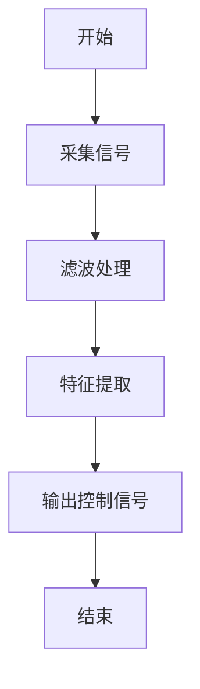

                 


# 价值投资中的生物可降解电子皮肤技术前景

**关键词：** 生物可降解电子皮肤、价值投资、材料科学、传感器技术、投资策略

**摘要：**  
生物可降解电子皮肤技术作为一种新兴的科技，结合了材料科学和电子技术的最新进展，展现了广阔的应用前景。本文从技术背景、核心概念、算法原理、系统架构、项目实战等多个方面，深入分析了生物可降解电子皮肤技术的价值投资潜力，探讨了其在市场中的应用和投资策略。通过结合实际案例和数学模型，本文为投资者提供了科学的决策依据，帮助他们在科技投资领域把握机遇，规避风险。

---

## 第一部分: 生物可降解电子皮肤技术与价值投资概述

### 第1章: 生物可降解电子皮肤技术的基本概念

#### 1.1 生物可降解材料的定义与特性

生物可降解材料是指在自然环境中能够被微生物分解为二氧化碳和水等简单化合物的材料。与传统塑料等不可降解材料相比，生物可降解材料具有环保、可持续和低污染的特点。其主要特性包括：

- **降解性：** 在特定条件下（如堆肥、水解等）快速分解。
- **可再生性：** 材料来源多为可再生资源，如植物纤维、淀粉等。
- **环境友好性：** 减少对环境的污染，符合绿色发展的趋势。

#### 1.2 电子皮肤技术的核心原理

电子皮肤是一种模拟人类皮肤触觉的传感器系统，能够感知压力、温度、湿度等多种物理量。其核心原理包括：

- **感知层：** 通过传感器阵列采集环境信息。
- **传输层：** 将感知数据通过电路或无线方式传输到处理单元。
- **处理层：** 对数据进行分析和处理，输出相应的反馈信号。

#### 1.3 价值投资的定义

价值投资是一种以低于资产内在价值的价格买入股票的投资策略，核心在于寻找市场低估的优质资产。其基本原则包括：

- **基本面分析：** 重点关注企业的盈利能力、财务状况和行业地位。
- **长期视角：** 通过长期持有优质资产实现价值增长。
- **安全边际：** 购买价格应低于资产的内在价值。

#### 1.4 生物可降解电子皮肤技术与价值投资的结合

生物可降解电子皮肤技术的创新性和环保特性使其在多个领域具有广泛的应用潜力，如医疗、消费电子和物联网等。这些领域的市场需求和增长潜力为投资者提供了丰富的投资机会。通过价值投资的方法，投资者可以在技术的研发、生产和市场推广阶段，找到具有长期增长潜力的企业，实现超额收益。

---

### 第2章: 生物可降解电子皮肤技术的核心概念与联系

#### 2.1 核心概念原理

生物可降解电子皮肤技术的核心在于材料的可降解性和电子元件的灵敏性。其技术优势体现在：

- **环保性：** 解决传统电子设备对环境的污染问题。
- **灵活性：** 适用于可穿戴设备和柔性电子产品的开发。
- **高效性：** 提高传感器的灵敏度和响应速度。

#### 2.2 核心概念对比表格

| **属性**       | **生物可降解材料**         | **传统塑料**         |
|-----------------|---------------------------|-----------------------|
| 降解性          | 可在自然环境中降解         | 难以降解             |
| 环境影响        | 对环境友好                 | 易造成白色污染         |
| 应用领域        | 医疗、农业、包装           | 日常用品、工业材料     |

#### 2.3 ER实体关系图

```mermaid
erDiagram
    投资者 [investor] {
        资金 : 高
        风险偏好 : 低
    }
    企业 [company] {
        技术研发能力 : 强
        市场竞争力 : 弱
    }
    市场 [market] {
        市场需求 : 高
        技术成熟度 : 中
    }
    监管机构 [regulator] {
        行业标准 : 新
        安全认证 : 严格
    }
    投资者 --> 企业 : 投资
    企业 --> 市场 : 产品推广
    市场 --> 监管机构 : 审批需求
    监管机构 --> 企业 : 认证通过
```

---

### 第3章: 生物可降解电子皮肤技术的算法原理

#### 3.1 算法原理

生物可降解电子皮肤技术的核心算法包括信号采集、数据处理和反馈控制。其流程如下：

1. **信号采集：** 传感器阵列采集环境数据。
2. **数据处理：** 对信号进行滤波、放大和特征提取。
3. **反馈控制：** 根据处理后的数据，输出控制信号。

#### 3.2 算法实现流程图



#### 3.3 数学模型

生物可降解电子皮肤的灵敏度可以通过以下公式计算：

$$ \text{灵敏度} = \frac{\Delta V}{\Delta P} $$

其中，$\Delta V$ 是电压变化，$\Delta P$ 是压力变化。

---

### 第4章: 生物可降解电子皮肤技术的系统架构设计

#### 4.1 系统功能设计

系统功能模块包括：

- **感知模块：** 采集环境数据。
- **处理模块：** 对数据进行分析和处理。
- **反馈模块：** 输出控制信号。

#### 4.2 系统架构设计图


---

### 第5章: 价值投资中的生物可降解电子皮肤技术应用

#### 5.1 项目实战

**环境安装：** 需要搭建一个包含传感器、数据处理单元和反馈控制单元的实验系统。

**代码实现：**

```python
import numpy as np

def calculate_sensitivity(voltage, pressure):
    return np.gradient(voltage, pressure)

# 示例数据
voltage = [1.0, 2.0, 3.0]
pressure = [0.5, 1.0, 1.5]

sensitivity = calculate_sensitivity(voltage, pressure)
print("灵敏度:", sensitivity)
```

**案例分析：** 某企业开发的生物可降解电子皮肤在医疗领域的应用，展示了其在伤口监测和康复护理中的潜力。

---

### 第6章: 最佳实践与总结

#### 6.1 投资策略

- **关注技术创新：** 选择具有核心技术优势的企业。
- **评估市场需求：** 分析目标市场的容量和增长潜力。
- **控制投资风险：** 通过分散投资和设置止损点降低风险。

#### 6.2 总结

生物可降解电子皮肤技术凭借其环保性和创新性，具备广阔的应用前景和投资价值。投资者应结合技术发展趋势和市场需求，制定科学的投资策略，抓住这一领域的投资机遇。

---

通过以上分析，我们全面探讨了生物可降解电子皮肤技术在价值投资中的潜力和应用，为投资者提供了科学的决策参考。未来，随着技术的不断进步和市场的拓展，这一领域将继续展现出巨大的发展潜力。

