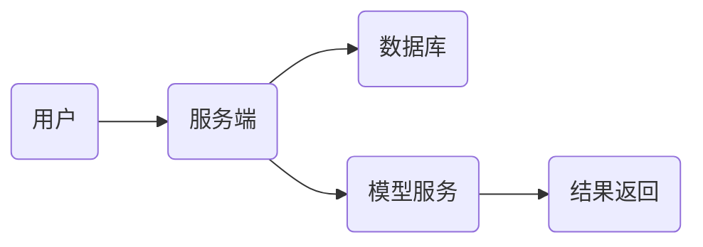

                 


```markdown
# 价值投资中的生物计算神经网络技术前景

## 关键词：生物计算神经网络、价值投资、金融市场、深度学习、投资预测、人工智能

## 摘要：生物计算神经网络技术在价值投资中的应用前景广阔，通过结合神经网络的深度学习能力和金融市场数据的复杂性，能够提供更精准的投资预测和决策支持。本文将详细探讨生物计算神经网络的基本原理、在价值投资中的具体应用以及实际案例分析，揭示其在现代投资决策中的潜力和挑战。

---

## 第1章：引言

### 1.1 生物计算神经网络的定义与背景
生物计算神经网络是一种模拟人脑神经网络结构和功能的计算模型，其灵感来源于生物学中的神经元之间的信息传递机制。与传统的计算机算法不同，生物计算神经网络具有自适应学习和非线性处理能力，能够处理复杂的金融数据。

### 1.2 价值投资的核心理念
价值投资是一种基于对公司基本面分析的投资策略，旨在通过识别被低估的资产，长期获得超额收益。其核心在于对公司财务状况、行业地位和管理团队的深入分析。

### 1.3 生物计算神经网络在价值投资中的潜力
通过分析历史市场数据、公司财务数据和行业动态，生物计算神经网络能够帮助投资者发现隐藏在数据中的模式，提供更精准的投资决策支持。

---

## 第2章：生物计算神经网络的基本原理

### 2.1 神经元模型
神经元模型是生物计算神经网络的基础，常用的模型包括：
- **麦卡洛克-帕斯卡模型（McCulloch-Pitts Model）**：基本的神经元模型，描述了神经元如何接收输入、计算加权和进行阈值判断。
- **霍普菲尔德网络（Hopfield Network）**：一种用于联想记忆的神经网络模型，具有自我纠正的特性。


### 2.2 网络结构
生物计算神经网络的结构通常包括输入层、隐藏层和输出层。隐藏层中的神经元通过权重和激活函数进行特征提取和非线性变换。


### 2.3 训练算法
- **前向传播**：输入数据经过网络层，计算输出。
- **反向传播**：计算预测误差，调整权重以最小化损失。
- **梯度下降**：优化权重参数，提高网络性能。


### 2.4 数学模型
神经网络的损失函数通常采用均方误差或交叉熵损失。反向传播中使用链式法则计算梯度。

$$ L = \frac{1}{n}\sum_{i=1}^{n}(y_i - \hat{y_i})^2 $$

### 2.5 代码实现
以下是一个简单的神经网络实现示例：

```python
import numpy as np

def sigmoid(x):
    return 1 / (1 + np.exp(-x))

def sigmoid_derivative(x):
    return sigmoid(x) * (1 - sigmoid(x))

def train_neural_network(X, y, hidden_layer_size=5, learning_rate=0.1, epochs=100):
    np.random.seed(1)
    weights_input_hidden = np.random.randn(X.shape[1], hidden_layer_size)
    weights_hidden_output = np.random.randn(hidden_layer_size, 1)
    
    for epoch in range(epochs):
        # 前向传播
        hidden_layer_activation = sigmoid(np.dot(X, weights_input_hidden))
        output_layer_activation = sigmoid(np.dot(hidden_layer_activation, weights_hidden_output))
        
        # 反向传播
        output_error = y - output_layer_activation
        hidden_error = np.dot(output_error, weights_hidden_output.T) * sigmoid_derivative(hidden_layer_activation)
        
        # 更新权重
        weights_hidden_output += learning_rate * np.dot(hidden_layer_activation.T, output_error)
        weights_input_hidden += learning_rate * np.dot(X.T, hidden_error)
    
    return weights_input_hidden, weights_hidden_output
```

---

## 第3章：价值投资中的数据分析与特征提取

### 3.1 数据来源
- **财务数据**：收入、利润、资产负债表等。
- **市场数据**：股价、成交量、市场指数。
- **文本数据**：公司新闻、财报文本。

### 3.2 数据预处理
- **数据清洗**：处理缺失值、异常值。
- **标准化**：归一化数据，避免特征尺度差异。
- **特征提取**：使用主成分分析（PCA）提取关键特征。

### 3.3 数据可视化
使用Python的matplotlib或seaborn库进行数据可视化，帮助发现数据中的潜在模式。

```python
import matplotlib.pyplot as plt
import pandas as pd

data = pd.read_csv('financial_data.csv')
plt.plot(data['date'], data['price'], label='Stock Price')
plt.xlabel('Date')
plt.ylabel('Price')
plt.legend()
plt.show()
```

---

## 第4章：生物计算神经网络在价值投资中的应用

### 4.1 市场情绪预测
通过分析新闻、社交媒体等文本数据，利用神经网络预测市场情绪，辅助投资决策。

### 4.2 公司基本面预测
基于财务数据，训练神经网络模型预测公司未来的财务表现。

### 4.3 量化交易策略
利用神经网络分析市场数据，制定动态交易策略，优化投资组合。

---

## 第5章：项目实战

### 5.1 环境搭建
- 安装必要的库：TensorFlow、Keras、Pandas、Matplotlib。

### 5.2 数据收集
从公开的金融数据源获取股票数据，例如Yahoo Finance。

### 5.3 模型训练
使用LSTM神经网络进行时间序列预测，代码示例：

```python
from tensorflow.keras.models import Sequential
from tensorflow.keras.layers import LSTM, Dense

model = Sequential()
model.add(LSTM(50, input_shape=(timesteps, features)))
model.add(Dense(1))
model.compile(loss='mean_squared_error', optimizer='adam')
model.fit(X_train, y_train, epochs=50, batch_size=32)
```

### 5.4 模型评估
计算预测准确率，绘制实际值与预测值的对比图。

---

## 第6章：系统架构设计

### 6.1 系统功能设计
- 数据采集模块：实时获取金融数据。
- 数据处理模块：清洗和预处理数据。
- 模型训练模块：训练神经网络模型。
- 投资决策模块：基于模型输出生成投资建议。


### 6.2 系统架构图



### 6.3 接口设计
- API接口：RESTful API，提供数据获取和模型预测服务。

---

## 第7章：总结与展望

### 7.1 总结
生物计算神经网络在价值投资中的应用前景广阔，能够通过深度学习技术提高投资决策的精准性。

### 7.2 展望
未来，随着计算能力的提升和数据量的增加，生物计算神经网络将在金融领域发挥更大的作用，例如实时市场预测和个性化投资建议。

---

## 附录：最佳实践 tips
- 数据预处理是关键，确保数据质量和准确性。
- 选择合适的神经网络模型，根据问题类型调整网络结构。
- 定期更新模型，适应市场的变化。

---

以上是《价值投资中的生物计算神经网络技术前景》的详细目录和内容框架，涵盖从理论到实践的各个方面，为读者提供全面的视角和深度的技术分析。
```

