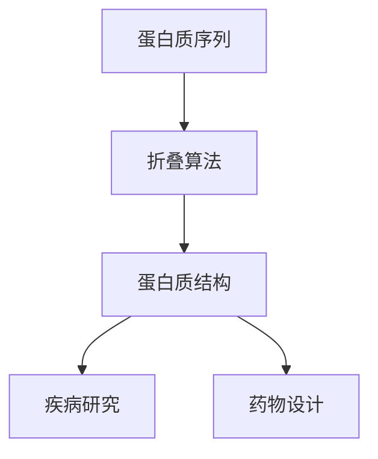

                 

# 价值投资中的生物计算蛋白质折叠技术前景

## 关键词：价值投资、生物计算、蛋白质折叠、人工智能、药物研发、投资分析

## 摘要：  
随着人工智能技术的迅速发展，蛋白质折叠技术在生物计算领域取得了显著突破。本文将探讨蛋白质折叠技术的基本原理、其在药物研发中的应用以及如何通过价值投资的方式挖掘这一领域的商业潜力。通过分析蛋白质折叠技术的算法原理、系统架构和实际案例，本文为投资者提供一个全面的技术和市场视角，帮助他们在生物计算领域做出明智的投资决策。

---

## 第一部分: 蛋白质折叠技术与生物计算的背景介绍

### 第1章: 蛋白质折叠技术的基本概念

#### 1.1 蛋白质折叠的基本概念
蛋白质是生命体中最重要的分子之一，其功能由其三维结构决定。蛋白质折叠是指氨基酸链通过特定的物理和化学相互作用形成有序结构的过程。了解蛋白质的折叠方式对于理解其功能、疾病机制以及药物设计至关重要。

- **1.1.1 蛋白质的结构与功能关系**  
  蛋白质的功能由其一级、二级、三级和四级结构决定。一级结构是氨基酸的序列，二级结构是局部结构（如α螺旋和β折叠），三级结构是整体折叠方式，四级结构是多个蛋白质亚基的组合。

- **1.1.2 蛋白质折叠的基本原理**  
  蛋白质折叠遵循能量最小化原则，氨基酸通过氢键、疏水作用等相互作用形成稳定的结构。然而，由于蛋白质的复杂性，折叠过程涉及大量的能量计算和空间排列，这使得蛋白质折叠问题成为一个NP难的问题。

- **1.1.3 蛋白质折叠异常与疾病的关系**  
  蛋白质折叠异常会导致错误折叠的蛋白质聚集，形成淀粉样纤维，与许多疾病（如阿尔茨海默病、帕金森病等）密切相关。

#### 1.2 生物计算的基本概念
生物计算是指利用计算机技术对生物数据进行分析和建模的过程。生物计算的核心技术包括分子动力学模拟、量子力学计算、深度学习和自然语言处理等。

- **1.2.1 生物计算的定义**  
  生物计算是通过计算机技术对生物系统进行模拟、分析和预测的学科，旨在帮助科学家更好地理解生物现象和开发新的生物技术。

- **1.2.2 生物计算的核心技术**  
  生物计算的核心技术包括分子动力学模拟、量子力学计算、深度学习和自然语言处理。这些技术在蛋白质结构预测、药物设计和基因组分析等领域得到了广泛应用。

- **1.2.3 生物计算在蛋白质研究中的应用**  
  生物计算在蛋白质研究中的应用包括蛋白质结构预测、功能预测、药物设计和疾病机制研究等。

#### 1.3 蛋白质折叠技术的现状与挑战
蛋白质折叠技术的现状和挑战主要体现在以下几个方面：

- **1.3.1 蛋白质折叠问题的历史**  
  蛋白质折叠问题自20世纪50年代以来一直是生物物理学和分子生物学的核心问题之一。随着计算机技术的发展，蛋白质折叠问题逐渐从实验研究转向计算模拟。

- **1.3.2 当前蛋白质折叠研究的技术瓶颈**  
  尽管生物计算技术在蛋白质折叠问题上取得了显著进展，但仍然面临许多挑战，如计算成本高、折叠模型的准确性有限、多尺度计算的复杂性等。

- **1.3.3 生物计算在蛋白质折叠中的作用**  
  生物计算通过深度学习、分子动力学模拟等技术，极大地提高了蛋白质结构预测的准确性和效率。然而，如何进一步提高计算效率和预测精度仍然是一个重要的研究方向。

### 第2章: 生物计算与蛋白质折叠技术的核心概念与联系

#### 2.1 蛋白质折叠的生物计算模型
蛋白质折叠的生物计算模型可以分为基于物理模型的折叠算法和基于机器学习的折叠算法。

- **2.1.1 基于物理模型的折叠算法**  
  基于物理模型的折叠算法通过计算氨基酸之间的相互作用能量，模拟蛋白质的折叠过程。这种方法通常需要大量的计算资源，且预测的准确性有限。

- **2.1.2 基于机器学习的折叠算法**  
  基于机器学习的折叠算法通过训练深度学习模型（如Transformer模型）来预测蛋白质的三维结构。这种方法在蛋白质结构预测方面取得了显著的突破，如AlphaFold的成功。

- **2.1.3 生物计算在蛋白质研究中的应用**  
  生物计算在蛋白质研究中的应用不仅限于结构预测，还包括功能预测、药物设计和疾病机制研究等。

#### 2.2 蛋白质折叠技术的数学模型与公式
蛋白质折叠技术的数学模型主要涉及能量最小化和深度学习模型的数学表示。

- **2.2.1 蛋白质序列与结构的关系公式**  
  蛋白质序列与结构的关系可以通过能量函数来描述。能量函数通常包括一系列物理化学相互作用的项，如氢键、疏水作用、二面角能量等。

- **2.2.2 蛋白质能量最小化模型**  
  蛋白质折叠的物理模型可以通过能量最小化来实现。能量函数的数学表示如下：

  $$ E = \sum_{i<j} V_{ij}(r_{ij}) $$

  其中，$r_{ij}$表示第$i$和$j$个原子之间的距离，$V_{ij}$是相应的相互作用势函数。

- **2.2.3 深度学习在蛋白质折叠中的数学模型**  
  深度学习模型（如Transformer）通过多层神经网络来学习蛋白质序列与结构之间的映射关系。模型的核心是自注意力机制，其数学表示如下：

  $$ \text{Attention}(Q, K, V) = \text{softmax}\left(\frac{QK^T}{\sqrt{d_k}}\right)V $$

  其中，$Q$、$K$和$V$分别是查询、键和值矩阵，$d_k$是键的维度。

#### 2.3 蛋白质折叠技术的ER实体关系图
以下是一个蛋白质折叠技术的ER实体关系图：

图中展示了蛋白质序列通过折叠算法生成蛋白质结构，蛋白质结构在疾病研究和药物设计中发挥重要作用。

### 第3章: 蛋白质折叠技术的算法原理讲解

#### 3.1 基于物理模型的折叠算法
基于物理模型的折叠算法主要通过分子动力学模拟和能量最小化方法来预测蛋白质结构。

- **3.1.1 分子动力学模拟**  
  分子动力学模拟通过计算蛋白质分子的运动轨迹，模拟其在溶液中的折叠过程。这种方法需要考虑大量的物理化学相互作用，计算成本较高。

- **3.1.2 能量最小化方法**  
  能量最小化方法通过优化能量函数，找到能量最低的蛋白质结构。这种方法通常用于粗粒化模型，计算速度较快。

- **3.1.3 蛋白质折叠的蒙特卡洛模拟**  
  蒙特卡洛模拟通过随机采样方法，探索蛋白质折叠的可能构象。这种方法可以有效地克服能量 barrier，找到低能量结构。

#### 3.2 基于机器学习的折叠算法
基于机器学习的折叠算法通过训练深度学习模型来预测蛋白质结构。

- **3.2.1 深度学习模型在蛋白质折叠中的应用**  
  深度学习模型（如AlphaFold）通过多层神经网络，学习蛋白质序列与结构之间的关系。模型的核心是自注意力机制，能够捕捉序列中的长距离依赖关系。

- **3.2.2 AlphaFold算法的原理**  
  AlphaFold算法通过训练一个Transformer模型，预测蛋白质序列中的每个氨基酸在三维空间中的位置。模型的输入是蛋白质序列，输出是预测的三维坐标。

- **3.2.3 Transformer模型在蛋白质结构预测中的作用**  
  Transformer模型通过自注意力机制，捕捉蛋白质序列中的局部和全局特征，从而提高结构预测的准确性。

#### 3.3 蛋白质折叠算法的数学模型与公式
蛋白质折叠算法的数学模型主要涉及能量函数和深度学习模型的训练过程。

- **3.3.1 蛋白质序列的表示方法**  
  蛋白质序列可以通过氨基酸的编码（如字母表示）或向量表示（如氨基酸嵌入）来表示。

- **3.3.2 深度学习模型的损失函数**  
  深度学习模型的损失函数通常包括结构预测误差和序列与结构之间的关联性。损失函数的数学表示如下：

  $$ \mathcal{L} = \sum_{i=1}^{N} (y_i - \hat{y}_i)^2 $$

  其中，$y_i$是真实值，$\hat{y}_i$是模型预测值，$N$是数据点的数量。

- **3.3.3 蛋白质结构预测的评估指标**  
  蛋白质结构预测的评估指标包括全局坐标误差（GCE）、局部坐标误差（LCE）和TM-score等。

### 第4章: 蛋白质折叠技术的数学模型与公式

#### 4.1 蛋白质折叠的基本数学模型
蛋白质折叠的基本数学模型主要涉及能量函数和优化问题。

- **4.1.1 蛋白质能量函数**  
  蛋白质能量函数通常包括一系列相互作用项，如氢键、疏水作用、二面角能量等。能量函数的数学表示如下：

  $$ E = \sum_{i<j} V_{ij}(r_{ij}) $$

  其中，$r_{ij}$是第$i$和$j$个原子之间的距离，$V_{ij}$是相应的相互作用势函数。

- **4.1.2 蛋白质序列与结构的对应关系**  
  蛋白质序列与结构的对应关系可以通过能量函数来描述。能量函数越小，蛋白质结构越稳定。

- **4.1.3 蛋白质折叠的优化问题**  
  蛋白质折叠的优化问题可以通过能量最小化来解决。优化问题的数学表示如下：

  $$ \min_{\theta} E(\theta) $$

  其中，$\theta$是蛋白质结构的参数。

#### 4.2 深度学习在蛋白质折叠中的数学模型
深度学习在蛋白质折叠中的数学模型主要涉及自注意力机制和多层神经网络。

- **4.2.1 Transformer模型的数学表示**  
  Transformer模型的核心是自注意力机制，其数学表示如下：

  $$ \text{Attention}(Q, K, V) = \text{softmax}\left(\frac{QK^T}{\sqrt{d_k}}\right)V $$

  其中，$Q$、$K$和$V$分别是查询、键和值矩阵，$d_k$是键的维度。

- **4.2.2 注意力机制在蛋白质折叠中的应用**  
  注意力机制可以帮助模型捕捉蛋白质序列中的长距离依赖关系，从而提高结构预测的准确性。

- **4.2.3 蛋白质结构预测的数学公式**  
  深度学习模型通过训练数据，学习蛋白质序列与结构之间的映射关系。模型的训练过程可以通过反向传播算法优化参数。

#### 4.3 蛋白质折叠算法的数学推导
蛋白质折叠算法的数学推导主要涉及能量函数的优化和深度学习模型的训练过程。

- **4.3.1 蛋白质能量最小化问题的数学推导**  
  蛋白质能量最小化问题可以通过梯度下降算法来优化。优化过程的数学表示如下：

  $$ \theta_{t+1} = \theta_t - \eta \frac{\partial E}{\partial \theta_t} $$

  其中，$\theta_t$是当前的参数，$\eta$是学习率，$\frac{\partial E}{\partial \theta_t}$是能量函数对参数的梯度。

- **4.3.2 深度学习模型的训练过程**  
  深度学习模型的训练过程包括正向传播和反向传播两个阶段。正向传播计算模型的输出，反向传播计算损失函数对参数的梯度，并更新参数。

- **4.3.3 蛋白质结构预测的评估公式**  
  蛋白质结构预测的评估公式通常包括全局坐标误差（GCE）、局部坐标误差（LCE）和TM-score等指标。

### 第5章: 蛋白质折叠技术的系统分析与架构设计方案

#### 5.1 蛋白质折叠技术的系统架构
蛋白质折叠技术的系统架构包括功能设计、架构设计和接口设计。

- **5.1.1 系统功能设计**  
  系统功能设计包括蛋白质序列输入、折叠算法选择、结构预测和结果输出等模块。

- **5.1.2 系统架构设计**  
  系统架构设计通常采用分层架构，包括数据输入层、算法计算层和结果输出层。

- **5.1.3 系统接口设计**  
  系统接口设计包括输入接口（如蛋白质序列输入）和输出接口（如预测结构输出）。

#### 5.2 蛋白质折叠技术的系统交互设计
蛋白质折叠技术的系统交互设计包括用户界面设计和系统模块划分。

- **5.2.1 系统交互流程**  
  系统交互流程包括用户输入蛋白质序列、系统选择折叠算法、计算蛋白质结构并输出结果。

- **5.2.2 用户界面设计**  
  用户界面设计包括输入界面和输出界面，用户可以通过输入界面输入蛋白质序列，系统通过输出界面显示预测结果。

- **5.2.3 系统模块划分**  
  系统模块划分包括数据处理模块、算法计算模块和结果输出模块。

#### 5.3 蛋白质折叠技术的系统实现
蛋白质折叠技术的系统实现包括环境安装、系统核心实现源代码和代码应用解读与分析。

- **5.3.1 环境安装**  
  环境安装包括安装Python、TensorFlow、Keras等深度学习框架，以及分子模拟软件（如Gromacs）。

- **5.3.2 系统核心实现源代码**  
  系统核心实现源代码包括蛋白质序列处理、折叠算法实现和结构预测输出等部分。

- **5.3.3 代码应用解读与分析**  
  代码应用解读与分析包括对蛋白质序列的处理、折叠算法的选择和结构预测结果的分析。

#### 5.4 蛋白质折叠技术的项目实战
蛋白质折叠技术的项目实战包括实际案例分析和详细讲解剖析。

- **5.4.1 实际案例分析**  
  实际案例分析包括选择一个具体的蛋白质，使用AlphaFold算法预测其三维结构，并与实验数据进行对比。

- **5.4.2 详细讲解剖析**  
  详细讲解剖析包括对预测结果的分析、对算法选择的讨论以及对预测精度的评估。

#### 5.5 蛋白质折叠技术的项目小结
蛋白质折叠技术的项目小结包括项目目标的实现、项目成果的总结以及项目中存在的问题和改进方向。

---

## 第二部分: 价值投资中的生物计算蛋白质折叠技术前景

### 第6章: 蛋白质折叠技术的投资价值分析

#### 6.1 生物计算领域的投资机会
生物计算领域的投资机会主要体现在以下几个方面：

- **6.1.1 蛋白质折叠技术的商业化应用**  
  蛋白质折叠技术在药物研发、疾病研究和生物技术中的应用为投资者提供了巨大的商业机会。

- **6.1.2 生物计算技术的市场前景**  
  生物计算技术在精准医疗、个性化治疗和基因编辑等领域具有广阔的应用前景，市场潜力巨大。

- **6.1.3 人工智能在生物计算中的作用**  
  人工智能技术的快速发展为生物计算提供了强大的技术支持，进一步推动了蛋白质折叠技术的商业化应用。

#### 6.2 蛋白质折叠技术的投资风险与挑战
蛋白质折叠技术的投资风险与挑战主要体现在以下几个方面：

- **6.2.1 技术风险**  
  蛋白质折叠技术的预测精度和计算效率仍有待提高，技术的不确定性和不可预测性可能对投资者造成风险。

- **6.2.2 市场风险**  
  生物计算市场的竞争激烈，技术更新换代快，投资者需要关注市场动态和竞争对手的情况。

- **6.2.3 伦理与法律风险**  
  生物计算技术的应用涉及个人隐私和数据安全问题，投资者需要关注相关法律法规和伦理道德问题。

### 第7章: 蛋白质折叠技术的投资策略与建议

#### 7.1 蛋白质折叠技术的投资策略
蛋白质折叠技术的投资策略包括以下几点：

- **7.1.1 关注技术创新**  
  投资者应关注蛋白质折叠技术的创新，特别是人工智能技术在蛋白质折叠中的应用。

- **7.1.2 投资具有强大研发能力的公司**  
  投资者应选择具有强大研发能力和技术储备的公司，特别是在深度学习和分子动力学模拟方面具有优势的公司。

- **7.1.3 关注行业动态和市场趋势**  
  投资者应密切关注生物计算行业的动态和市场趋势，抓住市场机会，规避市场风险。

#### 7.2 蛋白质折叠技术的投资建议
蛋白质折叠技术的投资建议包括以下几点：

- **7.2.1 长期投资与短期收益相结合**  
  蛋白质折叠技术的商业化应用需要较长时间，投资者应采取长期投资策略，同时关注短期收益。

- **7.2.2 多元化投资**  
  为了分散风险，投资者可以考虑多元化投资，包括投资不同的生物计算公司和相关技术。

- **7.2.3 关注政策支持与行业合作**  
  政策支持和行业合作对生物计算技术的发展至关重要，投资者应关注相关政策和行业动态。

### 第8章: 蛋白质折叠技术的未来发展趋势与投资机会

#### 8.1 蛋白质折叠技术的未来发展趋势
蛋白质折叠技术的未来发展趋势包括以下几点：

- **8.1.1 深度学习技术的进一步发展**  
  深度学习技术的进一步发展将推动蛋白质折叠技术的预测精度和计算效率的提高。

- **8.1.2 多尺度计算的融合**  
  多尺度计算的融合将使蛋白质折叠技术能够同时考虑微观和宏观的相互作用，进一步提高预测的准确性。

- **8.1.3 生物计算与实验技术的结合**  
  生物计算技术与实验技术的结合将推动蛋白质折叠技术的发展，特别是在实验数据的辅助下，提高预测的精度。

#### 8.2 蛋白质折叠技术的投资机会
蛋白质折叠技术的投资机会包括以下几点：

- **8.2.1 人工智能技术在蛋白质折叠中的应用**  
  人工智能技术的快速发展为蛋白质折叠技术提供了强大的技术支持，投资者可以关注相关的人工智能公司和生物计算公司。

- **8.2.2 蛋白质折叠技术在药物研发中的应用**  
  蛋白质折叠技术在药物研发中的应用将推动新药的开发，投资者可以关注相关药物研发公司和生物技术公司。

- **8.2.3 生物计算技术的商业化应用**  
  生物计算技术的商业化应用将为投资者带来巨大的商业机会，特别是在精准医疗和个性化治疗领域。

### 第9章: 蛋白质折叠技术的价值投资总结与展望

#### 9.1 价值投资中的蛋白质折叠技术总结
蛋白质折叠技术在生物计算领域的应用为投资者提供了巨大的商业机会，特别是在人工智能技术的支持下，蛋白质折叠技术的预测精度和计算效率得到了显著提高。

- **9.1.1 投资价值的总结**  
  蛋白质折叠技术的投资价值主要体现在其在药物研发、疾病研究和生物技术中的广泛应用。随着技术的不断发展，蛋白质折叠技术的市场潜力将越来越大。

- **9.1.2 技术前景的总结**  
  蛋白质折叠技术的未来发展趋势是深度学习技术的进一步发展、多尺度计算的融合以及生物计算与实验技术的结合。这些技术进步将推动蛋白质折叠技术的预测精度和计算效率的提高。

#### 9.2 价值投资中的蛋白质折叠技术展望
蛋白质折叠技术的未来展望包括以下几点：

- **9.2.1 人工智能技术的进一步发展**  
  人工智能技术的进一步发展将推动蛋白质折叠技术的预测精度和计算效率的提高，为投资者带来更多的商业机会。

- **9.2.2 生物计算技术的商业化应用**  
  生物计算技术的商业化应用将推动蛋白质折叠技术的广泛应用，特别是在药物研发和疾病研究领域。

- **9.2.3 生物计算与实验技术的结合**  
  生物计算技术与实验技术的结合将推动蛋白质折叠技术的发展，特别是在实验数据的辅助下，提高预测的精度。

---

## 总结
蛋白质折叠技术在生物计算领域的发展为投资者提供了巨大的商业机会。通过价值投资的方式，投资者可以关注具有强大研发能力和技术储备的生物计算公司，特别是在人工智能技术的支持下，蛋白质折叠技术的预测精度和计算效率得到了显著提高。随着技术的不断发展，蛋白质折叠技术的市场潜力将越来越大，为投资者带来丰厚的回报。

