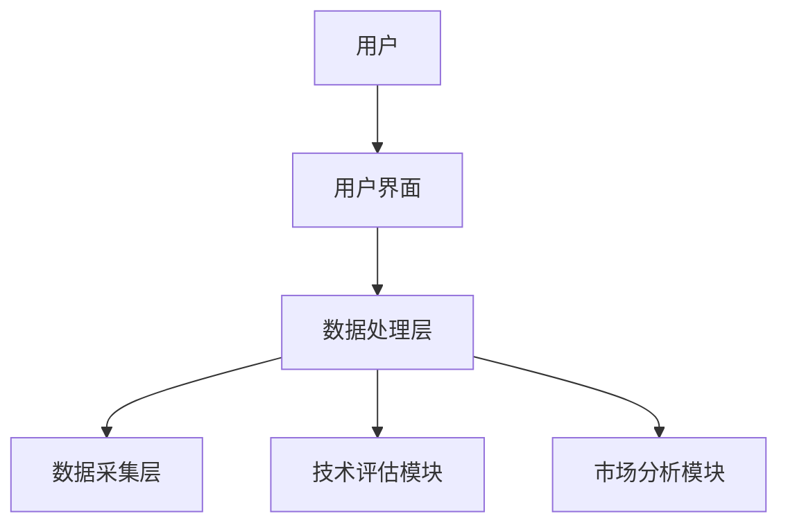

                 


# 价值投资中的生物降解电子产品技术

## 关键词：生物降解、电子产品、价值投资、技术评估、环境影响

## 摘要：  
随着环保意识的增强和可持续发展理念的推进，生物降解电子产品因其对环境友好的特点，逐渐成为市场关注的焦点。本文从技术与投资的双重角度，分析生物降解电子产品技术的核心原理、市场潜力以及如何通过价值投资评估其技术价值。通过构建技术评估模型和系统架构设计，本文为投资者提供了科学的投资决策依据，同时探讨了生物降解技术在电子产品领域的应用前景。

---

## 第1章: 生物降解电子产品技术概述

### 1.1 生物降解电子产品的概念与特点
#### 1.1.1 生物降解材料的基本定义  
生物降解材料是指在自然环境中，通过微生物的作用，能够在一定时间内分解为二氧化碳和水等简单无机物的材料。这种材料通常由可再生资源制成，如淀粉、纤维素、聚乳酸（PLA）等。  

#### 1.1.2 电子产品的降解特性  
电子产品中的生物降解材料主要用于外壳、连接线和包装等部分。这些材料在使用后可以通过堆肥等方式快速分解，减少对环境的污染。  

#### 1.1.3 生物降解电子产品的发展现状  
目前，生物降解电子产品主要集中在消费电子领域，如手机、笔记本电脑和可穿戴设备的外壳。然而，由于降解过程中的技术难题，如材料强度和耐久性不足，生物降解电子产品尚未完全取代传统电子产品。

---

### 1.2 价值投资的基本原理  
#### 1.2.1 价值投资的核心概念  
价值投资是一种长期投资策略，强调以低于市场价买入具有内在价值的资产。其核心在于识别被市场低估的优质资产，并长期持有。  

#### 1.2.2 价值投资在科技领域的应用  
科技领域的价值投资注重技术的创新性和市场潜力。投资者需要评估技术的商业化能力、市场规模以及竞争态势，以判断其投资价值。  

#### 1.2.3 投资决策中的技术评估  
在价值投资中，技术评估是关键环节。投资者需要分析技术的成熟度、市场竞争力以及盈利能力，以确定其投资价值。

---

## 第2章: 生物降解电子产品技术与价值投资的结合

### 2.1 生物降解电子产品技术的市场潜力  
#### 2.1.1 环境保护需求与市场机会  
随着全球环保政策的加强和消费者环保意识的提升，生物降解电子产品市场需求逐步增长。  

#### 2.1.2 技术创新对投资价值的影响  
生物降解技术的创新可以直接提升产品的市场竞争力，从而增加投资回报。  

#### 2.1.3 行业发展趋势与投资策略  
生物降解电子产品行业正处于快速发展阶段，投资者应关注技术创新和市场拓展的公司。

---

### 2.2 价值投资中的技术评估方法  
#### 2.2.1 技术成熟度评估  
技术成熟度是评估生物降解电子产品投资价值的重要指标。投资者需要分析技术的商业化能力和稳定性。  

#### 2.2.2 市场竞争力分析  
市场竞争力分析包括产品定价、市场份额和技术壁垒等方面。  

#### 2.2.3 投资回报率预测  
通过构建财务模型，投资者可以预测生物降解电子产品的投资回报率，从而做出科学的投资决策。

---

## 第3章: 生物降解电子产品技术的核心原理

### 3.1 生物降解材料的化学特性  
#### 3.1.1 常见生物降解材料的成分分析  
常见的生物降解材料包括聚乳酸（PLA）、聚乙醇酸（PGA）和聚碳酸亚丙酯（PCP）。这些材料通常由可再生资源制成，如植物油和淀粉。  

#### 3.1.2 材料降解过程的化学反应机制  
生物降解材料的降解过程主要依赖于微生物的作用。材料中的高分子链在酶的作用下分解为小分子化合物，最终转化为二氧化碳和水。  

#### 3.1.3 材料性能对电子产品设计的影响  
生物降解材料的机械性能和耐久性通常低于传统材料，因此在电子产品设计中需要进行优化。

---

### 3.2 电子产品降解的关键技术  
#### 3.2.1 可降解电子元件的设计  
可降解电子元件的设计需要考虑材料的兼容性和降解速率。例如，使用可降解基板和导电材料。  

#### 3.2.2 降解过程中的能量损耗  
降解过程中，电子元件的能量损耗可能会影响其性能。因此，设计时需要优化能量管理。  

#### 3.2.3 降解效率与产品寿命的关系  
降解效率和产品寿命是矛盾的。为了延长产品寿命，通常需要减少降解速率，这可能影响材料的环境友好性。

---

## 第4章: 价值投资中的技术评估模型

### 4.1 技术评估的核心指标  
#### 4.1.1 技术创新性评估  
技术创新性是评估生物降解电子产品技术价值的重要指标。投资者需要分析技术的独创性和领先性。  

#### 4.1.2 市场竞争力分析  
市场竞争力分析包括市场份额、竞争对手的技术水平和市场定位等方面。  

#### 4.1.3 投资回报率预测  
通过构建财务模型，投资者可以预测生物降解电子产品的投资回报率，从而做出科学的投资决策。

---

### 4.2 技术评估模型的构建  
#### 4.2.1 评估模型的设计思路  
评估模型需要综合考虑技术性能、市场潜力和财务指标。  

#### 4.2.2 技术成熟度评估  
技术成熟度评估包括实验室验证、小规模生产和大规模应用三个阶段。  

#### 4.2.3 市场潜力分析  
市场潜力分析包括市场规模、增长速度和竞争格局。  

#### 4.2.4 财务指标评估  
财务指标评估包括销售收入、成本结构和净利润率。  

---

## 第5章: 系统分析与架构设计方案

### 5.1 项目场景介绍  
本项目旨在通过构建生物降解电子产品技术评估系统，帮助投资者做出科学的投资决策。  

### 5.2 系统功能设计  
#### 5.2.1 领域模型设计  
领域模型包括用户模块、技术评估模块和市场分析模块。  

#### 5.2.2 系统架构设计  
系统架构包括数据采集层、数据处理层和用户界面层。  

### 5.3 系统架构设计  
#### 5.3.1 系统架构图  


---

## 第6章: 项目实战

### 6.1 环境安装  
#### 6.1.1 安装Python和相关库  
需要安装Python 3.8及以上版本，并安装pandas、numpy和scikit-learn库。  

### 6.2 系统核心实现  
#### 6.2.1 技术评估模块实现  
```python
import pandas as pd
import numpy as np
from sklearn.linear_model import LinearRegression

# 加载数据
data = pd.read_csv('technology.csv')

# 模型训练
model = LinearRegression()
model.fit(data[['technology_maturity', 'market_competition']], data['investment_return'])

# 预测投资回报
predicted_return = model.predict([[0.7, 0.6]])
print(predicted_return)
```

#### 6.2.2 代码实现解读  
上述代码通过线性回归模型预测投资回报率。模型输入包括技术成熟度和技术壁垒，输出为投资回报率。  

### 6.3 实际案例分析  
以某生物降解手机为例，分析其技术评估和投资回报情况。  

### 6.4 项目小结  
本项目通过构建技术评估系统，帮助投资者做出科学的投资决策。

---

## 第7章: 最佳实践

### 7.1 小结  
生物降解电子产品技术具有广阔的市场潜力，但技术评估和投资决策需要综合考虑多方面因素。  

### 7.2 注意事项  
投资者在进行技术评估时，需要关注技术成熟度、市场竞争力和财务指标。  

### 7.3 拓展阅读  
建议阅读相关领域的书籍和论文，以深入了解生物降解技术和价值投资的结合。

---

## 结语  
通过本文的分析，读者可以深入了解生物降解电子产品技术的核心原理和价值投资的评估方法。未来，随着技术的不断进步和市场的扩展，生物降解电子产品将在环保和投资领域发挥更大的作用。

