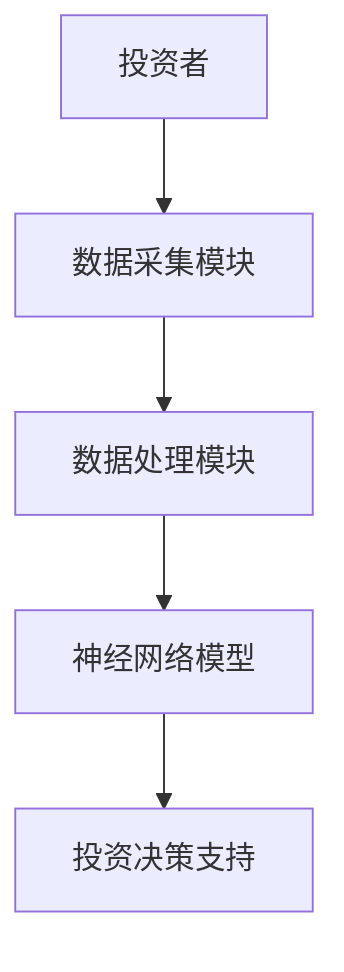

                 


# 价值投资中的神经科技前景分析

> 关键词：价值投资、神经科技、人工智能、投资策略、神经网络

> 摘要：本文探讨了神经科技在价值投资中的应用前景，分析了神经网络技术在投资决策中的作用，结合实际案例，详细阐述了神经科技如何优化投资策略，为投资者提供了新的视角和思路。

---

## 第1章 价值投资与神经科技的背景介绍

### 1.1 价值投资的核心概念

#### 1.1.1 价值投资的定义与历史演变
价值投资是一种长期投资策略，以购买并持有具有显著内在价值的股票为主。它起源于20世纪20年代，由本杰明·格雷厄姆和戴维·多德提出，强调以低于内在价值的价格买入股票，长期持有，等待其价值回归。

#### 1.1.2 神经科技的定义与技术特征
神经科技是基于神经网络和深度学习的人工智能技术，模拟人脑神经网络的结构和功能，用于数据处理、模式识别和决策支持。其核心特征包括非线性关系建模、自适应学习和分布式计算。

#### 1.1.3 价值投资与神经科技的结合背景
随着金融市场数据的爆炸式增长，传统价值投资方法在数据处理和分析能力上逐渐显现出局限性。神经科技的兴起为价值投资提供了新的技术手段，能够更高效地分析海量数据，识别潜在的投资机会。

### 1.2 问题背景与问题描述

#### 1.2.1 传统价值投资的局限性
传统价值投资依赖于人工分析，存在主观性强、效率低、难以处理复杂数据关系等问题。

#### 1.2.2 神经科技在投资决策中的潜在优势
神经科技能够快速处理海量数据，发现隐藏的规律，辅助投资者做出更科学的决策。

#### 1.2.3 问题解决的路径与方法
通过将神经科技应用于价值投资的关键环节（如数据分析、风险评估、市场预测等），优化投资决策流程。

### 1.3 问题的边界与外延

#### 1.3.1 神经科技在投资中的适用范围
适用于量化分析、市场情绪分析、风险评估等领域。

#### 1.3.2 价值投资中的神经科技应用边界
主要应用于数据驱动的决策支持，不完全替代人类的判断和决策。

#### 1.3.3 神经科技与传统金融分析的结合
神经科技可以作为传统金融分析的补充工具，帮助投资者更好地理解和把握市场动态。

### 1.4 核心概念结构与要素组成

#### 1.4.1 价值投资的核心要素
- 企业基本面分析
- 市场情绪分析
- 风险评估

#### 1.4.2 神经科技的关键组成部分
- 神经网络模型
- 数据处理与分析
- 决策支持系统

#### 1.4.3 两者的结合机制与关系
神经科技通过数据处理和分析能力，增强价值投资的分析深度和广度，实现更精准的投资决策。

---

## 第2章 神经科技与价值投资的核心概念与联系

### 2.1 神经科技的核心原理

#### 2.1.1 神经网络的基本原理
神经网络通过多层结构模拟人脑神经元的连接方式，利用反向传播算法进行参数优化，实现数据的非线性关系建模。

#### 2.1.2 神经科技在投资中的应用原理
通过分析历史价格、市场情绪、财务数据等多维度信息，识别潜在的投资机会和风险。

#### 2.1.3 神经科技与价值投资的结合原理
将神经网络应用于企业基本面分析、市场情绪预测、风险评估等价值投资的关键环节，提升分析效率和准确性。

### 2.2 核心概念的属性特征对比

| **核心概念** | **价值投资** | **神经科技** |
|--------------|---------------|--------------|
| **核心目标** | 实现超额收益 | 提供数据支持 | 
| **分析方法** | 定量与定性结合 | 定量分析为主 | 
| **决策依据** | 企业基本面、市场情绪 | 数据驱动的模式识别 | 

#### 2.3 ER实体关系图架构
```mermaid
er
  actor(投资者)
  entity(投资标的)
  relation(投资行为)
  actor -[进行]-> relation
  relation -[涉及]-> entity
```

---

## 第3章 价值投资中的神经科技算法原理

### 3.1 算法原理概述

#### 3.1.1 神经网络的基本结构
神经网络由输入层、隐藏层和输出层组成，通过权重调整实现对数据的非线性映射。

#### 3.1.2 价值投资中的神经网络模型
用于企业价值评估、市场趋势预测和风险评估。

#### 3.1.3 算法的基本流程
- 数据预处理
- 模型训练
- 模型预测
- 结果分析

### 3.2 算法实现细节

#### 3.2.1 情绪识别算法
```python
def calculate_emotion(sentences):
    # 简单的情绪强度计算
    positive_words = ['good', 'positive']
    negative_words = ['bad', 'negative']
    emotion_strength = 0
    for word in sentences:
        if word in positive_words:
            emotion_strength += 1
        elif word in negative_words:
            emotion_strength -= 1
    return emotion_strength
```

#### 3.2.2 认知偏差校正算法
```python
def correct_cognitive_bias(predictions):
    # 假设predictions是一个概率分布
    adjusted_predictions = []
    for pred in predictions:
        if pred > 0.8:
            adjusted_predictions.append(pred * 0.9)
        else:
            adjusted_predictions.append(pred)
    return adjusted_predictions
```

#### 3.2.3 神经网络训练算法
```python
import tensorflow as tf

model = tf.keras.Sequential([
    tf.keras.layers.Dense(64, activation='relu'),
    tf.keras.layers.Dense(1, activation='sigmoid')
])
model.compile(optimizer='adam', loss='binary_crossentropy', metrics=['accuracy'])
model.fit(X_train, y_train, epochs=10, batch_size=32)
```

### 3.3 算法的数学模型与公式

#### 3.3.1 情绪强度计算公式
$$ 情绪强度 = \sum (w_i \times f_i) $$
其中，$w_i$是情感词的权重，$f_i$是情感词的出现频率。

#### 3.3.2 神经网络模型公式
$$ y = \sigma(w_1x + b_1) $$
其中，$x$是输入，$w_1$和$b_1$是网络参数，$\sigma$是激活函数。

---

## 第4章 价值投资中的神经科技数学模型

### 4.1 神经网络模型的设计与优化

#### 4.1.1 神经网络的层数与节点数
选择合适的网络深度和宽度，避免过拟合和欠拟合。

#### 4.1.2 激活函数的选择
常用的激活函数包括ReLU、sigmoid和tanh。

#### 4.1.3 损失函数与优化器
使用交叉熵损失函数和Adam优化器。

### 4.2 价值投资中的特征工程

#### 4.2.1 特征选择
选择对企业价值影响较大的财务指标和市场指标。

#### 4.2.2 数据预处理
对数据进行标准化、归一化处理。

#### 4.2.3 特征组合
通过主成分分析（PCA）等方法降低特征维度。

### 4.3 数学模型的实现与验证

#### 4.3.1 模型实现
```python
import tensorflow as tf

model = tf.keras.Sequential([
    tf.keras.layers.Dense(64, activation='relu'),
    tf.keras.layers.Dense(1, activation='sigmoid')
])
```

#### 4.3.2 模型验证
通过训练集和测试集的准确率、召回率等指标评估模型性能。

---

## 第5章 神经科技在价值投资中的系统分析与架构设计

### 5.1 系统分析与项目介绍

#### 5.1.1 项目背景
利用神经科技优化价值投资决策流程。

#### 5.1.2 系统功能需求
- 数据采集与处理
- 模型训练与预测
- 投资决策支持

#### 5.1.3 系统架构设计


### 5.2 系统架构设计

#### 5.2.1 数据采集模块
负责收集股票价格、财务数据、市场情绪等信息。

#### 5.2.2 数据处理模块
对数据进行清洗、转换和特征提取。

#### 5.2.3 神经网络模型
基于处理后的数据进行训练和预测。

#### 5.2.4 投资决策支持
根据模型输出结果，提供投资建议。

### 5.3 系统接口设计

#### 5.3.1 API接口
- 数据接口：获取实时数据
- 模型接口：进行预测
- 结果接口：返回投资建议

#### 5.3.2 接口交互流程
投资者通过API调用模型进行预测，获取投资建议。

---

## 第6章 价值投资中的神经科技项目实战

### 6.1 环境安装与配置

#### 6.1.1 安装Python环境
使用Anaconda或虚拟环境管理Python版本。

#### 6.1.2 安装必要的库
安装TensorFlow、Keras、Pandas、NumPy等库。

### 6.2 系统核心实现

#### 6.2.1 数据采集代码
```python
import pandas as pd
import requests

url = "https://api.example.com/stock_data"
data = requests.get(url).json()
df = pd.DataFrame(data)
```

#### 6.2.2 模型训练代码
```python
model = tf.keras.Sequential([
    tf.keras.layers.Dense(64, activation='relu'),
    tf.keras.layers.Dense(1, activation='sigmoid')
])
model.compile(optimizer='adam', loss='binary_crossentropy', metrics=['accuracy'])
model.fit(X_train, y_train, epochs=10, batch_size=32)
```

#### 6.2.3 模型预测代码
```python
predictions = model.predict(X_test)
```

### 6.3 代码应用解读与分析

#### 6.3.1 数据预处理
对数据进行标准化、缺失值处理等。

#### 6.3.2 模型调参
调整学习率、批量大小等超参数，优化模型性能。

#### 6.3.3 结果分析
分析模型的准确率、召回率等指标，评估模型性能。

### 6.4 实际案例分析

#### 6.4.1 案例背景
以某科技公司为例，分析其股票的投资价值。

#### 6.4.2 数据分析
通过神经网络模型预测该股票的未来走势。

#### 6.4.3 投资建议
根据模型预测结果，提供买入或卖出建议。

### 6.5 项目小结

#### 6.5.1 项目成果
成功实现了神经科技在价值投资中的应用。

#### 6.5.2 经验总结
模型性能依赖于数据质量和特征选择，需要不断优化和调整。

#### 6.5.3 项目价值
为投资者提供了科学的投资决策支持工具。

---

## 第7章 总结与展望

### 7.1 总结

#### 7.1.1 核心观点回顾
神经科技能够显著提升价值投资的分析效率和准确性。

#### 7.1.2 主要结论
神经科技与价值投资的结合是未来投资领域的重要趋势。

### 7.2 未来展望

#### 7.2.1 技术发展
神经科技将更加智能化、自动化。

#### 7.2.2 投资策略优化
神经科技将推动投资策略向更个性化、动态化方向发展。

#### 7.2.3 应用前景
神经科技在价值投资中的应用将更加广泛和深入。

### 7.3 最佳实践 tips

#### 7.3.1 技术层面
- 持续关注神经科技的最新进展
- 加强数据处理和分析能力

#### 7.3.2 投资层面
- 结合神经科技进行多维度分析
- 定期评估和优化投资策略

### 7.4 小结

#### 7.4.1 内容回顾
本文系统地分析了神经科技在价值投资中的应用前景。

#### 7.4.2 展望未来
神经科技将继续推动投资领域的创新和发展。

### 7.5 注意事项

#### 7.5.1 技术风险
模型的准确性和稳定性需要持续关注。

#### 7.5.2 市场风险
投资决策依赖于模型，需谨慎评估市场变化。

#### 7.5.3 法律合规
确保技术应用符合相关法律法规。

### 7.6 拓展阅读

#### 7.6.1 推荐书籍
- 《神经网络与深度学习》
- 《价值投资实战》

#### 7.6.2 推荐博客
- 神经科技与投资的前沿动态
- 价值投资策略的最新研究

---

## 结语

神经科技与价值投资的结合不仅为投资者提供了新的工具，也为投资领域带来了新的可能性。未来，随着技术的不断进步，神经科技将在投资决策中发挥越来越重要的作用，为投资者创造更大的价值。

