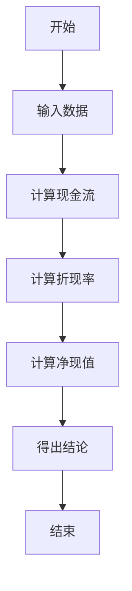
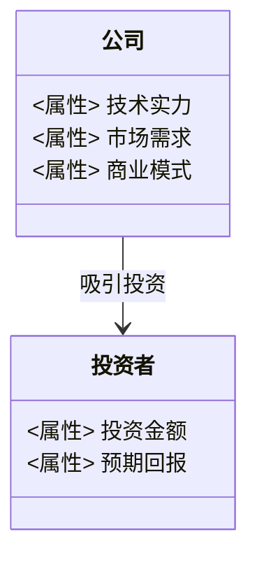
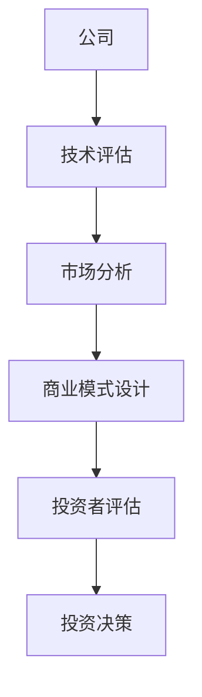

                 


# 价值投资中的空间技术商业化前景

> 关键词：价值投资、空间技术、商业化、投资前景、数学模型

> 摘要：本文探讨了在价值投资框架下，空间技术商业化的发展前景。通过分析空间技术的核心领域、商业化模式、数学模型和投资策略，本文为投资者提供了深入了解空间技术商业化潜力的视角。

---

## 第1章: 空间技术商业化与价值投资的背景

### 1.1 空间技术的定义与现状
空间技术是指用于探索、开发和利用太空资源的各项技术，涵盖卫星通信、遥感技术、航天器制造、火箭发射等领域。当前，空间技术正经历快速发展，商业化进程也在加速，特别是在卫星互联网、太空采矿和深空探索等领域。

### 1.2 价值投资的基本概念
价值投资是一种投资策略，强调以低于内在价值的价格买入优质资产。其核心在于识别市场低估的公司，通过长期持有实现收益。价值投资的关键在于对企业基本面的深入分析和对安全边际的重视。

### 1.3 空间技术商业化与价值投资的结合
空间技术的商业化为投资者提供了新的投资机会，但同时也带来了技术和市场风险。价值投资在这一领域的作用在于识别那些具备强大技术实力、良好商业模式和竞争优势的企业。

---

## 第2章: 空间技术商业化的核心概念与联系

### 2.1 空间技术商业化的核心要素
- **技术创新**：核心技术如卫星技术、发射技术的进步是商业化的基础。
- **市场需求**：明确的应用场景和需求推动商业化进程。
- **商业模式**：成功的商业模式如订阅服务、硬件销售等是商业化成功的关键。

### 2.2 核心概念对比
下表展示了空间技术商业化中几个核心概念的对比：

| 概念 | 技术创新 | 市场需求 | 商业模式 |
|------|----------|----------|----------|
| 定义 | 新技术的研发与应用 | 用户对产品或服务的需求 | 企业盈利的方式 |
| 关系 | 技术创新满足市场需求 | 市场需求驱动商业模式选择 | 商业模式依赖技术创新和市场需求 |

### 2.3 ER实体关系图
```mermaid
erDiagram
    企业 ..> 技术创新
    企业 ..> 市场需求
    企业 ..> 商业模式
    企业 ..> 投资者
    投资者 ..> 市场
    市场 ..> 竞争格局
```

---

## 第3章: 空间技术商业化中的数学模型与算法原理

### 3.1 价值评估模型
价值评估是空间技术商业化中的关键环节。以下是几种常用的数学模型：

#### 3.1.1 现金流折现法
$$ V = \sum_{t=1}^{n} \frac{CF_t}{(1 + r)^t} $$
其中，\( CF_t \) 是第 t 年的现金流，\( r \) 是折现率，\( n \) 是项目寿命。

#### 3.1.2 内部收益率法
$$ IRR = r \text{ 使得 } NPV = 0 $$
内部收益率是使净现值为零的折现率。

#### 3.1.3 净现值法
$$ NPV = \sum_{t=1}^{n} \frac{CF_t}{(1 + r)^t} - I_0 $$
净现值是未来现金流的现值减去初始投资。

### 3.2 算法原理的流程图


---

## 第4章: 系统分析与架构设计

### 4.1 项目场景介绍
假设我们正在评估一家提供卫星通信服务的公司。我们需要分析其技术实力、市场需求和商业模式。

### 4.2 系统功能设计
以下是领域模型类图：



### 4.3 系统架构设计
以下是系统架构图：



---

## 第5章: 项目实战

### 5.1 环境安装
首先安装Python和必要的库：
```bash
pip install numpy pandas matplotlib
```

### 5.2 核心实现源代码
```python
import numpy as np
import pandas as pd

def calculate_npv(cash_flows, discount_rate):
    return np.npv(discount_rate, *cash_flows)

# 示例数据
cash_flows = [-100, 50, 60, 70]
discount_rate = 0.1

npv = calculate_npv(cash_flows, discount_rate)
print(f"净现值为: {npv}")
```

### 5.3 实际案例分析
假设某公司未来五年的现金流分别为-100, 50, 60, 70, 80万元，折现率为10%。计算其净现值：
$$ NPV = \sum_{t=1}^{5} \frac{CF_t}{(1 + 0.1)^t} - 100 $$

---

## 第6章: 最佳实践

### 6.1 小结
空间技术商业化与价值投资的结合需要深入分析技术创新、市场需求和商业模式。通过数学模型和系统设计，可以有效评估投资价值。

### 6.2 注意事项
- 保持对市场变化的敏感性。
- 确保模型假设合理。
- 关注政策和法规的影响。

### 6.3 拓展阅读
- 建议阅读《价值投资实战策略》和《空间技术商业化指南》。

---

## 结语
通过本文的分析，读者可以深入了解空间技术商业化中的投资机会和挑战，并掌握相关的数学模型和系统设计方法。希望本文能为投资者提供有价值的见解和指导。

