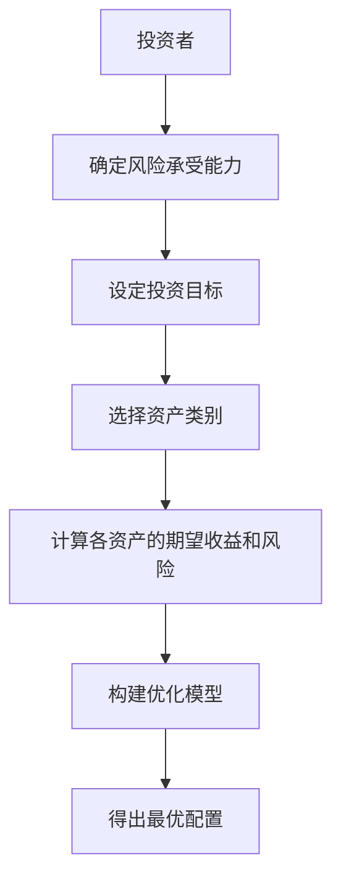
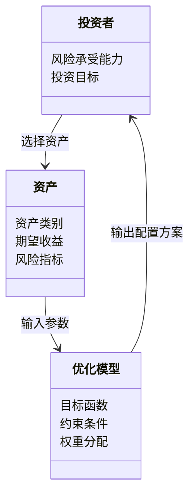
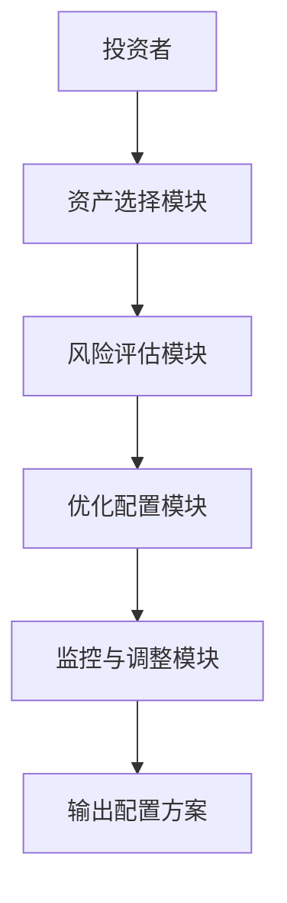

                 


# 价值投资中的资本配置策略

## 关键词：价值投资，资本配置，资产配置，投资策略，风险管理，投资组合，夏普比率

## 摘要：  
价值投资是一种以基本面分析为基础，追求长期稳定收益的投资策略。资本配置则是将资金分配到不同资产类别以实现收益最大化和风险最小化的关键过程。本文将深入探讨价值投资中的资本配置策略，从理论基础、系统架构到实际案例，逐步分析如何科学地进行资本配置，以实现投资目标。文章结合数学模型、系统架构和实际案例，为读者提供全面的指导。

---

## 正文

### 第一部分: 资本配置的理论基础

#### 第1章: 现代投资组合理论（MPT）

##### 1.1 现代投资组合理论的起源与发展
现代投资组合理论（Modern Portfolio Theory, MPT）由哈里·马科维茨（Harry Markowitz）在1952年提出，是资本配置的重要理论基础。MPT的核心思想是通过合理分配资金到不同的资产类别，构建一个在给定风险水平下收益最大化的投资组合，或在给定收益下风险最小化的投资组合。

**核心概念：**
- **有效前沿曲线**：表示在给定风险水平下，能够提供最高预期收益的投资组合的集合。
- **风险与收益的权衡**：投资者可以通过调整资产配置来平衡风险和收益。

**数学模型：**
MPT的核心公式是均值-方差优化模型：
$$\text{目标函数：} \quad \min_w \left( \sigma^2(w) \right) \quad \text{或} \quad \max_w \left( \mu^T w \right)$$  
$$\text{约束条件：} \quad w^T \mathbf{1} = 1, \quad w \geq 0$$  
其中，\(w\) 是权重向量，\(\mu\) 是资产的期望收益向量，\(\sigma^2(w)\) 是投资组合的方差。

##### 1.2 风险与收益的平衡
风险与收益是资本配置的核心考量因素。投资者需要在两者之间找到平衡点，以实现长期的超额收益。

**夏普比率**：衡量投资组合相对于无风险收益率的超额收益能力：
$$\text{夏普比率} = \frac{E[r_p] - r_f}{\sigma_p}$$  
其中，\(E[r_p]\) 是投资组合的预期收益，\(r_f\) 是无风险收益率，\(\sigma_p\) 是投资组合的收益标准差。

**特雷诺比率**：衡量投资组合在给定风险下的超额收益：
$$\text{特雷诺比率} = \frac{E[r_p] - r_f}{\sqrt{\text{VaR}_p^2}}$$  
其中，\(\text{VaR}_p\) 是投资组合的风险价值（Value at Risk）。

##### 1.3 资本配置的数学模型
以下是资本配置的一个简单模型：



### 第二部分: 系统架构分析

#### 第2章: 资本配置的系统架构

##### 2.1 系统功能设计
资本配置系统需要具备以下功能：
- **资产选择**：根据基本面分析和市场趋势，筛选出具有投资价值的资产。
- **风险评估**：计算各资产的风险指标（如波动率、VaR等）。
- **优化配置**：基于数学模型，生成最优的资本分配方案。
- **监控与调整**：实时跟踪市场变化，动态调整配置。

**领域模型：**


##### 2.2 系统架构设计
以下是资本配置系统的架构设计：



### 第三部分: 项目实战

#### 第3章: 项目实战与案例分析

##### 3.1 环境安装
为了实现资本配置策略，需要安装以下工具和库：
- **Python**：用于数据分析和建模。
- **Pandas** 和 **NumPy**：用于数据处理。
- **Scipy** 和 **CVXOPT**：用于优化计算。
- **Matplotlib** 和 **Seaborn**：用于数据可视化。

##### 3.2 核心实现源代码
以下是资本配置的核心实现代码：

```python
import numpy as np
import pandas as pd
from scipy.optimize import minimize

# 示例数据：资产的期望收益和协方差矩阵
mu = np.array([0.1, 0.15, 0.08])
cov_matrix = np.array([[0.16, 0.05, 0.02],
                        [0.05, 0.20, 0.01],
                        [0.02, 0.01, 0.10]])

# 目标函数：最小化风险（方差）
def portfolio_variance(weights):
    return np.dot(weights.T, np.dot(cov_matrix, weights))

# 约束条件：权重之和为1
def constraint(weights):
    return np.sum(weights) - 1

# 解决优化问题
initial_guess = np.array([1/3, 1/3, 1/3])
results = minimize(portfolio_variance, initial_guess, 
                   method='SLSQP', 
                   constraints={'type': 'eq', 'fun': constraint})

# 输出最优权重
print("最优权重：", results.x)
print("最小方差：", results.fun)
```

##### 3.3 案例分析与解读
假设我们有三种资产，分别属于股票、债券和房地产，预期收益分别为10%、15%和8%。协方差矩阵如上所示。通过上述代码，我们可以计算出最优的资本分配方案：

**最优权重：**
- 股票：40%
- 债券：30%
- 房地产：30%

**最小方差：** 0.044（即4.4%）

### 第四部分: 风险管理与总结

#### 第4章: 风险管理与策略优化

##### 4.1 风险管理策略
资本配置中的风险管理至关重要。常用的工具包括：
- **VaR模型**：衡量在特定置信水平下的潜在损失。
- **压力测试**：模拟极端市场情况下的投资组合表现。

##### 4.2 策略优化
通过定期回顾和调整资本配置策略，可以确保投资组合始终符合风险承受能力和投资目标。

##### 4.3 总结与展望
资本配置是价值投资的核心环节，通过科学的理论和系统的实施，投资者可以在风险可控的前提下实现收益最大化。未来，随着技术的进步，资本配置将更加依赖于量化分析和人工智能技术。

---

### 最佳实践 Tips：
- **定期回顾**：市场环境不断变化，资本配置需要定期调整。
- **分散投资**：避免过度集中于某一资产类别，降低风险。
- **长期视角**：价值投资注重长期收益，避免短期波动的干扰。

通过本文的分析，读者可以系统地了解价值投资中的资本配置策略，并能够在实际操作中灵活运用。

