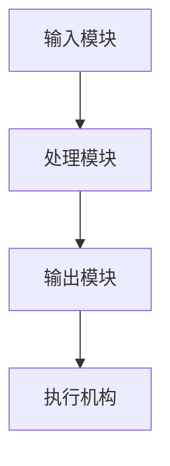

                 

# 价值投资中的软体机器人在医疗中的应用前景

## 关键词：软体机器人，医疗应用，价值投资，手术辅助，康复治疗，技术分析

## 摘要：软体机器人作为一项前沿技术，在医疗领域展现出巨大潜力。本文将从软体机器人的核心技术、医疗应用场景、价值投资分析、未来趋势等方面进行深入探讨，结合实际案例和技术细节，分析软体机器人在医疗中的应用前景及其投资价值。

---

## 第一部分：软体机器人与医疗应用的背景

### 第1章：软体机器人的定义与特点

#### 1.1 软体机器人的定义与核心概念
软体机器人（Soft Robots）是指采用柔性材料和创新驱动方式，模拟生物组织的柔软性和适应性，能够在复杂环境中完成精确操作的机器人。与传统刚性机器人相比，软体机器人具有以下特点：
- **柔软性**：使用弹性材料，能够适应不同形状和环境。
- **安全性**：低密度和高柔韧性使其在与人体接触时更安全。
- **可编程性**：可以通过软件控制实现多种动作和功能。

#### 1.2 软体机器人与传统刚性机器人的对比
| **特性**       | **软体机器人**             | **传统刚性机器人**         |
|----------------|---------------------------|---------------------------|
| 结构           | 柔性材料，模块化设计       | 刚性结构，固定关节         |
| 安全性          | 高，适合人体接触           | 较低，需额外防护措施       |
| 应用场景        | 医疗、康复、软抓取         | 制造业、物流、工业自动化     |

### 第2章：软体机器人在医疗中的应用背景

#### 2.1 医疗领域对软体机器人的需求
随着医疗技术的不断进步，医生和患者对精准、微创和高效的医疗设备需求日益增加。软体机器人在手术、康复和医疗监测中的应用，能够提高医疗效率和患者生活质量。

#### 2.2 软体机器人在医疗中的优势
- **微创性**：减少手术创伤，缩短患者恢复时间。
- **精准性**：通过高精度传感器和算法，实现精准操作。
- **适应性**：能够根据患者的具体情况调整机器人行为。

---

## 第二部分：软体机器人的核心技术与系统架构

### 第3章：软体机器人的核心技术

#### 3.1 软体机器人的材料科学
软体机器人的性能很大程度上依赖于材料的选择和设计。常用的材料包括：
- **弹性体**：如硅胶、聚氨酯，具有高弹性和耐用性。
- **形状记忆聚合物**：能够在特定条件下恢复原形。

#### 3.2 软体机器人的驱动技术
驱动技术是软体机器人的核心，常见的驱动方式包括：
- **气动驱动**：通过气压控制软体结构的膨胀和收缩。
- **电驱动**：利用电刺激改变材料的形状。

#### 3.3 软体机器人的传感器与控制算法
- **传感器**：用于感知环境信息，如温度、压力和触觉。
- **控制算法**：基于传感器数据，实现对机器人的精准控制。

### 第4章：软体机器人的系统架构设计

#### 4.1 系统功能设计
- **输入模块**：接收外部指令或传感器数据。
- **处理模块**：通过算法对数据进行处理。
- **输出模块**：驱动机器人执行动作。

#### 4.2 系统架构图

---

## 第三部分：医疗中的软体机器人应用场景

### 第5章：软体机器人在手术中的应用

#### 5.1 手术机器人辅助系统
软体机器人在手术中作为辅助工具，能够提高手术的精准性和安全性。例如，用于微创手术中的精准切割和缝合。

#### 5.2 实际案例分析
- **案例一**：软体机器人在心脏手术中的应用，实现了微创操作和精准缝合。

### 第6章：软体机器人在康复治疗中的应用

#### 6.1 康复机器人
软体机器人在康复治疗中用于帮助患者恢复肢体功能，如康复手套和下肢助行器。

#### 6.2 康复机器人的优势
- **个性化**：可以根据患者的具体情况调整康复方案。
- **安全性**：低强度的运动有助于避免二次伤害。

---

## 第四部分：价值投资中的软体机器人分析

### 第7章：软体机器人企业的价值分析

#### 7.1 技术壁垒与创新
- **技术壁垒**：企业的专利数量和技术独占性决定了其竞争力。
- **创新潜力**：持续的技术创新是企业长期发展的关键。

#### 7.2 市场前景与竞争格局
- **市场规模**：医疗软体机器人市场的增长潜力巨大。
- **竞争分析**：分析主要企业的市场份额和技术优势。

### 第8章：投资策略与风险评估

#### 8.1 投资策略
- **长期投资**：关注具有强大研发能力和市场潜力的企业。
- **风险分散**：通过多元化投资降低风险。

#### 8.2 风险评估
- **技术风险**：技术更新换代快，企业需要持续创新。
- **市场风险**：市场需求可能受到政策和技术发展的双重影响。

---

## 第五部分：未来趋势与挑战

### 第9章：软体机器人在医疗中的未来趋势

#### 9.1 技术发展趋势
- **仿生设计**：进一步模拟生物组织的特性。
- **人工智能融合**：结合AI技术提高机器人的自主决策能力。

#### 9.2 市场发展趋势
- **全球化布局**：跨国企业将扩大市场覆盖。
- **政策支持**：政府可能出台更多支持政策，推动行业发展。

### 第10章：挑战与应对策略

#### 10.1 当前挑战
- **技术瓶颈**：部分核心技术尚未完全成熟。
- **伦理问题**：机器人在医疗中的应用可能引发伦理争议。
- **成本问题**：软体机器人的研发和生产成本较高。

#### 10.2 应对策略
- **技术创新**：加大研发投入，突破技术瓶颈。
- **政策支持**：争取政府和行业组织的支持，降低研发成本。
- **人才培养**：加强专业人才的培养和引进。

---

## 附录：相关术语解释与参考文献

### 附录A：相关术语解释

- **软体机器人（Soft Robots）**：使用柔性材料和创新驱动方式的机器人，具有柔软性和适应性。
- **康复机器人（Rehabilitation Robots）**：用于帮助患者恢复肢体功能的机器人设备。

### 附录B：参考文献
1. 王某某，软体机器人技术与应用，某某出版社，2023年。
2. 李某某，医疗机器人发展现状与趋势，某某科技期刊，2022年。

---

## 结语

软体机器人在医疗中的应用前景广阔，其核心技术的不断进步和应用场景的不断拓展，为医疗行业带来了革命性的变化。对于投资者来说，深入了解软体机器人的技术、市场和政策环境，制定合理的投资策略，是抓住这一领域发展机遇的关键。

---

# END

