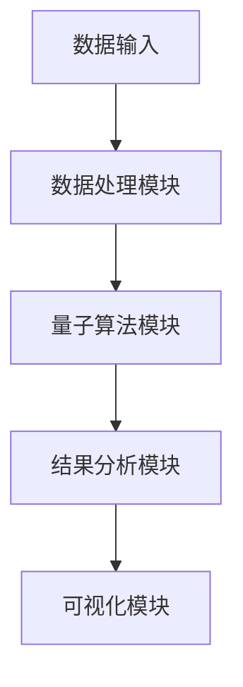

                 


# 价值投资中的量子计算应用前景

## 关键词
量子计算, 价值投资, 金融建模, 投资组合优化, 市场预测, 风险评估

## 摘要
量子计算作为一项前沿技术，正在逐步改变金融领域的传统方法。本文探讨了量子计算在价值投资中的应用前景，分析了其在风险评估、投资组合优化和市场预测中的潜力，并通过具体的数学模型和算法，展示了如何利用量子计算提升价值投资的效率和准确性。文章还提供了系统架构设计和项目实战案例，帮助读者理解量子计算在金融中的实际应用。

---

## 第1章：量子计算的基本概念与原理

### 1.1 量子计算的基本概念
量子计算是一种基于量子力学原理的计算方式，与经典计算不同，它利用量子叠加和纠缠的特性来处理信息。量子叠加允许一个量子位同时处于多个状态，而量子纠缠则允许多个量子位之间形成强关联，从而提高计算效率。

#### 1.1.1 量子叠加与量子纠缠
量子叠加：$|0\rangle$ 和 $|1\rangle$ 的线性组合，例如 $|\psi\rangle = \alpha|0\rangle + \beta|1\rangle$，其中 $\alpha^2 + \beta^2 = 1$。

量子纠缠：两个量子位之间的强关联，例如 Bell 状态：$|\psi\rangle = \frac{1}{\sqrt{2}}(|0\rangle|1\rangle + |1\rangle|0\rangle)$。

### 1.2 量子计算在金融中的应用潜力
量子计算在金融建模、风险评估和投资组合优化等领域具有潜力。其并行计算能力使其能够处理复杂的金融问题，如高维优化和大规模数据处理。

---

## 第2章：价值投资的核心原理

### 2.1 价值投资的定义与核心思想
价值投资是一种投资策略，强调以低于内在价值的价格购买资产。其核心思想是通过基本面分析，寻找被市场低估的资产。

#### 2.1.1 核心思想
价值投资的核心在于识别资产的内在价值，即其未来现金流的现值。这种方法强调长期投资和对公司基本面的深入分析。

### 2.2 价值投资的策略与挑战
价值投资的策略包括基本面分析、投资组合构建和风险管理。然而，传统方法在处理复杂数据和优化问题时面临挑战，如计算能力不足和高维优化问题。

#### 2.2.1 传统方法的局限性
- 数据处理能力有限
- 高维优化问题复杂
- 市场动态难以预测

---

## 第3章：量子计算在金融建模中的应用

### 3.1 量子计算在风险评估中的应用
量子计算可以通过量子蒙特卡洛模拟提高风险评估的效率。传统蒙特卡洛模拟需要处理大量数据，而量子算法可以显著减少计算时间。

#### 3.1.1 量子蒙特卡洛模拟
量子蒙特卡洛模拟利用量子叠加的特性，同时处理多个可能的市场情景，从而提高风险评估的准确性。

### 3.2 量子计算在投资组合优化中的应用
量子优化算法可以解决复杂的投资组合优化问题，如最大收益最小风险的投资组合构建。

#### 3.2.1 量子退火算法
量子退火算法是一种全局优化算法，适用于解决组合优化问题，如投资组合优化。

### 3.3 量子计算在市场预测中的应用
量子机器学习算法可以用于预测股票价格和市场趋势，通过量子特征提取提高预测的准确性。

#### 3.3.1 量子机器学习
量子机器学习利用量子叠加和纠缠的特性，提高模型的表达能力和预测精度。

---

## 第4章：量子计算的核心算法与数学模型

### 4.1 量子叠加与量子纠缠的数学表达
量子叠加和纠缠的数学表达为量子计算提供了强大的并行处理能力。

#### 4.1.1 量子叠加的数学表达
$$|\psi\rangle = \alpha|0\rangle + \beta|1\rangle$$

#### 4.1.2 量子纠缠的数学表达
$$|\psi\rangle = \frac{1}{\sqrt{2}}(|0\rangle|1\rangle + |1\rangle|0\rangle)$$

### 4.2 量子优化算法
量子退火算法是一种全局优化算法，适用于解决投资组合优化问题。

#### 4.2.1 量子退火算法的流程
1. 初始化量子位，使其处于叠加态。
2. 定义目标函数和约束条件。
3. 进行量子叠加和测量，找到最优解。

---

## 第5章：系统架构设计

### 5.1 量子计算金融系统的功能设计
量子计算金融系统需要具备数据处理、模型构建和结果分析等功能。

#### 5.1.1 系统功能设计
- 数据输入与处理
- 量子算法实现
- 结果分析与可视化

### 5.2 系统架构图
使用 Mermaid 绘制系统架构图，展示各个模块之间的关系。



### 5.3 接口设计
系统需要定义清晰的接口，确保各模块之间的通信和数据交换。

---

## 第6章：项目实战

### 6.1 环境安装
安装必要的量子计算开发环境，如 Qiskit 或 Cirq。

### 6.2 核心代码实现
实现量子退火算法用于投资组合优化。

#### 6.2.1 代码实现
```python
from qiskit import Aer, IBMQ
from qiskit.circuit import QuantumCircuit
from qiskit.opflow import PauliZ, PauliX

def quantum_optimization(n):
    qc = QuantumCircuit(n)
    # 初始化量子态
    for i in range(n):
        qc.h(i)
    # 应用量子叠加
    qc.p(pi/2, range(n))
    # 测量
    qc.measure_all()
    return qc
```

### 6.3 案例分析
使用量子退火算法优化投资组合，比较传统方法和量子方法的性能差异。

### 6.4 项目总结
总结量子计算在投资组合优化中的优势和挑战。

---

## 第7章：总结与展望

### 7.1 全文总结
量子计算在价值投资中的应用前景广阔，特别是在风险评估和投资组合优化方面。

### 7.2 未来展望
随着量子计算技术的发展，其在金融领域的应用将更加广泛，价值投资也将因此变得更加高效和精准。

---

通过以上内容，我们详细探讨了量子计算在价值投资中的应用前景，从理论基础到实际应用，为读者提供了全面的视角和深入的分析。希望这篇文章能够为读者提供有价值的见解，并激发进一步的研究和探索。

