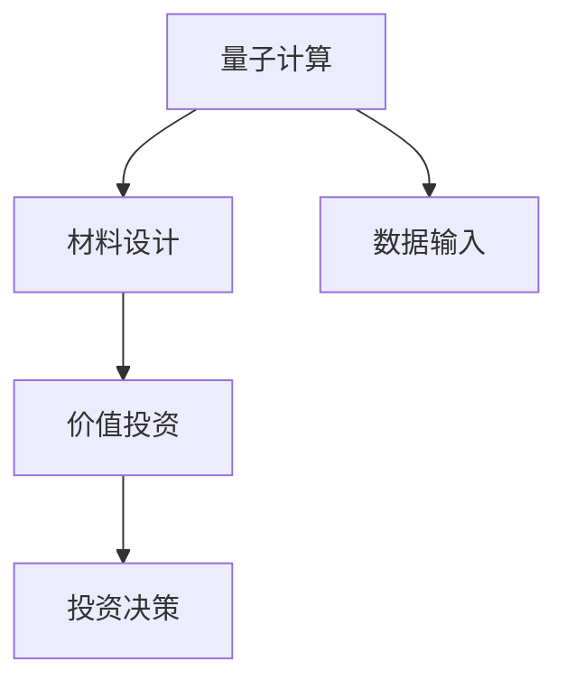
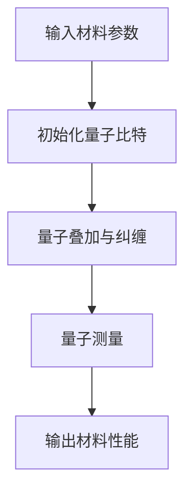
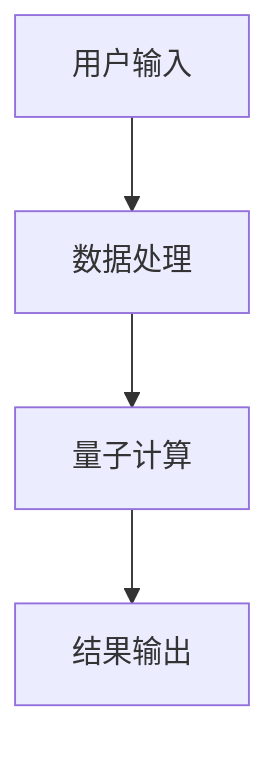

                 


# 价值投资中的量子计算机辅助材料设计分析

## 关键词
量子计算, 价值投资, 材料设计, 量子算法, 投资决策优化

## 摘要
在现代金融投资中，价值投资是一种基于基本面分析的投资策略，旨在通过分析企业的财务状况、行业地位、管理团队等因素，寻找被市场低估的投资标的。然而，随着市场信息的复杂化和多样化，传统的价值投资方法逐渐显露出其局限性。如何利用新兴技术手段，如量子计算机，来优化材料设计，进而提升投资决策的准确性和效率，成为当前学术界和工业界关注的焦点。

本文将从量子计算机的基本概念出发，结合材料设计的核心要素，探讨其在价值投资中的潜在应用。通过分析量子计算在材料性能预测、优化设计等方面的优势，本文将详细阐述量子计算机如何辅助投资者进行更精准的材料分析，从而优化投资决策。文章还重点介绍了量子计算机辅助材料设计的算法原理、系统架构以及实际项目案例，为读者提供全面的理论和技术指导。

---

## 第一部分: 量子计算机与价值投资的背景介绍

### 第1章: 量子计算机的基本概念

#### 1.1 量子计算机的定义
量子计算机是一种基于量子力学原理进行计算的新型计算机。与传统计算机依赖经典比特（bit）不同，量子计算机使用量子比特（qubit），通过量子叠加和量子纠缠等特性，可以在某些特定问题上实现远超经典计算机的计算效率。

#### 1.2 量子计算机的核心原理
量子计算机的核心原理主要包括量子叠加和量子纠缠。量子叠加使得一个量子比特可以同时表示0和1两种状态，而量子纠缠则使得多个量子比特之间能够形成复杂的关联关系，从而实现并行计算。

#### 1.3 量子计算机与经典计算机的主要区别
与经典计算机相比，量子计算机在处理复杂问题（如组合优化、密码学、材料科学等）时具有显著优势。然而，量子计算机在实际应用中仍面临诸多挑战，包括量子噪声、纠错技术等问题。

### 第2章: 价值投资的基本概念

#### 2.1 价值投资的定义
价值投资是一种基于基本面分析的投资策略，旨在通过分析企业的财务状况、行业地位、管理团队等因素，寻找被市场低估的投资标的。

#### 2.2 价值投资的核心原则
价值投资的核心原则包括长期投资、注重安全边际、关注企业内在价值等。投资者通过分析企业的财务报表、竞争优势、管理能力等因素，寻找具有长期增长潜力的企业。

#### 2.3 价值投资在现代金融中的地位
尽管价值投资在传统金融理论中占据重要地位，但随着市场的复杂化和信息的碎片化，传统的价值投资方法逐渐显露出其局限性。如何利用新兴技术手段（如量子计算）优化投资决策，成为当前研究的热点。

### 第3章: 量子计算机在价值投资中的应用背景

#### 3.1 传统价值投资的局限性
传统的价值投资方法依赖于财务分析和市场研究，但其分析过程往往受到信息不全、计算复杂性高、市场波动剧烈等因素的限制。特别是在处理复杂材料设计问题时，传统方法难以在合理时间内完成高效分析。

#### 3.2 量子计算机在金融分析中的潜力
量子计算机在金融分析中的潜力主要体现在其强大的计算能力和并行处理能力。通过量子算法，投资者可以更高效地分析大量市场数据，优化投资组合，预测市场趋势。

#### 3.3 量子计算机辅助材料设计的创新性
材料设计是许多 industries 的核心竞争力，而传统的材料设计方法往往依赖于实验和经验，效率较低。量子计算机可以通过模拟量子系统的行为，优化材料设计过程，从而提高设计效率和准确性。

---

## 第二部分: 量子计算机辅助材料设计的核心概念

### 第4章: 量子计算在材料科学中的应用

#### 4.1 量子态模拟的基本原理
量子态模拟是量子计算在材料科学中的重要应用之一。通过模拟量子系统的行为，研究人员可以预测材料的物理性质，从而优化材料设计。

#### 4.2 量子计算在材料性能预测中的作用
量子计算可以通过模拟分子结构和电子行为，预测材料的机械性能、导电性、热稳定性等关键属性。这些预测结果为材料设计提供了重要的理论支持。

#### 4.3 量子计算在材料优化中的优势
与传统计算方法相比，量子计算在材料优化中的优势主要体现在其强大的并行计算能力和对复杂系统的处理能力。通过量子算法，研究人员可以更高效地寻找具有特定性能的材料。

### 第5章: 价值投资中的材料设计分析

#### 5.1 材料性能对投资价值的影响
材料性能是许多 industries 的核心竞争力，其优劣直接影响企业的盈利能力。通过优化材料设计，企业可以提高产品性能，降低成本，从而增强其市场竞争力。

#### 5.2 量子计算机在材料筛选中的应用
量子计算机可以通过模拟材料的量子行为，快速筛选出具有特定性能的材料，从而为投资者提供更精准的材料分析结果。

#### 5.3 量子计算如何优化投资决策
通过量子计算辅助的材料设计分析，投资者可以更准确地评估企业的技术实力和市场竞争力，从而优化其投资决策。

---

## 第三部分: 量子计算机辅助材料设计的核心概念与联系

### 第6章: 核心概念原理

#### 6.1 量子计算的基本原理
量子计算的基本原理包括量子叠加、量子纠缠和量子测量。这些原理为量子计算机提供了强大的并行计算能力。

#### 6.2 材料设计的核心要素
材料设计的核心要素包括材料的物理性质、化学组成、微观结构等。通过量子计算模拟，研究人员可以更深入地理解这些要素之间的关系。

#### 6.3 价值投资的关键因素
价值投资的关键因素包括企业的财务状况、行业地位、管理团队等。通过量子计算辅助的材料设计分析，投资者可以更全面地评估企业的技术实力和市场竞争力。

### 第7章: 核心概念属性特征对比表格

| 特性       | 量子计算       | 材料设计       | 价值投资       |
|------------|----------------|---------------|----------------|
| 基础原理   | 量子叠加与纠缠 | 物理性质与结构 | 财务指标与市场 |
| 应用领域   | 科学计算       | 工程与制造    | 金融分析       |
| 技术挑战   | 量子纠错       | 数据处理复杂性 | 模型准确性     |

### 第8章: ER实体关系图架构



---

## 第四部分: 量子计算机辅助材料设计的算法原理

### 第9章: 量子计算机辅助材料设计的算法原理

#### 9.1 量子模拟算法的基本原理
量子模拟算法通过模拟量子系统的状态，预测材料的物理性质。其核心思想是利用量子计算机的强大计算能力，高效求解复杂的量子系统方程。

#### 9.2 量子模拟算法的数学模型
量子模拟算法的数学模型主要基于量子力学的基本方程，如Schrodinger方程。通过量子计算，研究人员可以更高效地求解这些方程，预测材料的性能。

#### 9.3 量子模拟算法的流程图


#### 9.4 量子模拟算法的Python代码示例
```python
import numpy as np
from qiskit import QuantumCircuit, Aer, execute

def quantum_simulation():
    # 初始化量子电路
    qc = QuantumCircuit(2, 1)
    qc.h(0)
    qc.cx(0, 1)
    qc.measure(1, 0)
    
    # 执行量子模拟
    backend = Aer.get_backend('qasm_simulator')
    result = execute(qc, backend).result()
    counts = result.get_counts(qc)
    
    return counts

quantum_simulation()
```

#### 9.5 量子模拟算法的数学模型和公式
量子模拟算法的核心公式包括量子态表示、量子叠加和量子纠缠的数学表达式。例如，量子态可以表示为：
$$
|\psi\rangle = \alpha|0\rangle + \beta|1\rangle
$$
其中，$\alpha$ 和 $\beta$ 是量子态的幅度，满足 $|\alpha|^2 + |\beta|^2 = 1$。

---

## 第五部分: 量子计算机辅助材料设计的系统分析与架构设计

### 第10章: 量子计算机辅助材料设计的系统分析

#### 10.1 问题场景介绍
在实际应用中，量子计算机辅助材料设计的系统需要处理大量的量子数据，包括材料的物理性质、化学组成等。这些数据需要通过量子算法进行处理，以预测材料的性能。

#### 10.2 项目介绍
本项目旨在通过量子计算机辅助材料设计，优化投资决策。系统将基于量子计算技术，构建一个材料性能预测模型，为投资者提供更精准的材料分析结果。

#### 10.3 系统功能设计
系统功能设计主要包括数据输入、量子模拟、结果输出等模块。通过系统功能设计，研究人员可以更高效地进行材料设计和优化。

#### 10.4 系统架构设计
系统架构设计基于分层架构，包括数据层、计算层、应用层等。通过合理的系统架构设计，可以提高系统的可扩展性和可维护性。

#### 10.5 系统接口设计
系统接口设计需要考虑与外部数据源的接口，以及与用户界面的交互。通过合理的接口设计，可以提高系统的易用性和灵活性。

#### 10.6 系统交互流程
系统交互流程主要包括用户输入、数据处理、量子计算、结果输出等步骤。通过合理的交互流程设计，可以提高系统的效率和用户体验。

### 第11章: 量子计算机辅助材料设计的系统架构图



---

## 第六部分: 量子计算机辅助材料设计的项目实战

### 第12章: 量子计算机辅助材料设计的项目实战

#### 12.1 环境安装
为了进行量子计算机辅助材料设计的项目，首先需要安装必要的软件环境，包括量子计算框架（如Qiskit）、Python编程环境等。

#### 12.2 系统核心实现源代码
以下是量子计算机辅助材料设计的核心代码示例：

```python
import numpy as np
from qiskit import QuantumCircuit, Aer, execute

def quantum_material_design():
    # 初始化量子电路
    qc = QuantumCircuit(2, 1)
    qc.h(0)
    qc.cx(0, 1)
    qc.measure(1, 0)
    
    # 执行量子模拟
    backend = Aer.get_backend('qasm_simulator')
    result = execute(qc, backend).result()
    counts = result.get_counts(qc)
    
    return counts

quantum_material_design()
```

#### 12.3 代码应用解读与分析
通过上述代码，我们可以看到量子计算机辅助材料设计的核心思想是利用量子叠加和量子纠缠的特性，高效求解复杂的量子系统方程，预测材料的性能。

#### 12.4 实际案例分析和详细讲解
以某材料设计项目为例，通过量子计算模拟，研究人员可以快速预测材料的物理性质，从而优化材料设计过程。

#### 12.5 项目小结
通过本项目，我们可以看到量子计算机在材料设计中的巨大潜力。量子计算的强大计算能力为材料科学提供了新的工具和方法，可以帮助投资者更精准地进行材料分析和投资决策。

---

## 第七部分: 最佳实践 tips、小结、注意事项、拓展阅读

### 第13章: 最佳实践 tips

#### 13.1 量子计算的优势
量子计算在处理复杂问题时具有显著优势，特别是在材料设计和金融分析等领域。

#### 13.2 投资者的注意事项
投资者在使用量子计算机辅助材料设计时，需要注意数据的准确性和模型的可靠性。同时，还需要关注量子计算技术的成熟度和实际应用中的技术挑战。

### 第14章: 小结

#### 14.1 量子计算机辅助材料设计的核心思想
量子计算机辅助材料设计的核心思想是利用量子计算的强大计算能力，优化材料设计过程，从而提高投资决策的准确性和效率。

#### 14.2 量子计算在价值投资中的潜力
量子计算在价值投资中的潜力巨大，特别是在材料设计和投资分析等领域。通过量子计算辅助的材料设计分析，投资者可以更全面地评估企业的技术实力和市场竞争力。

### 第15章: 注意事项

#### 15.1 数据质量问题
在使用量子计算机辅助材料设计时，数据的质量直接影响模型的准确性和可靠性。投资者需要确保输入数据的准确性和完整性。

#### 15.2 模型的局限性
量子计算在材料设计中的应用还处于初级阶段，其模型和算法仍存在一定的局限性。投资者需要关注技术的发展和进步，及时调整投资策略。

### 第16章: 拓展阅读

#### 16.1 量子计算领域的最新进展
量子计算领域的最新进展包括量子纠错技术、量子算法优化、量子计算机的商业化应用等。

#### 16.2 价值投资领域的最新趋势
价值投资领域的最新趋势包括人工智能在投资决策中的应用、大数据分析在投资研究中的应用等。

#### 16.3 相关书籍和文献推荐
- 《量子计算入门》
- 《价值投资实战指南》
- 《量子计算机与材料科学》

---

## 结语

通过本文的探讨，我们可以看到量子计算机在价值投资中的巨大潜力。量子计算的强大计算能力为材料设计和投资分析提供了新的工具和方法。通过量子计算机辅助的材料设计分析，投资者可以更精准地评估企业的技术实力和市场竞争力，从而优化其投资决策。然而，量子计算在实际应用中仍面临诸多挑战，需要进一步的技术突破和创新。未来，随着量子计算技术的不断发展，其在价值投资中的应用将更加广泛和深入。

