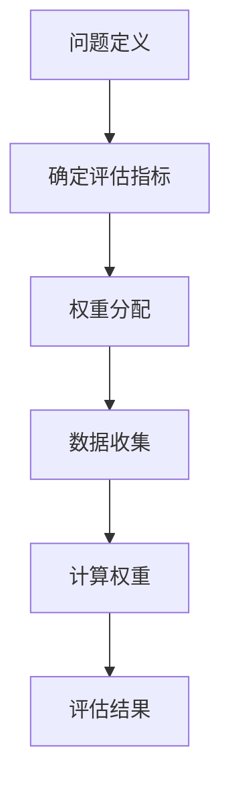
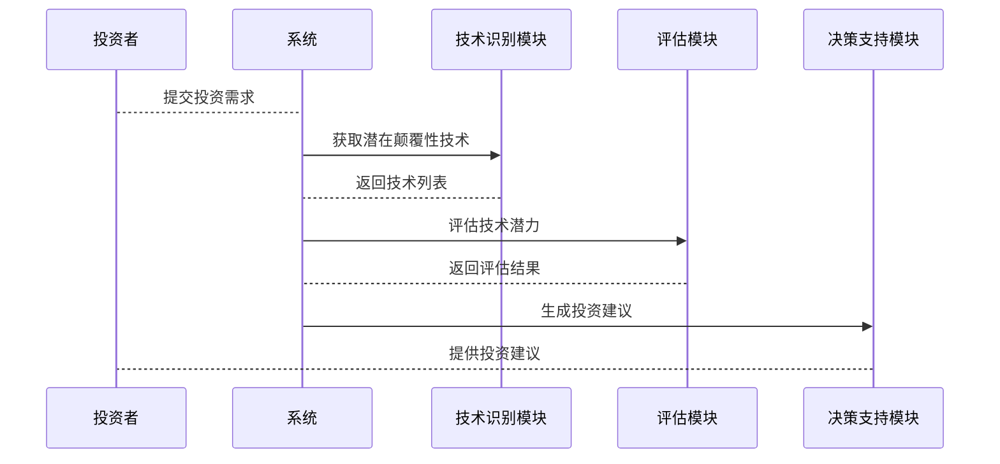

                 


# 价值投资中的颠覆性技术分析

---

## 关键词：价值投资、颠覆性技术、技术评估、投资决策、系统架构

---

## 摘要：  
本文探讨了价值投资与颠覆性技术分析的结合，从技术视角重新审视投资决策过程。通过分析颠覆性技术的核心原理、评估算法、系统架构及实际案例，为投资者提供一种新的技术驱动的投资策略。文章详细介绍了如何利用技术分析工具和系统架构设计，帮助投资者识别潜在的投资机会，优化投资决策，降低风险。

---

# 第一部分：价值投资与颠覆性技术的背景介绍

## 第1章：价值投资与颠覆性技术概述

### 1.1 价值投资的核心概念

#### 1.1.1 价值投资的定义与核心原则
价值投资是一种长期投资策略，强调以低于内在价值的价格买入优质资产。其核心原则包括：
1. **安全边际**：买入价格低于内在价值，以降低风险。
2. **长期视角**：关注企业的长期盈利能力，而非短期波动。
3. **基本面分析**：通过财务报表、行业地位、管理层质量等指标评估企业价值。

#### 1.1.2 投资中的问题背景与挑战
传统价值投资依赖主观判断，存在以下挑战：
1. **信息不对称**：市场参与者获取信息的能力不一，影响定价效率。
2. **情绪干扰**：投资者情绪波动可能导致市场定价偏离理性区间。
3. **技术复杂性**：新兴技术对企业价值的影响难以量化。

#### 1.1.3 颠覆性技术的定义与特征
颠覆性技术是指能够从根本上改变行业格局、商业模式或竞争优势的技术。其特征包括：
- **创新性**：突破传统技术的局限性。
- **扩散性**：快速普及并影响广泛市场。
- **破坏性**：对现有市场格局产生重大冲击。

---

### 1.2 颠覆性技术与投资的关系

#### 1.2.1 颠覆性技术的起源与演变
颠覆性技术的起源可以追溯到20世纪末，随着信息技术的快速发展，颠覆性技术逐渐从理论走向实践。例如，互联网技术颠覆了传统媒体行业，区块链技术颠覆了金融行业。

#### 1.2.2 颠覆性技术对投资机会的影响
颠覆性技术能够创造新的市场需求、降低运营成本、提高效率，从而为投资者带来超额收益。例如，人工智能技术的应用显著提升了企业的运营效率，成为价值投资的重要考量因素。

#### 1.2.3 颠覆性技术的生命周期与投资策略
颠覆性技术通常经历以下几个阶段：技术萌芽期、快速发展期、成熟期和衰退期。投资者应根据不同阶段的技术特征制定相应的投资策略，例如在萌芽期布局早期技术，在成熟期投资规模化应用。

---

## 第2章：颠覆性技术的核心概念与联系

### 2.1 颠覆性技术的核心原理

#### 2.1.1 技术创新的核心要素
技术创新的核心要素包括：
1. **技术本身**：技术的先进性、实用性和可扩展性。
2. **市场环境**：市场需求、竞争格局、政策环境。
3. **商业模式**：技术如何通过商业模式实现价值。

#### 2.1.2 颠覆性技术的扩散模型
技术扩散模型描述了颠覆性技术从创新者到大众用户的过程。模型包括以下阶段：
1. **创新者**：早期采用新技术的企业或个人。
2. **早期采用者**：行业内的领先企业。
3. **主流市场**：技术被广泛采用，市场占有率迅速上升。
4. **后期采用者**：技术普及，市场接近饱和。

#### 2.1.3 技术与市场的交互作用
技术与市场的交互作用是颠覆性技术发展的核心动力。市场需求推动技术创新，技术创新反过来影响市场格局。例如，智能手机的普及推动了移动支付技术的发展，而移动支付技术又进一步推动了电子商务的繁荣。

---

### 2.2 颠覆性技术与传统技术的对比分析

#### 2.2.1 技术属性对比表格
以下表格对比了颠覆性技术和传统技术的核心属性：

| 属性             | 颠覆性技术                     | 传统技术                     |
|------------------|-------------------------------|-----------------------------|
| 技术来源         | 创新性高，可能来自新兴领域     | 迭代性改进，来自现有领域    |
| 市场影响         | 根本性改变行业格局             | 改善现有产品或服务           |
| 用户接受度       | 初期低，逐步提高               | 用户需求明确，接受度高       |
| 竞争格局         | 初期竞争小，后期竞争加剧       | 竞争格局稳定，替代品较少     |

#### 2.2.2 技术对行业的影响对比
以下对比分析了颠覆性技术对行业的影响：

| 行业             | 颠覆性技术的影响               | 传统技术的影响               |
|------------------|-------------------------------|-----------------------------|
| 金融             | 区块链技术改变交易方式         | 传统银行体系                |
| 教育             | 在线教育平台改变教学模式       | 线下教学模式                |
| 医疗             | 人工智能辅助诊断技术           | 传统医疗设备                |

#### 2.2.3 颠覆性技术的ER实体关系图
以下是一个简单的ER图，展示了颠覆性技术、企业、市场之间的关系：

```mermaid
er
actor 投资者
actor 企业
actor 市场
```

---

# 第二部分：颠覆性技术分析的算法原理

## 第3章：颠覆性技术评估的算法模型

### 3.1 技术评估的核心算法

#### 3.1.1 层次分析法（AHP）在技术评估中的应用
层次分析法（AHP）是一种用于多指标决策分析的方法。以下是AHP在技术评估中的步骤：

1. **确定目标**：明确技术评估的目标，例如选择最佳投资的技术。
2. **构建层次结构**：将目标分解为多个因素，例如技术可行性、市场潜力、团队能力等。
3. **建立比较矩阵**：对每个因素进行权重分配，建立比较矩阵。
4. **计算权重**：通过计算比较矩阵的特征向量，确定每个因素的权重。
5. **评估结果**：根据权重计算各技术的综合评分，选择评分最高的技术。

#### 3.1.2 颠覆性技术潜力的数学模型
以下是一个简单的数学模型，用于评估颠覆性技术的潜力：

$$
TPI = \sum_{i=1}^{n} w_i \times f_i
$$

其中，$TPI$ 是技术潜力指数，$w_i$ 是第 $i$ 个指标的权重，$f_i$ 是第 $i$ 个指标的评分。

---

### 3.2 技术潜力评估的流程图



---

## 第三部分：系统分析与架构设计

## 第4章：颠覆性技术驱动的投资决策系统

### 4.1 系统功能设计

#### 4.1.1 颠覆性技术识别模块
1. **技术数据采集**：从公开数据源采集技术相关数据，例如专利申请、论文发表等。
2. **技术分类**：根据技术领域对技术进行分类，例如人工智能、区块链、5G等。
3. **技术趋势分析**：通过数据分析识别技术的未来发展趋势。

#### 4.1.2 技术潜力评估模块
1. **技术潜力计算**：根据AHP模型计算技术潜力指数。
2. **技术对比分析**：将不同技术的潜力指数进行对比，找出最具潜力的技术。
3. **风险评估**：分析技术的潜在风险，例如技术可行性、市场接受度等。

#### 4.1.3 投资决策支持模块
1. **投资建议生成**：根据技术潜力和风险评估结果，生成投资建议。
2. **投资组合优化**：根据投资者的风险偏好，优化投资组合。
3. **实时监控**：实时监控技术动态和市场变化，及时调整投资策略。

---

### 4.2 系统架构设计


---

### 4.3 系统接口与交互设计



---

# 第四部分：项目实战

## 第5章：基于颠覆性技术的项目分析

### 5.1 项目背景与目标
本项目旨在通过技术分析方法，识别具有颠覆性潜力的技术，并评估其投资价值。

### 5.2 环境安装与数据准备
1. **环境安装**：
   - 安装Python和相关库（如numpy、pandas、scipy）。
   - 安装Mermaid和图表工具。

2. **数据准备**：
   - 收集目标技术的相关数据，例如专利数量、论文数量、市场应用情况等。

---

### 5.3 系统核心实现源代码

#### 5.3.1 技术潜力评估模块代码
以下是AHP模型的Python实现代码：

```python
import numpy as np
import pandas as pd

# 定义比较矩阵
matrix = [
    [1, 3, 2],
    [1/3, 1, 1/2],
    [1/2, 2, 1]
]

# 计算特征向量
eigenvalues, eigenvectors = np.linalg.eig(matrix)

# 提取最大的特征向量
max_eigen = eigenvalues.max()
weights = eigenvectors[:, np.argmax(eigenvalues)]

# 计算权重并归一化
weights = weights / weights.sum()

print("权重为：", weights)
```

---

#### 5.3.2 技术对比分析模块代码
以下是技术对比分析模块的Python代码：

```python
import pandas as pd

# 创建技术对比数据框
data = {
    '技术A': [8, 6, 7],
    '技术B': [6, 9, 8],
    '技术C': [7, 5, 9]
}
df = pd.DataFrame(data)

# 计算平均值和标准差
mean = df.mean()
std = df.std()

print("平均值为：", mean)
print("标准差为：", std)
```

---

### 5.4 代码应用解读与分析
1. **技术潜力评估模块**：通过AHP模型计算技术潜力指数，权重反映了每个指标的重要性。
2. **技术对比分析模块**：通过计算平均值和标准差，评估不同技术的潜力和风险。

---

### 5.5 实际案例分析与详细讲解
以下是一个实际案例分析：

#### 案例分析：人工智能在医疗行业的应用
1. **技术识别**：识别人工智能在医疗行业的应用，例如智能诊断、药物研发等。
2. **潜力评估**：计算人工智能在医疗行业的技术潜力指数，发现其具有较高的潜力。
3. **投资建议**：建议投资者关注人工智能在医疗行业的相关企业，例如AI医疗初创公司。

---

## 第5.6 项目小结
通过本项目，我们验证了颠覆性技术分析方法的有效性，并展示了如何将技术分析应用于实际投资决策中。

---

## 第六部分：总结与展望

### 6.1 总结与小结
本文从技术视角重新审视了价值投资，提出了颠覆性技术分析的方法。通过算法和系统设计，帮助投资者识别潜在的投资机会，优化投资决策。

### 6.2 未来研究方向
1. **技术与经济的结合**：进一步研究技术对企业价值的影响。
2. **人工智能在投资决策中的应用**：利用机器学习算法优化技术评估和投资决策。
3. **风险控制**：研究如何通过技术分析降低投资风险。

---

## 6.3 最佳实践 tips

1. **持续学习**：技术发展迅速，投资者需要不断学习新技术。
2. **关注趋势**：关注颠覆性技术的趋势，抓住投资机会。
3. **分散投资**：避免过度集中，降低风险。

---

## 6.4 注意事项

1. **数据质量**：技术评估依赖于高质量的数据，数据不足可能导致评估结果不准确。
2. **模型局限性**：AHP模型是一种简化模型，可能无法捕捉所有影响因素。
3. **市场变化**：技术市场的变化可能会影响评估结果，需要定期更新模型。

---

## 6.5 拓展阅读

1. 《The Innovator's Dilemma》
2. 《技术分析实战》
3. 《价值投资经典案例》

---

通过本文的分析，投资者可以更好地理解颠覆性技术对价值投资的影响，并利用技术分析工具优化投资决策。

