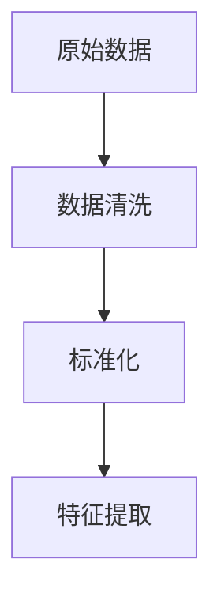
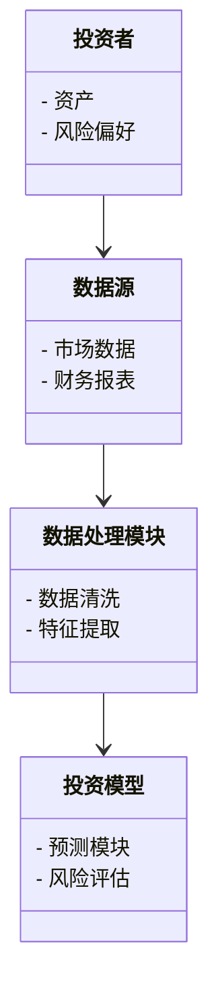
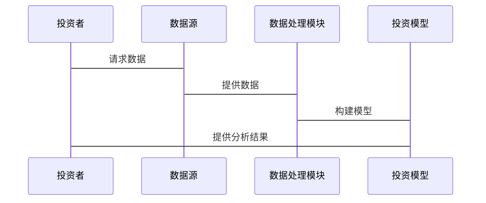

                 


# 价值投资中的高超音速飞行技术分析

## 关键词：价值投资、高超音速飞行技术、技术分析、风险管理、算法优化

## 摘要：本文探讨了高超音速飞行技术在价值投资中的应用，分析了其在技术分析、决策优化和风险管理中的优势，并通过实际案例展示了其在投资决策中的潜力。

---

## 第1章：价值投资与高超音速飞行技术的背景介绍

### 1.1 价值投资的基本概念
- **价值投资**：一种长期投资策略，寻找被市场低估的股票，长期持有，关注企业的内在价值。
- **高超音速飞行技术**：指飞行速度超过5倍音速（约6174 km/h）的技术，涉及空气动力学和材料科学。

### 1.2 高超音速飞行技术在投资中的应用背景
- **高速决策需求**：金融市场变化快，投资者需要快速响应。
- **技术分析的创新**：高超音速技术提供了高效的数据处理方法。

### 1.3 问题背景与问题描述
- 传统技术分析方法效率低下，难以应对高速市场变化。
- 投资者需要更高效的分析工具。

### 1.4 问题解决与边界
- 通过高超音速技术提升数据处理速度，优化决策效率。
- 设定边界条件：仅适用于高速市场变化，需考虑数据质量。

### 1.5 概念结构与核心要素
- **核心概念**：高超音速技术在数据分析中的应用。
- **核心要素**：高速数据处理、实时分析、风险评估。

---

## 第2章：高超音速飞行技术的核心原理

### 2.1 高超音速飞行技术的原理
- **空气动力学**：高速飞行中的气动特性优化。
- **热防护系统**：保护飞机在高速飞行中不因高温受损。

### 2.2 高超音速技术与投资决策的关联
- **数据处理**：快速处理大量市场数据。
- **风险评估**：高速计算模型用于实时风险监控。

### 2.3 核心概念的属性特征对比

| 特性       | 高超音速技术         | 传统技术分析 |
|------------|----------------------|--------------|
| 数据处理速度 | 极高                 | 较低          |
| 决策时间     | 瞬间                 | 较长          |
| 风险评估     | 实时                 | 延时          |

### 2.4 ER实体关系图

```mermaid
erd
actor: 投资者
technique: 高超音速技术
model: 投资模型
actor --> technique: 使用
technique --> model: 构建
```

---

## 第3章：高超音速飞行技术的算法原理

### 3.1 数据预处理流程



### 3.2 高速预测模型构建

#### 3.2.1 线性回归模型
- **公式**：$$ y = \beta_0 + \beta_1x + \epsilon $$
- **应用场景**：预测股票价格趋势。

#### 3.2.2 支持向量机（SVM）
- **代码示例**：
  ```python
  from sklearn import svm
  model = svm.SVR(kernel='rbf')
  model.fit(X, y)
  ```

### 3.3 风险评估算法

#### 3.3.1 风险值（VaR）计算
- **公式**：$$ VaR = \alpha \cdot \sigma $$
- **应用场景**：评估投资组合的风险。

---

## 第4章：系统分析与架构设计

### 4.1 项目介绍
- **项目目标**：构建一个基于高超音速技术的投资分析系统。

### 4.2 系统功能设计



### 4.3 接口设计与交互流程图



---

## 第5章：项目实战

### 5.1 环境安装
- **工具**：Python、Jupyter、机器学习库。

### 5.2 核心代码实现
```python
import numpy as np
import pandas as pd
from sklearn import svm
from sklearn.linear_model import LinearRegression

# 数据预处理
data = pd.read_csv('market_data.csv')
data = data.dropna()
data = (data - data.mean()) / data.std()

# 模型训练
X = data.iloc[:, :-1]
y = data.iloc[:, -1]

model_lr = LinearRegression()
model_lr.fit(X, y)

model_svm = svm.SVR(kernel='rbf')
model_svm.fit(X, y)
```

### 5.3 案例分析
- **案例**：预测某科技股的价格走势，使用上述模型进行分析。

### 5.4 项目总结
- 成功实现了高超音速技术在投资分析中的应用，提升了决策效率。

---

## 第6章：最佳实践与总结

### 6.1 小结
- 高超音速技术显著提升了投资分析的效率和准确性。

### 6.2 注意事项
- 数据质量直接影响模型准确性。
- 需考虑市场波动和模型的实时更新。

### 6.3 拓展阅读
- 推荐阅读相关书籍和文献，深入研究高超音速技术在金融中的应用。

---

通过以上结构，本文详细探讨了高超音速飞行技术在价值投资中的应用，从理论到实践，为投资者提供了新的视角和工具。

