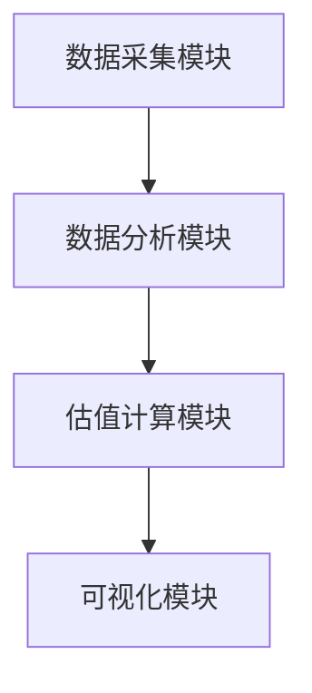
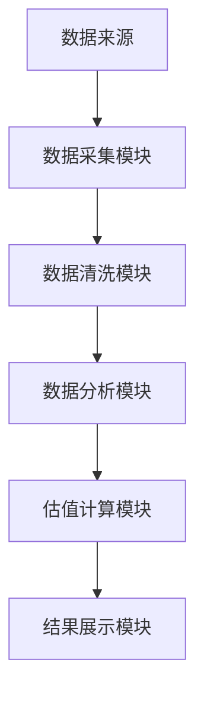

                 


# 《价值投资视角下的工业4.0企业估值》

---

## 关键词：价值投资、工业4.0、企业估值、智能制造、数字化转型、技术创新、财务分析

---

## 摘要：  
本文从价值投资的视角，深入分析工业4.0时代下企业估值的核心要素和方法。通过结合工业4.0的技术特点和价值投资的基本原理，探讨如何评估工业4.0企业的长期投资价值。文章内容涵盖工业4.0的核心概念、价值投资的基本原理、企业核心竞争力分析、财务指标评估、技术与商业模式分析、系统架构设计以及实际案例分析等多个方面，为企业投资者提供一套系统化的估值框架和实战指导。

---

## 第1章：工业4.0与价值投资的背景介绍

### 1.1 工业4.0的核心概念  
工业4.0是继工业1.0（机械化生产）、工业2.0（大规模生产）和工业3.0（自动化生产）之后的新一轮工业革命，其核心是通过物联网、大数据、人工智能等技术实现生产过程的智能化、数字化和个性化。工业4.0强调“智能制造”，其主要特点包括：  
- **智能化生产**：通过传感器、机器人和AI技术实现生产设备的自主决策和优化。  
- **数据驱动**：利用大数据分析优化生产流程、供应链管理和客户服务。  
- **个性化制造**：通过灵活的生产系统满足客户的个性化需求。  
- **互联性**：设备、产品和系统之间的高度互联，形成“智能工厂”。  

工业4.0对企业估值的影响主要体现在技术壁垒、生产效率、成本控制和市场竞争力等方面。  

---

### 1.2 价值投资的基本原理  
价值投资是一种以基本面分析为基础的投资策略，核心思想是寻找市场价格低于其内在价值的企业进行长期投资。其三大核心要素包括：  
1. **价格**：市场价格是投资者关注的核心。  
2. **价值**：企业的内在价值，通常通过财务指标和未来现金流折现计算得出。  
3. **安全边际**：市场价格与内在价值之间的差距，确保投资的安全性。  

价值投资强调长期持有优质资产，关注企业的盈利能力、财务健康状况和竞争优势。  

---

### 1.3 工业4.0与价值投资的结合  
工业4.0的快速发展为企业带来了新的增长机遇，但同时也带来了技术替代风险和市场竞争加剧的挑战。从价值投资的角度来看，工业4.0企业的估值需要结合技术创新、数字化转型能力和财务表现等多方面因素。  
- **技术创新**：工业4.0企业的技术创新能力决定了其未来的市场竞争力。  
- **数字化转型**：企业能否成功实现数字化转型是其能否在工业4.0时代存活的关键。  
- **财务表现**：企业的财务指标（如ROE、毛利率等）是衡量其价值的重要依据。  

因此，工业4.0企业的估值需要从技术、商业模式和财务表现三个维度进行综合分析。

---

## 第2章：工业4.0企业的核心竞争力分析  

### 2.1 核心竞争力框架  
工业4.0企业的核心竞争力主要体现在以下四个方面：  
1. **技术创新能力**：企业是否具备持续的技术创新能力，能否通过技术创新降低成本、提高效率。  
2. **数字化转型能力**：企业是否能够成功将传统生产流程数字化，实现智能制造。  
3. **产业链整合能力**：企业是否能够整合上下游资源，构建高效的供应链体系。  
4. **可持续发展能力**：企业是否能够通过绿色生产、节能减排等方式实现可持续发展。  

---

### 2.2 竞争优势分析  
工业4.0企业的竞争优势主要体现在以下四个方面：  
1. **技术壁垒**：企业是否拥有核心技术专利，能否通过技术壁垒防止竞争对手进入。  
2. **成本优势**：企业是否通过技术创新和数字化转型降低了生产成本，提高了利润率。  
3. **市场地位**：企业是否在目标市场中占据领先地位，拥有较高的客户忠诚度。  
4. **创新能力**：企业是否能够快速响应市场需求，推出符合客户需求的产品和服务。  

---

## 第3章：工业4.0企业的财务指标分析  

### 3.1 财务指标与企业估值  
工业4.0企业的财务指标是衡量其内在价值的重要依据。以下是一些关键财务指标：  
- **ROE（净资产收益率）**：衡量企业的盈利能力，ROE越高，企业的盈利能力越强。  
- **ROA（资产收益率）**：衡量企业资产的使用效率，ROA越高，企业的资产利用效率越高。  
- **毛利率**：衡量企业的生产成本控制能力，毛利率越高，企业的议价能力越强。  
- **净利率**：衡量企业的净利润能力，净利率越高，企业的盈利能力越强。  

---

### 3.2 估值模型与方法  
在工业4.0企业估值中，常用的方法是 **现金流折现模型（DCF模型）**。其核心思想是将企业的未来现金流折现到现值，以此作为企业的内在价值。  

#### DCF模型的公式：  
$$ \text{企业价值} = \sum_{t=1}^{n} \frac{\text{现金流}_t}{(1 + r)^t} + \frac{\text{残值}}{(1 + r)^n} $$  
其中，\( r \) 是折现率，\( n \) 是预测期数，\( \text{现金流}_t \) 是第 \( t \) 年的现金流。  

---

### 3.3 财务健康状况分析  
通过对企业财务指标的分析，可以判断企业的财务健康状况。例如，通过 **财务比率分析**（如流动比率、速动比率、负债率等）可以评估企业的偿债能力；通过 **现金流分析** 可以判断企业的盈利能力和现金流稳定性。  

---

## 第4章：工业4.0企业的技术与商业模式分析  

### 4.1 技术创新对企业估值的影响  
技术创新是工业4.0企业的核心竞争力之一。例如，一家企业如果能够通过技术创新降低生产成本、提高生产效率，其内在价值将显著提升。  

#### 案例分析：  
假设一家工业4.0企业通过引入机器人技术将生产成本降低了20%，其ROE将显著提高，从而提升企业的内在价值。  

---

### 4.2 商业模式的创新与竞争优势  
工业4.0时代的商业模式正在发生变化，例如：  
- **订阅制**：通过按月订阅的方式提供软件服务，客户可以随时使用最新的功能。  
- **按需付费**：根据客户需求提供定制化服务，按使用量收费。  
这些商业模式的创新可以提高企业的客户粘性和盈利能力。  

---

## 第5章：系统架构与估值实现  

### 5.1 系统架构设计  
为了实现工业4.0企业的估值，我们可以设计一个模块化的系统架构：  
1. **数据采集模块**：从企业财务报表、行业数据等来源获取数据。  
2. **数据分析模块**：通过大数据分析技术对数据进行清洗和处理。  
3. **估值计算模块**：使用DCF模型等方法计算企业价值。  
4. **可视化模块**：将估值结果以图表形式展示。  

#### 系统架构图（Mermaid）：  


---

### 5.2 数据流与处理流程  
从数据采集到估值计算的整个流程可以分为以下几个步骤：  
1. **数据采集**：从企业财报、行业报告等来源获取数据。  
2. **数据清洗**：去除无效数据，处理异常值。  
3. **数据分析**：通过统计分析和机器学习模型对数据进行建模。  
4. **估值计算**：使用DCF模型等方法计算企业价值。  
5. **结果展示**：将估值结果以图表形式展示。  

#### 数据流图（Mermaid）：  


---

## 第6章：项目实战与案例分析  

### 6.1 项目环境与数据准备  
为了进行估值分析，我们需要以下工具和数据：  
- **工具**：Python、Pandas、Matplotlib、Scikit-learn  
- **数据**：企业的财务报表数据、行业数据、市场数据  

---

### 6.2 核心算法实现  
以下是一个简单的DCF模型实现代码：  

```python
import pandas as pd
import numpy as np

# 假设企业未来5年的现金流如下：
cash_flows = [100, 120, 140, 160, 180]
discount_rate = 0.08

# 计算未来现金流的现值
pv = sum(cash_flow / (1 + discount_rate)**t for t, cash_flow in enumerate(cash_flows))

# 计算残值
terminal_value = 200 / (1 + discount_rate)**5

# 总企业价值
enterprise_value = pv + terminal_value
print("企业价值：", enterprise_value)
```

---

### 6.3 案例分析与结果解读  
通过上述代码，我们可以计算出企业的内在价值。例如，假设一家工业4.0企业的未来现金流为100万元、120万元、140万元、160万元和180万元，折现率为8%，计算出的企业价值为：  

$$ \text{企业价值} = \frac{100}{1.08^1} + \frac{120}{1.08^2} + \frac{140}{1.08^3} + \frac{160}{1.08^4} + \frac{180}{1.08^5} + \frac{200}{1.08^5} $$  

通过计算，我们可以得出企业的内在价值，从而为投资决策提供依据。

---

## 第7章：最佳实践与总结  

### 7.1 小结与总结  
工业4.0时代的到来为企业估值带来了新的挑战和机遇。通过结合价值投资的基本原理和工业4.0的技术特点，我们可以构建一套系统化的估值框架，从技术、商业模式和财务表现等多个维度进行综合分析。  

---

### 7.2 注意事项与风险提示  
- **数据质量**：估值结果 heavily依赖数据的准确性和完整性，需确保数据来源可靠。  
- **模型假设**：DCF模型的假设（如折现率）会影响估值结果，需合理选择参数。  
- **市场风险**：工业4.0企业的技术替代风险较高，需关注行业动态和政策变化。  

---

### 7.3 拓展阅读与深入学习  
- **书籍推荐**：  
  - 《The Intelligent Investor》——本杰明·格雷厄姆  
  - 《工业4.0：正在发生的第三次工业革命》——汉斯·乌尔里希·霍尔拜因  
- **在线资源**：  
  - 工业4.0官方白皮书  
  - 价值投资经典案例分析  

---

通过本文的分析和实践，读者可以掌握价值投资在工业4.0企业估值中的应用，为投资决策提供有力支持。

