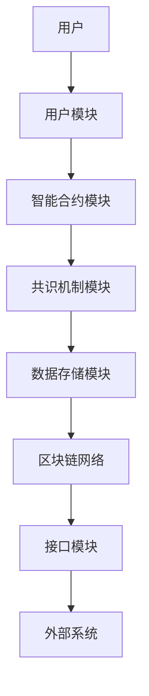

                 

# 价值投资视角下的智能城市区块链治理模式

> 关键词：区块链治理、智能城市、价值投资、治理模式、智慧城市、区块链技术

> 摘要：随着区块链技术的快速发展和价值投资理念的深入人心，智能城市的治理模式正经历一场深刻变革。本文从价值投资视角出发，探讨区块链技术在智能城市治理中的应用，分析区块链治理模式的核心原理、系统架构与实现，并结合实际案例，提出一套创新的治理方案。通过价值投资视角的分析，我们能够更好地理解区块链技术在智能城市治理中的潜力与挑战，并为未来的实践提供理论支持。

---

## 第1章: 背景介绍与核心概念

### 1.1 智慧城市与区块链技术概述

#### 1.1.1 智慧城市的定义与特征
智慧城市建设的目标是通过信息技术的整合与创新，提升城市的管理效率、资源利用率和服务质量。智慧城市的特征包括数字化、智能化、网络化和协同化。其核心在于利用新兴技术优化城市治理流程，提高居民生活质量。

#### 1.1.2 区块链技术的基本原理
区块链是一种分布式账本技术，具有去中心化、不可篡改和透明性等特点。区块链的核心数据结构包括区块、链式结构和 Merkel 树，共识机制（如 PoW、PoS）确保数据的一致性，智能合约则实现了自动化的业务逻辑。

#### 1.1.3 价值投资的基本概念
价值投资是一种投资策略，强调以低于内在价值的价格购买优质资产。在区块链治理中，价值投资视角关注项目的技术可行性、市场潜力和长期收益，注重通过内在价值判断选择最优治理模式。

### 1.2 智慧城市治理中的问题与挑战

#### 1.2.1 当前智慧城市治理的主要问题
当前智慧城市治理面临数据孤岛、信任缺失、资源分配不均等问题。传统的中心化治理模式效率低下，且容易受到人为干预的影响，难以满足智能城市的高效需求。

#### 1.2.2 区块链技术在智慧城市治理中的优势
区块链技术通过去中心化、不可篡改和透明性等特点，解决了智慧城市治理中的信任缺失和数据孤岛问题。区块链可以实现数据的安全共享和自动化流程，提高治理效率。

#### 1.2.3 价值投资视角下的治理模式创新
价值投资视角下的治理模式注重项目的长期价值和内在潜力，通过区块链技术实现治理流程的优化和资源的合理分配，为智慧城市的可持续发展提供新的思路。

---

## 第2章: 区块链技术在智慧城市治理中的核心原理

### 2.1 区块链的核心技术原理

#### 2.1.1 区块链的基本数据结构
区块链由一系列区块组成，每个区块包含交易数据、哈希指针和时间戳。通过链式结构和 Merkel 树，区块链确保数据的完整性和可追溯性。

#### 2.1.2 共识机制的实现原理
共识机制是区块链的核心技术之一。常见的共识机制包括：
- **PoW（工作量证明）**：通过计算哈希值来验证交易，确保网络安全。
- **PoS（权益证明）**：根据持币者的权益分配记账权，降低能源消耗。
- **RAFT**：适用于分布式系统中的 leader 选举和日志复制。

#### 2.1.3 智能合约的运行机制
智能合约是区块链上的自动化程序，能够根据预设条件自动执行交易。智能合约通过编译和部署在区块链上，实现业务逻辑的自动化执行。

### 2.2 区块链在智慧城市治理中的应用场景

#### 2.2.1 数据共享与隐私保护
区块链通过加密技术和权限控制，实现数据的安全共享和隐私保护。例如，居民可以通过区块链授权第三方机构访问部分数据，确保隐私不被滥用。

#### 2.2.2 智能合约在公共服务中的应用
智能合约可以用于自动执行公共服务流程，例如自动分配资源、自动结算费用等。通过智能合约，可以减少人为干预，提高服务效率。

#### 2.2.3 区块链在城市治理中的信任机制
区块链的去中心化特性可以建立多方信任机制，例如在投票、选举和资源分配中，通过区块链确保过程的透明和公正。

---

## 第3章: 价值投资视角下的区块链治理模式

### 3.1 价值投资的基本原理

#### 3.1.1 价值投资的核心理念
价值投资强调长期价值，注重资产的内在价值和基本面分析。在区块链治理中，价值投资关注项目的可持续性和技术的实用性，通过内在价值判断选择最优治理模式。

#### 3.1.2 投资决策中的关键因素
价值投资的关键因素包括项目的市场需求、技术可行性、团队能力和商业模式。在区块链治理中，还需要关注项目的社会价值和生态效益。

#### 3.1.3 价值投资在区块链治理中的应用
价值投资在区块链治理中的应用包括项目评估、投资决策和风险管理。通过内在价值分析，选择具有长期潜力的治理模式，降低投资风险。

### 3.2 区块链治理模式的设计原则

#### 3.2.1 治理模式的多样性与可扩展性
区块链治理模式需要具备多样性和可扩展性，能够适应不同场景和需求。通过模块化设计，实现治理模式的灵活调整和扩展。

#### 3.2.2 价值投资视角下的治理目标
价值投资视角下的治理目标是实现长期价值的最大化，注重项目的可持续发展和社会效益。在区块链治理中，需要平衡经济效益和社会效益，实现共赢。

#### 3.2.3 区块链技术与治理模式的结合
区块链技术与治理模式的结合需要考虑技术的可行性和实际应用场景。通过技术创新和模式优化，实现治理效率和价值的双重提升。

---

## 第4章: 区块链治理模式的系统分析与架构设计

### 4.1 系统分析与需求定义

#### 4.1.1 问题场景的描述
智能城市治理中存在的问题包括数据孤岛、信任缺失和资源分配不均。区块链治理模式需要解决这些问题，实现数据共享和高效治理。

#### 4.1.2 系统功能需求分析
区块链治理系统需要具备数据存储、智能合约执行、共识机制实现和用户交互等功能。通过功能需求分析，明确系统的实现目标。

#### 4.1.3 系统边界与接口设计
系统边界需要明确与外部系统的接口，例如与政府机构、企业和居民的交互接口。通过接口设计，实现系统的模块化和灵活性。

### 4.2 系统架构设计

#### 4.2.1 系统模块划分
区块链治理系统的模块划分包括数据存储模块、共识机制模块、智能合约模块和用户交互模块。每个模块负责特定的功能实现。

#### 4.2.2 系统架构的Mermaid图示

#### 4.2.3 系统交互流程的设计
系统交互流程包括用户请求、智能合约执行、共识机制验证和数据存储等步骤。通过流程设计，实现系统的高效运行和数据的安全性。

---

## 第5章: 区块链治理模式的算法原理与数学模型

### 5.1 算法原理

#### 5.1.1 共识算法的实现
共识算法是区块链的核心算法之一。通过算法实现，确保区块链网络中的数据一致性和可靠性。

#### 5.1.2 智能合约的运行机制
智能合约通过编译和部署在区块链上，实现业务逻辑的自动化执行。通过算法优化，提高智能合约的执行效率和安全性。

#### 5.1.3 区块链的数学模型
区块链的数学模型包括哈希函数、加密算法和共识机制的数学模型。通过数学模型的分析，优化区块链的技术性能。

### 5.2 数学模型

#### 5.2.1 共识机制的数学模型
共识机制的数学模型可以通过概率论和图论进行建模，例如通过拜占庭容错模型分析共识机制的可靠性。

#### 5.2.2 智能合约的数学模型
智能合约的数学模型可以通过形式化验证和自动机理论进行建模，确保合约的正确性和安全性。

#### 5.2.3 区块链的数学公式
区块链的数学公式包括哈希函数、加密算法和共识机制的数学表达式。例如，比特币的哈希函数为 SHA-256。

---

## 第6章: 价值投资视角下的区块链治理模式的实践与案例分析

### 6.1 价值投资视角下的治理模式创新

#### 6.1.1 治理模式的创新思路
通过价值投资视角，创新治理模式，实现治理效率和价值的双重提升。例如，通过区块链技术实现资源的优化配置和利益的公平分配。

#### 6.1.2 案例分析与经验总结
通过实际案例分析，总结区块链治理模式的实践经验。例如，某城市通过区块链技术实现垃圾分类的智能管理，提高了治理效率和居民参与度。

---

## 第7章: 价值投资视角下的区块链治理模式的未来展望与总结

### 7.1 未来发展趋势

#### 7.1.1 技术创新与模式优化
未来，区块链技术将不断创新，治理模式也将进一步优化。例如，通过Layer 2技术提升区块链的扩展性，实现更高效的治理流程。

#### 7.1.2 价值投资视角下的治理模式创新
价值投资视角下的治理模式将更加注重项目的长期价值和生态效益。通过技术创新和模式优化，实现治理效率和价值的双重提升。

### 7.2 总结

通过价值投资视角下的区块链治理模式，我们能够更好地理解区块链技术在智能城市治理中的潜力与挑战。区块链技术的应用将推动智能城市的数字化转型，实现治理效率和透明度的双提升。

---

## 附录: 参考文献与进一步阅读

- 参考文献：
  1. Nakamoto, S. (2008). Bitcoin: A Peer-to-Peer Electronic Cash System.
  2. 市场调研报告：区块链技术在智慧城市中的应用现状与发展趋势。

- 进一步阅读：
  - 《区块链技术入门与实战》
  - 《价值投资实战策略》

---

通过以上内容，我们从价值投资视角深入分析了区块链技术在智能城市治理中的应用，探讨了区块链治理模式的核心原理、系统架构与实现，并结合实际案例，提出了创新的治理方案。希望本文能够为智能城市的治理模式创新提供理论支持和实践指导。

