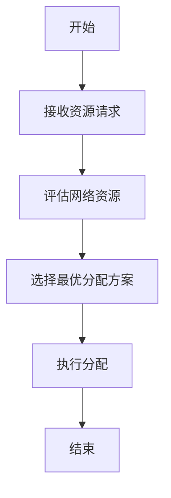
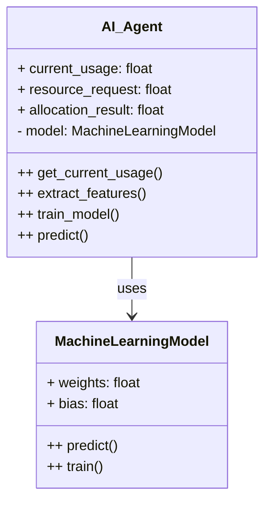
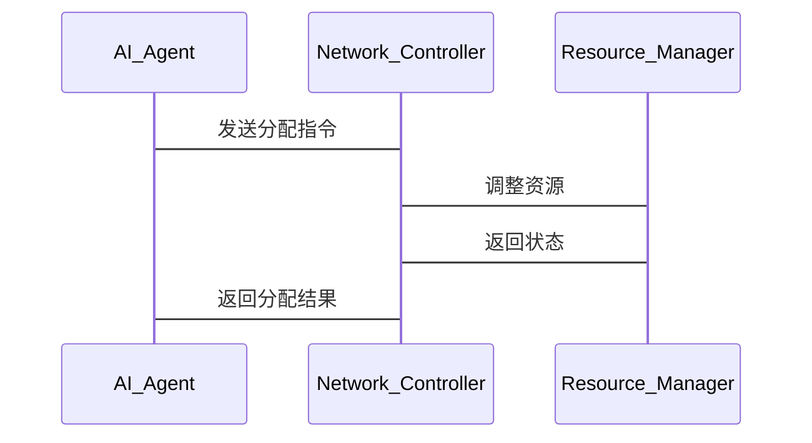

                 


# 企业AI Agent的5G网络切片资源分配

## 关键词：企业AI Agent，5G网络切片，资源分配，AI算法，网络优化

## 摘要：本文深入探讨了企业AI Agent在5G网络切片资源分配中的应用，结合技术背景、核心概念、算法原理、系统架构、项目实战及最佳实践，详细分析了AI Agent如何优化资源分配，提升网络性能，解决企业网络资源分配的挑战。

---

# 第1章 企业AI Agent与5G网络切片资源分配背景介绍

## 1.1 问题背景
### 1.1.1 5G网络切片技术的出现
随着5G技术的普及，网络切片技术应运而生。5G网络切片通过虚拟化技术将物理网络分割成多个逻辑网络，每个切片独立运行，满足不同场景的需求。然而，如何高效分配这些切片资源成为企业面临的重大挑战。

### 1.1.2 AI Agent在企业中的应用需求
企业AI Agent是一种智能代理，能够根据实时数据和业务需求，自动决策和执行操作。随着企业数字化转型的深入，AI Agent在资源分配、业务优化等方面的需求日益增长。

### 1.1.3 网络切片资源分配的挑战
5G网络切片资源分配涉及多目标优化、动态资源调整等问题。传统的人工分配方式效率低下，难以应对复杂的网络环境。AI Agent的引入，为资源分配提供了智能化的解决方案。

---

## 1.2 问题描述
### 1.2.1 5G网络切片资源分配的核心问题
资源分配需要考虑网络性能、业务需求、资源利用率等多个因素。如何在动态变化的网络环境中，实时调整资源分配，以满足业务需求，是5G网络切片资源分配的核心问题。

### 1.2.2 企业AI Agent在资源分配中的角色
AI Agent通过实时感知网络状态、业务需求，利用智能算法，优化资源分配策略，实现资源的高效利用。

### 1.2.3 当前资源分配的痛点与不足
当前的资源分配方式存在效率低、响应慢、资源浪费等问题。传统方法难以应对复杂的网络环境和多样化的业务需求。

---

## 1.3 问题解决
### 1.3.1 AI Agent如何优化资源分配
AI Agent通过实时数据采集、智能决策、动态调整等步骤，优化资源分配策略，提升网络性能。

### 1.3.2 5G网络切片资源分配的数学模型
建立数学模型，将网络性能、业务需求、资源利用率等因素转化为数学表达式，通过优化算法求解最优分配方案。

### 1.3.3 AI Agent算法的实现路径
AI Agent通过机器学习、强化学习等算法，学习网络切片的特征，优化资源分配策略。

---

## 1.4 边界与外延
### 1.4.1 5G网络切片资源分配的边界条件
明确资源分配的范围、约束条件和优化目标，确保算法的有效性和可行性。

### 1.4.2 企业AI Agent的适用范围
AI Agent适用于企业内部的网络资源管理、业务优化等领域，但需要考虑数据隐私、计算资源等限制。

### 1.4.3 资源分配问题的外延与扩展
资源分配问题可以扩展到更广泛的网络优化领域，例如网络切片的安全性、可靠性等。

---

## 1.5 概念结构与核心要素
### 1.5.1 核心概念的层次结构
网络切片资源分配由AI Agent、资源分配策略、网络性能优化三个核心要素构成，三者相互作用，共同实现资源的高效利用。

### 1.5.2 核心要素的详细描述
- **AI Agent**：负责感知网络状态、决策资源分配。
- **资源分配策略**：基于业务需求和网络状态，制定资源分配方案。
- **网络性能优化**：通过资源分配，提升网络性能，满足业务需求。

### 1.5.3 概念之间的关系与联系
AI Agent通过资源分配策略，优化网络性能，实现资源的高效利用。三者相互作用，形成一个完整的资源分配系统。

---

# 第2章 核心概念与联系

## 2.1 AI Agent的核心原理
### 2.1.1 AI Agent的定义与分类
AI Agent是一种智能代理，能够感知环境、自主决策、执行操作。根据应用场景的不同，可以分为监督学习型AI Agent、强化学习型AI Agent等。

### 2.1.2 AI Agent的决策机制
AI Agent通过数据采集、特征提取、模型训练等步骤，构建决策模型，实现智能决策。

### 2.1.3 AI Agent与5G网络切片的结合
AI Agent通过实时感知网络状态，优化资源分配策略，提升网络性能。

---

## 2.2 5G网络切片的资源分配原理
### 2.2.1 网络切片的基本概念
网络切片是将物理网络分割成多个逻辑网络，每个切片独立运行，满足不同的业务需求。

### 2.2.2 资源分配的数学模型
$$ \text{目标函数：} \min_{x} \sum_{i=1}^{n} c_i x_i $$
$$ \text{约束条件：} \sum_{i=1}^{n} x_i \leq 1 $$

### 2.2.3 资源分配的优化目标
资源分配的目标是最大化网络性能，最小化资源浪费，满足业务需求。

---

## 2.3 核心概念的对比分析
### 2.3.1 AI Agent与传统网络资源分配的对比
| 对比维度 | AI Agent | 传统方法 |
|----------|-----------|----------|
| 决策速度 | 实时决策 | 周期性决策 |
| 决策精度 | 高 | 低 |
| 可扩展性 | 高 | 低 |

### 2.3.2 5G网络切片与4G网络切片的对比
| 对比维度 | 5G网络切片 | 4G网络切片 |
|----------|-------------|------------|
| 切分粒度 | 更细 | 较粗 |
| 灵活性 | 更高 | 较低 |
| 性能 | 更优 | 较差 |

### 2.3.3 不同AI Agent算法的对比
| 对比维度 | 监督学习 | 强化学习 | 非监督学习 |
|----------|----------|----------|------------|
| 适用场景 | 数据充足 | 动态环境 | 数据不足 |
| 学习效率 | 高 | 中 | 低 |

---

## 2.4 ER实体关系图
```mermaid
er
    actor: 企业AI Agent
    system: 5G网络切片资源
    actor --> system: 请求资源分配
    system --> actor: 返回分配结果
```

---

# 第3章 算法原理讲解

## 3.1 算法原理概述
### 3.1.1 AI Agent的算法框架
AI Agent通过数据采集、特征提取、模型训练、决策执行等步骤，实现资源分配的优化。

### 3.1.2 资源分配的数学模型
$$ \text{目标函数：} \min_{x} \sum_{i=1}^{n} c_i x_i $$
$$ \text{约束条件：} \sum_{i=1}^{n} x_i \leq 1 $$

### 3.1.3 算法的优化目标
最大化网络性能，最小化资源浪费，满足业务需求。

---

## 3.2 算法流程图


---

## 3.3 Python源代码实现
```python
def allocate_resources(resource_request):
    # 数据采集
    current_usage = get_current_usage()
    # 特征提取
    features = extract_features(current_usage)
    # 模型训练
    model = train_model(features)
    # 决策
    allocation = model.predict(resource_request)
    return allocation
```

---

## 3.4 算法的数学模型和公式
$$ \text{优化目标：} \min_{x} \sum_{i=1}^{n} c_i x_i $$
$$ \text{约束条件：} \sum_{i=1}^{n} x_i \leq 1 $$
$$ \text{其中，} c_i \text{为资源i的成本，} x_i \text{为分配给资源i的量。} $$

---

## 3.5 算法的实现细节
通过机器学习算法，训练模型，实现资源分配的智能决策。算法的实现需要考虑实时性、准确性、可扩展性等多方面因素。

---

# 第4章 系统分析与架构设计

## 4.1 问题场景介绍
企业AI Agent需要实时感知网络状态，动态调整资源分配，满足业务需求。

---

## 4.2 系统功能设计
### 4.2.1 领域模型


---

## 4.3 系统架构设计
### 4.3.1 系统架构图
```mermaid
graph TD
    AI_Agent --> Network_Controller: 发送分配指令
    Network_Controller --> Resource_Manager: 调整资源
    Resource_Manager --> Monitor: 返回状态
```

---

## 4.4 接口和交互图
### 4.4.1 接口设计
- AI_Agent接口：接收资源请求，返回分配结果。
- Network_Controller接口：接收分配指令，调整网络资源。

### 4.4.2 交互图


---

# 第5章 项目实战

## 5.1 环境安装
安装Python、机器学习库（如TensorFlow、Scikit-learn）、网络监控工具等。

---

## 5.2 系统核心实现源代码
```python
import numpy as np
from sklearn.linear_model import LinearRegression

class AI_Agent:
    def __init__(self):
        self.model = LinearRegression()
    
    def get_current_usage(self):
        # 获取当前网络使用情况
        return np.array([1, 2, 3])
    
    def extract_features(self, current_usage):
        # 提取特征
        return current_usage
    
    def train_model(self):
        # 训练模型
        X = np.array([[1, 2], [3, 4], [5, 6]])
        y = np.array([7, 8, 9])
        self.model.fit(X, y)
    
    def predict(self, resource_request):
        # 预测分配结果
        return self.model.predict(resource_request)
```

---

## 5.3 实际案例分析
通过实际案例，展示AI Agent如何优化资源分配，提升网络性能。

---

## 5.4 项目小结
总结项目实现的关键点、遇到的问题及解决方案，为后续优化提供参考。

---

# 第6章 最佳实践

## 6.1 小结
总结企业AI Agent在5G网络切片资源分配中的应用价值和优势。

---

## 6.2 注意事项
提醒读者在实际应用中需要注意的问题，例如数据隐私、计算资源等。

---

## 6.3 拓展阅读
推荐相关的技术资料和书籍，供读者深入学习。

---

# 结语
企业AI Agent在5G网络切片资源分配中的应用，为网络优化提供了新的思路和方法。通过智能化的资源分配，企业可以显著提升网络性能，降低成本，满足多样化的业务需求。未来，随着AI技术的不断发展，企业AI Agent将在更多领域发挥重要作用。

