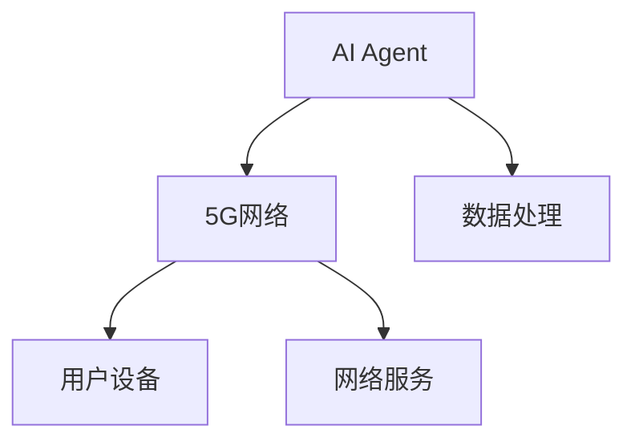
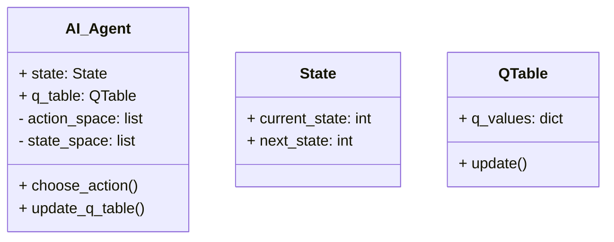
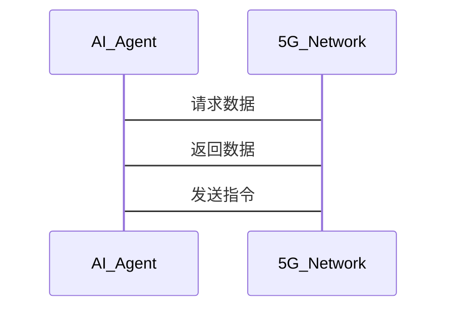

                 


# 企业AI Agent的5G网络应用策略

> 关键词：企业AI Agent，5G网络，强化学习，图神经网络，系统架构设计

> 摘要：随着5G技术的快速发展，AI Agent在企业中的应用也逐渐成为焦点。本文详细探讨了AI Agent与5G网络的关系，分析了其算法原理、系统架构设计及项目实战案例，为企业在5G环境下的AI Agent应用提供了全面的指导。

---

## 第1章: 企业AI Agent的5G网络应用背景

### 1.1 AI Agent的基本概念

#### 1.1.1 AI Agent的定义
AI Agent是一种智能体，能够感知环境、自主决策并执行任务，具备学习和适应能力。

#### 1.1.2 AI Agent的核心特点
- **自主性**：无需外部干预，自主完成任务。
- **反应性**：实时感知环境变化并做出反应。
- **学习能力**：通过数据和经验提升性能。

#### 1.1.3 AI Agent与传统AI的区别
AI Agent强调自主性和实时性，而传统AI更多关注数据处理和模式识别。

### 1.2 5G网络的技术特点

#### 1.2.1 5G网络的定义
5G是第五代移动通信技术，提供高速度、低延迟和大连接能力。

#### 1.2.2 5G网络的核心技术
- **大规模MIMO**：提升网络容量。
- **网络切片**：按需分配网络资源。
- **边缘计算**：降低延迟，提升实时性。

#### 1.2.3 5G网络的应用场景
- 智慧城市
- 工业自动化
- 增强现实

### 1.3 企业AI Agent的5G应用背景

#### 1.3.1 5G网络对企业AI Agent的推动作用
- 提供高速连接，支持实时数据处理。
- 边缘计算提升AI Agent的响应速度。

#### 1.3.2 AI Agent在5G网络中的潜在应用领域
- 自动化运维
- 智能客服
- 设备管理

#### 1.3.3 企业采用AI Agent的5G应用的优势
- 提高效率
- 降低成本
- 增强用户体验

---

## 第2章: AI Agent与5G网络的核心概念与联系

### 2.1 AI Agent的核心概念原理

#### 2.1.1 AI Agent的决策机制
通过传感器接收信息，利用算法做出决策。

#### 2.1.2 AI Agent的学习机制
采用强化学习和深度学习，提升决策准确性。

#### 2.1.3 AI Agent的自适应能力
根据环境变化调整行为策略。

### 2.2 5G网络的核心技术原理

#### 2.2.1 大规模MIMO技术
使用多根天线，提升信号质量和网络容量。

#### 2.2.2 网络切片技术
为不同用户提供定制化网络服务。

#### 2.2.3 边缘计算技术
在靠近用户的边缘节点处理数据，减少延迟。

### 2.3 AI Agent与5G网络的实体关系图



---

## 第3章: AI Agent的算法原理与数学模型

### 3.1 强化学习算法

#### 3.1.1 强化学习的基本原理
智能体通过与环境互动，学习最优策略。

#### 3.1.2 Q-learning算法

##### 3.1.2.1 算法流程
1. 初始化Q表。
2. 选择动作并执行。
3. 更新Q值。
4. 重复直到目标达成。

##### 3.1.2.2 算法实现的Python代码示例

```python
import numpy as np

class QLearning:
    def __init__(self, state_space, action_space):
        self.q_table = np.zeros((state_space, action_space))
    
    def choose_action(self, state, epsilon):
        if np.random.random() < epsilon:
            return np.random.randint(action_space)
        return np.argmax(self.q_table[state])
    
    def update_q_table(self, state, action, reward, next_state, alpha, gamma):
        self.q_table[state, action] = (1 - alpha) * self.q_table[state, action] + \
                                        alpha * (reward + gamma * np.max(self.q_table[next_state]))
```

#### 3.1.3 算法实现的数学模型和公式

Q-learning的更新公式为：
$$ Q(s, a) = (1-\alpha) Q(s,a) + \alpha (r + \gamma \max Q(s',a')) $$

### 3.2 图神经网络

#### 3.2.1 图神经网络的基本原理
处理图结构数据，利用节点之间的关系进行信息传播。

#### 3.2.2 图神经网络的数学模型

图神经网络的传播方程：
$$ h_i^{(l+1)} = \sigma \left( \sum_{j \in N(i)} W h_j^{(l)} + b \right) $$

#### 3.2.3 算法实现的Python代码示例

```python
import tensorflow as tf
from tensorflow.keras import layers

class GraphNeuralNetwork:
    def __init__(self, nodes, edges):
        self.model = self.build_model(nodes, edges)
    
    def build_model(self, nodes, edges):
        # 定义图结构并构建模型
        pass
```

---

## 第4章: 系统分析与架构设计方案

### 4.1 问题场景介绍

#### 4.1.1 项目介绍
设计一个基于5G网络的智能设备管理系统。

#### 4.1.2 系统功能设计

##### 4.1.2.1 系统功能模块
- 设备监控
- 故障诊断
- 自动修复

##### 4.1.2.2 领域模型类图



### 4.2 系统架构设计

#### 4.2.1 系统架构图


#### 4.2.2 系统接口设计
- API接口定义
- 接口交互流程

#### 4.2.3 系统交互序列图



---

## 第5章: 项目实战

### 5.1 环境搭建

#### 5.1.1 安装Python
安装最新版本的Python和必要的库。

#### 5.1.2 配置5G网络环境
设置5G网络接口和API。

### 5.2 核心代码实现

#### 5.2.1 AI Agent代码

```python
class AIAgent:
    def __init__(self, states, actions):
        self.states = states
        self.actions = actions
        self.q_table = np.zeros((states, actions))
    
    def choose_action(self, state, epsilon):
        if np.random.random() < epsilon:
            return np.random.randint(self.actions)
        return np.argmax(self.q_table[state])
    
    def update_q_table(self, state, action, reward, next_state, alpha, gamma):
        self.q_table[state, action] = (1 - alpha) * self.q_table[state, action] + \
                                        alpha * (reward + gamma * np.max(self.q_table[next_state]))
```

#### 5.2.2 5G网络接口代码

```python
class FiveGNetwork:
    def __init__(self, devices):
        self.devices = devices
    
    def get_data(self, device_id):
        # 返回设备数据
        pass
    
    def send_command(self, device_id, command):
        # 发送指令到设备
        pass
```

### 5.3 代码解读与分析

#### 5.3.1 AI Agent代码解读
- 初始化Q表，选择动作，更新Q值。

#### 5.3.2 5G网络接口代码解读
- 获取设备数据，发送指令。

### 5.4 实际案例分析

#### 5.4.1 应用场景
设备监控和故障诊断。

#### 5.4.2 案例分析
通过AI Agent监控设备状态，利用5G网络快速响应故障。

### 5.5 项目小结

#### 5.5.1 项目总结
实现了一个基于5G网络的智能设备管理系统，展示了AI Agent的实际应用。

---

## 第6章: 最佳实践、小结、注意事项和拓展阅读

### 6.1 最佳实践 Tips

#### 6.1.1 设计建议
- 明确需求，合理选择算法。
- 确保网络环境稳定。

#### 6.1.2 开发建议
- 代码模块化，便于维护。
- 定期测试和优化。

### 6.2 小结

本文详细探讨了AI Agent在5G网络中的应用策略，从理论到实践提供了全面的指导。

### 6.3 注意事项

- 确保数据安全。
- 处理好延迟和带宽问题。

### 6.4 拓展阅读

推荐相关书籍和论文，进一步深入学习。

---

## 附录

### 附录A: 术语解释

- AI Agent：人工智能代理。
- 5G网络：第五代移动通信技术。

### 附录B: 参考文献

列出相关的书籍和论文。

---

通过以上结构，您可以根据需要逐步展开各章节内容，确保文章的完整性和深度。

