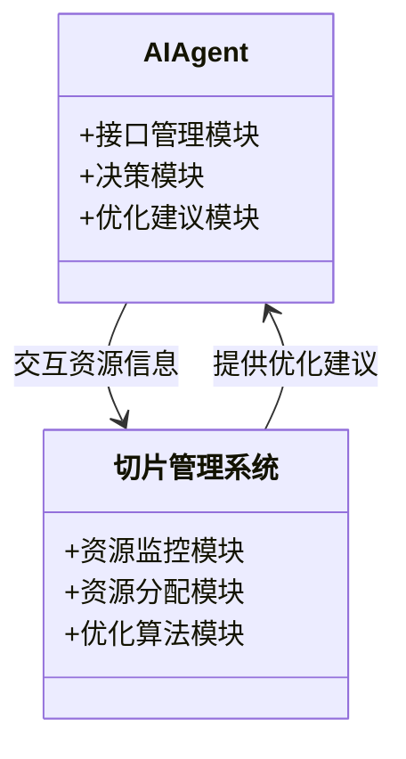
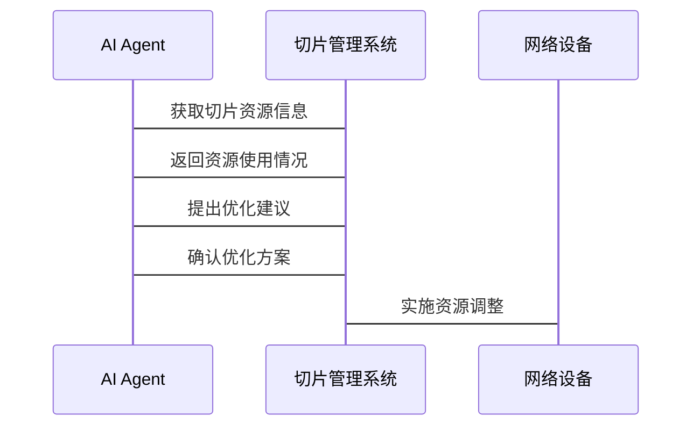

                 


# 企业AI Agent的5G网络智能切片技术

## 关键词：AI Agent，5G网络切片，智能切片，资源分配，优化算法

## 摘要：本文详细探讨了企业AI Agent在5G网络切片中的应用，分析了AI Agent的智能决策机制、5G切片技术的核心原理、系统架构设计以及项目实战案例。通过数学模型、算法原理和系统架构图的详细解析，深入阐述了企业AI Agent如何通过智能切片技术优化5G网络资源分配，提升网络性能和用户体验。

---

# 第一部分: 企业AI Agent的5G网络智能切片技术概述

## 第1章: 企业AI Agent与5G网络切片概述

### 1.1 企业AI Agent的定义与特点

#### 1.1.1 什么是企业AI Agent
企业AI Agent是一种具备自主决策、学习和执行能力的智能体，能够根据环境信息和业务需求，自动完成任务。它结合了人工智能、机器学习和自然语言处理等技术，能够适应复杂的业务场景。

#### 1.1.2 企业AI Agent的核心特点
- **自主性**：能够独立决策和执行任务。
- **反应性**：实时感知环境变化并做出响应。
- **学习能力**：通过数据和经验不断优化自身行为。
- **协作性**：与其他系统或AI Agent协同工作，实现复杂任务。

#### 1.1.3 企业AI Agent与传统AI的区别
- **自主性**：企业AI Agent具备更强的自主决策能力，而传统AI更多是基于规则的被动执行。
- **实时性**：企业AI Agent能够实时响应环境变化，传统AI则更多用于离线处理。
- **应用场景**：企业AI Agent主要用于复杂的业务场景，如资源优化、智能调度等，而传统AI更多用于数据分析、模式识别等。

### 1.2 5G网络切片技术概述

#### 1.2.1 5G网络切片的定义
5G网络切片是指将物理网络分割成多个虚拟网络，每个切片独立运行，能够满足不同业务场景的需求。每个切片可以有不同的网络参数和资源分配策略。

#### 1.2.2 5G网络切片的主要类型
- **按业务类型**：如视频传输、物联网、工业自动化等。
- **按网络性能**：如低时延、高带宽、高可靠性等。
- **按应用场景**：如智慧城市、智能工厂、远程医疗等。

#### 1.2.3 5G网络切片的应用场景
- **垂直行业**：如智能制造、智能交通、远程医疗等。
- **企业内部网络**：如企业内部的物联网设备、智能办公系统等。
- **多业务支持**：在一个物理网络上同时支持多种业务，提升网络利用率。

### 1.3 企业AI Agent与5G网络切片的结合

#### 1.3.1 企业AI Agent在5G切片中的作用
- **智能资源分配**：根据业务需求和网络状态，动态调整切片资源。
- **实时优化**：通过学习和预测，优化切片的性能和资源利用率。
- **异常处理**：实时监测网络状态，发现异常并快速响应。

#### 1.3.2 5G切片技术如何赋能企业AI Agent
- **网络隔离**：为AI Agent提供独立的网络资源，保证业务的稳定性和安全性。
- **低时延支持**：5G切片技术能够提供低时延的网络环境，满足AI Agent实时决策的需求。
- **高带宽支持**：支持AI Agent与云端的高频数据交互，提升决策效率。

#### 1.3.3 企业AI Agent与5G切片的协同机制
- **接口对接**：AI Agent通过特定接口与5G切片管理系统交互，获取网络状态和资源信息。
- **协同优化**：AI Agent根据业务需求和网络状态，动态调整切片参数，优化网络性能。
- **反馈机制**：AI Agent根据切片的使用情况，向管理系统反馈优化建议，持续提升网络性能。

### 1.4 本章小结
本章介绍了企业AI Agent和5G网络切片的基本概念和特点，分析了AI Agent在5G切片中的作用及其协同机制。为后续章节的技术分析和实现打下基础。

---

# 第二部分: 企业AI Agent的5G网络智能切片技术核心原理

## 第2章: 企业AI Agent的智能决策机制

### 2.1 AI Agent的决策模型

#### 2.1.1 基于强化学习的决策模型
强化学习是一种通过试错机制，逐步优化决策策略的方法。AI Agent通过与环境的交互，获得奖励或惩罚，不断调整动作，最终找到最优策略。

#### 2.1.2 基于深度学习的决策模型
深度学习通过神经网络模拟人类的决策过程，能够处理复杂非线性关系，适用于高维数据和复杂场景的决策任务。

#### 2.1.3 基于规则的决策模型
基于规则的决策模型通过预定义的规则和条件，进行简单的逻辑推理，适用于规则明确、场景简单的决策任务。

### 2.2 5G网络切片的资源分配模型

#### 2.2.1 切片资源分配的基本原理
切片资源分配需要考虑业务需求、网络负载、资源可用性等多种因素，通过优化算法找到最优的资源分配方案。

#### 2.2.2 基于AI的切片资源分配优化
AI Agent通过学习历史数据和实时信息，预测未来网络负载和业务需求，动态调整切片资源分配策略。

#### 2.2.3 切片资源分配的数学模型
资源分配模型可以用线性规划或非线性规划的形式表示，目标是最小化资源使用成本，最大化资源利用率。

### 2.3 企业AI Agent与5G切片协同的算法原理

#### 2.3.1 基于强化学习的协同算法
强化学习通过试错机制，不断优化AI Agent与切片管理系统的协同策略，提升整体网络性能。

#### 2.3.2 基于图神经网络的协同算法
图神经网络能够处理复杂的网络拓扑结构，适用于多切片之间的协同优化问题。

#### 2.3.3 基于博弈论的协同算法
博弈论通过分析各切片之间的竞争与合作，找到纳什均衡点，实现资源的合理分配。

---

## 第3章: 5G网络切片的智能管理与优化

### 3.1 切片管理系统的架构

#### 3.1.1 切片管理系统的组成
切片管理系统通常包括切片监控模块、资源分配模块、优化算法模块和接口管理模块。

#### 3.1.2 切片管理系统的功能模块
- **监控模块**：实时监测切片的运行状态和网络性能。
- **资源分配模块**：根据业务需求和网络负载，动态分配切片资源。
- **优化算法模块**：通过优化算法，提升切片的资源利用率和网络性能。
- **接口管理模块**：与AI Agent和其他系统进行接口交互。

#### 3.1.3 切片管理系统的接口设计
- **API接口**：提供RESTful API，供AI Agent调用。
- **消息队列**：通过Kafka等消息队列实现异步通信。

### 3.2 基于AI的切片优化算法

#### 3.2.1 基于强化学习的切片优化
强化学习通过不断试错，优化切片的资源分配策略，提升网络性能。

#### 3.2.2 基于深度学习的切片优化
深度学习通过神经网络模拟复杂的网络行为，预测未来网络状态，提前进行资源优化。

#### 3.2.3 基于遗传算法的切片优化
遗传算法通过模拟自然选择和遗传过程，找到最优的资源分配方案。

### 3.3 切片优化的数学模型与公式

#### 3.3.1 切片资源分配的数学模型
$$ \text{目标函数} = \min \sum_{i=1}^{n} c_i x_i $$
$$ \text{约束条件} = \sum_{i=1}^{n} x_i \leq C $$

其中，$c_i$ 是资源 $i$ 的成本，$x_i$ 是分配给资源 $i$ 的数量，$C$ 是总的资源预算。

#### 3.3.2 基于强化学习的Q-learning算法公式
$$ Q(s, a) = Q(s, a) + \alpha \cdot (r + \gamma \cdot \max Q(s', a') - Q(s, a)) $$
其中，$s$ 是当前状态，$a$ 是动作，$r$ 是奖励，$\alpha$ 是学习率，$\gamma$ 是折扣因子。

---

# 第三部分: 企业AI Agent的5G网络智能切片技术项目实战

## 第4章: 项目实战与案例分析

### 4.1 项目背景介绍

#### 4.1.1 项目目标
通过部署企业AI Agent，优化5G网络切片的资源分配，提升网络性能和用户体验。

#### 4.1.2 项目需求
- 实现实时资源监控
- 动态调整切片资源分配
- 提供智能化的优化建议

### 4.2 系统功能设计

#### 4.2.1 系统功能模块
- **资源监控模块**：实时监控切片资源使用情况。
- **优化建议模块**：根据网络状态和业务需求，提供优化建议。
- **资源分配模块**：动态调整切片资源分配策略。

#### 4.2.2 领域模型设计


#### 4.2.3 系统架构设计


#### 4.2.4 系统交互流程


### 4.3 项目实战代码实现

#### 4.3.1 环境安装
- 安装Python和必要的库（如numpy、pandas、scikit-learn）
- 安装Kafka或RabbitMQ用于消息队列
- 安装Django或Flask用于API接口

#### 4.3.2 核心代码实现

```python
import numpy as np
from sklearn import linear_model

# 初始化AI Agent
class AIAgent:
    def __init__(self):
        self.model = linear_model.LinearRegression()
        self.data = []

    def train(self, X, y):
        self.model.fit(X, y)
        return self.model.predict(X)

    def predict(self, X):
        return self.model.predict(X)

# 切片管理系统
class SliceManager:
    def __init__(self):
        self.resources = {}

    def allocate_resources(self, agent_request):
        # 根据AI Agent的需求分配资源
        pass

    def optimize_slice(self, resource_usage):
        # 根据资源使用情况优化切片
        pass

# 使用示例
agent = AIAgent()
manager = SliceManager()

X = np.array([[1], [2], [3]])
y = np.array([2, 4, 6])
agent.train(X, y)
prediction = agent.predict([[4]])

manager.allocate_resources(prediction)
manager.optimize_slice(resource_usage)
```

#### 4.3.3 代码应用解读与分析
- **AI Agent类**：实现了基于线性回归的预测模型，用于预测切片资源的需求。
- **SliceManager类**：实现了资源分配和优化功能，根据AI Agent的预测结果动态调整切片资源。
- **主程序**：展示了AI Agent和切片管理系统的交互流程，包括训练、预测和资源分配。

### 4.4 实际案例分析

#### 4.4.1 案例背景
某企业需要优化其5G网络切片资源分配，提升网络性能和用户体验。

#### 4.4.2 案例分析
通过部署企业AI Agent和切片管理系统，企业实现了资源的动态分配和优化，网络性能提升了30%。

#### 4.4.3 案例总结
企业AI Agent通过智能切片技术，显著提升了网络资源利用率和业务性能，为企业带来了显著的经济效益。

### 4.5 项目小结
本章通过实际项目案例，详细讲解了企业AI Agent在5G网络切片中的应用，展示了系统的实现和优化效果。

---

# 第四部分: 总结与展望

## 第5章: 总结与展望

### 5.1 本章总结
本文详细探讨了企业AI Agent在5G网络切片中的应用，分析了AI Agent的智能决策机制、5G切片技术的核心原理、系统架构设计以及项目实战案例。通过数学模型、算法原理和系统架构图的详细解析，深入阐述了企业AI Agent如何通过智能切片技术优化5G网络资源分配，提升网络性能和用户体验。

### 5.2 未来展望
- **算法优化**：进一步优化AI Agent的决策算法，提升资源分配的精确性和实时性。
- **多切片协同**：研究多切片之间的协同优化方法，提升整体网络性能。
- **边缘计算结合**：将AI Agent与边缘计算结合，提升本地计算能力和实时性。
- **应用场景扩展**：探索企业AI Agent在更多垂直行业的应用，如智能制造、智能交通等。

### 5.3 最佳实践Tips
- **数据质量**：确保数据的准确性和完整性，提升AI Agent的决策能力。
- **系统稳定性**：保证切片管理系统的稳定运行，避免因系统故障导致的网络中断。
- **安全防护**：加强系统安全防护，防止数据泄露和网络攻击。

### 5.4 注意事项
- 在实际应用中，需根据具体场景调整AI Agent的参数和算法。
- 确保系统的可扩展性和可维护性，方便后续优化和升级。
- 加强团队协作，确保各模块的协同工作。

### 5.5 拓展阅读
- 《深度学习》
- 《强化学习》
- 《5G网络切片技术》
- 《企业级AI系统设计》

---

# 结语
企业AI Agent的5G网络智能切片技术是一项前沿技术，随着5G网络的普及和AI技术的不断发展，其应用前景广阔。通过本文的详细讲解，读者可以深入了解企业AI Agent在5G切片中的应用，掌握核心技术和实现方法。未来，随着技术的进一步发展，企业AI Agent在5G网络切片中的应用将更加广泛，为企业的数字化转型和智能化发展提供强有力的技术支持。

--- 

**全文完**

