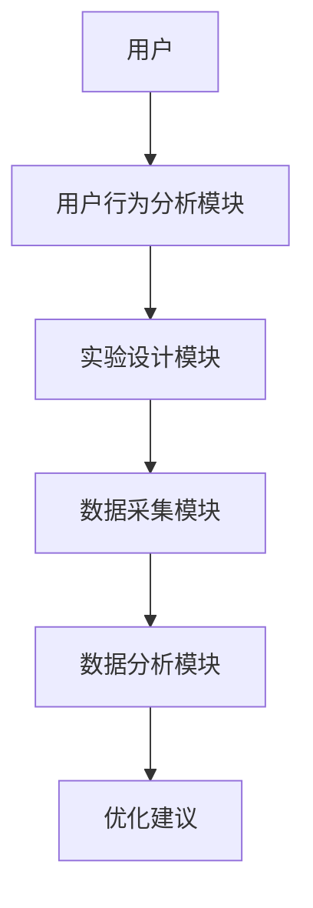

                 


# 企业AI Agent的A/B测试功能：持续优化用户体验

## 关键词：企业AI Agent，A/B测试，用户体验优化，算法原理，系统架构设计，项目实战

## 摘要：  
在现代企业中，AI Agent（人工智能代理）的应用越来越广泛，而A/B测试作为一种重要的优化工具，能够帮助企业持续优化AI Agent的用户体验。本文将从企业AI Agent的基本概念出发，详细探讨A/B测试的功能与优势、算法原理、系统架构设计、项目实战以及最佳实践。通过理论与实践相结合的方式，帮助读者全面理解并掌握企业AI Agent的A/B测试功能，从而实现用户体验的持续优化。

---

## 第一部分: 企业AI Agent与A/B测试概述

### 第1章: 企业AI Agent的基本概念

#### 1.1 AI Agent的定义与特点  
AI Agent是一种能够感知环境、自主决策并执行任务的智能实体。它具备以下特点：  
- **自主性**：能够在没有人工干预的情况下执行任务。  
- **反应性**：能够实时感知环境并做出响应。  
- **目标导向**：通过目标驱动来优化决策和行动。  
- **学习能力**：能够通过数据学习和优化自身性能。  

#### 1.2 企业AI Agent的核心功能  
企业AI Agent的核心功能包括：  
1. **用户行为分析**：通过收集和分析用户行为数据，理解用户需求。  
2. **智能决策**：基于数据分析和机器学习算法，生成最优决策方案。  
3. **自动化执行**：根据决策结果，自动执行相关操作。  
4. **持续优化**：通过反馈机制不断优化自身性能和用户体验。  

#### 1.3 企业AI Agent的应用场景  
企业AI Agent广泛应用于以下场景：  
- **智能推荐系统**：为用户提供个性化推荐。  
- **自然语言处理**：实现智能对话和文本分析。  
- **流程自动化**：优化企业内部流程效率。  
- **风险管理**：实时监控并识别潜在风险。  

---

### 第2章: A/B测试的功能与优势

#### 2.1 A/B测试的基本概念  
A/B测试是一种通过对比不同版本（A和B）来评估用户行为差异的实验方法。它能够帮助企业找到最优的解决方案，提升用户体验和业务指标。  

#### 2.2 A/B测试的核心功能  
- **用户分组与流量分配**：将用户随机分配到不同的实验组，确保实验结果的科学性。  
- **实验设计与执行**：设计实验方案并执行测试，记录用户行为数据。  
- **数据采集与分析**：通过数据分析工具，评估实验结果并优化方案。  

#### 2.3 A/B测试的优势  
- **数据驱动决策**：基于实验数据，而非主观判断，确保决策的科学性。  
- **快速迭代与优化**：通过小规模实验快速验证假设，缩短产品迭代周期。  
- **提升用户体验**：通过持续优化，提供更符合用户需求的产品和服务。  

---

## 第二部分: A/B测试的算法原理

### 第3章: A/B测试的算法原理  

#### 3.1 随机分配算法  
随机分配算法是A/B测试的核心算法之一，它通过概率模型将用户随机分配到不同的实验组。  

**随机分配算法的实现步骤**：  
1. **设定概率**：通常采用50%的比例分配用户到A组和B组。  
2. **生成随机数**：根据用户的唯一标识生成随机数。  
3. **分配用户**：根据随机数将用户分配到对应的实验组。  

**代码示例**：  
```python
import random

def assign_user(user_id):
    random.seed(user_id)
    return 'A' if random.random() < 0.5 else 'B'
```

#### 3.2 统计检验方法  
统计检验方法用于评估实验结果的显著性，常用的统计检验方法包括t检验和卡方检验。  

**t检验的实现步骤**：  
1. **计算样本均值**：分别计算A组和B组的样本均值。  
2. **计算标准误差**：基于样本标准差和样本容量计算标准误差。  
3. **计算t值**：通过公式 $t = \frac{\bar{X}_A - \bar{X}_B}{\sqrt{\frac{s_A^2}{n_A} + \frac{s_B^2}{n_B}}}$ 计算t值。  
4. **判断显著性**：根据t值和p值判断实验结果是否具有显著性。  

**代码示例**：  
```python
import numpy as np
from scipy.stats import ttest_ind

# 假设A组和B组的样本数据分别为data_A和data_B
t_stat, p_val = ttest_ind(data_A, data_B)
print(f"t统计量: {t_stat}, p值: {p_val}")
```

---

## 第三部分: 系统架构设计

### 第4章: 系统架构设计  

#### 4.1 系统功能模块设计  
企业AI Agent的A/B测试系统主要包含以下功能模块：  
1. **用户行为分析模块**：收集和分析用户行为数据。  
2. **实验设计模块**：设计和管理A/B测试实验。  
3. **数据采集模块**：实时采集实验数据。  
4. **数据分析模块**：分析实验数据并生成优化建议。  

#### 4.2 系统架构设计  
以下是系统的架构图：



#### 4.3 接口与交互设计  
系统的主要接口包括：  
- 用户与系统交互的API接口。  
- 系统内部各模块之间的通信接口。  

---

## 第四部分: 项目实战

### 第5章: 项目实战  

#### 5.1 项目背景  
以电商推荐系统为例，我们需要通过A/B测试优化推荐算法，提升用户体验和转化率。  

#### 5.2 环境搭建  
- **工具安装**：安装Python、Pandas、Scikit-learn等工具。  
- **数据准备**：收集用户行为数据和产品数据。  

#### 5.3 核心代码实现  
以下是A/B测试的核心代码实现：  
```python
import pandas as pd
from sklearn.metrics import accuracy_score

# 数据预处理
data = pd.read_csv('user_data.csv')
data['group'] = data.apply(lambda x: assign_user(x['user_id']), axis=1)

# 训练模型
model_A = train_model(data[data['group'] == 'A'])
model_B = train_model(data[data['group'] == 'B'])

# 预测与评估
y_true_A = data[data['group'] == 'A']['label']
y_pred_A = model_A.predict(data[data['group'] == 'A'])
accuracy_A = accuracy_score(y_true_A, y_pred_A)

y_true_B = data[data['group'] == 'B']['label']
y_pred_B = model_B.predict(data[data['group'] == 'B'])
accuracy_B = accuracy_score(y_true_B, y_pred_B)

# 对比结果
print(f"A组准确率: {accuracy_A}, B组准确率: {accuracy_B}")
```

---

## 第五部分: 最佳实践与总结

### 第6章: 最佳实践  

#### 6.1 实验设计注意事项  
- **样本量选择**：确保样本量足够大，以提高实验结果的显著性。  
- **实验独立性**：避免实验之间的相互干扰。  
- **结果可解释性**：确保实验结果能够清晰地解释业务价值。  

#### 6.2 系统优化建议  
- **数据实时采集**：通过实时数据采集，快速响应用户行为变化。  
- **自动化优化**：利用自动化工具，实现实验的快速迭代与优化。  

### 第7章: 总结与展望  

#### 7.1 本章总结  
本文详细探讨了企业AI Agent的A/B测试功能，从基本概念到算法原理，再到系统架构设计和项目实战，为读者提供了全面的理论与实践指导。  

#### 7.2 未来展望  
随着人工智能和大数据技术的不断发展，企业AI Agent的A/B测试功能将更加智能化和自动化。未来的研究方向包括多目标优化、动态实验设计以及更高效的算法优化。  

---

通过本文的系统讲解和实战案例，读者可以深入了解企业AI Agent的A/B测试功能，并在实际应用中不断优化用户体验，提升企业竞争力。

