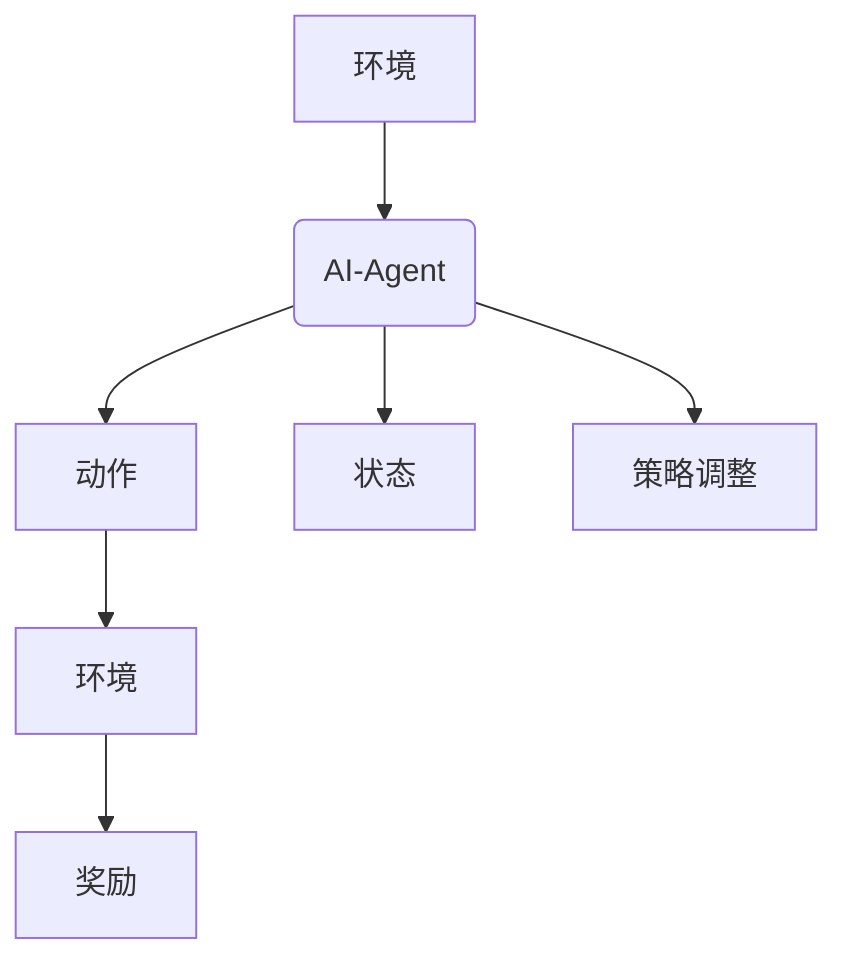
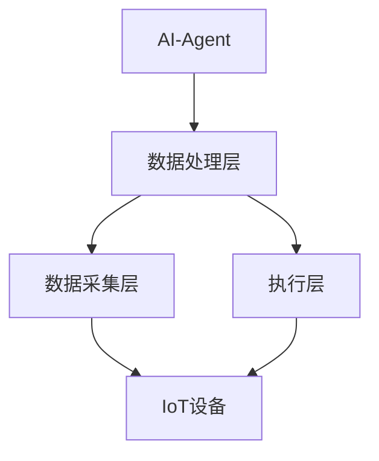

                 


```markdown
# 企业AI Agent的IoT集成策略

## 关键词
企业AI Agent, IoT集成, 系统架构, 算法原理, 数学模型, 系统设计, 项目实战

## 摘要
本文详细探讨了企业AI Agent与物联网（IoT）集成的策略，从背景概述、核心概念、算法原理到系统设计、项目实战，最后总结最佳实践。文章通过详细分析AI Agent与IoT的结合，展示了如何通过系统化的架构设计和算法优化，实现企业级IoT应用的智能化升级。

---

## 第一部分：企业AI Agent与IoT概述

### 第1章：AI Agent与IoT的背景与概述

#### 1.1 AI Agent的基本概念
- **1.1.1 AI Agent的定义与特点**
  AI Agent（人工智能代理）是一种能够感知环境、自主决策并执行任务的智能实体。它具备以下特点：
  - **自主性**：能够在没有外部干预的情况下独立运作。
  - **反应性**：能够实时感知环境变化并做出响应。
  - **目标导向**：以特定目标为导向，优化决策以实现目标。
  - **学习能力**：通过数据和经验不断优化自身的决策能力。

- **1.1.2 AI Agent的核心功能与应用场景**
  AI Agent的核心功能包括感知、推理、规划、决策和执行。其应用场景广泛，例如智能助手、推荐系统、自动驾驶等。

- **1.1.3 AI Agent与传统自动化的区别**
  AI Agent与传统自动化的主要区别在于其智能化和自主决策能力。传统自动化依赖预设规则，而AI Agent能够根据实时数据动态调整行为。

#### 1.2 IoT的基本概念
- **1.2.1 IoT的定义与特点**
  IoT（物联网）是指通过各种信息传感设备，如传感器、射频识别（RFID）技术、全球定位系统（GPS）、红外感应器等，按照约定的协议，把任何物品与互联网连接起来，进行信息交换和通信，以实现智能化识别、定位、跟踪、监控和管理。

- **1.2.2 IoT的核心组件与体系结构**
  IoT的核心组件包括感知层、网络层、应用层和数据存储层。其体系结构通常采用分层设计，各层之间通过标准接口进行通信。

- **1.2.3 IoT在企业中的应用现状**
  当前，IoT在企业中的应用主要集中在智能制造、供应链管理、资产管理、能源管理等领域。企业通过IoT技术实现设备监控、数据采集和自动化管理。

#### 1.3 AI Agent与IoT的结合与应用价值
- **1.3.1 AI Agent在IoT中的角色与作用**
  AI Agent在IoT系统中扮演着智能决策者和执行者的角色。它能够处理大量IoT设备产生的数据，通过分析和推理，做出最优决策并驱动执行。

- **1.3.2 IoT数据驱动AI Agent的潜力**
  IoT系统产生的海量数据为AI Agent提供了丰富的学习和决策素材。通过实时数据流的处理，AI Agent能够不断提升自身的决策能力，从而实现更高效的系统优化。

- **1.3.3 企业AI Agent-IoT集成的商业价值**
  AI Agent与IoT的集成能够显著提升企业的运营效率，降低成本，提高决策的准确性。例如，在智能制造中，AI Agent可以通过实时分析设备状态数据，预测设备故障并进行预防性维护，从而减少停机时间。

---

## 第二部分：AI Agent与IoT的核心概念与联系

### 第2章：AI Agent与IoT的核心概念与联系

#### 2.1 AI Agent与IoT的核心原理
- AI Agent通过感知IoT设备和系统的实时数据，结合预设的目标和规则，进行推理和决策，并通过IoT设备执行相应的操作。
- IoT设备作为AI Agent的感知和执行载体，为AI Agent提供实时数据，并执行AI Agent的决策指令。

#### 2.2 AI Agent与IoT的特点对比
| 特性       | AI Agent                          | IoT                             |
|------------|-----------------------------------|----------------------------------|
| 核心功能    | 感知、推理、决策、执行           | 数据采集、通信、设备控制       |
| 依赖性      | 依赖IoT设备的数据输入           | 依赖AI Agent的决策指令         |
| 优势       | 提高系统智能化和自主决策能力     | 实现设备互联和数据共享         |

#### 2.3 AI Agent与IoT的实体关系图
```mermaid
er
  %% AI Agent与IoT的实体关系图
  entity AI-Agent {
    <属性>
    id, name, goal
  }
  entity IoT-Device {
    <属性>
    device-id, type, status
  }
  entity IoT-Data {
    <属性>
    data-id, value, timestamp
  }
  AI-Agent --> IoT-Device: 控制
  IoT-Device --> IoT-Data: 产生
  AI-Agent --> IoT-Data: 消费
```

---

## 第三部分：AI Agent的算法原理与实现

### 第3章：AI Agent的算法原理

#### 3.1 AI Agent的核心算法
- **强化学习（Reinforcement Learning）**：AI Agent通过与环境的交互，不断优化其决策策略，以最大化累计奖励。
- **决策树（Decision Tree）**：基于IoT数据构建决策树，用于分类和回归任务，帮助AI Agent做出最优决策。

#### 3.2 强化学习算法流程图


#### 3.3 强化学习算法数学模型
强化学习的目标是最优化策略函数 \( \pi \)，使得在与环境交互的过程中，累计奖励 \( R \) 最大化。数学表达式如下：
$$
R = \sum_{t=1}^{T} r_t
$$
其中，\( r_t \) 是第 \( t \) 步的即时奖励，\( T \) 是终止步数。

---

## 第四部分：系统分析与架构设计

### 第4章：AI Agent-IoT系统的架构设计

#### 4.1 系统功能设计
- **数据采集层**：负责采集IoT设备的数据，并将其传输到数据处理层。
- **数据处理层**：对采集的数据进行清洗、转换和分析，生成可供AI Agent决策的特征。
- **AI Agent层**：基于处理后的数据，进行推理和决策，并生成控制指令。
- **执行层**：根据AI Agent的决策指令，驱动IoT设备执行相应的操作。

#### 4.2 系统架构设计


#### 4.3 接口设计与交互
- **AI-Agent与数据处理层的接口**：提供API用于数据查询和决策请求。
- **数据处理层与IoT设备的接口**：通过MQTT协议进行数据采集和设备控制。

---

## 第五部分：项目实战与实现

### 第5章：AI Agent-IoT系统的项目实战

#### 5.1 环境安装
- **Python环境**：安装Python 3.8及以上版本。
- **依赖库**：安装TensorFlow、Kafka、MQTT库。

#### 5.2 核心代码实现
```python
# AI-Agent核心代码示例
import numpy as np
from tensorflow.keras import models

class AI-Agent:
    def __init__(self, model_path):
        self.model = models.load_model(model_path)
    
    def decide(self, state):
        return self.model.predict(np.array([state]))[0]

# IoT设备控制代码示例
import paho.mqtt.client as mqtt

class IoTDevice:
    def __init__(self, broker, port):
        self.client = mqtt.Client()
        self.client.connect(broker, port)
    
    def send_command(self, command):
        self.client.publish("command/topic", command)
```

#### 5.3 代码解读与分析
- **AI-Agent类**：加载预训练的深度学习模型，根据输入的状态数据生成决策。
- **IoTDevice类**：通过MQTT协议连接到IoT设备，发送控制命令。

#### 5.4 实际案例分析
以智能工厂为例，AI Agent通过分析设备状态数据，预测设备故障风险，并触发预防性维护流程。

---

## 第六部分：总结与展望

### 第6章：总结与展望

#### 6.1 总结
本文详细探讨了企业AI Agent与IoT的集成策略，从理论到实践，全面分析了AI Agent在IoT系统中的应用价值和实现方法。

#### 6.2 未来研究方向
- **多Agent协作**：研究多个AI Agent在IoT环境中的协作机制。
- **边缘计算**：探索AI Agent在边缘计算环境中的部署与优化。

#### 6.3 注意事项
- 确保数据安全和隐私保护。
- 优化AI Agent的决策算法，提升系统的实时性和准确性。

#### 6.4 拓展阅读
建议读者进一步阅读《强化学习入门》和《物联网系统设计》等相关书籍。

---

## 附录

### 附录A：参考文献
- [1] Russell S, Norvig P. 人工智能:一种现代的方法[M]. 清华大学出版社, 2013.
- [2] IoT Architecture Patterns. [Online]. Available: https://www.iot_architecture.com.

### 附录B：工具与库
- **Python**：用于AI Agent的开发与部署。
- **TensorFlow**：深度学习框架。
- **MQTT**：物联网设备间通信协议。

---

## 结语
企业AI Agent与IoT的集成是未来智能化发展的趋势。通过本文的系统分析和实践案例，读者可以深入了解AI Agent在IoT系统中的应用，并为实际项目提供参考和借鉴。
```

