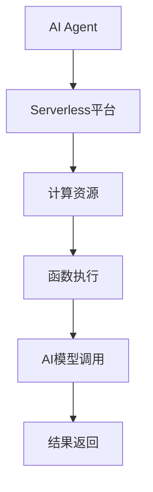
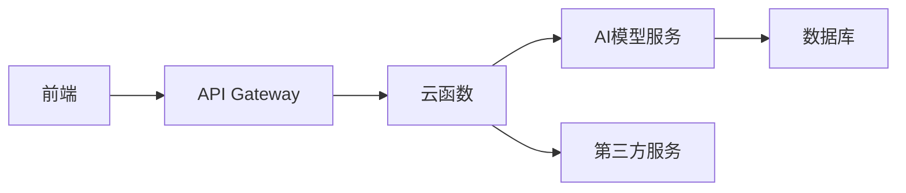
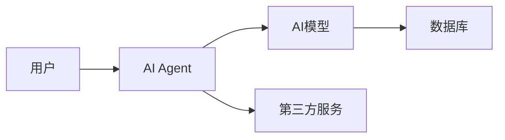
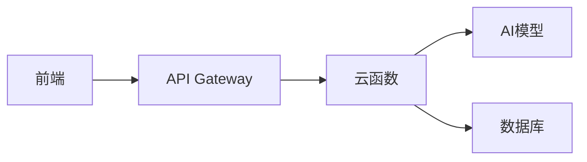

                 


# 企业AI Agent的Serverless架构优化

> 关键词：企业AI Agent，Serverless架构，云函数，无服务器计算，AI模型优化

> 摘要：随着企业数字化转型的深入，AI Agent在企业智能化中的作用日益重要。本文深入探讨了AI Agent与Serverless架构的结合，分析了Serverless架构如何优化AI Agent的运行，提出了基于Serverless架构的企业AI Agent优化方案。通过详细的算法原理、系统架构设计和项目实战，本文为企业级AI Agent的高效运行提供了理论和实践指导。

---

# 第1章 企业AI Agent的Serverless架构背景

## 1.1 企业智能化转型的挑战与需求

### 1.1.1 企业数字化转型的现状与痛点
企业在数字化转型过程中，面临着业务系统复杂化、数据量爆炸式增长、用户需求多样化等挑战。传统的集中式架构难以应对这些挑战，特别是在资源利用率、成本控制和快速响应方面。

### 1.1.2 AI Agent在企业智能化中的作用
AI Agent作为一种智能代理，能够帮助企业实现自动化决策、智能交互和高效任务处理。它能够理解用户需求、分析数据、调用模型并返回结果，从而提升企业的智能化水平。

### 1.1.3 Serverless架构的兴起与优势
Serverless架构通过按需分配资源、降低运维成本和快速部署等特点，成为企业智能化转型的重要支撑。它能够弹性扩展，适合处理高并发、低频的任务，如AI Agent的请求处理。

## 1.2 Serverless架构的核心概念与特点

### 1.2.1 Serverless架构的定义
Serverless架构是一种基于云的计算模型，开发者无需管理底层服务器，云供应商负责资源分配和管理。其核心是“函数即服务”（Function as a Service，FaaS）。

### 1.2.2 Serverless架构的主要特点
| 特性 | 描述 |
|------|------|
| 无服务器化 | 无需管理服务器，资源按需分配 |
| 弹性扩展 | 根据请求量自动扩缩容 |
| 简化运维 | 无需维护服务器和运行环境 |
| 成本优化 | 按使用付费，空闲时无成本 |

### 1.2.3 Serverless与传统架构的对比分析
| 对比维度 | 传统架构 | Serverless架构 |
|----------|----------|----------------|
| 资源管理 | 需要手动分配和管理 | 自动分配和管理 |
| 成本 | 需要预分配资源，成本较高 | 按需付费，成本较低 |
| 扩展性 | 手动配置，扩展缓慢 | 自动弹性扩展，响应速度快 |

## 1.3 AI Agent与Serverless架构的结合

### 1.3.1 AI Agent的定义与功能
AI Agent是一种智能代理，能够感知环境、理解用户需求、执行任务并返回结果。其核心功能包括：
1. **感知环境**：通过传感器或API获取环境信息。
2. **理解需求**：解析用户请求并生成任务描述。
3. **决策优化**：基于模型和数据，优化任务执行策略。
4. **执行任务**：调用相关服务或API完成任务。
5. **反馈结果**：将结果返回给用户或系统。

### 1.3.2 Serverless架构如何优化AI Agent的运行
Serverless架构为AI Agent提供了弹性计算资源、按需扩展和自动化运维的优势。例如，AI Agent的请求处理可以通过云函数实现，后端无需维护服务器，资源按需分配。

### 1.3.3 企业级AI Agent的场景与应用
企业级AI Agent的应用场景包括：
1. **智能客服**：通过自然语言处理（NLP）理解用户需求，提供个性化的服务。
2. **智能推荐**：基于用户行为和数据，推荐相关产品或内容。
3. **自动化运维**：监控系统状态，自动处理异常情况。
4. **智能调度**：优化资源分配，提高效率。

## 1.4 本章小结
本章介绍了企业智能化转型的背景、AI Agent的核心功能以及Serverless架构的特点。通过分析AI Agent与Serverless架构的结合，展示了Serverless架构在企业智能化中的优势和应用场景。

---

# 第2章 企业AI Agent的Serverless架构核心概念与联系

## 2.1 AI Agent的核心原理与组成部分

### 2.1.1 AI Agent的输入输出模型
AI Agent的输入包括用户请求、环境数据和历史记录，输出包括任务执行结果和反馈信息。输入输出模型可以用以下公式表示：
$$
\text{输入} = (\text{用户请求}, \text{环境数据}, \text{历史记录})
$$
$$
\text{输出} = (\text{任务结果}, \text{反馈信息})
$$

### 2.1.2 AI Agent的推理机制
AI Agent的推理机制基于知识表示和推理算法。常用的推理算法包括逻辑推理、概率推理和深度学习推理。例如，基于概率推理的公式为：
$$
P(\text{结论} | \text{证据}) = \frac{P(\text{结论}) \cdot P(\text{证据}|\text{结论})}{P(\text{证据})}
$$

### 2.1.3 AI Agent的决策优化算法
决策优化算法包括强化学习和遗传算法。例如，强化学习的奖励函数可以表示为：
$$
R(s, a) = \text{奖励值}
$$
其中，\( s \) 表示状态，\( a \) 表示动作。

## 2.2 Serverless架构的实现机制与优化策略

### 2.2.1 Serverless的函数计算模型
Serverless的函数计算模型基于“无状态”函数，每个函数执行环境独立。函数计算的流程可以用以下公式表示：
$$
\text{函数}(\text{输入}) \rightarrow \text{输出}
$$

### 2.2.2 Serverless的资源调度与管理
Serverless平台通过容器化技术实现资源调度与管理。容器化技术的核心是Docker，其镜像构建过程如下：
1. 编写Dockerfile。
2. 打包镜像。
3. 部署到云平台。

### 2.2.3 Serverless的冷启动问题与优化
冷启动问题是Serverless架构的常见问题，可以通过以下优化策略解决：
1. 使用预留资源。
2. 优化函数代码，减少启动时间。
3. 使用边缘计算优化冷启动。

## 2.3 AI Agent与Serverless架构的实体关系分析

### 2.3.1 实体关系图
以下是AI Agent与Serverless架构的实体关系图：



### 2.3.2 架构设计图
以下是基于Serverless架构的企业AI Agent的架构设计图：



## 2.4 本章小结
本章详细讲解了AI Agent的核心原理和组成部分，分析了Serverless架构的实现机制与优化策略。通过实体关系图和架构设计图，展示了AI Agent与Serverless架构的结合方式。

---

# 第3章 企业AI Agent的Serverless架构算法原理

## 3.1 AI Agent的请求处理流程

### 3.1.1 请求解析与参数提取
AI Agent的请求解析过程如下：
1. 接收用户请求。
2. 解析请求参数。
3. 提取关键信息。

### 3.1.2 模型调用与结果返回
AI Agent的模型调用流程可以用以下公式表示：
$$
\text{输入} \rightarrow \text{模型} \rightarrow \text{输出}
$$

### 3.1.3 并行处理与结果合并
AI Agent可以通过并行处理多个任务，提高处理效率。并行处理的流程可以用以下公式表示：
$$
\text{任务} = \text{任务1} \parallel \text{任务2} \parallel \cdots \parallel \text{任务n}
$$

## 3.2 Serverless架构下的AI Agent优化算法

### 3.2.1 基于概率的优化算法
基于概率的优化算法可以用以下公式表示：
$$
P(\text{优化目标}) = \prod_{i=1}^{n} P(\text{优化步骤} | \text{优化目标})
$$

### 3.2.2 基于强化学习的优化算法
基于强化学习的优化算法可以用以下公式表示：
$$
R(s, a) = \text{奖励值}
$$
其中，\( s \) 表示状态，\( a \) 表示动作。

## 3.3 算法优化与实现

### 3.3.1 算法优化策略
1. 优化模型调用速度。
2. 减少冷启动时间。
3. 提高资源利用率。

### 3.3.2 实现细节与代码示例
以下是AI Agent的请求处理代码示例：

```python
def handle_request(request):
    # 解析请求
    user_request = request['text']
    # 提取关键信息
    key_info = extract_info(user_request)
    # 调用AI模型
    model_input = prepare_input(key_info)
    result = model.predict(model_input)
    return result
```

## 3.4 本章小结
本章详细讲解了AI Agent的请求处理流程和优化算法，分析了Serverless架构下的优化策略。通过代码示例和数学公式，展示了AI Agent的实现细节和优化方法。

---

# 第4章 企业AI Agent的Serverless架构系统分析与设计

## 4.1 系统分析

### 4.1.1 项目介绍
本项目旨在构建一个基于Serverless架构的企业AI Agent系统，实现智能化任务处理和资源优化。

### 4.1.2 系统目标
系统目标包括：
1. 实现AI Agent的智能化请求处理。
2. 优化资源利用率，降低运维成本。
3. 提供高可用性和扩展性。

### 4.1.3 系统范围
系统范围包括：
1. 用户请求处理。
2. AI模型调用。
3. 结果反馈。

## 4.2 系统功能设计

### 4.2.1 领域模型设计
以下是领域模型设计图：



### 4.2.2 系统架构设计
以下是系统架构设计图：



### 4.2.3 接口设计
系统接口包括：
1. 用户请求接口。
2. AI模型调用接口。
3. 结果反馈接口。

## 4.3 本章小结
本章通过系统分析和功能设计，展示了基于Serverless架构的企业AI Agent系统的实现方案。通过领域模型和架构设计图，明确了系统的组成部分和交互流程。

---

# 第5章 企业AI Agent的Serverless架构项目实战

## 5.1 环境安装与配置

### 5.1.1 安装Python
安装Python的命令如下：
```bash
sudo apt-get install python3
```

### 5.1.2 安装Serverless框架
安装Serverless框架的命令如下：
```bash
npm install -g serverless
```

## 5.2 系统核心代码实现

### 5.2.1 AI Agent核心代码
以下是AI Agent的核心代码：

```python
def handle_request(request):
    # 解析请求
    user_request = request['text']
    # 提取关键信息
    key_info = extract_info(user_request)
    # 调用AI模型
    model_input = prepare_input(key_info)
    result = model.predict(model_input)
    return result
```

### 5.2.2 Serverless函数实现
以下是Serverless函数实现代码：

```javascript
function handler(request, response) {
    const { text } = request.body;
    // 调用AI Agent
    const result = handle_request({ text });
    // 返回结果
    response.status(200).json({ result });
}
```

## 5.3 项目实战案例分析

### 5.3.1 案例背景
本案例旨在优化企业的智能客服系统，实现用户请求的快速处理和个性化服务。

### 5.3.2 实施步骤
1. 安装开发环境。
2. 编写AI Agent核心代码。
3. 部署Serverless函数。
4. 测试系统功能。

## 5.4 本章小结
本章通过项目实战，展示了基于Serverless架构的企业AI Agent系统的实现过程。通过环境安装、代码实现和案例分析，验证了系统的可行性和优化效果。

---

# 第6章 企业AI Agent的Serverless架构最佳实践

## 6.1 性能优化与调优

### 6.1.1 模型优化策略
1. 使用轻量级模型。
2. 优化模型训练数据。
3. 增加缓存机制。

### 6.1.2 系统性能监控
系统性能监控包括：
1. 请求响应时间。
2. 函数执行时间。
3. 资源利用率。

## 6.2 安全性与可靠性

### 6.2.1 数据安全
1. 数据加密传输。
2. 访问权限控制。

### 6.2.2 系统可靠性
1. 数据备份与恢复。
2. 容错设计。

## 6.3 可扩展性与可维护性

### 6.3.1 系统扩展性设计
1. 模块化设计。
2. 异构架构支持。

### 6.3.2 系统可维护性设计
1. 日志记录。
2. 代码复用。

## 6.4 本章小结
本章总结了企业AI Agent的Serverless架构的最佳实践，包括性能优化、安全性、可靠性和可扩展性等方面。通过这些实践，可以提高系统的性能和可靠性，降低运维成本。

---

# 第7章 总结与展望

## 7.1 本项目总结
本项目通过构建基于Serverless架构的企业AI Agent系统，实现了智能化任务处理和资源优化。系统具备高可用性、扩展性和低成本的优势。

## 7.2 未来展望
未来，随着AI技术的不断发展，Serverless架构在企业AI Agent中的应用将更加广泛。研究方向包括：
1. 更高效的模型调用优化。
2. 更智能的资源调度算法。
3. 更强大的安全性保障。

## 7.3 拓展阅读
推荐以下书籍和资源：
1. 《Serverless Computing: Architecture and Design》
2. 《Deep Learning for NLP: A Comprehensive Guide》
3. AWS、Azure和Google Cloud的Serverless文档。

---

# 参考文献
1. AWS官方文档.
2. Azure官方文档.
3. Google Cloud官方文档.
4. 《Serverless Computing: Architecture and Design》.
5. 《Deep Learning for NLP: A Comprehensive Guide》.

---

# 结语
企业AI Agent的Serverless架构优化是一个复杂而有趣的课题。通过本篇文章的分析和实践，我们深入探讨了AI Agent与Serverless架构的结合，提出了优化方案，并通过项目实战验证了其可行性。未来，随着技术的不断发展，企业AI Agent的Serverless架构将更加成熟，为企业智能化转型提供更强大的支持。

