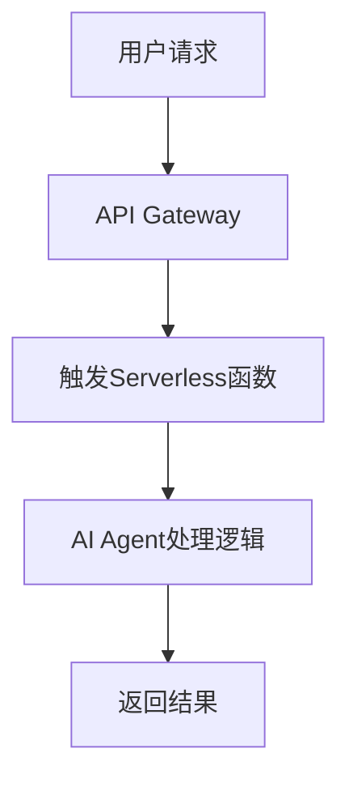
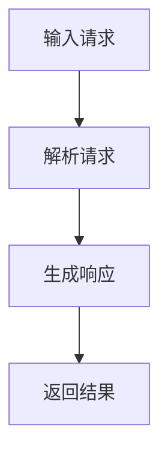
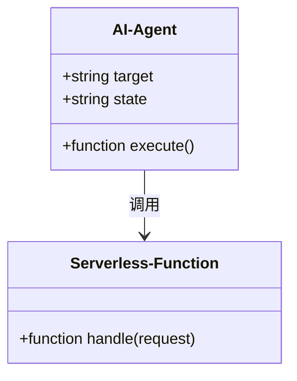
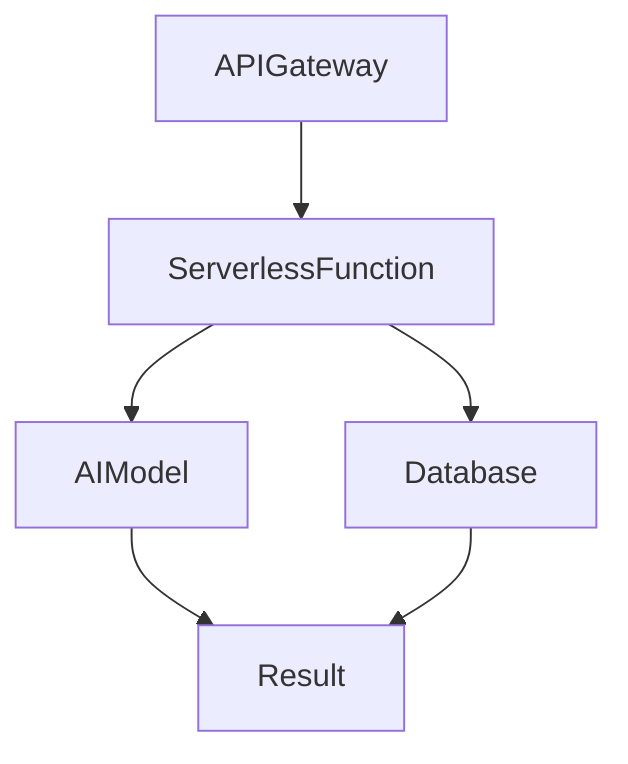
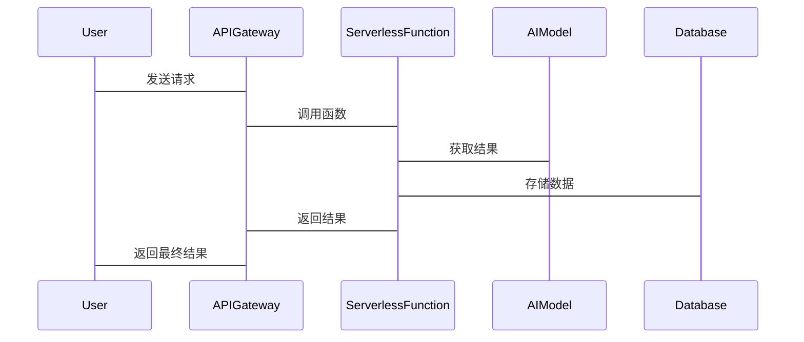

                 


# 企业AI Agent的serverless架构设计

> **关键词**：AI Agent，Serverless架构，企业应用，无服务器计算，云原生技术

> **摘要**：本文探讨了在企业环境中设计AI Agent的serverless架构，分析了其核心概念、算法原理、系统架构设计及项目实战。通过详细的技术分析和案例分享，揭示了AI Agent与Serverless架构结合的优势与挑战，为企业开发者提供实践指导。

---

# 企业AI Agent的Serverless架构设计

## 第一章: 企业AI Agent与Serverless架构概述

### 1.1 企业AI Agent的定义与背景
企业AI Agent是一种能够感知环境、执行任务并优化决策的智能体，广泛应用于智能客服、自动化运维等领域。Serverless架构作为无服务器计算模型，具备按需付费、弹性扩展的优势，为AI Agent的高效运行提供了理想环境。

### 1.2 企业AI Agent的应用场景
- **智能客服**：通过自然语言处理提供个性化的客户支持。
- **自动化运维**：自动监控和修复系统故障。
- **智能推荐系统**：基于用户行为推荐相关内容。
- **供应链优化**：通过预测分析优化库存和物流。

### 1.3 Serverless架构的核心优势
- **按需付费**：仅支付实际使用的资源。
- **弹性扩展**：自动适应请求量的变化。
- **简化运维**：无需管理服务器，专注于代码开发。
- **快速部署**：通过云服务快速上线。

### 1.4 企业AI Agent与Serverless架构的结合优势
- **弹性处理高并发请求**：Serverless架构适合处理AI Agent的高并发任务。
- **事件驱动**：AI Agent可以通过触发事件来响应用户请求。

---

## 第二章: 核心概念与原理

### 2.1 AI Agent的核心概念
AI Agent具备感知、决策和执行能力，通过与环境交互实现目标。其核心功能包括感知环境、生成目标、规划行动和执行反馈。

### 2.2 Serverless架构的核心原理
Serverless架构通过无状态函数和事件驱动机制，将代码运行在云提供的执行环境中。函数即服务（FaaS）模式允许开发者专注于业务逻辑，而资源管理由云服务提供商负责。

### 2.3 AI Agent与Serverless架构的结合原理
AI Agent通过Serverless函数实现其核心功能，函数由事件触发，处理用户请求并返回结果。Mermaid流程图展示了AI Agent如何在Serverless环境中执行任务：



---

## 第三章: 算法原理与实现

### 3.1 AI Agent的算法原理
AI Agent通常使用自然语言处理（NLP）和机器学习（ML）模型。例如，NLP用于解析用户请求，ML模型用于生成响应。算法流程如下：



### 3.2 Serverless架构中的算法实现
Serverless函数可以调用AI模型的API，例如调用NLP库进行文本分析。Python代码示例如下：

```python
import requests

def process_request(text):
    # 调用NLP API
    response = requests.post('https://api.nlp.com/analyze', json={'text': text})
    return response.json()['result']
```

### 3.3 算法的数学模型与公式
AI Agent的决策过程可以基于概率模型，例如：

$$ P(A|B) = \frac{P(B|A) \cdot P(A)}{P(B)} $$

其中，$P(A|B)$ 表示在B条件下A的概率，用于生成响应的概率计算。

---

## 第四章: 系统分析与架构设计

### 4.1 项目背景与需求分析
企业希望通过AI Agent提高效率，同时利用Serverless架构降低成本和复杂性。

### 4.2 系统功能设计
系统功能包括用户请求处理、任务执行、数据存储与分析。Mermaid类图展示了领域模型：



### 4.3 系统架构设计
整体架构由API Gateway、Serverless函数、AI模型和数据库组成。Mermaid架构图如下：



### 4.4 系统接口与交互设计
系统接口包括用户请求、API调用和数据存储。Mermaid序列图展示了交互流程：



---

## 第五章: 项目实战

### 5.1 环境安装与配置
安装Python和必要的库，例如：

```bash
pip install boto3 firebase-functions requests
```

### 5.2 核心功能实现
实现AI Agent的Serverless函数，例如：

```python
def handler(event, context):
    text = event['text']
    response = process_request(text)
    return {'result': response}
```

### 5.3 实际案例分析
案例：智能客服系统。用户发送请求，Serverless函数调用NLP API生成响应，返回结果。

### 5.4 项目优化与扩展
优化包括缓存机制、错误处理和日志监控。例如，使用Redis缓存频繁请求。

---

## 第六章: 最佳实践与总结

### 6.1 最佳实践
- **选择合适的云平台**：根据需求选择AWS Lambda、Azure Functions或Google Cloud Functions。
- **优化函数性能**：避免长运行时间，拆分复杂任务。
- **处理冷启动问题**：使用预热机制或调整函数超时设置。

### 6.2 项目小结
本文详细介绍了企业AI Agent的Serverless架构设计，从概念到实现，结合理论与实践，为开发者提供了全面的指导。

### 6.3 注意事项
- **数据安全**：确保敏感数据的加密和保护。
- **监控与调试**：使用云平台提供的监控工具跟踪函数运行情况。
- **成本控制**：合理规划资源使用，避免浪费。

### 6.4 拓展阅读
- 《Serverless Architecture Patterns》
- 《Designing Serverless Systems》
- 《AI Agent Development Guide》

---

通过以上章节，我们系统地探讨了企业AI Agent在Serverless架构中的设计与实现，从理论到实践，帮助开发者构建高效可靠的AI解决方案。

