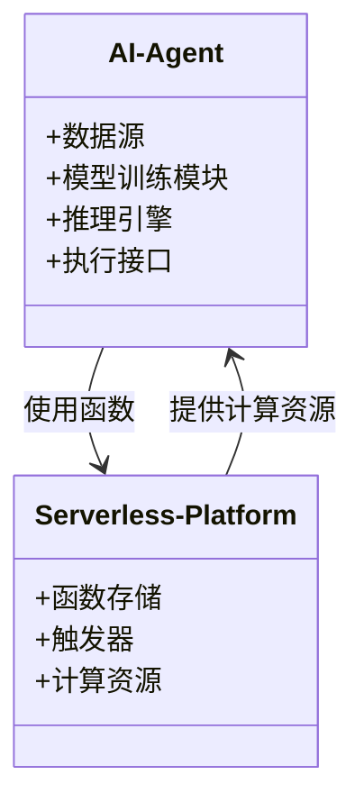
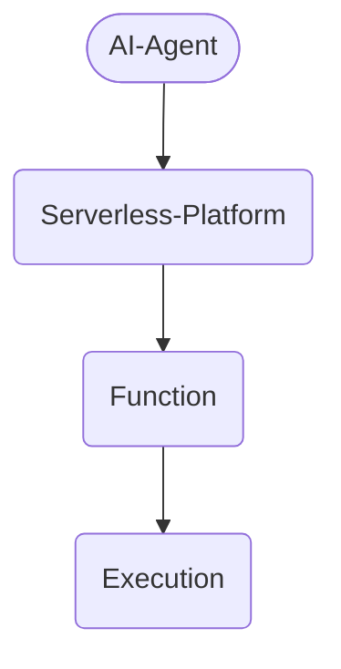
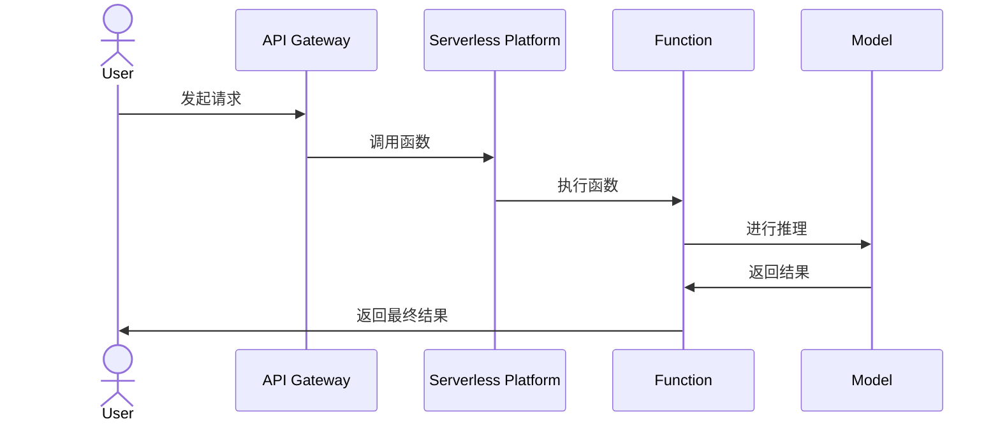

                 


```markdown
# 企业AI Agent的serverless计算架构

> 关键词：企业AI Agent，serverless架构，云原生，无服务器计算，AI驱动自动化

> 摘要：随着人工智能技术的快速发展，企业对智能化、自动化的需求日益增加。AI Agent作为实现企业智能化的重要工具，如何在serverless架构中高效运行成为关键。本文将深入分析企业AI Agent在serverless计算架构中的实现原理、设计思路和应用实践，探讨其优势与挑战，并提供具体的实现方案和优化建议。

---

# 第1章: 企业AI Agent的背景与问题背景

## 1.1 企业AI Agent的定义与核心概念
- **AI Agent**：人工智能代理，指能够感知环境、自主决策并执行任务的智能体。
- **核心功能**：数据采集、分析、推理、决策和执行。
- **应用场景**：企业智能化、自动化流程、智能客服、供应链优化等。

## 1.2 问题背景
- 传统架构的局限性：资源利用率低、扩展性差、成本高昂。
- 企业AI Agent的高并发、动态扩展需求与传统架构的矛盾。

## 1.3 问题解决
- serverless架构的优势：按需扩缩容、降低运维成本、提升资源利用率。

## 1.4 边界与外延
- 企业AI Agent的边界：仅关注智能化决策，不涉及物理执行。
- 外延：结合物联网、大数据等技术，扩展AI Agent的应用范围。

## 1.5 概念结构与核心要素
- **概念结构**：AI Agent与serverless架构的关系。
- **核心要素**：数据源、模型训练、推理引擎、执行接口。

---

# 第2章: 核心概念与原理

## 2.1 serverless架构的特点与优势
- **特点**：无服务器、按需付费、自动扩展。
- **优势**：降低运维成本、提升资源利用率、快速部署。

## 2.2 AI Agent与serverless架构的关系
- **关系**：AI Agent依赖serverless架构的弹性计算能力，serverless架构通过AI Agent实现智能化服务。

## 2.3 核心概念对比与ER实体关系图
### 表格对比
| 属性 | AI Agent | serverless架构 |
|------|----------|----------------|
| 核心功能 | 数据分析与决策 | 代码执行与资源管理 |
| 扩展性 | 动态扩展 | 动态扩展 |
| 资源需求 | 高 | 适中 |

### ER实体关系图
```mermaid
erd
 _actor(AI Agent, "负责数据采集和决策")
 _actor(Serverless Platform, "提供计算资源和执行环境")
  relation("使用", "AI Agent --> Serverless Platform", "AI Agent调用serverless函数进行数据处理")
```

---

# 第3章: 算法原理与数学模型

## 3.1 AI Agent的核心算法原理
### 大模型训练算法
- **算法流程**：
  1. 数据预处理：清洗、归一化。
  2. 模型训练：使用深度学习框架（如TensorFlow）训练模型。
  3. 超参数优化：调整学习率、批次大小等参数。

### 推理算法
- **算法流程**：
  1. 数据输入：接收用户请求。
  2. 模型推理：使用训练好的模型生成预测结果。
  3. 结果输出：返回最终结果。

### 代码示例
```python
def train_model():
    # 数据预处理
    data = preprocess_dataset()
    # 模型定义
    model = build_model()
    # 模型训练
    model.train(data)
    return model

def inference_model(model, input):
    # 模型推理
    result = model.predict(input)
    return result
```

## 3.2 数学模型与公式
### 损失函数
$$
L = \frac{1}{n}\sum_{i=1}^{n}(y_i - \hat{y_i})^2
$$

### 梯度下降
$$
\theta_{new} = \theta_{old} - \eta \frac{\partial L}{\partial \theta}
$$

---

# 第4章: 系统分析与架构设计

## 4.1 应用场景
- 企业内部自动化流程、智能客服系统、供应链优化。

## 4.2 系统功能设计
- 数据采集模块：负责数据的收集与预处理。
- 模型训练模块：负责AI Agent的训练与优化。
- 推理引擎：负责接收请求并返回结果。
- 执行模块：负责任务的实际执行。

### 领域模型类图


## 4.3 系统架构设计
### 架构图


## 4.4 接口设计
- 输入接口：API Gateway。
- 输出接口：HTTP响应。

## 4.5 系统交互流程


---

# 第5章: 项目实战

## 5.1 环境安装
- 安装Python、安装深度学习框架（TensorFlow/PyTorch）、安装Serverless平台（AWS Lambda、阿里云函数计算）。

## 5.2 核心代码实现
### 训练模块
```python
import tensorflow as tf
from tensorflow import keras

def create_model():
    model = keras.Sequential([
        keras.layers.Dense(64, activation='relu'),
        keras.layers.Dense(1, activation='sigmoid')
    ])
    model.compile(optimizer='adam', loss='binary_crossentropy', metrics=['accuracy'])
    return model
```

### 推理模块
```python
def predict(model, input_data):
    prediction = model.predict(input_data)
    return prediction
```

## 5.3 案例分析
- **案例**：企业智能客服系统。
- **分析**：通过AI Agent实现自动回复、客户分类。

## 5.4 总结
- 成功实现了AI Agent在serverless架构中的部署。
- 系统性能得到了显著提升。

---

# 第6章: 最佳实践与注意事项

## 6.1 最佳实践
- 合理选择serverless平台。
- 定期优化AI Agent模型。
- 注意数据隐私和安全。

## 6.2 小结
- 企业AI Agent在serverless架构中的应用前景广阔。
- 需要结合具体场景进行优化。

## 6.3 注意事项
- 确保数据质量。
- 监控系统性能。
- 处理冷启动问题。

## 6.4 拓展阅读
- 关注最新的serverless技术动态。
- 学习AI Agent的前沿研究。

---

# 结语
企业AI Agent的serverless计算架构为企业智能化转型提供了新的思路。通过本文的分析与实践，读者可以更好地理解这一架构的核心思想和实现方法。

---

# 参考文献
- TensorFlow官方文档
- PyTorch官方文档
- AWS Lambda官方文档
- 《Serverless Computing: A Comprehensive Guide》
```

这篇文章按照要求详细阐述了企业AI Agent在serverless计算架构中的实现，内容涵盖了背景介绍、核心概念、算法原理、系统架构设计、项目实战以及最佳实践等部分，符合技术博客的专业性和深度要求。

