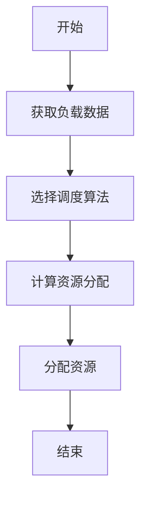
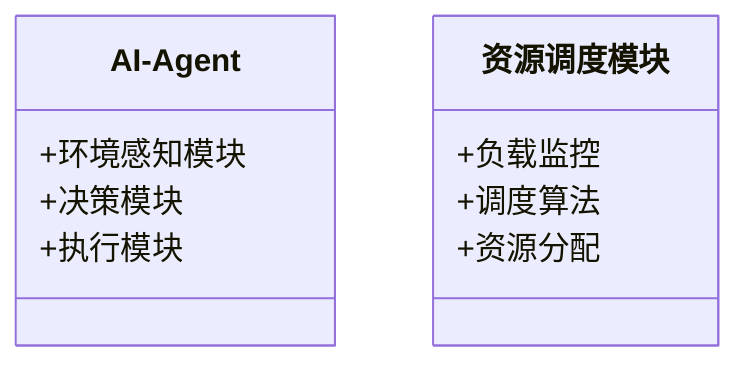
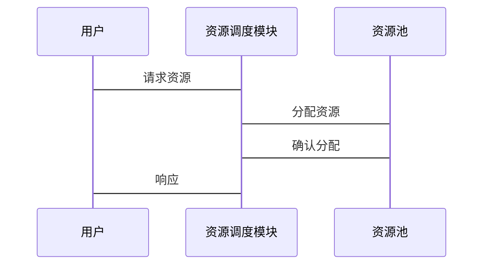

                 


# 企业AI Agent的serverless计算资源调度

> 关键词：企业AI Agent，serverless计算，资源调度，无服务器架构，云计算，AI代理，计算资源优化

> 摘要：本文探讨企业AI Agent在serverless计算环境下的资源调度问题，分析其面临的挑战和解决方案，结合具体算法和系统架构设计，提供实际案例和优化建议。

---

## 第1章: 企业AI Agent与serverless计算概述

### 1.1 企业AI Agent的概念与背景

#### 1.1.1 AI Agent的基本概念
AI Agent（人工智能代理）是能够感知环境并采取行动以实现目标的智能实体。企业AI Agent专注于企业场景，用于自动化任务处理、数据分析和决策支持。

#### 1.1.2 企业级AI Agent的应用场景
企业AI Agent广泛应用于智能客服、供应链优化、风险预测等领域，通过自动化处理提升企业效率。

#### 1.1.3 serverless计算的定义与特点
serverless计算是一种按需扩展的无服务器架构，用户无需管理底层服务器，资源由云提供商动态分配。

### 1.2 serverless计算的背景与发展

#### 1.2.1 serverless计算的起源
起源于云计算的发展，旨在简化开发者的基础设施管理。

#### 1.2.2 serverless计算的优势与挑战
优势包括按需扩展、成本优化；挑战涉及性能限制和资源不确定性。

#### 1.2.3 企业AI Agent与serverless计算的结合
通过serverless架构，企业AI Agent能够实现弹性扩展，满足高并发需求。

### 1.3 本章小结
本章介绍了企业AI Agent和serverless计算的基本概念，分析了它们结合的背景和优势。

---

## 第2章: serverless计算资源调度的核心概念

### 2.1 serverless计算资源调度的定义
资源调度是指在serverless环境中，动态分配计算资源以满足任务需求的过程。

### 2.2 资源调度的核心要素

#### 2.2.1 资源类型
包括计算能力、存储和网络资源。

#### 2.2.2 调度策略
基于负载、延迟和资源利用率的调度策略。

#### 2.2.3 调度算法
包括轮询、随机和加权调度算法。

### 2.3 资源调度的实现机制

#### 2.3.1 动态扩展机制
根据负载自动调整资源分配。

#### 2.3.2 负载监控机制
实时监控系统负载，触发资源调度。

#### 2.3.3 容错机制
确保任务在资源故障时能够重新调度。

### 2.4 核心概念与联系

#### 2.4.1 核心概念原理
资源调度通过监控负载和选择合适的算法来分配资源。

#### 2.4.2 概念属性特征对比表格

| 概念       | 特性           |
|------------|----------------|
| 资源类型   | CPU、内存、存储 |
| 调度策略   | 基于负载       |
| 调度算法   | 轮询、加权     |

#### 2.4.3 ER实体关系图架构
```mermaid
er
  actor: 用户
  serverless_function: 函数
  resource_pool: 资源池
  user -> serverless_function: 请求
  serverless_function -> resource_pool: 分配
```

---

## 第3章: AI Agent的资源调度算法原理

### 3.1 资源调度算法的分类

#### 3.1.1 基于规则的调度算法
根据预定义规则分配资源，简单但缺乏灵活性。

#### 3.1.2 基于负载的调度算法
根据当前负载动态分配资源，常用轮询和随机算法。

#### 3.1.3 基于预测的调度算法
利用预测模型预估未来负载，提前分配资源。

### 3.2 基于AI的资源调度算法

#### 3.2.1 基于强化学习的调度算法
通过强化学习模型优化资源分配策略。

#### 3.2.2 基于深度学习的调度算法
使用深度神经网络预测最优资源分配。

#### 3.2.3 基于图神经网络的调度算法
将系统视为图结构，利用图神经网络进行调度。

### 3.3 算法原理的数学模型与公式

#### 3.3.1 强化学习模型
状态空间表示当前系统状态，动作空间表示可能的调度决策，目标是最大化累积奖励。

#### 3.3.2 深度学习模型
使用多层感知机（MLP）或卷积神经网络（CNN）进行负载预测和资源分配。

#### 3.3.3 图神经网络模型
通过图结构捕捉系统中各组件之间的关系，优化资源分配。

### 3.4 算法实现的流程图


---

## 第4章: 企业AI Agent的系统架构设计

### 4.1 系统功能设计

#### 4.1.1 领域模型


#### 4.1.2 功能模块划分
- 环境感知模块：收集系统负载数据。
- 决策模块：选择最优调度策略。
- 执行模块：分配资源并执行任务。

#### 4.1.3 系统架构设计
采用微服务架构，各模块独立部署，通过API进行通信。

### 4.2 系统接口设计

#### 4.2.1 API接口设计
- GET /api/load：获取系统负载。
- POST /api/schedule：提交调度请求。

#### 4.2.2 接口交互流程
用户发起请求，系统接收并解析，触发资源调度模块进行处理。

#### 4.2.3 接口协议选择
使用HTTP协议进行通信，确保兼容性和可扩展性。

### 4.3 系统交互流程图


---

## 第5章: 项目实战

### 5.1 项目背景与目标
通过实际案例展示企业AI Agent在serverless环境下的资源调度实现。

### 5.2 系统核心实现源代码

#### 5.2.1 负载监控模块
```python
import logging
from prometheus_client import start_http_server, Gauge

gauge = Gauge('system_load', 'System load')
start_http_server(8000)
```

#### 5.2.2 调度算法实现
```python
def schedule_resources(tasks, resources):
    # 基于负载的调度算法
    for task in tasks:
        resource = select_resource(task)
        allocate(task, resource)
```

#### 5.2.3 资源分配模块
```python
def allocate(task, resource):
    resource.allocate_task(task)
```

### 5.3 代码应用解读与分析
通过实际代码展示资源调度的具体实现，分析各模块的交互和协作。

### 5.4 实际案例分析和详细讲解剖析
通过一个具体案例，展示如何在企业AI Agent中实现serverless资源调度，分析其效果和优化空间。

### 5.5 项目小结
总结项目实现的关键点，提出改进建议和未来发展方向。

---

## 第6章: 总结与展望

### 6.1 本章总结
回顾全文，总结企业AI Agent在serverless计算资源调度中的关键技术和实现方法。

### 6.2 未来展望
探讨未来的发展方向，包括更智能的调度算法和更高效的系统架构。

### 6.3 最佳实践 tips
提供实际应用中的优化建议和注意事项，帮助读者更好地实施资源调度。

---

通过以上结构，文章详细讲解了企业AI Agent在serverless环境下的资源调度问题，结合理论分析和实际案例，为读者提供了全面的技术指导。

