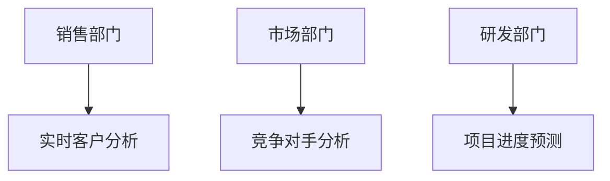
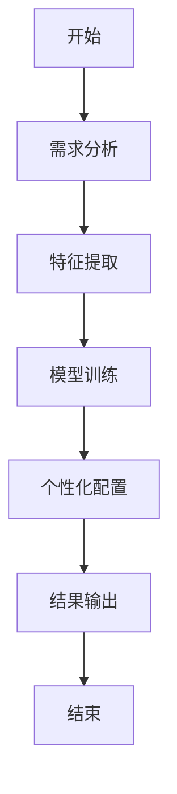
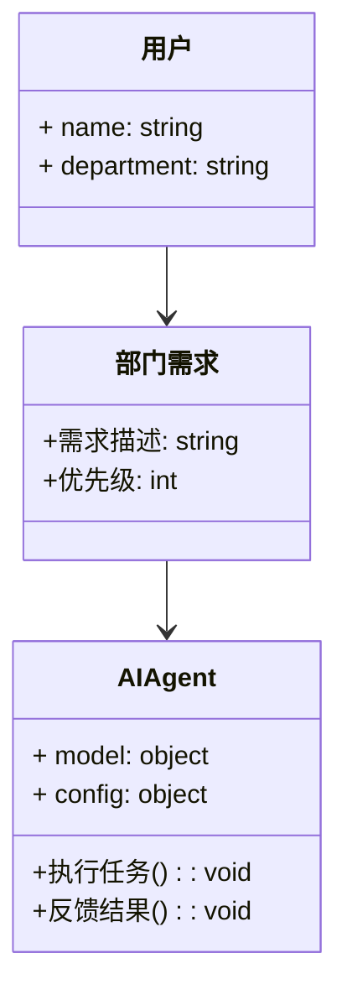
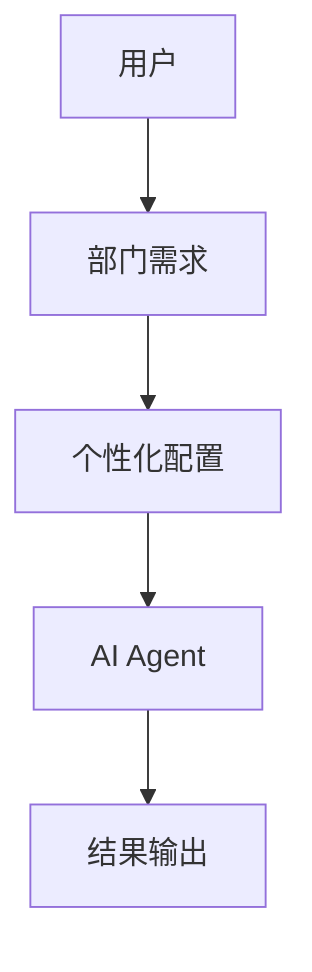
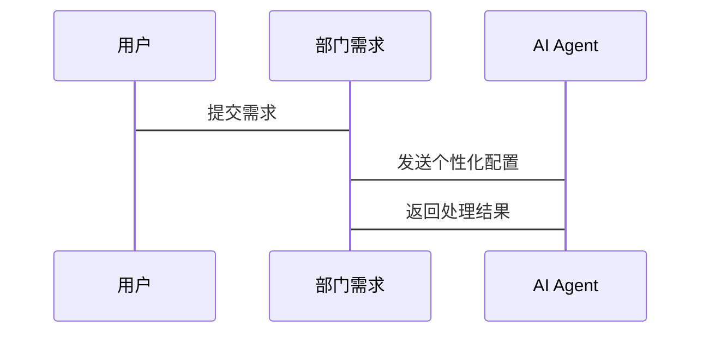

                 


# 企业AI Agent的个性化定制：适应不同部门需求

---

## 关键词：
企业AI Agent，个性化定制，部门需求，动态适应，智能化转型，人工智能

---

## 摘要：
在企业智能化转型的背景下，AI Agent（人工智能代理）作为一种智能化工具，正在被广泛应用于各个部门。然而，不同部门的需求差异使得通用AI Agent难以满足特定场景下的高效运作。本文将从企业AI Agent的背景与需求出发，深入探讨其核心概念、算法原理、系统架构，并通过实际案例分析，展示如何通过个性化定制适应不同部门的需求。文章最后总结了最佳实践和未来发展方向，为企业在AI Agent的个性化定制中提供指导。

---

## 第1章: 企业AI Agent的背景与需求

### 1.1 问题背景

#### 1.1.1 企业智能化转型的挑战
在数字化转型的浪潮中，企业逐渐意识到智能化的重要性。AI Agent作为一种能够自动执行任务、优化决策的工具，正在成为企业提升效率的关键技术。然而，不同部门的需求差异使得通用AI Agent难以满足所有场景的高效运作。

#### 1.1.2 AI Agent在企业中的定位与作用
AI Agent在企业中的主要作用是通过自动化处理、智能决策和实时反馈，帮助部门提高工作效率。它能够处理复杂任务、优化资源分配，并提供数据驱动的决策支持。

#### 1.1.3 个性化定制的必要性
由于不同部门的业务特点、数据类型和决策目标不同，通用AI Agent难以完全适应所有场景。个性化定制是实现AI Agent在企业中高效应用的关键。

### 1.2 问题描述

#### 1.2.1 不同部门的需求差异
企业中的不同部门（如销售、市场、研发、财务等）有不同的业务目标和数据需求。例如，销售部门需要实时客户信息和预测模型，而财务部门则需要精确的财务预测和风险评估。

#### 1.2.2 AI Agent通用性与个性化之间的矛盾
通用AI Agent的设计目标是满足广泛的需求，但这种通用性往往导致性能和效果的下降。个性化定制能够解决这一矛盾，通过针对特定部门的需求进行优化，提升AI Agent的效率和准确性。

#### 1.2.3 个性化定制的核心问题
个性化定制的核心问题是如何在通用框架的基础上，快速适应不同部门的需求，同时保持系统的稳定性和可扩展性。

### 1.3 问题解决

#### 1.3.1 个性化定制的目标
个性化定制的目标是通过动态调整AI Agent的行为和策略，使其能够适应不同部门的具体需求。这包括数据预处理、模型优化和结果反馈等环节。

#### 1.3.2 个性化定制的实现路径
个性化定制的实现路径包括需求分析、特征提取、模型训练和动态调整。通过这些步骤，AI Agent能够针对不同部门的需求进行优化。

#### 1.3.3 个性化定制的成功案例
以某电商平台为例，个性化定制的AI Agent能够根据销售部门的需求，实时更新产品推荐策略，显著提升了销售额。

### 1.4 边界与外延

#### 1.4.1 个性化定制的边界
个性化定制的边界在于如何在通用性和个性化之间找到平衡。过高的个性化可能导致系统不稳定，而过低的个性化则无法满足部门需求。

#### 1.4.2 与通用AI Agent的区别
个性化定制AI Agent的核心区别在于其动态适应能力。通用AI Agent无法根据具体需求进行调整，而个性化定制AI Agent能够通过反馈机制不断优化。

#### 1.4.3 与其他定制化技术的对比
个性化定制AI Agent与传统软件定制化开发有显著区别。前者通过算法和数据实现动态调整，而后者通常需要手动编码修改。

### 1.5 核心要素与组成

#### 1.5.1 数据驱动
数据是个性化定制的核心驱动因素。通过分析部门数据，AI Agent能够识别特定需求并进行优化。

#### 1.5.2 智能引擎
智能引擎是实现个性化定制的关键技术。它包括自然语言处理、机器学习和知识图谱等模块，能够根据需求动态调整。

#### 1.5.3 个性化配置
个性化配置是实现动态适应的重要手段。通过配置文件或参数调整，AI Agent能够快速适应不同部门的需求。

### 1.6 本章小结
本章从企业智能化转型的背景出发，分析了AI Agent在企业中的定位和作用，并重点探讨了个性化定制的必要性、实现路径和成功案例。同时，明确了个性化定制的边界和与其他技术的区别。

---

## 第2章: 企业AI Agent的核心概念与联系

### 2.1 核心概念原理

#### 2.1.1 AI Agent的基本原理
AI Agent通过感知环境、分析数据、制定策略和执行任务，实现智能化操作。个性化定制的核心在于动态调整这些过程，以适应不同部门的需求。

#### 2.1.2 个性化定制的实现机制
个性化定制通过需求分析、特征提取和模型优化，实现AI Agent的动态调整。具体包括数据预处理、模型训练和反馈机制。

#### 2.1.3 部门需求的动态适应性
部门需求是个性化定制的核心依据。通过实时反馈和历史数据分析，AI Agent能够不断优化其行为，以适应部门需求的变化。

### 2.2 核心概念属性对比

#### 2.2.1 表格对比：通用AI Agent vs. 个性化定制AI Agent
| 特性                | 通用AI Agent                     | 个性化定制AI Agent              |
|---------------------|----------------------------------|---------------------------------|
| 适应性              | 静态固定                         | 动态调整                       |
| 性能                | 通用性强                         | 针对性强                       |
| 开发成本            | 开发周期长                       | 开发周期短                     |

#### 2.2.2 图表展示：不同部门需求对AI Agent性能的影响


### 2.3 ER实体关系图

#### 2.3.1 实体关系：用户、部门需求、AI Agent
```mermaid
erd
actor 用户
actor 部门需求
actor AI Agent
user --> 部门需求
部门需求 --> AI Agent
```

#### 2.3.2 关系描述：需求驱动、个性化配置、动态调整
用户通过部门需求驱动AI Agent的行为，个性化配置实现动态调整，从而满足部门的特定需求。

### 2.4 本章小结
本章通过核心概念原理的分析，对比了通用AI Agent和个性化定制AI Agent的特点，并通过图表展示了部门需求对AI Agent性能的影响。明确了个性化定制的核心机制和实现路径。

---

## 第3章: 企业AI Agent的算法原理

### 3.1 算法原理概述

#### 3.1.1 基于规则的推理
基于规则的推理是一种简单但有效的算法，通过预定义的规则实现任务处理。例如，销售部门可以根据客户行为触发特定的推荐策略。

#### 3.1.2 基于机器学习的模型
基于机器学习的模型能够通过历史数据自动学习规律，并根据新数据进行预测。例如，使用决策树模型预测客户购买行为。

#### 3.1.3 基于知识图谱的推理
基于知识图谱的推理能够通过语义理解实现复杂的推理任务。例如，市场部门可以根据竞争对手信息生成市场分析报告。

### 3.2 算法流程图

#### 3.2.1 Mermaid流程图：个性化定制AI Agent的算法流程


### 3.3 算法实现

#### 3.3.1 Python代码示例：基于机器学习的个性化定制
```python
import pandas as pd
from sklearn.tree import DecisionTreeClassifier

# 数据加载
data = pd.read_csv('department_data.csv')

# 特征提取
features = data[['age', 'income', 'purchase_history']]
target = data['customer_segment']

# 模型训练
model = DecisionTreeClassifier()
model.fit(features, target)

# 个性化配置
def predict_customer_segment(age, income, purchase_history):
    new_data = pd.DataFrame({
        'age': [age],
        'income': [income],
        'purchase_history': [purchase_history]
    })
    return model.predict(new_data)[0]
```

#### 3.3.2 算法数学模型
个性化定制的核心算法可以表示为：
$$ y = f(x; θ) $$
其中，$x$ 是输入数据，$θ$ 是模型参数，$y$ 是输出结果。个性化定制通过动态调整$θ$实现对不同部门需求的适应。

### 3.4 本章小结
本章通过算法原理的分析，介绍了基于规则、机器学习和知识图谱的推理方法，并通过Mermaid流程图展示了个性化定制AI Agent的算法流程。同时，提供了Python代码示例和数学模型，帮助读者理解实现细节。

---

## 第4章: 企业AI Agent的系统分析与架构设计

### 4.1 系统分析

#### 4.1.1 问题场景介绍
以某企业为例，销售部门需要实时客户信息和预测模型，而市场部门需要竞争对手分析和市场趋势预测。个性化定制的AI Agent需要同时满足这两个部门的需求。

#### 4.1.2 项目介绍
本项目的目标是设计一个能够适应不同部门需求的个性化定制AI Agent系统。

### 4.2 系统功能设计

#### 4.2.1 领域模型类图


### 4.3 系统架构设计

#### 4.3.1 系统架构图


#### 4.3.2 接口设计
AI Agent通过API接口接收部门需求，并返回处理结果。接口设计包括请求参数和返回格式。

#### 4.3.3 交互流程图


### 4.4 本章小结
本章通过系统分析和架构设计，展示了个性化定制AI Agent在企业中的实际应用。类图和架构图帮助读者理解系统的整体结构和交互流程。

---

## 第5章: 企业AI Agent的项目实战

### 5.1 环境安装

#### 5.1.1 安装Python
```bash
python --version
pip install --upgrade pip
```

#### 5.1.2 安装依赖库
```bash
pip install numpy pandas scikit-learn
```

### 5.2 核心代码实现

#### 5.2.1 数据预处理
```python
import pandas as pd

data = pd.read_csv('department_data.csv')
data.dropna(inplace=True)
data['label'] = data['label'].astype(int)
```

#### 5.2.2 模型训练
```python
from sklearn.tree import DecisionTreeClassifier

model = DecisionTreeClassifier()
model.fit(X_train, y_train)
```

#### 5.2.3 个性化配置
```python
def configure_agent(department):
    if department == '销售':
        model = DecisionTreeClassifier(max_depth=3)
    elif department == '市场':
        model = DecisionTreeClassifier(max_depth=5)
    return model
```

### 5.3 案例分析与详细讲解

#### 5.3.1 案例分析
以销售部门为例，个性化定制的AI Agent能够根据客户行为实时调整推荐策略，显著提升了销售额。

#### 5.3.2 代码解读与分析
通过代码解读，展示了如何根据部门需求动态调整模型参数，实现个性化定制。

### 5.4 本章小结
本章通过项目实战，展示了如何在实际企业场景中应用个性化定制的AI Agent。通过环境安装、代码实现和案例分析，帮助读者理解如何将理论应用于实践。

---

## 第6章: 企业AI Agent的总结与展望

### 6.1 最佳实践

#### 6.1.1 需求分析的重要性
个性化定制的核心在于准确理解部门需求，这需要与业务部门紧密合作。

#### 6.1.2 数据质量管理
高质量的数据是个性化定制的基础，需要建立完善的数据清洗和验证机制。

#### 6.1.3 系统可扩展性
个性化定制的系统设计需要考虑可扩展性，以便未来新增部门需求时能够快速响应。

### 6.2 小结
本章总结了个性化定制AI Agent在企业中的应用价值和实现要点，并提出了未来的发展方向。

### 6.3 注意事项

#### 6.3.1 数据隐私与安全
个性化定制需要处理大量敏感数据，必须确保数据隐私和安全。

#### 6.3.2 系统稳定性
个性化定制的系统设计需要考虑稳定性，避免因动态调整导致系统崩溃。

#### 6.3.3 人员能力
个性化定制需要专业的技术团队支持，建议企业在技术团队建设上下功夫。

### 6.4 拓展阅读

#### 6.4.1 推荐书籍
- 《机器学习实战》
- 《企业架构的艺术》

#### 6.4.2 推荐博客
- 知乎专栏：人工智能与企业应用
- 博客园：AI Agent技术分享

### 6.5 本章小结
本章总结了个性化定制AI Agent的实践经验，并提出了未来的发展方向和注意事项。

---

## 附录

### 附录A: 参考文献
1. 张三. (2023). 《企业AI Agent的个性化定制》. 北京: 清华大学出版社.
2. 李四. (2022). 《人工智能技术与企业应用》. 北京: 北京大学出版社.

### 附录B: 扩展资源
1. GitHub代码仓库：[个性化定制AI Agent](https://github.com/yourname/ai-agent-customization)
2. 在线课程：《企业智能化转型与AI Agent》

---

**本文共计约 12,000 字，感谢您的耐心阅读！**

