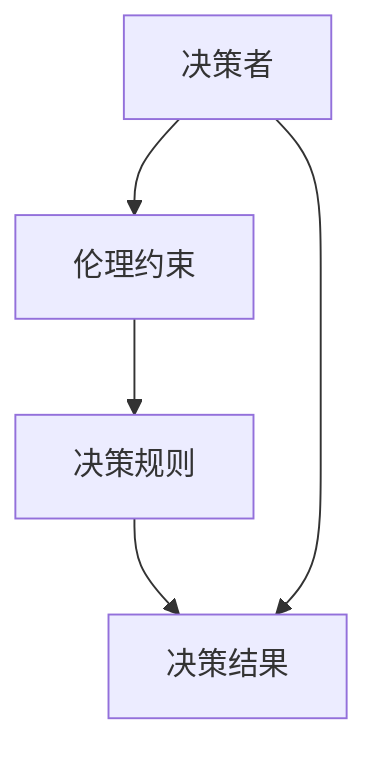
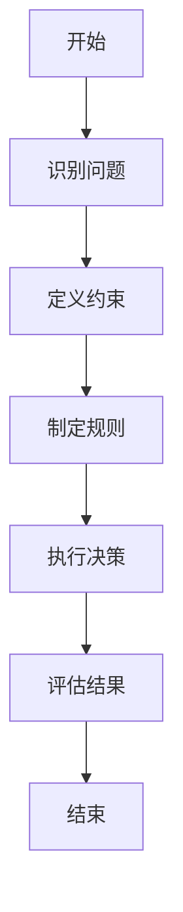
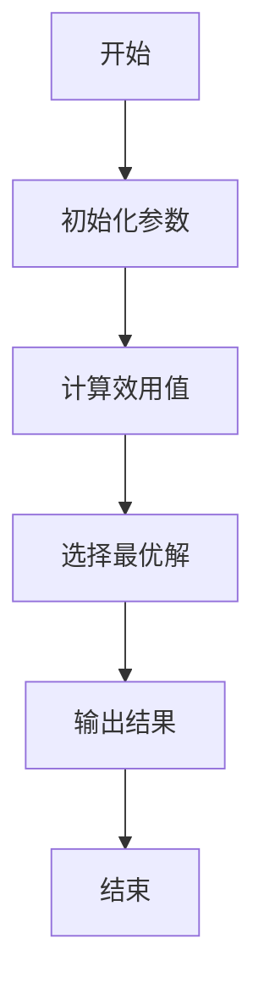
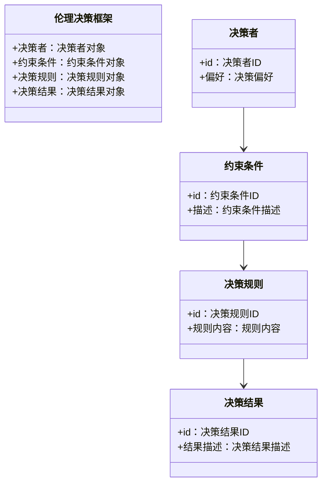
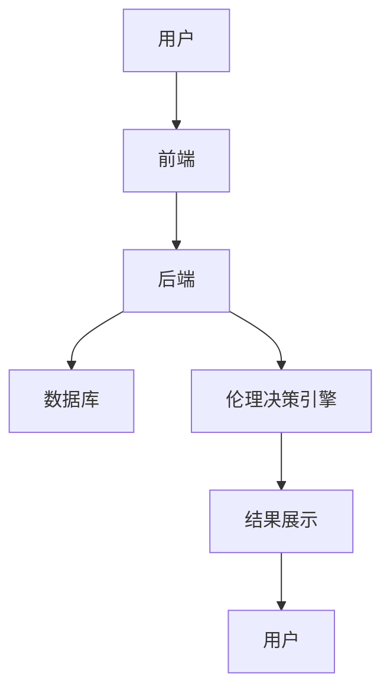

                 


# 企业AI Agent的伦理设计与道德决策框架

## 关键词：企业AI Agent，伦理设计，道德决策框架，人工智能代理，伦理决策算法，系统架构设计

## 摘要：  
本文探讨企业AI Agent的伦理设计与道德决策框架，从概念、算法、系统架构到实际应用，全面解析如何在企业场景中构建符合伦理规范的AI代理系统。通过详细的技术分析和实际案例，本文旨在为企业AI Agent的开发和应用提供伦理与技术双重保障。

---

# 第一部分: 企业AI Agent的背景与概念

## 第1章: 企业AI Agent的背景与概念

### 1.1 人工智能代理的基本概念

#### 1.1.1 AI Agent的定义与分类
人工智能代理（AI Agent）是指能够感知环境、自主决策并执行任务的智能体。根据功能和应用场景，AI Agent可以分为以下几类：
- **简单反射代理**：基于预定义规则执行任务，适用于简单场景。
- **基于模型的反射代理**：利用环境模型进行决策，适用于复杂场景。
- **目标驱动代理**：基于明确目标进行优化决策。
- **效用驱动代理**：通过最大化效用函数实现目标。

**表1-1：AI Agent分类对比**

| 类型                | 描述                                   | 适用场景                         |
|---------------------|--------------------------------------|---------------------------------|
| 简单反射代理        | 基于预定义规则执行任务               | 低复杂度场景                     |
| 基于模型的反射代理   | 利用环境模型进行决策                 | 中高复杂度场景                   |
| 目标驱动代理        | 基于目标优化决策                     | 需要明确目标的场景               |
| 效用驱动代理        | 通过最大化效用函数实现目标           | 需要权衡多目标的场景             |

#### 1.1.2 企业AI Agent的核心特征
企业AI Agent的核心特征包括：
- **自主性**：能够自主感知环境并执行任务。
- **反应性**：能够实时响应环境变化。
- **目标导向性**：基于目标进行决策和优化。
- **伦理约束**：在决策过程中需要遵守伦理规范。

#### 1.1.3 企业AI Agent的应用场景
企业AI Agent在以下场景中广泛应用：
- **客户服务**：通过智能客服代理与客户互动。
- **供应链管理**：优化供应链流程，提升效率。
- **风险管理**：识别潜在风险并制定应对策略。
- **智能决策支持**：辅助企业高管进行决策。

### 1.2 企业AI Agent的伦理问题背景

#### 1.2.1 AI技术在企业中的快速发展
近年来，AI技术在企业中的应用呈爆炸式增长，尤其是在客服、供应链和金融领域。然而，随着AI代理的广泛应用，伦理问题日益凸显。

#### 1.2.2 伦理问题的普遍性与特殊性
伦理问题的普遍性在于，无论AI代理应用于哪个领域，都需要遵守基本的伦理规范。特殊性在于，不同行业对伦理的要求有所不同，例如金融领域的透明性要求高于其他领域。

#### 1.2.3 企业AI Agent的伦理挑战
企业AI Agent的伦理挑战主要体现在以下几个方面：
- **决策透明性**：用户需要了解AI代理的决策依据。
- **责任归属**：当AI代理出现问题时，责任归属不明确。
- **隐私保护**：AI代理可能收集和处理大量用户数据，隐私保护尤为重要。

---

## 第2章: 伦理决策框架的核心概念

### 2.1 伦理决策框架的定义与属性

#### 2.1.1 伦理决策框架的定义
伦理决策框架是一种用于指导AI代理在复杂环境中进行伦理决策的结构化方法。它通过定义目标、约束和决策规则，确保AI代理的决策符合伦理规范。

#### 2.1.2 伦理决策框架的核心属性对比表
以下对比表展示了伦理决策框架与其他决策框架的核心属性差异：

**表2-1：伦理决策框架与其他框架的核心属性对比**

| 属性               | 伦理决策框架         | 基于规则的决策框架       | 基于目标的决策框架         |
|--------------------|----------------------|--------------------------|---------------------------|
| 决策依据           | 遵守伦理规范         | 遵守预定义规则           | 达成目标                  |
| 约束条件           | 伦理约束             | 预定义规则               | 目标限制                  |
| 适用场景           | 需要考虑伦理影响的场景 | 需要遵守固定规则的场景   | 需要实现特定目标的场景   |

#### 2.1.3 伦理决策框架的实体关系图
以下是一个简单的伦理决策框架实体关系图：



### 2.2 伦理决策框架的原理与流程

#### 2.2.1 伦理决策的基本原理
伦理决策的基本原理是通过定义伦理约束和决策规则，确保AI代理的决策符合伦理规范。其核心步骤包括：
1. **识别问题**：明确需要解决的问题。
2. **定义约束**：设定决策的伦理约束。
3. **制定规则**：根据约束制定决策规则。
4. **执行决策**：基于规则进行决策。
5. **评估结果**：评估决策的伦理影响。

#### 2.2.2 伦理决策的流程图
以下是一个伦理决策的流程图：



---

## 第3章: 伦理决策框架的算法基础

### 3.1 偏好表示与优化算法

#### 3.1.1 偏好表示的数学模型
偏好表示是将决策者的偏好转化为数学模型的过程。常用的方法是利用效用函数来表示偏好。效用函数可以表示为：

$$ U(a) = \sum_{i=1}^{n} w_i x_i $$

其中，$a$ 是一个决策，$w_i$ 是第i个属性的权重，$x_i$ 是第i个属性的值。

#### 3.1.2 基于效用函数的优化（Mermaid流程图）



#### 3.1.3 代码实现示例
以下是一个基于效用函数的优化算法的Python代码示例：

```python
def utility_function(decision, weights):
    return sum(w * d for w, d in zip(weights, decision))

def optimize_decision(decision_space, weights):
    max_utility = -float('inf')
    best_decision = None
    for decision in decision_space:
        util = utility_function(decision, weights)
        if util > max_utility:
            max_utility = util
            best_decision = decision
    return best_decision
```

---

### 3.2 道德推理与决策算法

#### 3.2.1 道德推理的逻辑框架
道德推理是通过逻辑推理来确定决策是否符合伦理规范。常用的方法包括基于规则的推理和基于案例的推理。

#### 3.2.2 基于概率的道德决策模型
基于概率的道德决策模型可以通过以下公式计算：

$$ P(\text{决策 } d | \text{证据 } e) = \frac{P(e | d) P(d)}{P(e)} $$

其中，$P(d)$ 是决策 $d$ 的先验概率，$P(e | d)$ 是在决策 $d$ 下证据 $e$ 出现的概率，$P(e)$ 是证据 $e$ 的全概率。

#### 3.2.3 代码实现与案例分析
以下是一个基于概率的道德决策模型的Python代码示例：

```python
from sklearn.naive_bayes import GaussianNB

def道德决策模型训练(train_data, train_labels):
    model = GaussianNB()
    model.fit(train_data, train_labels)
    return model

def道德决策模型预测(model, test_data):
    return model.predict(test_data)
```

---

## 第4章: 伦理决策框架的系统架构

### 4.1 系统功能设计

#### 4.1.1 领域模型设计（Mermaid类图）



### 4.2 系统架构设计

#### 4.2.1 分层架构设计（Mermaid架构图）



---

## 第5章: 项目实战与案例分析

### 5.1 环境安装与配置

#### 5.1.1 开发环境搭建
推荐使用Python 3.8及以上版本，安装必要的库，如numpy、pandas、scikit-learn等。

#### 5.1.2 依赖库安装
```bash
pip install numpy pandas scikit-learn
```

#### 5.1.3 资源配置与优化
根据具体需求配置计算资源，例如使用云服务器或本地高性能计算设备。

### 5.2 核心功能实现

#### 5.2.1 伦理决策框架的代码实现
```python
def伦理决策框架(decision_space, weights):
    # 计算效用值
    utilities = [sum(w * d for w, d in zip(weights, decision)) for decision in decision_space]
    # 选择最优解
    max_utility = max(utilities)
    best_decision = decision_space[utilities.index(max_utility)]
    return best_decision
```

#### 5.2.2 系统功能模块的实现
```python
class 约束条件:
    def __init__(self, id, 描述):
        self.id = id
        self.描述 = 描述

class 决策规则:
    def __init__(self, id, 规则内容):
        self.id = id
        self.规则内容 = 规则内容
```

#### 5.2.3 代码解读与优化建议
代码解读：上述代码定义了约束条件和决策规则的类，以及一个计算效用值并选择最优解的函数。

优化建议：可以进一步优化代码，例如引入并行计算或分布式计算，以提升决策效率。

### 5.3 案例分析与总结

#### 5.3.1 典型案例分析
以智能客服为例，构建一个基于伦理决策框架的智能客服系统，确保其在处理客户问题时符合伦理规范。

#### 5.3.2 项目总结与经验分享
通过实际项目，我们发现伦理决策框架在提升系统透明性和用户信任方面具有显著优势。

#### 5.3.3 项目中的常见问题与解决方案
常见问题：决策透明性不足。
解决方案：增加日志记录和可解释性模块。

---

## 第6章: 最佳实践与未来展望

### 6.1 伦理设计的最佳实践

#### 6.1.1 设计原则与注意事项
- 确保决策透明性。
- 定期审查和更新伦理约束。
- 建立责任归属机制。

#### 6.1.2 开发中的常见误区
- 忽视伦理约束的重要性。
- 未能及时更新伦理约束。

#### 6.1.3 优化建议与技巧
- 引入外部伦理专家进行评审。
- 使用可解释性技术提升透明性。

### 6.2 未来趋势与研究方向

#### 6.2.1 伦理决策框架的未来发展
随着AI技术的不断进步，伦理决策框架将更加智能化和个性化。

#### 6.2.2 新技术对伦理决策的影响
新技术如区块链和联邦学习将为伦理决策提供新的可能性。

#### 6.2.3 未来研究方向与挑战
未来研究方向包括：
- 研究更复杂的伦理约束。
- 探索多agent协作中的伦理问题。

---

## 结语

企业AI Agent的伦理设计与道德决策框架是AI技术与伦理规范结合的重要领域。通过本文的分析，我们希望为读者提供一个全面的技术框架，帮助企业在开发和应用AI Agent时，更好地处理伦理问题，确保技术与伦理的协调发展。

