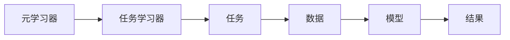
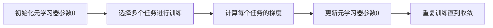
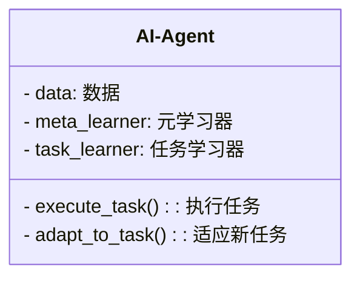
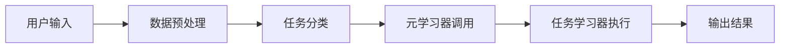
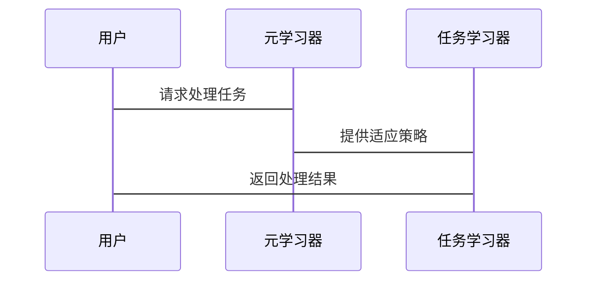

                 


# 《企业AI Agent的元学习应用：快速适应新任务》

---

## 关键词

- 企业AI Agent
- 元学习
- 快速适应新任务
- 知识迁移
- 智能系统设计

---

## 摘要

本文深入探讨了企业AI Agent在元学习中的应用，重点分析了如何通过元学习使AI代理快速适应新任务。文章首先介绍了元学习的基本概念和其在企业AI Agent中的重要性，随后详细讲解了元学习的算法原理、系统架构设计及实际应用场景。通过数学模型、算法流程图和Python代码示例，本文系统地阐述了元学习在企业AI Agent中的实现过程，并提供了项目实战和最佳实践建议。最后，文章总结了元学习在企业AI Agent中的优势，并展望了未来的发展方向。

---

# 第一部分: 企业AI Agent的元学习应用背景

---

## 第1章: 企业AI Agent与元学习概述

### 1.1 问题背景

#### 1.1.1 传统AI代理的局限性

- 传统AI代理在处理新任务时，通常需要重新训练整个模型，导致效率低下。
- 无法有效处理任务之间的知识迁移问题，增加了企业AI系统的维护成本。

#### 1.1.2 快速适应新任务的需求

- 企业环境中任务多样，AI代理需要快速适应新任务以提高效率。
- 快速适应能力是企业AI代理在复杂环境中生存的关键。

#### 1.1.3 元学习的提出与目标

- 元学习的提出为企业AI代理提供了快速适应新任务的解决方案。
- 元学习的目标是通过学习如何学习，提高AI代理的适应能力。

### 1.2 问题描述

#### 1.2.1 任务多样性的挑战

- 企业环境中的任务种类繁多，AI代理需要在不同任务间快速切换。
- 任务之间的关联性复杂，增加了快速适应的难度。

#### 1.2.2 知识迁移的难点

- 不同任务之间的知识差异较大，传统迁移学习方法效果有限。
- 快速知识迁移需要高效的算法支持。

#### 1.2.3 快速适应的实现路径

- 通过元学习算法实现快速知识迁移。
- 建立高效的元学习模型，优化AI代理的适应能力。

### 1.3 问题解决

#### 1.3.1 元学习的核心思想

- 元学习通过学习多个任务，掌握快速适应新任务的策略。
- 元学习的核心思想是“学习如何学习”，而非具体任务的知识。

#### 1.3.2 快速适应的实现方法

- 使用元学习算法训练AI代理，使其具备快速调整参数的能力。
- 在新任务中，AI代理能够快速调整参数以适应任务需求。

#### 1.3.3 企业AI Agent的应用场景

- 企业内部流程自动化：快速适应不同流程任务。
- 客户服务：快速应对多样化的客户咨询和问题。
- 数据分析：快速处理不同类型的数据集。

### 1.4 边界与外延

#### 1.4.1 元学习的适用范围

- 元学习适用于需要快速适应新任务的场景。
- 在任务之间具有相似性或相关性的场景中效果显著。

#### 1.4.2 与传统机器学习的区分

- 传统机器学习：针对具体任务进行训练。
- 元学习：学习如何在多个任务间进行调整。

#### 1.4.3 与其他AI技术的对比

- 与强化学习：强化学习注重通过试错优化策略，元学习注重快速适应任务。
- 与迁移学习：元学习更注重跨任务的快速调整能力。

### 1.5 核心概念与结构

#### 1.5.1 元学习的基本模型

- 元学习模型包括元学习器和任务学习器。
- 元学习器负责训练任务学习器的参数调整策略。

#### 1.5.2 企业AI Agent的组成要素

- 数据采集模块：收集任务相关数据。
- 元学习器：负责快速调整参数。
- 任务执行模块：根据调整后的参数执行任务。

#### 1.5.3 元学习在其中的作用机制

- 元学习器通过训练学习快速调整参数的策略。
- 在新任务中，任务学习器根据元学习器提供的策略快速适应。

---

# 第二部分: 元学习的核心概念与联系

---

## 第2章: 元学习原理与模型

### 2.1 元学习的基本原理

#### 2.1.1 元学习的定义与特点

- 元学习是一种通过学习多个任务来提高新任务适应能力的方法。
- 元学习的特点包括通用性、快速适应性和高效性。

#### 2.1.2 元学习的数学模型

- 元学习的数学模型通常包括元学习目标函数和任务损失函数。
- 元学习器通过优化目标函数，使得任务学习器在新任务上表现良好。

#### 2.1.3 元学习的训练过程

1. 元学习器先在多个任务上进行训练。
2. 在新任务中，任务学习器根据元学习器提供的策略快速调整参数。
3. 元学习器通过不断优化策略，提高任务学习器的适应能力。

### 2.2 元学习模型的特征对比

#### 2.2.1 不同模型的特征分析

| 模型名称 | 特征描述 | 优缺点 |
|----------|----------|--------|
| MAML     | 通过优化任务特定的参数更新规则 | 收敛速度快，但在复杂任务中表现一般 |
| ReM      | 基于关系的元学习 | 适用于任务间关系复杂的场景 |
| Meta-SGD | 基于梯度的元学习方法 | 易于实现，但在任务多样性较低时效果有限 |

#### 2.2.2 模型对比的特征表格

- 通过表格对比不同模型的特征，帮助读者选择适合的元学习算法。

### 2.3 实体关系图



---

# 第三部分: 元学习算法原理

---

## 第3章: 元学习算法的数学模型

### 3.1 元学习算法的数学模型

#### 3.1.1 元学习的数学表达式

$$ \theta = \arg \min_{\theta} \sum_{i=1}^{N} L_{i}(\theta) $$

- $\theta$ 表示元学习器的参数。
- $L_i$ 表示第$i$个任务的损失函数。

#### 3.1.2 快速适应的优化目标

$$ \theta = \theta - \eta \nabla_{\theta} L_{meta} $$

- $\eta$ 表示学习率。
- $L_{meta}$ 表示元损失函数，用于衡量元学习器在新任务上的表现。

### 3.2 元学习算法的流程



---

## 第4章: 元学习算法的实现

### 4.1 元学习算法的实现步骤

1. **数据准备**：收集多个任务的数据集。
2. **模型构建**：定义元学习器和任务学习器的结构。
3. **训练过程**：在多个任务上训练元学习器，优化其参数。
4. **新任务适应**：在新任务中，任务学习器根据元学习器提供的策略快速调整参数。

### 4.2 元学习算法的Python代码示例

```python
import torch
import torch.nn as nn
import torch.optim as optim

class MetaLearner(nn.Module):
    def __init__(self, input_size, hidden_size, output_size):
        super(MetaLearner, self).__init__()
        self.fc1 = nn.Linear(input_size, hidden_size)
        self.fc2 = nn.Linear(hidden_size, output_size)
    
    def forward(self, x):
        x = torch.relu(self.fc1(x))
        x = self.fc2(x)
        return x

def train_meta_learner(meta_learner, optimizer, criterion, tasks, epochs):
    for epoch in range(epochs):
        for task in tasks:
            optimizer.zero_grad()
            inputs, labels = task
            outputs = meta_learner(inputs)
            loss = criterion(outputs, labels)
            loss.backward()
            optimizer.step()
    return meta_learner

# 示例任务数据
tasks = [
    (torch.randn(100, input_size), torch.randint(0, output_size, (100,))),
    (torch.randn(80, input_size), torch.randint(0, output_size, (80,))),
    # 添加更多任务数据
]

meta_learner = MetaLearner(input_size, hidden_size, output_size)
optimizer = optim.Adam(meta_learner.parameters(), lr=0.001)
criterion = nn.CrossEntropyLoss()

meta_learner = train_meta_learner(meta_learner, optimizer, criterion, tasks, 10)
```

---

# 第四部分: 系统分析与架构设计

---

## 第5章: 系统分析与架构设计

### 5.1 问题场景介绍

- 企业内部需要处理多样化的任务，如数据分析、客户服务等。
- AI代理需要快速适应不同任务，提高效率。

### 5.2 系统功能设计

#### 5.2.1 领域模型



### 5.3 系统架构设计



### 5.4 系统接口设计

- 输入接口：接收用户请求和数据。
- 输出接口：返回处理结果和反馈信息。
- 元学习器接口：提供快速适应新任务的策略。

### 5.5 系统交互流程



---

## 第6章: 项目实战

### 6.1 环境安装与配置

- 安装必要的Python库：如PyTorch、numpy、matplotlib。
- 确保安装了最新版本的Python和相关开发工具。

### 6.2 核心代码实现

```python
import torch
import torch.nn as nn
import torch.optim as optim
import numpy as np

class TaskLearner(nn.Module):
    def __init__(self, input_size, hidden_size):
        super(TaskLearner, self).__init__()
        self.fc1 = nn.Linear(input_size, hidden_size)
        self.fc2 = nn.Linear(hidden_size, 1)  # 二分类任务

    def forward(self, x):
        x = torch.relu(self.fc1(x))
        x = self.fc2(x)
        return x

class MetaLearner(nn.Module):
    def __init__(self, input_size, hidden_size):
        super(MetaLearner, self).__init__()
        self.fc1 = nn.Linear(input_size, hidden_size)
        self.fc2 = nn.Linear(hidden_size, hidden_size)
        self.fc3 = nn.Linear(hidden_size, 1)

    def forward(self, x):
        x = torch.relu(self.fc1(x))
        x = torch.relu(self.fc2(x))
        x = self.fc3(x)
        return x

def train(meta_learner, task_learner, optimizer_meta, criterion_meta, tasks, inner_epochs=5):
    for task in tasks:
        optimizer_task = optim.Adam(task_learner.parameters(), lr=0.01)
        for _ in range(inner_epochs):
            inputs, labels = task
            optimizer_task.zero_grad()
            outputs = task_learner(inputs)
            loss = criterion_meta(outputs, labels)
            loss.backward()
            optimizer_task.step()
        # 计算任务损失
        meta_loss = criterion_meta(meta_learner(torch.cat([inputs, outputs.mean(dim=0).unsqueeze(0)], dim=1)), labels.mean().item())
        optimizer_meta.zero_grad()
        meta_loss.backward()
        optimizer_meta.step()
    return meta_learner

# 示例任务数据
tasks = [
    (torch.randn(100, 5), torch.randint(0, 2, (100, 1))),
    (torch.randn(80, 5), torch.randint(0, 2, (80, 1))),
]

meta_learner = MetaLearner(5, 10)
task_learner = TaskLearner(5, 10)
optimizer_meta = optim.Adam(meta_learner.parameters(), lr=0.001)
criterion_meta = nn.BCEWithLogitsLoss()

meta_learner = train(meta_learner, task_learner, optimizer_meta, criterion_meta, tasks)
```

---

## 第7章: 总结与最佳实践

### 7.1 最佳实践

- **数据预处理**：确保数据质量，减少噪声干扰。
- **模型选择**：根据任务需求选择合适的元学习算法。
- **系统优化**：通过并行计算和优化算法提高训练效率。

### 7.2 小结

- 本文系统地介绍了企业AI Agent在元学习中的应用。
- 通过数学模型和代码示例，详细讲解了元学习的实现过程。
- 总结了系统设计和项目实战中的关键点。

### 7.3 注意事项

- 元学习算法的选择需要根据具体任务需求。
- 系统设计时要考虑可扩展性和可维护性。
- 在实际应用中，需要不断优化和调整模型参数。

### 7.4 拓展阅读

- 推荐阅读相关领域的最新论文和书籍。
- 关注元学习在其他领域的应用，如自然语言处理和计算机视觉。

---

# 结语

企业AI Agent的元学习应用为企业智能化转型提供了新的思路。通过元学习，AI代理能够快速适应新任务，提高企业的运营效率。未来，随着元学习算法的不断进步，企业AI Agent将在更多领域发挥重要作用。

