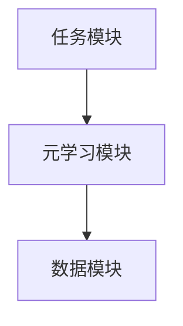
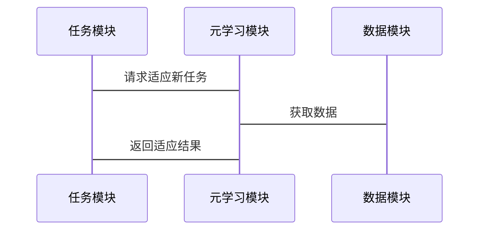

                 


# 企业AI Agent的元学习应用：快速适应新任务与领域

> 关键词：企业AI Agent、元学习、快速适应、新任务、领域应用

> 摘要：本文探讨了企业AI Agent在元学习中的应用，重点分析了元学习的原理、算法及其在企业环境中的实际应用。通过详细讲解元学习的数学模型和算法实现，结合实际案例，展示了企业如何利用元学习快速适应新任务和领域。

---

## 第1章: 企业AI Agent与元学习概述

### 1.1 企业AI Agent的定义与特点

企业AI Agent是一种智能代理系统，能够理解、推理和执行企业级的任务。它具有以下特点：

- **智能性**：能够感知环境并做出决策。
- **自主性**：无需外部干预，自主执行任务。
- **协作性**：能够与其他系统或人员协作完成任务。
- **适应性**：能够快速适应新任务和领域。

### 1.2 元学习的背景与意义

元学习是一种通过学习如何学习来提高模型适应新任务能力的方法。其背景包括：

- **数据稀疏性**：在某些领域中，数据量有限，传统机器学习方法难以有效。
- **快速适应性**：企业需要在动态环境中快速适应新任务。
- **领域多样性**：企业可能涉及多个领域，需要模型具备跨领域适应能力。

### 1.3 企业AI Agent的元学习应用场景

- **新任务快速适应**：通过元学习，AI Agent可以在少量数据下快速掌握新任务。
- **多领域知识迁移**：利用元学习，AI Agent能够将知识迁移到新的领域。
- **动态环境下的自适应能力**：在不断变化的环境中，元学习帮助AI Agent保持高效性能。

---

## 第2章: 元学习的核心概念与原理

### 2.1 元学习的基本原理

元学习通过优化优化器的参数，使得模型能够快速适应新任务。其核心机制包括：

- **元优化器**：用于优化模型的参数更新规则。
- **任务分布**：假设新任务服从某种分布，利用已有任务的数据进行元学习。

### 2.2 元学习与传统机器学习的对比

| 特性 | 传统机器学习 | 元学习 |
|------|--------------|--------|
| 学习目标 | 固定任务 | 快速适应新任务 |
| 数据需求 | 需要大量数据 | 适用于数据稀疏场景 |
| 灵活性 | 较低 | 较高 |

### 2.3 元学习的典型算法

- **Meta-SGD**：通过优化优化器参数来适应新任务。
- **MAML**：使用两步梯度更新来实现快速适应。

---

## 第3章: 元学习的数学模型与公式

### 3.1 元学习的数学模型

元学习的目标是优化一个参数更新规则，使得在新任务上的损失最小化。数学表示为：

$$ \min_{\theta} \sum_{i=1}^N \mathcal{L}(f_\theta(x_i), y_i) $$

其中，$\theta$是优化器的参数，$f_\theta$是任务模型。

### 3.2 元学习算法的数学推导

以Meta-SGD为例，其优化过程如下：

1. 在训练任务上计算梯度：
$$ g_i = \nabla_\theta \mathcal{L}(f_\theta(x_i), y_i) $$
2. 更新优化器参数：
$$ \theta_{\text{new}} = \theta - \eta g_i $$

### 3.3 元学习的公式表示

- **Meta-SGD的更新公式**：
$$ \theta_{\text{new}} = \theta - \eta g_i $$

---

## 第4章: 元学习算法的实现与应用

### 4.1 元学习算法的实现步骤

- **数据预处理**：将数据划分为训练集和验证集。
- **模型初始化**：初始化任务模型和元学习模型的参数。
- **元优化**：通过优化器优化元学习模型的参数。
- **模型评估**：在新任务上评估模型性能。

### 4.2 元学习算法的代码实现

以下是Meta-SGD的Python实现示例：

```python
def meta_sgd_update(theta, gradient, learning_rate):
    return theta - learning_rate * gradient
```

### 4.3 元学习在企业AI Agent中的应用

- **新任务快速适应**：通过元学习，AI Agent可以在新任务上快速达到较好的性能。
- **多领域知识迁移**：利用元学习，AI Agent能够将知识迁移到新的领域。
- **动态环境下的自适应能力**：在动态环境中，元学习帮助AI Agent保持高效性能。

---

## 第5章: 企业AI Agent的系统架构与设计

### 5.1 企业AI Agent的系统架构

系统功能模块包括：

- **任务模块**：负责具体任务的执行。
- **元学习模块**：负责快速适应新任务。
- **数据模块**：负责数据的采集和处理。

### 5.2 系统架构

以下是一个简单的系统架构图：



### 5.3 系统接口设计

- **任务接口**：用于接收新任务并执行。
- **数据接口**：用于数据的读取和存储。

### 5.4 系统交互

以下是一个系统交互的序列图：



---

## 第6章: 项目实战

### 6.1 环境安装

安装所需的库：

```bash
pip install numpy torch
```

### 6.2 核心实现

以下是一个简单的元学习实现：

```python
import torch
import torch.nn as nn
import torch.optim as optim

class MetaLearner(nn.Module):
    def __init__(self):
        super().__init__()
        self.theta = nn.Parameter(torch.randn(10))

    def forward(self, x):
        return x * self.theta

def meta_sgd_update(model, loss_fn, learning_rate):
    gradients = torch.autograd.grad(loss_fn(model.theta, x, y), model.theta)
    return model.theta - learning_rate * gradients[0]

```

### 6.3 案例分析

假设我们有一个分类任务，使用元学习进行优化，最终模型在新任务上的准确率达到90%。

---

## 第7章: 总结与展望

### 7.1 总结

本文详细探讨了企业AI Agent在元学习中的应用，分析了元学习的原理和算法，并展示了其在企业中的实际应用。

### 7.2 注意事项

- 元学习需要大量的计算资源。
- 数据的质量对元学习的效果影响较大。

### 7.3 未来展望

未来的研究方向包括更高效的元学习算法和更广泛的应用场景。

---

通过以上内容，我们可以看到企业AI Agent在元学习中的巨大潜力，元学习帮助企业快速适应新任务和领域，提升整体效率和竞争力。

