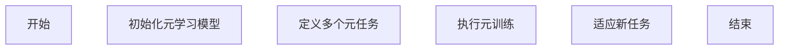
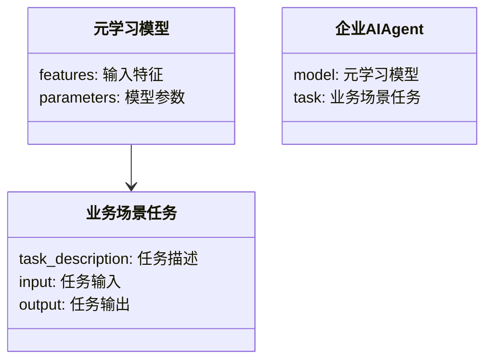
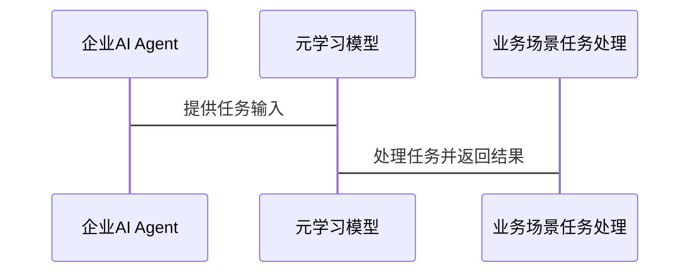

                 


# 企业AI Agent的元学习框架：快速适应新业务场景的能力培养

## 关键词：元学习，企业AI Agent，快速适应，业务场景，算法实现

## 摘要：  
本文详细探讨了企业AI Agent通过元学习框架快速适应新业务场景的能力培养。从元学习的基本概念到企业AI Agent的独特属性，再到元学习算法的实现和系统架构设计，文章层层深入，结合实际案例分析和代码实现，为企业AI Agent的快速部署和优化提供了全面的指导。

---

## 第一部分：企业AI Agent的元学习框架概述

### 第1章：元学习与企业AI Agent的背景介绍

#### 1.1 元学习的基本概念

##### 1.1.1 元学习的定义  
元学习（Meta-Learning）是一种机器学习方法，旨在让模型学会如何快速学习新任务。与传统机器学习不同，元学习不是针对单一任务进行优化，而是通过在多个任务上预训练，使得模型能够快速适应新任务。

##### 1.1.2 元学习的核心要素  
- **元学习模型**：用于执行具体任务的模型，如神经网络。  
- **元任务**：一组用于训练元学习模型的任务。  
- **元训练目标**：通过优化元任务，使模型具备快速适应新任务的能力。  

##### 1.1.3 元学习与传统机器学习的对比  
| 对比维度 | 传统机器学习 | 元学习 |
|----------|---------------|--------|
| 数据需求 | 需要大量任务特定数据 | 需要少量跨任务数据 |
| 适应性 | 适用于单一任务 | 适用于多任务快速适应 |
| 训练目标 | 优化单任务性能 | 优化跨任务适应能力 |

#### 1.2 企业AI Agent的定义与特点

##### 1.2.1 AI Agent的基本概念  
AI Agent是一种能够感知环境、采取行动以实现目标的智能体。它可以自主决策，通常用于解决复杂问题或执行特定任务。

##### 1.2.2 企业AI Agent的独特属性  
- **高度定制化**：针对企业特定需求设计。  
- **适应性强**：能够快速适应不同的业务场景。  
- **可扩展性**：支持多种任务和数据源。  

##### 1.2.3 企业AI Agent的应用场景  
- **客户服务**：自动化回答客户问题，处理订单。  
- **流程优化**：优化企业内部流程，提高效率。  
- **决策支持**：基于数据分析提供决策支持。  

#### 1.3 元学习在企业AI Agent中的重要性

##### 1.3.1 元学习的核心价值  
- 通过元学习，企业AI Agent可以在新业务场景中快速调整参数，减少对新数据的依赖。  
- 提高AI Agent的灵活性和适应性，使其能够快速应对市场变化。  

##### 1.3.2 元学习在企业AI Agent中的应用  
- 在客户服务中，元学习使AI Agent能够快速适应不同客户的问题类型。  
- 在流程优化中，元学习使AI Agent能够快速调整策略以应对变化。  

##### 1.3.3 元学习的挑战与未来趋势  
- **数据质量**：元学习需要高质量的跨任务数据。  
- **模型泛化能力**：如何提高模型在不同任务上的泛化能力是关键。  
- **计算资源需求**：元学习通常需要大量计算资源，未来可能会通过轻量化技术优化。  

### 第2章：元学习的核心概念与联系

#### 2.1 元学习的原理

##### 2.1.1 元学习的基本原理  
元学习的核心思想是通过在多个任务上预训练，使得模型能够快速适应新任务。具体来说，元学习模型在训练过程中优化其参数，使得在新任务上只需要少量数据即可快速调整参数，达到较好的性能。

##### 2.1.2 元学习的算法框架  
元学习算法可以分为两类：  
- **模型agnostic方法**：不依赖特定模型架构，适用于各种模型。  
- **基于神经网络的方法**：针对特定神经网络架构设计的元学习算法。  

##### 2.1.3 元学习的核心算法对比  
| 算法名称 | 描述 | 适用场景 |
|----------|------|----------|
| Meta-SGD | 基于梯度的元学习算法 | 适用于多种任务的快速适应 |
| MAML     | 基于神经网络的元学习算法 | 适用于图像分类、NLP等任务 |
| ReMAML   | 增量式元学习算法 | 适用于在线学习场景 |

#### 2.2 元学习与企业AI Agent的关系

##### 2.2.1 元学习在企业AI Agent中的角色  
元学习是实现企业AI Agent快速适应新任务的核心技术。通过元学习，企业AI Agent可以在新业务场景中快速调整参数，减少对新数据的依赖。

##### 2.2.2 元学习与企业业务场景的结合  
通过将企业业务需求融入元学习模型的设计和训练中，可以使得企业AI Agent更加符合实际业务需求。例如，在客户服务中，元学习可以使得AI Agent快速适应不同客户的问题类型。

##### 2.2.3 元学习在企业AI Agent中的具体应用  
- 在客户服务中，元学习使企业AI Agent能够快速适应不同客户的问题类型。  
- 在流程优化中，元学习使企业AI Agent能够快速调整策略以应对变化。  

#### 2.3 元学习的实体关系图

```mermaid
er
    Actor: 企业AI Agent
    Model: 元学习模型
    Task: 业务场景任务
    Relationship: 企业AI Agent -> Model: 使用元学习模型
    Relationship: Model -> Task: 适应业务场景
```

### 第3章：元学习的算法原理与实现

#### 3.1 元学习算法的流程



#### 3.2 元学习算法的数学模型

##### 3.2.1 元学习的优化目标  
元学习的目标是最小化元任务的损失，使得模型能够快速适应新任务。其优化目标可以表示为：  
$$ \min_{\theta} \sum_{i=1}^{N} \mathcal{L}_i(f_\theta(x_i, y_i)) $$  

##### 3.2.2 元学习的更新规则  
元学习的参数更新规则可以通过梯度下降实现：  
$$ \theta \leftarrow \theta - \eta \nabla_\theta \mathcal{L}_{\text{meta}} $$  

#### 3.3 元学习算法的代码实现

##### 3.3.1 元学习模型的定义  
```python
import torch
import torch.nn as nn

class MetaLearner(nn.Module):
    def __init__(self, input_size, hidden_size, output_size):
        super(MetaLearner, self).__init__()
        self.linear1 = nn.Linear(input_size, hidden_size)
        self.linear2 = nn.Linear(hidden_size, output_size)

    def forward(self, x):
        x = self.linear1(x)
        x = self.linear2(x)
        return x
```

##### 3.3.2 元学习的训练过程  
```python
def meta_train(model, optimizer, tasks, epochs):
    for epoch in range(epochs):
        optimizer.zero_grad()
        total_loss = 0
        for task in tasks:
            loss = task.compute_loss(model)
            total_loss += loss
        total_loss.backward()
        optimizer.step()
    return model
```

##### 3.3.3 元学习的适应过程  
```python
def meta_adapt(model, task, num_steps=5):
    for _ in range(num_steps):
        optimizer.zero_grad()
        loss = task.compute_loss(model)
        loss.backward()
        optimizer.step()
    return model
```

---

## 第二部分：系统分析与架构设计

### 第4章：企业AI Agent的系统分析

#### 4.1 企业AI Agent的应用场景  
企业AI Agent可以应用于客户服务、流程优化、决策支持等多个场景。例如，在客户服务中，企业AI Agent可以通过元学习快速适应不同客户的问题类型。

#### 4.2 元学习框架的功能设计  
- **任务识别**：识别需要适应的新任务。  
- **模型调整**：根据新任务调整元学习模型的参数。  
- **结果反馈**：将结果反馈给业务系统，优化后续操作。  

#### 4.3 系统的领域模型  


### 第5章：系统架构设计

#### 5.1 系统架构的总体设计  


#### 5.2 系统的接口设计  
- **元学习模型接口**：接受任务输入，返回调整后的模型。  
- **业务场景任务接口**：定义任务，获取结果。  

#### 5.3 系统的交互设计  


---

## 第三部分：项目实战

### 第6章：项目实战

#### 6.1 环境安装  
安装必要的库，如PyTorch、meta-learning库等。  

#### 6.2 核心代码实现  
```python
import torch
import torch.nn as nn
from torch.optim import Adam

class MetaLearner:
    def __init__(self, model, meta_lr=1e-3):
        self.model = model
        self.meta_optimizer = Adam(self.model.parameters(), lr=meta_lr)

    def meta_step(self, task_loss, inner_params, inner_step):
        # 计算梯度
        meta梯度 = torch.autograd.grad(task_loss, inner_params, retain_graph=True)
        # 更新元参数
        for p, g in zip(self.model.parameters(), meta梯度):
            p.grad = g
        self.meta_optimizer.step()
```

#### 6.3 案例分析与解读  
通过具体案例展示元学习框架在企业AI Agent中的应用效果，分析其优缺点及优化方向。

---

## 第四部分：最佳实践与总结

### 第7章：最佳实践与小结

#### 7.1 元学习框架的关键点  
- **算法选择**：根据具体任务选择合适的元学习算法。  
- **数据质量**：确保元任务数据的多样性和代表性。  
- **模型调优**：通过实验不断优化模型参数和架构。  

#### 7.2 实际应用中的注意事项  
- **数据多样性**：确保元任务数据涵盖多种业务场景。  
- **任务相关性**：选择与实际业务场景相关的元任务。  
- **计算资源需求**：元学习通常需要大量计算资源，需合理规划。  

#### 7.3 未来趋势与研究方向  
- **更高效的元学习算法**：开发更高效的元学习算法，减少计算资源需求。  
- **多任务学习的结合**：探索元学习与多任务学习的结合，提升模型的泛化能力。  
- **可解释性提升**：提高元学习模型的可解释性，便于企业理解和部署。  

---

## 总结  
通过本文的详细探讨，企业可以更好地理解如何利用元学习框架快速适应新业务场景。从算法原理到系统架构，再到项目实战，本文为企业AI Agent的部署和优化提供了全面的指导。未来，随着技术的不断发展，元学习将在企业AI Agent中发挥更大的作用，为企业带来更大的价值。

