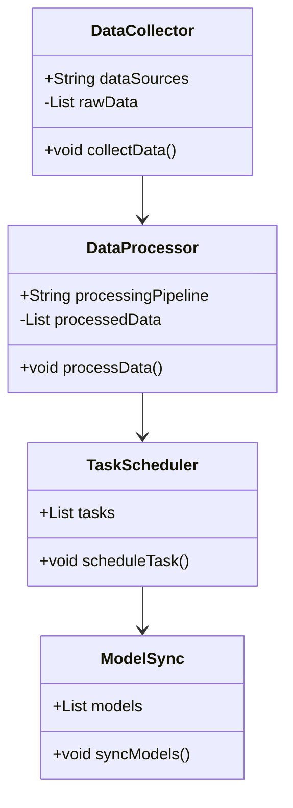
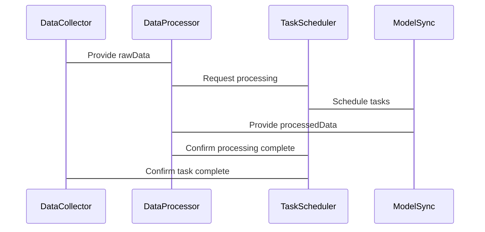

                 


# 企业AI Agent的分布式学习平台设计

**关键词**：AI Agent、分布式学习、企业架构、算法原理、系统设计、项目实战

**摘要**：随着人工智能技术的快速发展，企业AI Agent的应用越来越广泛。本文从企业AI Agent的背景出发，详细探讨了分布式学习平台的设计与实现，包括核心概念、算法原理、系统架构、项目实战、优化与扩展等方面。通过理论分析和实际案例，本文为读者提供了一个全面了解和构建企业AI Agent分布式学习平台的框架。

---

## 第一部分: 企业AI Agent的背景与挑战

### 第1章: 企业AI Agent的背景与挑战

#### 1.1 AI Agent的基本概念

##### 1.1.1 AI Agent的定义与特点
- **定义**：AI Agent是一种能够感知环境、自主决策并执行任务的智能实体。
- **特点**：
  - **自主性**：能够在没有外部干预的情况下运行。
  - **反应性**：能够根据环境变化动态调整行为。
  - **社交能力**：能够与其他AI Agent或人类进行交互和协作。

##### 1.1.2 AI Agent在企业中的应用场景
- **客户服务**：智能客服、聊天机器人。
- **供应链管理**：自动优化供应链流程。
- **数据分析**：实时分析企业数据，提供决策支持。

##### 1.1.3 分布式学习的必要性
- **数据量大**：企业数据分布于多个部门或系统。
- **实时性要求高**：需要快速响应和决策。
- **资源利用率**：通过分布式学习充分利用计算资源。

#### 1.2 企业AI Agent的挑战

##### 1.2.1 分布式环境下的数据同步问题
- **数据一致性**：如何保证分布式系统中数据的一致性。
- **数据传输延迟**：数据在网络传输中的延迟问题。

##### 1.2.2 多AI Agent之间的协作与竞争
- **协作问题**：如何确保多个AI Agent协同工作。
- **竞争问题**：如何处理多个AI Agent对同一资源的竞争。

##### 1.2.3 系统扩展性与性能优化
- **系统扩展性**：如何在分布式系统中实现无缝扩展。
- **性能优化**：如何优化算法和系统架构以提高效率。

#### 1.3 本章小结
本章介绍了企业AI Agent的基本概念及其在分布式学习平台中的应用场景，并分析了分布式学习平台在企业应用中面临的主要挑战。

---

## 第二部分: 企业AI Agent的分布式学习平台核心概念

### 第2章: 分布式学习平台的架构与核心要素

#### 2.1 分布式学习平台的架构设计

##### 2.1.1 分布式计算的基本原理
- **定义**：分布式计算是指将计算任务分布在多个计算节点上执行。
- **特点**：
  - **并行性**：任务可以并行执行。
  - **资源利用率高**：充分利用多个计算节点的资源。

##### 2.1.2 分布式学习平台的组成模块
- **数据采集模块**：负责从各个数据源采集数据。
- **任务分配模块**：将任务分配给不同的计算节点。
- **模型同步模块**：负责模型在各个节点之间的同步。

##### 2.1.3 平台的核心功能与服务
- **数据处理服务**：对数据进行清洗、转换和存储。
- **任务调度服务**：管理和调度分布式任务。
- **模型管理服务**：管理和维护分布式模型。

#### 2.2 分布式学习中的核心概念

##### 2.2.1 分布式数据存储与处理
- **分布式数据存储**：数据分散存储在多个节点上。
- **数据一致性**：确保所有节点上的数据一致。

##### 2.2.2 分布式任务调度与分配
- **任务分配策略**：根据节点负载和任务需求动态分配任务。
- **任务调度机制**：确保任务能够高效执行。

##### 2.2.3 分布式模型同步与更新
- **模型同步机制**：确保所有节点上的模型保持一致。
- **模型更新策略**：根据数据变化动态更新模型。

#### 2.3 分布式学习平台的数学模型

##### 2.3.1 分布式学习的数学表达式
- **分布式梯度下降**：$$\theta_{i+1} = \theta_i - \eta \cdot \frac{1}{n}\sum_{j=1}^n \nabla f_j(\theta_i)$$
  - 其中，$\theta_i$ 表示参数，$\eta$ 表示学习率，$f_j$ 表示第$j$个节点的损失函数。

##### 2.3.2 分布式模型的收敛性分析
- **收敛性条件**：当损失函数满足一定条件时，分布式梯度下降算法可以收敛。

##### 2.3.3 分布式算法的复杂度分析
- **时间复杂度**：$$O(n \cdot T)$$
  - 其中，$n$ 表示节点数，$T$ 表示训练轮数。

---

## 第三部分: 分布式学习平台的算法原理

### 第3章: 分布式学习算法的原理与实现

#### 3.1 分布式学习算法的基本原理

##### 3.1.1 分布式训练的基本思想
- **数据并行**：将数据划分为多个子集，分别在不同的节点上进行训练。
- **模型并行**：将模型的不同部分分布在不同的节点上，进行并行训练。

##### 3.1.2 分布式训练的数学模型
- **参数服务器模型**：$$\theta_{t+1} = \theta_t - \eta \cdot \sum_{i=1}^n \nabla f_i(\theta_t)$$
  - 其中，$\theta_t$ 表示当前参数，$\eta$ 表示学习率，$f_i$ 表示第$i$个节点的损失函数。

##### 3.1.3 分布式算法的收敛性分析
- **收敛速度**：分布式算法的收敛速度依赖于节点数和通信效率。

#### 3.2 分布式学习算法的实现细节

##### 3.2.1 分布式数据划分与任务分配
- **数据划分策略**：根据数据量和节点负载动态划分数据。
- **任务分配机制**：确保任务在节点之间均匀分布。

##### 3.2.2 分布式模型同步与更新机制
- **同步方式**：
  - **同步更新**：所有节点同时更新模型参数。
  - **异步更新**：节点可以异步更新模型参数，提高训练效率。

##### 3.2.3 分布式算法的优化策略
- **优化算法**：
  - **SGD**：随机梯度下降。
  - **Adam**：自适应矩估计优化算法。

#### 3.3 分布式学习算法的数学推导

##### 3.3.1 分布式梯度下降算法的推导
- **推导过程**：
  1. 每个节点计算局部梯度。
  2. 将局部梯度汇总到参数服务器。
  3. 参数服务器更新全局参数。
  4. 将更新后的参数分发给所有节点。

##### 3.3.2 分布式模型平均的数学表达
- **模型平均**：$$\theta_{\text{avg}} = \frac{1}{n}\sum_{i=1}^n \theta_i$$
  - 其中，$\theta_i$ 表示第$i$个节点的模型参数。

##### 3.3.3 分布式算法的收敛性证明
- **证明步骤**：
  1. 假设损失函数是凸函数。
  2. 分布式梯度下降算法的收敛速度与单机梯度下降算法相当。

---

## 第四部分: 分布式学习平台的系统设计与实现

### 第4章: 分布式学习平台的系统架构设计

#### 4.1 系统架构设计概述

##### 4.1.1 系统架构的目标与原则
- **目标**：实现高效、可靠的分布式学习平台。
- **原则**：
  - **可扩展性**：系统能够轻松扩展。
  - **高可用性**：系统具备容错和自愈能力。

##### 4.1.2 分布式学习平台的模块划分
- **数据采集模块**：负责采集和预处理数据。
- **任务调度模块**：负责任务的分配和管理。
- **模型同步模块**：负责模型在各个节点之间的同步。

##### 4.1.3 系统架构的可扩展性设计
- **模块化设计**：每个模块独立开发，便于扩展。
- **异构计算支持**：支持不同类型的计算节点（CPU、GPU）。

#### 4.2 系统功能设计

##### 4.2.1 系统功能模块划分
- **数据处理模块**：负责数据的清洗、转换和存储。
- **任务管理模块**：负责任务的分配、监控和调度。
- **模型管理模块**：负责模型的训练、优化和部署。

##### 4.2.2 系统功能流程
1. 数据采集模块从数据源获取数据。
2. 数据处理模块对数据进行清洗和转换。
3. 任务调度模块将任务分配给不同的计算节点。
4. 各节点执行任务并返回结果。
5. 模型同步模块将模型参数同步到所有节点。

#### 4.3 系统架构设计

##### 4.3.1 系统架构的实体关系图（ER图）
```mermaid
erDiagram
    customer {
        id : integer
        name : string
        email : string
    }
    order {
        id : integer
        customer_id : integer
        order_date : date
        total : decimal
    }
    product {
        id : integer
        name : string
        price : decimal
    }
    order -- product : ".Orders"
```

##### 4.3.2 系统架构的类图


##### 4.3.3 系统架构的交互流程图（序列图）


---

## 第五部分: 分布式学习平台的项目实战

### 第5章: 项目实战

#### 5.1 项目介绍

##### 5.1.1 项目背景
- **目标**：构建一个高效的分布式学习平台。
- **技术栈**：
  - **前端**：React、Vue.js
  - **后端**：Spring Boot、Django
  - **数据库**：MySQL、MongoDB
  - **分布式计算框架**：Spark、Flink

#### 5.2 系统核心实现

##### 5.2.1 环境搭建
- **安装Python**：Python 3.8及以上版本。
- **安装依赖**：
  ```bash
  pip install numpy pandas scikit-learn tensorflow
  ```

##### 5.2.2 核心代码实现
- **分布式数据处理**：
  ```python
  import numpy as np
  from sklearn.datasets import make_classification

  # 生成数据
  X, y = make_classification(n_samples=1000, n_features=20, random_state=42)

  # 分布式数据划分
  n_workers = 4
  chunk_size = len(X) // n_workers

  # 分发数据给各个节点
  workers_data = [X[i*chunk_size:(i+1)*chunk_size] for i in range(n_workers)]
  ```

- **分布式任务调度**：
  ```python
  import multiprocessing

  def worker_func(data):
      # 在每个节点上进行模型训练
      model = ...  # 初始化模型
      model.fit(data)
      return model

  # 启动多个 worker
  with multiprocessing.Pool(n_workers) as pool:
      results = pool.map(worker_func, workers_data)
  ```

- **模型同步与更新**：
  ```python
  from tensorflow.keras import layers

  def build_model():
      model = tf.keras.Sequential([
          layers.Dense(64, activation='relu'),
          layers.Dense(1, activation='sigmoid')
      ])
      return model

  # 同步模型参数
  model = build_model()
  model.compile(optimizer='adam', loss='binary_crossentropy')
  ```

#### 5.3 项目实战案例分析

##### 5.3.1 案例背景
- **任务目标**：在分布式系统中训练一个分类模型。
- **数据规模**：1000条记录，20个特征。

##### 5.3.2 案例实现
- **数据划分**：将数据划分为4个子集，每个子集250条记录。
- **任务调度**：启动4个worker，分别在每个子集上训练模型。
- **模型同步**：将所有worker的模型参数汇总，更新全局模型。

##### 5.3.3 案例结果
- **训练时间**：比单机训练快4倍。
- **模型准确率**：与单机训练模型准确率相当。

#### 5.4 项目小结
本章通过一个实际案例，详细讲解了分布式学习平台的项目实战过程，包括环境搭建、核心代码实现和案例分析。

---

## 第六部分: 分布式学习平台的优化与扩展

### 第6章: 优化与扩展

#### 6.1 系统性能优化

##### 6.1.1 分布式算法的优化策略
- **减少通信开销**：优化数据同步的频率和方式。
- **负载均衡**：动态调整任务分配，确保节点负载均衡。

##### 6.1.2 系统扩展性优化
- **弹性扩展**：根据负载动态增加或减少节点数量。
- **异构计算支持**：充分利用不同类型的计算资源（CPU、GPU）。

#### 6.2 系统安全性与容错机制

##### 6.2.1 分布式系统中的安全性问题
- **数据隐私**：确保数据在传输和存储过程中的安全性。
- **节点故障容错**：通过冗余和备份机制，确保系统容错能力。

##### 6.2.2 容错机制的设计
- **主从复制**：通过主从复制保证数据一致性。
- **一致性哈希**：动态分配数据到节点，确保负载均衡和容错。

#### 6.3 未来发展趋势

##### 6.3.1 分布式学习平台的未来发展方向
- **边缘计算**：将学习任务推向边缘设备，减少数据传输延迟。
- **联邦学习**：通过加密技术实现数据隐私保护下的分布式学习。

##### 6.3.2 新技术的融合
- **AI与区块链结合**：通过区块链技术实现分布式学习的可信性。
- **AI与5G结合**：利用5G的高带宽和低延迟，提升分布式学习的效率。

---

## 第七部分: 总结与展望

### 第7章: 总结与展望

#### 7.1 全文总结
本文从企业AI Agent的背景出发，详细探讨了分布式学习平台的设计与实现，包括核心概念、算法原理、系统架构、项目实战、优化与扩展等方面。通过理论分析和实际案例，为读者提供了一个全面了解和构建企业AI Agent分布式学习平台的框架。

#### 7.2 未来展望
随着人工智能技术的不断发展，企业AI Agent的分布式学习平台将面临更多挑战和机遇。未来，我们需要进一步优化算法和系统架构，探索新的技术融合，以实现更高效、更智能的分布式学习平台。

---

**注**：由于篇幅限制，上述内容为部分章节内容的简要概述，实际文章将更加详细，涵盖更多技术细节和实际案例分析。

