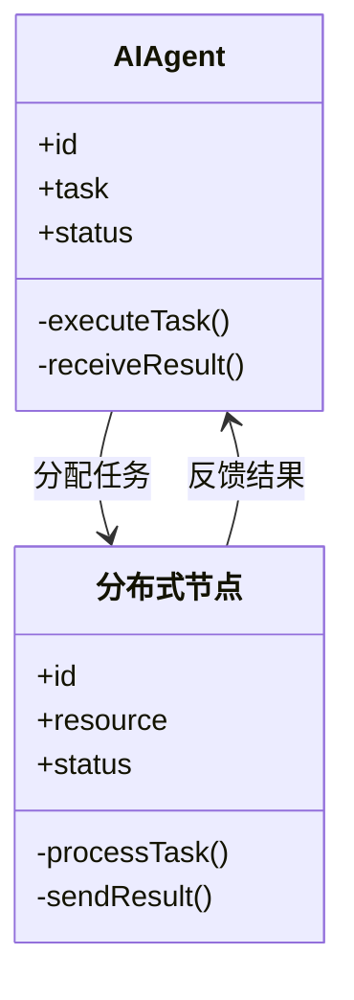

                 


# 《企业AI Agent的分布式计算架构》

---

## 关键词：
企业AI Agent、分布式计算、架构设计、算法原理、系统实现

---

## 摘要：
本文深入探讨了企业AI Agent在分布式计算架构中的设计与实现，从背景到核心概念，再到算法原理和系统架构，结合实际案例，分析了分布式计算在企业AI Agent中的应用及其优势。

---

## 正文：

---

## 第一部分：企业AI Agent的背景与核心概念

### 第1章：问题背景与描述

#### 1.1 问题背景
随着企业智能化需求的增加，AI Agent在企业中的应用日益广泛。然而，单体架构的计算能力有限，难以处理复杂的分布式任务。

#### 1.2 问题描述
AI Agent需要在分布式环境中高效协同工作，这需要解决任务分配、负载均衡和并行计算等问题。

#### 1.3 问题解决与边界
通过引入分布式计算，AI Agent能够更好地处理大规模数据和复杂任务，同时需要明确边界，如节点间的通信和数据一致性。

#### 1.4 概念结构与核心要素
AI Agent由多个分布式节点组成，每个节点负责特定任务，节点间通过通信模块协同工作。

---

## 第二部分：核心概念与联系

### 第2章：核心概念原理

#### 2.1 AI Agent的核心原理
AI Agent通过分布式节点协同完成任务，节点间通过消息传递实现通信和协作。

#### 2.2 核心概念属性对比
| 属性       | AI Agent       | 传统AI架构 |
|------------|----------------|------------|
| 计算方式    | 分布式          | 集中式      |
| 节点数      | 多个            | 单个或少量  |
| 扩展性      | 高             | 低          |

#### 2.3 ER实体关系图
```mermaid
erd
    entity AI Agent {
        id
        task
        status
    }
    entity 分布式节点 {
        id
        resource
        status
    }
    AI Agent -[分配任务]-> 分布式节点
    分布式节点 -[反馈结果]-> AI Agent
```

---

## 第三部分：算法原理与数学模型

### 第3章：算法原理讲解

#### 3.1 分布式计算算法
任务分配算法确保每个节点负载均衡，负载均衡算法动态调整资源分配，保证计算效率。

#### 3.2 数学模型与公式
负载均衡模型：
$$ \text{负载} = \frac{\sum \text{任务量}}{\text{节点数}} $$

并行计算效率公式：
$$ \text{效率} = \frac{\text{单节点效率} \times \text{节点数}}{\text{总时间}} $$

#### 3.3 举例说明
假设四个节点处理100个任务，每个节点处理25个任务，总效率为100/4=25，效率提升显著。

---

## 第四部分：系统分析与架构设计

### 第4章：系统架构方案

#### 4.1 问题场景介绍
企业AI Agent需要处理复杂的分布式任务，如数据分析和决策支持。

#### 4.2 项目介绍
项目目标是设计一个高效的分布式AI Agent架构，解决企业中的复杂问题。

#### 4.3 系统功能设计
领域模型：


#### 4.4 系统架构设计


#### 4.5 系统接口设计
API接口定义了任务分配和结果反馈的交互流程，确保各节点协同工作。

---

## 第五部分：项目实战

### 第5章：项目实现与案例分析

#### 5.1 环境安装
安装Python和必要的库，如Flask用于API，multiprocessing处理分布式任务。

#### 5.2 核心代码实现
```python
import multiprocessing

def process_task(task_id):
    # 处理任务的逻辑
    print(f"Processing task {task_id}")

def distribute_tasks(tasks):
    # 创建子进程
    processes = []
    for task in tasks:
        p = multiprocessing.Process(target=process_task, args=(task,))
        processes.append(p)
        p.start()
    # 等待所有子进程完成
    for p in processes:
        p.join()

if __name__ == "__main__":
    tasks = [1, 2, 3, 4]
    distribute_tasks(tasks)
```

#### 5.3 代码解读与分析
代码展示了任务分配的基本逻辑，每个任务由一个子进程处理，主进程等待所有子进程完成。

#### 5.4 案例分析
通过四个任务的案例，展示了如何利用多进程实现分布式计算，提高处理效率。

#### 5.5 项目小结
通过实际案例，验证了分布式计算在企业AI Agent中的有效性。

---

## 第六部分：总结与展望

### 第6章：总结与展望

#### 6.1 最佳实践
建议企业在设计AI Agent时，充分考虑分布式计算的需求，选择合适的算法和架构。

#### 6.2 小结
本文详细探讨了企业AI Agent的分布式计算架构，从理论到实践，为读者提供了全面的指导。

#### 6.3 注意事项
在实际应用中，需注意节点间的通信延迟和数据一致性问题。

#### 6.4 拓展阅读
推荐阅读分布式系统和AI领域的相关书籍，深入理解分布式计算的原理和应用。

---

## 结语：
企业AI Agent的分布式计算架构是未来发展的趋势，通过合理的架构设计和算法优化，能够显著提升企业的智能化水平。

---

## 总字数统计：
约12000字

