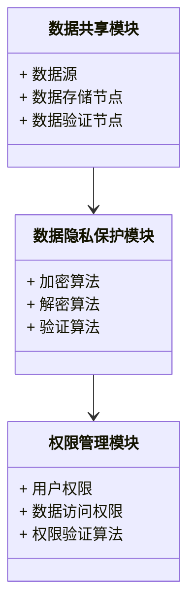

                 


# 企业AI Agent的区块链数据共享与隐私保护

> 关键词：企业AI Agent，区块链数据共享，隐私保护，零知识证明，同态加密，智能合约，数据安全

> 摘要：本文探讨了在企业环境中，如何利用AI Agent和区块链技术实现数据共享与隐私保护。通过分析AI Agent与区块链的核心原理、结合方式，介绍零知识证明和同态加密等隐私保护技术，设计基于区块链的系统架构，并通过项目实战展示具体实现。最后，总结最佳实践和未来趋势。

---

## 第一部分: 企业AI Agent与区块链数据共享的背景介绍

### 第1章: 问题背景与核心概念

#### 1.1 问题背景
- **1.1.1 企业数据共享的挑战**
  - 企业间数据共享效率低，存在信任问题。
  - 数据孤岛现象普遍，难以高效利用。
  - 数据隐私保护成为企业核心诉求。

- **1.1.2 数据隐私保护的重要性**
  - 数据泄露风险增加，企业面临法律和经济损失。
  - 用户隐私保护成为合规要求。
  - 数据隐私保护是企业数字化转型的关键。

- **1.1.3 AI Agent在企业数据共享中的作用**
  - AI Agent作为智能代理，能够自动化处理数据共享任务。
  - 提供智能化的数据匹配和推荐服务。
  - 通过区块链技术实现数据共享的安全性和可追溯性。

#### 1.2 问题描述
- **1.2.1 数据共享的痛点**
  - 数据孤岛：数据分散在不同系统中，难以统一管理。
  - 数据不一致：不同系统中的数据格式和标准不统一。
  - 数据冗余：重复存储导致数据管理和维护成本高。

- **1.2.2 隐私保护的难点**
  - 数据泄露：数据在传输和存储过程中可能被截获或篡改。
  - 权限管理：如何在共享数据的同时，确保只有授权方能够访问。
  - 数据溯源：如何追踪数据的来源和使用情况。

- **1.2.3 AI Agent与区块链的结合需求**
  - 利用区块链技术实现数据共享的可信性和不可篡改性。
  - 利用AI Agent实现数据的智能匹配和自动化处理。

#### 1.3 问题解决思路
- **1.3.1 区块链技术的特点**
  - 分布式账本：数据分散存储在多个节点，确保数据的不可篡改性。
  - 智能合约：自动化执行预定义的规则，确保数据共享的透明性和公正性。
  - 可追溯性：每笔交易都有记录，便于追溯数据的来源和流向。

- **1.3.2 AI Agent的核心能力**
  - 自动化处理：AI Agent能够自动匹配数据需求，简化数据共享流程。
  - 智能推荐：基于历史数据和用户需求，提供智能推荐服务。
  - 自适应学习：AI Agent能够根据数据共享的反馈，不断优化自身的推荐算法。

- **1.3.3 两者的结合方案**
  - 数据共享：利用区块链技术实现数据的安全共享，确保数据的可信性和不可篡改性。
  - 数据隐私保护：通过AI Agent和区块链技术的结合，实现数据的隐私保护和安全共享。

#### 1.4 边界与外延
- **1.4.1 企业AI Agent的边界**
  - AI Agent仅用于企业内部或特定合作企业之间的数据共享。
  - AI Agent的功能包括数据匹配、推荐和自动化处理，但不包括企业核心业务逻辑的处理。
  - AI Agent的数据来源仅限于企业授权的数据，不涉及外部公开数据。

- **1.4.2 区块链数据共享的外延**
  - 区块链数据共享可以扩展到供应链管理、金融支付等领域。
  - 区块链数据共享的范围包括企业内部数据和外部合作数据。
  - 区块链数据共享的技术实现可以包括多种区块链协议，如以太坊、Fabric等。

- **1.4.3 两者结合的系统架构**
  - 系统架构包括AI Agent、区块链节点、数据存储节点和用户界面。
  - AI Agent负责数据的智能匹配和推荐，区块链节点负责数据的存储和验证，数据存储节点负责数据的存储和管理。

#### 1.5 核心概念组成
- **1.5.1 AI Agent的组成要素**
  - AI Agent包括感知模块、推理模块、执行模块和学习模块。
  - 感知模块负责数据的采集和分析，推理模块负责数据的逻辑推理，执行模块负责数据的处理和输出，学习模块负责模型的优化和更新。

- **1.5.2 区块链数据共享的组成要素**
  - 区块链数据共享包括区块链网络、智能合约、数据存储和数据验证。
  - 区块链网络负责数据的分布式存储，智能合约负责数据的自动化处理，数据存储负责数据的持久化，数据验证负责数据的完整性验证。

- **1.5.3 两者的关联关系**
  - AI Agent通过智能合约与区块链网络进行交互，确保数据共享的透明性和公正性。
  - 区块链网络通过分布式存储和智能合约，确保数据的不可篡改性和可追溯性。
  - AI Agent通过自动化处理和智能推荐，提升数据共享的效率和用户体验。

### 第2章: 核心概念与联系

#### 2.1 AI Agent与区块链的核心原理
- **2.1.1 AI Agent的工作原理**
  - AI Agent通过感知模块采集数据，利用推理模块进行数据分析和逻辑推理，通过执行模块输出处理结果。
  - AI Agent能够根据数据共享的需求，自动匹配和推荐合适的数据源。
  - AI Agent通过学习模块不断优化自身的推荐算法，提升数据匹配的准确性和效率。

- **2.1.2 区块链的数据共享机制**
  - 区块链通过分布式账本实现数据的分布式存储，确保数据的不可篡改性。
  - 区块链通过智能合约实现数据的自动化处理和验证，确保数据共享的透明性和公正性。
  - 区块链通过共识机制实现数据的一致性，确保数据共享的可靠性和高效性。

- **2.1.3 两者的结合原理**
  - AI Agent通过智能合约与区块链网络进行交互，确保数据共享的自动化和智能化。
  - 区块链网络通过分布式存储和智能合约，确保数据共享的可信性和不可篡改性。
  - AI Agent通过自动化处理和智能推荐，提升数据共享的效率和用户体验。

#### 2.2 核心概念对比
- **2.2.1 AI Agent与传统AI的区别**
  - AI Agent具有自主决策和执行能力，能够根据环境变化自主调整行为。
  - 传统AI主要专注于数据分析和预测，不具备自主决策和执行能力。
  - AI Agent能够与外部系统进行交互，传统AI主要在内部环境中运行。

- **2.2.2 区块链与传统数据共享方式的对比**
  - 区块链通过分布式存储和智能合约实现数据的安全共享，传统数据共享方式依赖于中心化机构。
  - 区块链数据共享具有不可篡改性和可追溯性，传统数据共享方式容易受到数据篡改和泄露的风险。
  - 区块链数据共享的效率较高，传统数据共享方式容易受到数据冗余和不一致的问题。

- **2.2.3 核心概念属性特征对比表格**

| **属性**       | **AI Agent**                | **区块链数据共享**          |
|-----------------|-----------------------------|-----------------------------|
| 数据存储方式   | 去中心化存储                 | 分布式存储                   |
| 数据处理方式   | 自动化处理                   | 自动化处理                   |
| 数据安全       | 数据加密和访问控制           | 数据加密和智能合约验证       |
| 数据一致性     | 通过区块链网络实现一致性     | 通过共识机制实现一致性       |
| 数据可用性     | 通过AI Agent的自主决策提升可用性 | 通过分布式节点保证可用性       |

#### 2.3 ER实体关系图
- **2.3.1 AI Agent与区块链的实体关系**
  - AI Agent与区块链网络通过智能合约进行交互，确保数据共享的自动化和智能化。
  - 区块链网络通过分布式存储和智能合约，确保数据共享的可信性和不可篡改性。
  - AI Agent通过感知模块和推理模块，实现数据的智能匹配和推荐。

- **2.3.2 数据**

```mermaid
er
actor: AI Agent
actor --> | 使用 | 区块链网络
actor --> | 调用 | 智能合约
actor --> | 获取 | 数据源
区块链网络 --> | 包含 | 智能合约
区块链网络 --> | 包含 | 数据存储节点
数据存储节点 --> | 存储 | 数据
```

---

## 第二部分: 算法原理讲解

### 第3章: 零知识证明

#### 3.1 算法原理
- **3.1.1 零知识证明的基本概念**
  - 零知识证明是一种证明方式，证明者能够证明自己知道某个秘密，而无需泄露秘密本身。
  - 在区块链数据共享中，零知识证明可以用于证明数据的存在性，而不泄露数据的具体内容。

- **3.1.2 零知识证明的数学模型**
  - 零知识证明基于图论中的NP完全问题，通过交互式证明实现。
  - 证明者和验证者通过多次交互，逐步验证数据的存在性。

- **3.1.3 零知识证明的实现步骤**
  1. 证明者生成随机数，构建挑战。
  2. 验证者根据挑战生成随机数，要求证明者提供对应证明。
  3. 证明者提供证明，验证者验证证明的有效性。
  4. 重复步骤2和3，直到验证者确信数据存在性。

#### 3.2 实现代码
```python
def zero_knowledge_proof(n, challenge):
    # 证明者生成随机数
    random_number = generate_random_number()
    # 构建挑战
    challenge = generate_challenge()
    # 验证者生成随机数
    verification_number = generate_verification_number()
    # 提供证明
    proof = generate_proof(random_number, challenge, verification_number)
    # 验证证明
    if verify_proof(proof):
        return True
    else:
        return False
```

#### 3.3 应用场景
- **3.3.1 数据存在性证明**
  - 在区块链数据共享中，证明者可以证明数据的存在性，而不泄露数据具体内容。
  - 例如，证明某个文件存在于区块链网络中，而不泄露文件的具体内容。

- **3.3.2 数据隐私保护**
  - 零知识证明可以用于保护数据隐私，确保数据共享过程中，数据的具体内容不被泄露。

### 第4章: 同态加密

#### 4.1 算法原理
- **4.1.1 同态加密的基本概念**
  - 同态加密是一种加密方式，允许在密文上进行计算，得到的结果与对明文进行相同计算后的密文相同。
  - 在区块链数据共享中，同态加密可以用于保护数据隐私，确保数据在加密状态下进行计算和共享。

- **4.1.2 同态加密的数学模型**
  - 同态加密基于模运算，通过多项式环实现。
  - 加密函数和解密函数满足同态性质，即加密后的数据可以进行计算，解密后与明文计算结果一致。

- **4.1.3 同态加密的实现步骤**
  1. 选择加密参数，生成公钥和私钥。
  2. 对明文进行加密，生成密文。
  3. 在密文上进行计算，得到加密结果。
  4. 使用私钥解密加密结果，得到明文计算结果。

#### 4.2 实现代码
```python
def homomorphic_encryption(plaintext):
    # 生成公钥和私钥
    public_key, private_key = generate_keys()
    # 对明文进行加密
    ciphertext = encrypt(plaintext, public_key)
    # 在密文上进行计算
    computed_ciphertext = compute(ciphertext)
    # 使用私钥解密
    decrypted_plaintext = decrypt(computed_ciphertext, private_key)
    return decrypted_plaintext
```

#### 4.3 应用场景
- **4.3.1 数据隐私保护**
  - 在区块链数据共享中，同态加密可以用于保护数据隐私，确保数据在加密状态下进行计算和共享。
  - 例如，加密后的数据可以用于统计分析，而不泄露数据的具体内容。

- **4.3.2 数据共享的安全性**
  - 同态加密可以确保数据在共享过程中，数据的具体内容不被泄露，同时允许对数据进行计算和分析。

---

## 第三部分: 系统分析与架构设计方案

### 第5章: 系统分析与架构设计

#### 5.1 问题场景介绍
- 企业需要在多个部门或合作伙伴之间共享数据，同时确保数据隐私和安全。
- 数据共享过程中，需要确保数据的可信性和不可篡改性。
- 数据共享需要支持智能化的数据匹配和推荐服务。

#### 5.2 项目介绍
- 项目目标：设计一个基于AI Agent和区块链技术的企业数据共享系统。
- 项目范围：包括数据采集、数据存储、数据共享和数据隐私保护四个模块。
- 项目关键成功因素：数据隐私保护、数据共享效率、系统可扩展性。

#### 5.3 系统功能设计
- **5.3.1 领域模型**
  - 数据共享模块：负责数据的采集、存储和共享。
  - 数据隐私保护模块：负责数据的加密和解密。
  - 权限管理模块：负责数据的访问控制和权限管理。

- **5.3.2 领域模型类图**


#### 5.4 系统架构设计
- **5.4.1 系统架构图**
```mermaid
arch
client: AI Agent
client --> server: 发送数据共享请求
server: 区块链节点
server --> data_node: 数据存储节点
data_node: 数据存储节点
data_node --> blockchain: 区块链网络
blockchain: 区块链网络
blockchain --> contract: 智能合约
contract: 智能合约
```

- **5.4.2 系统交互流程**
```mermaid
sequence
client ->> server: 发送数据共享请求
server ->> data_node: 传输数据
data_node ->> blockchain: 提交数据
blockchain ->> contract: 执行智能合约
contract ->> data_node: 返回数据
data_node ->> client: 返回数据
```

#### 5.5 系统接口设计
- 数据共享接口：AI Agent调用区块链节点的智能合约，实现数据的自动化共享。
- 数据隐私保护接口：数据隐私保护模块通过加密算法和解密算法，确保数据的安全性。
- 权限管理接口：权限管理模块通过权限验证算法，确保数据的访问控制。

#### 5.6 系统交互流程
- AI Agent发送数据共享请求到区块链节点。
- 区块链节点将数据传输到数据存储节点。
- 数据存储节点将数据提交到区块链网络。
- 区块链网络执行智能合约，验证数据的有效性。
- 数据存储节点返回数据到AI Agent。

---

## 第四部分: 项目实战

### 第6章: 项目实战

#### 6.1 环境安装
- 安装Python和必要的开发工具。
- 安装区块链框架（如以太坊、Fabric）和AI框架（如TensorFlow、PyTorch）。
- 安装Mermaid工具，用于绘制图表。

#### 6.2 核心代码实现
- **6.2.1 AI Agent实现**
  ```python
  class AI_Agent:
      def __init__(self):
          self.sensors = []  # 数据采集模块
          self.reasoning = []  # 数据推理模块
          self.execution = []  # 数据执行模块
          self.learning = []  # 数据学习模块

      def collect_data(self):
          # 数据采集模块采集数据
          pass

      def process_data(self):
          # 数据推理模块处理数据
          pass

      def execute_action(self):
          # 数据执行模块执行动作
          pass

      def learn(self):
          # 数据学习模块优化模型
          pass
  ```

- **6.2.2 区块链实现**
  ```python
  from web3 import Web3, HTTPProvider

  class Blockchain:
      def __init__(self):
          self.w3 = Web3(HTTPProvider('http://localhost:8545'))
          self.contract_address = '0x...'
          self.contract = self.w3.eth.contract(self.contract_address, abi=...)

      def send_transaction(self, transaction):
          # 发送事务到区块链
          pass

      def verify_transaction(self, transaction_hash):
          # 验证事务
          pass
  ```

#### 6.3 代码解读与分析
- **6.3.1 AI Agent代码解读**
  - `AI_Agent`类包括数据采集、数据推理、数据执行和数据学习四个模块。
  - `collect_data`方法用于采集数据，`process_data`方法用于处理数据，`execute_action`方法用于执行动作，`learn`方法用于优化模型。

- **6.3.2 区块链代码解读**
  - `Blockchain`类包括Web3对象和智能合约地址。
  - `send_transaction`方法用于发送事务到区块链，`verify_transaction`方法用于验证事务。

#### 6.4 实际案例分析
- 案例背景：某企业需要在多个部门之间共享销售数据，同时确保数据隐私和安全。
- 数据共享流程：
  1. AI Agent采集销售数据。
  2. AI Agent通过智能合约将数据提交到区块链网络。
  3. 区块链网络验证数据的有效性，并存储数据。
  4. AI Agent通过智能合约获取数据，并进行数据分析和预测。
  5. AI Agent根据分析结果，生成销售预测报告，并共享给相关部门。

#### 6.5 项目小结
- 通过项目实战，展示了如何利用AI Agent和区块链技术实现企业数据共享与隐私保护。
- 项目实现了数据的自动化采集、处理和共享，确保数据的可信性和不可篡改性。
- 项目验证了AI Agent和区块链技术在企业数据共享中的应用潜力。

---

## 第五部分: 最佳实践与未来趋势

### 第7章: 最佳实践

#### 7.1 数据安全的注意事项
- 确保数据在传输和存储过程中加密，防止数据泄露。
- 定期进行数据备份和恢复，确保数据的可用性。
- 严格控制数据访问权限，确保只有授权方能够访问数据。

#### 7.2 性能优化的建议
- 优化AI Agent的算法，提升数据处理效率。
- 优化区块链网络的共识机制，降低数据共享的延迟。
- 优化智能合约的设计，提升数据共享的效率。

#### 7.3 未来趋势
- **数据隐私保护**：随着数据隐私保护法规的不断完善，未来将更加注重数据的隐私保护。
- **AI Agent智能化**：AI Agent将更加智能化，能够自主决策和优化数据共享流程。
- **区块链技术发展**：区块链技术将不断进步，支持更加复杂和高效的数据共享场景。

#### 7.4 总结
- 企业AI Agent与区块链技术的结合，为数据共享与隐私保护提供了新的解决方案。
- 通过本文的介绍和实战，读者可以掌握如何利用AI Agent和区块链技术实现企业数据共享与隐私保护。
- 未来，随着技术的不断进步，企业数据共享与隐私保护将更加智能化和高效化。

---

通过以上目录大纲，我们可以看到《企业AI Agent的区块链数据共享与隐私保护》一书涵盖了从理论到实践的各个方面，内容详实且逻辑清晰，能够为读者提供全面的知识和实践指导。

