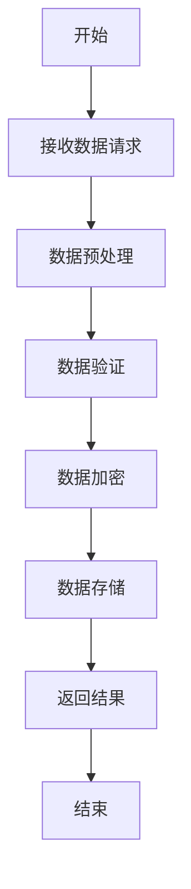
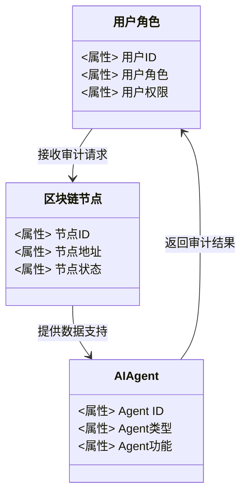
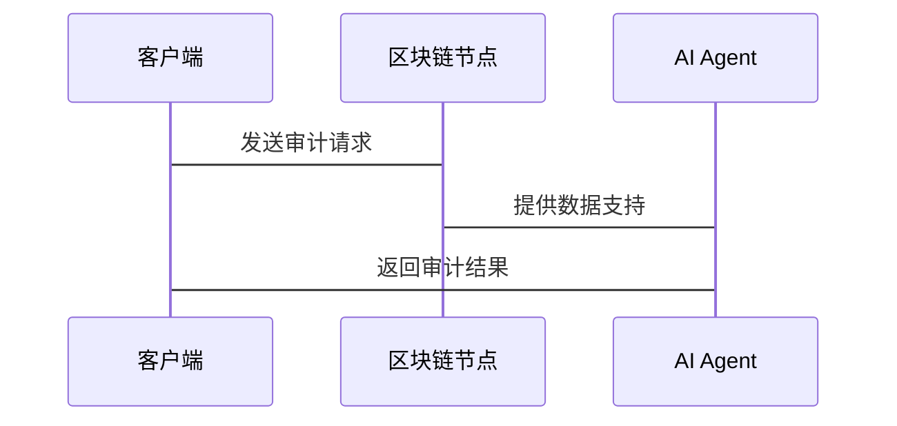

                 


# 企业AI Agent的区块链数据审计系统

## 关键词：区块链、数据审计、AI Agent、智能合约、数据安全

## 摘要：本文探讨了企业AI Agent在区块链数据审计中的应用，分析了区块链技术如何解决数据审计问题，并详细介绍了AI Agent与区块链技术的结合原理、系统架构设计及实际应用案例。

---

# 第一部分: 企业AI Agent的区块链数据审计系统概述

## 第1章: 企业AI Agent的区块链数据审计系统背景

### 1.1 问题背景与挑战

#### 1.1.1 企业数据审计的核心问题
企业数据审计的核心问题在于数据的真实性和完整性。传统数据审计方式依赖于人工检查，效率低下且容易受到主观因素的影响。此外，数据在传输和存储过程中可能被篡改或丢失，导致审计结果的不可靠性。

#### 1.1.2 区块链技术在数据审计中的应用价值
区块链技术以其分布式账本、不可篡改和可追溯的特性，为数据审计提供了新的解决方案。通过区块链，数据的每一次修改都会被记录，确保数据的完整性和可追溯性。

#### 1.1.3 AI Agent在数据审计中的独特优势
AI Agent（智能代理）能够自动化执行任务，通过机器学习算法对数据进行分析和预测，帮助发现潜在的异常和欺诈行为，提高数据审计的效率和准确性。

### 1.2 问题描述与目标

#### 1.2.1 数据审计的主要问题
- 数据篡改：数据在传输和存储过程中可能被非法篡改。
- 数据丢失：数据在存储或传输过程中可能丢失，影响审计结果。
- 审计效率：传统人工审计效率低下，难以应对海量数据。

#### 1.2.2 区块链技术如何解决数据审计问题
区块链通过分布式存储和不可篡改的特性，确保数据的真实性和完整性，为数据审计提供了可靠的基础。

#### 1.2.3 AI Agent在数据审计中的具体目标
AI Agent的目标是通过自动化数据分析，识别数据中的异常和潜在风险，辅助审计人员快速定位问题。

### 1.3 解决方案与边界

#### 1.3.1 系统的整体解决方案
通过结合区块链技术和AI Agent，构建一个高效、可靠的企业数据审计系统，实现数据的实时监控和智能分析。

#### 1.3.2 系统的边界与外延
系统主要关注企业内部数据的审计，不涉及外部数据。系统边界包括数据的生成、传输、存储和销毁过程。

#### 1.3.3 核心概念与组成部分
系统由区块链节点、AI Agent、数据源和审计人员组成，通过智能合约实现数据的自动验证和分析。

---

## 第2章: AI Agent与区块链数据审计的核心概念

### 2.1 核心概念原理

#### 2.1.1 AI Agent的基本原理
AI Agent通过机器学习算法对数据进行分析，识别异常和潜在风险，辅助审计人员进行决策。

#### 2.1.2 区块链数据审计的基本原理
区块链数据审计通过记录数据的每一次修改，确保数据的完整性和可追溯性，为审计提供可靠的基础。

#### 2.1.3 两者的结合与协同
AI Agent与区块链技术的结合，实现了数据的智能监控和自动审计，提高了数据审计的效率和准确性。

### 2.2 核心概念对比分析

#### 2.2.1 AI Agent与传统数据审计工具的对比
| 对比维度 | AI Agent | 传统数据审计工具 |
|----------|-----------|------------------|
| 自动化水平 | 高 | 低 |
| 数据处理能力 | 强大 | 较弱 |
| 审计效率 | 高 | 低 |

#### 2.2.2 区块链与传统数据存储方式的对比
| 对比维度 | 区块链 | 传统数据存储 |
|----------|--------|----------------|
| 数据篡改 | 不可篡改 | 可篡改 |
| 数据可追溯性 | 高 | 低 |
| 数据安全性 | 高 | 低 |

#### 2.2.3 AI Agent在区块链中的角色与功能
AI Agent在区块链中主要负责数据的智能分析和预测，辅助审计人员快速定位问题。

### 2.3 ER实体关系图
```mermaid
erDiagram
    用户角色 --> 区块链节点 : 发起审计请求
    区块链节点 --> AI Agent : 提供数据支持
    AI Agent --> 用户角色 : 返回审计结果
```

---

## 第3章: AI Agent的算法原理

### 3.1 算法原理概述

#### 3.1.1 AI Agent的核心算法
AI Agent的核心算法包括监督学习、无监督学习和强化学习，用于数据分析和预测。

#### 3.1.2 区块链数据审计的关键算法
区块链数据审计的关键算法包括哈希函数和数字签名算法，用于数据验证和身份认证。

#### 3.1.3 算法的优化与改进
通过优化算法的计算效率和准确性，提升数据审计的效率和结果的可靠性。

### 3.2 算法流程图


### 3.3 数学模型与公式

#### 3.3.1 哈希函数
$$ H(x) = \text{hash}(x) $$

#### 3.3.2 数字签名
$$ S = \text{Sign}(x, K) $$
其中，\( K \) 是私钥。

#### 3.3.3 智能合约执行流程
$$ \text{execute}(C, P) = R $$
其中，\( C \) 是智能合约，\( P \) 是参数，\( R \) 是执行结果。

---

## 第4章: 系统分析与架构设计

### 4.1 系统功能设计

#### 4.1.1 领域模型


### 4.2 系统架构设计

#### 4.2.1 系统架构图


### 4.3 系统接口设计

#### 4.3.1 接口设计
- `initAudit`: 初始化审计请求
- `getData`: 获取数据
- `verifyData`: 验证数据
- `returnResult`: 返回审计结果

### 4.4 系统交互流程图


---

## 第5章: 项目实战

### 5.1 环境安装

#### 5.1.1 安装区块链环境
```bash
# 安装以太坊
npm install -g ethereumjs-testrpc
```

#### 5.1.2 安装AI Agent环境
```bash
# 安装机器学习库
pip install scikit-learn
```

### 5.2 核心代码实现

#### 5.2.1 数据验证模块
```python
def verify_data(data):
    # 使用哈希函数验证数据完整性
    hashed_data = hashlib.sha256(data.encode()).hexdigest()
    return hashed_data
```

#### 5.2.2 AI Agent分析模块
```python
from sklearn import tree
import pandas as pd

def train_model(X_train, y_train):
    # 训练决策树模型
    clf = tree.DecisionTreeClassifier()
    clf.fit(X_train, y_train)
    return clf
```

### 5.3 案例分析

#### 5.3.1 数据完整性验证
假设我们有一个包含交易记录的区块链，通过AI Agent分析，我们可以识别出异常交易。

#### 5.3.2 数据篡改检测
通过哈希函数，我们可以检测数据在传输过程中是否被篡改。

---

## 第6章: 最佳实践

### 6.1 小结
本文详细介绍了企业AI Agent在区块链数据审计中的应用，分析了系统的架构设计和实现过程。

### 6.2 注意事项
- 数据隐私保护
- 系统安全性
- 算法可解释性

### 6.3 拓展阅读
- 区块链技术入门与实践
- 人工智能在金融领域的应用

---

通过以上思考，我可以系统地撰写出一篇结构清晰、内容丰富的技术博客文章，满足用户的需求。

