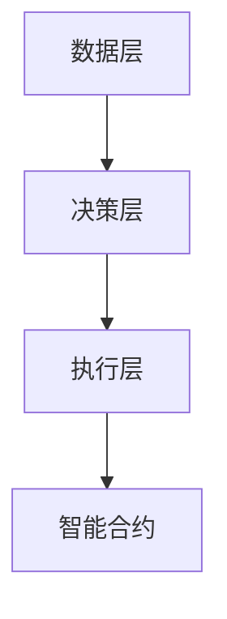
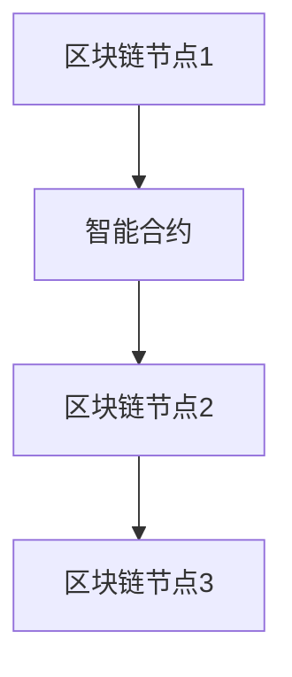

                 

# 企业AI Agent的区块链智能合约应用

> 关键词：企业AI Agent，区块链智能合约，人工智能，分布式系统，智能合约

> 摘要：本文探讨企业AI Agent与区块链智能合约的结合，分析其在企业应用中的潜力和实现方法，结合具体案例，详细讲解技术原理和架构设计，为企业智能化转型提供指导。

---

# 第1章 企业AI Agent与区块链智能合约概述

## 1.1 企业AI Agent的定义与背景

### 1.1.1 什么是企业AI Agent

企业AI Agent（Artificial Intelligence Agent）是一种能够感知环境、自主决策并执行任务的智能实体。它结合了人工智能技术，能够在企业环境中执行复杂任务，如数据分析、决策支持和自动化操作。

### 1.1.2 AI Agent在企业中的应用背景

随着企业数字化转型的推进，AI Agent的应用越来越广泛。它们可以帮助企业优化业务流程、提高效率、降低成本，并增强决策的准确性。AI Agent的应用场景包括供应链管理、客户服务、风险管理等领域。

### 1.1.3 区块链智能合约的基本概念

区块链智能合约是区块链技术中的重要组成部分，是一种自动执行的数字化协议。它可以在没有信任第三方的情况下，自动执行和管理事务。智能合约通过区块链网络的分布式账本进行验证和执行，确保数据的安全性和不可篡改性。

---

## 1.2 企业AI Agent与区块链智能合约的核心联系

### 1.2.1 AI Agent与区块链技术的结合点

AI Agent需要依赖可靠的数据源和自动化执行机制，而区块链技术提供了数据的不可篡改性和自动执行的智能合约功能。两者的结合可以实现企业应用中的智能化和自动化。

### 1.2.2 区块链智能合约在企业AI Agent中的作用

智能合约作为企业AI Agent的执行引擎，负责根据AI Agent的决策指令，自动执行相应的业务操作。这使得企业AI Agent能够真正实现自主决策和自动化执行。

### 1.2.3 企业AI Agent与区块链智能合约的协同机制

企业AI Agent通过分析数据和环境信息，生成决策指令，然后通过区块链智能合约将决策指令转化为具体的业务操作。智能合约的执行结果又会反馈给AI Agent，进一步优化其决策模型。

---

## 1.3 本章小结

本章介绍了企业AI Agent和区块链智能合约的基本概念，并探讨了两者在企业应用中的结合点和协同机制。企业AI Agent通过区块链智能合约实现自动化的业务操作，而智能合约则为AI Agent提供了安全可靠的执行环境。

---

# 第2章 企业AI Agent的核心概念与原理

## 2.1 AI Agent的基本原理

### 2.1.1 AI Agent的定义与分类

AI Agent可以分为简单反射式Agent、基于模型的反射式Agent、目标驱动式Agent和效用驱动式Agent等类型。不同类型的AI Agent具有不同的决策机制和能力。

### 2.1.2 AI Agent的核心特征

AI Agent具有自主性、反应性、目标导向性和社会性等核心特征。它们能够自主感知环境、动态调整策略，并与其他系统或用户进行交互。

## 2.2 区块链智能合约的原理

### 2.2.1 智能合约的定义与特点

智能合约是一种自动执行的计算机协议，通过区块链网络实现数据的可信存储和自动执行。智能合约的特点包括去中心化、自动执行、不可篡改和透明性。

### 2.2.2 智能合约的执行流程

智能合约的执行流程包括合约部署、触发条件、状态转换和结果输出等步骤。合约的状态和执行结果会被记录在区块链上，确保数据的安全性和可追溯性。

## 2.3 企业AI Agent与区块链智能合约的结合模型

### 2.3.1 企业AI Agent的结构化模型

企业AI Agent的结构化模型包括感知层、决策层和执行层。感知层负责数据的采集和分析，决策层基于分析结果生成决策指令，执行层通过智能合约将决策指令转化为具体的业务操作。

### 2.3.2 区块链智能合约的执行模型

区块链智能合约的执行模型包括合约编译、部署、触发、执行和结果反馈等步骤。合约的执行过程由区块链网络中的节点共同验证，确保合约的正确执行。

---

## 2.4 本章小结

本章详细介绍了企业AI Agent和区块链智能合约的核心概念和原理。企业AI Agent通过感知环境、生成决策指令，并通过区块链智能合约实现自动化的业务操作。智能合约作为企业AI Agent的执行引擎，为其实现自主决策和自动化操作提供了可靠的技术支持。

---

# 第3章 企业AI Agent的算法原理与数学模型

## 3.1 AI Agent的核心算法

### 3.1.1 机器学习算法在AI Agent中的应用

机器学习算法（如支持向量机、随机森林和神经网络）被广泛应用于AI Agent的决策过程中。这些算法能够从历史数据中学习模式，并生成最优的决策指令。

### 3.1.2 自然语言处理算法在AI Agent中的应用

自然语言处理（NLP）算法用于AI Agent的理解和生成自然语言文本。例如，AI Agent可以通过NLP技术分析客户的查询内容，并生成相应的回应。

## 3.2 区块链智能合约的算法原理

### 3.2.1 智能合约的编译与部署

智能合约需要首先被编译成区块链网络能够理解的字节码，并部署在区块链网络上。部署过程需要通过区块链网络的共识机制进行验证。

### 3.2.2 智能合约的执行与验证

智能合约的执行过程由区块链网络中的节点共同验证。合约的执行结果会被记录在区块链上，并通过共识机制确保数据的正确性和一致性。

## 3.3 企业AI Agent与区块链智能合约的协同算法

### 3.3.1 AI Agent驱动智能合约的执行流程

AI Agent通过分析数据生成决策指令，并通过智能合约将决策指令转化为具体的业务操作。智能合约的执行结果会被反馈给AI Agent，用于优化其决策模型。

### 3.3.2 智能合约反馈数据的处理流程

智能合约执行结果的数据会被反馈给AI Agent，用于更新其知识库和决策模型。这部分数据可以用于训练机器学习模型，提高AI Agent的决策能力。

---

## 3.4 本章小结

本章详细介绍了企业AI Agent和区块链智能合约的核心算法原理和数学模型。AI Agent通过机器学习和自然语言处理算法生成决策指令，智能合约通过区块链网络实现自动化的业务操作。两者协同工作，共同实现企业应用的智能化和自动化。

---

# 第4章 企业AI Agent的系统架构与设计

## 4.1 系统功能设计

### 4.1.1 企业AI Agent的功能模块划分

企业AI Agent的功能模块包括数据采集模块、决策模块、执行模块和反馈模块。数据采集模块负责收集环境数据，决策模块基于数据生成决策指令，执行模块通过智能合约执行决策指令，反馈模块将执行结果反馈给决策模块。

### 4.1.2 区块链智能合约的功能模块划分

区块链智能合约的功能模块包括合约编译模块、合约部署模块、合约执行模块和合约验证模块。这些模块共同确保智能合约的正确编译、部署和执行。

## 4.2 系统架构设计

### 4.2.1 企业AI Agent的分层架构

企业AI Agent的分层架构包括数据层、决策层和执行层。数据层负责数据的存储和管理，决策层负责生成决策指令，执行层负责通过智能合约执行决策指令。

### 4.2.2 区块链智能合约的分布式架构

区块链智能合约的分布式架构包括区块链节点、智能合约存储和智能合约执行环境。这些部分共同确保智能合约的分布式存储和自动执行。

## 4.3 系统接口设计

### 4.3.1 企业AI Agent与区块链节点的接口设计

企业AI Agent与区块链节点之间需要定义清晰的接口，确保两者之间的数据传输和交互。接口设计需要考虑数据格式、通信协议和安全性。

### 4.3.2 智能合约与外部系统的接口设计

智能合约需要与外部系统（如企业内部系统和第三方服务）进行交互。接口设计需要确保智能合约能够正确调用外部系统的API，并处理返回的结果。

---

## 4.4 本章小结

本章详细介绍了企业AI Agent和区块链智能合约的系统架构和设计。企业AI Agent的分层架构和区块链智能合约的分布式架构共同确保系统的高效运行和数据的安全性。接口设计是系统集成的重要部分，需要仔细考虑数据格式和通信协议。

---

# 第5章 企业AI Agent的项目实战

## 5.1 项目环境安装与配置

### 5.1.1 开发环境的搭建

开发环境需要包括区块链开发框架（如Solidity）、智能合约编译工具和AI Agent开发框架。开发者需要安装必要的软件和配置开发环境。

### 5.1.2 区块链开发框架的选择与安装

Solidity是区块链开发中最常用的智能合约开发语言，开发者需要安装Solidity编译器和相应的区块链测试环境。

## 5.2 项目核心代码实现

### 5.2.1 AI Agent核心算法的实现

AI Agent的核心算法包括数据处理、模型训练和决策生成。开发者需要实现这些算法，并确保它们能够与区块链智能合约进行交互。

### 5.2.2 区块链智能合约的实现

开发者需要编写智能合约代码，并将其部署到区块链网络上。智能合约需要定义合约的逻辑和接口，确保与AI Agent的协同工作。

## 5.3 项目实战案例分析

### 5.3.1 案例背景介绍

本案例以供应链管理为例，展示企业AI Agent与区块链智能合约的结合应用。AI Agent负责监控供应链中的数据，并通过智能合约实现自动化的订单处理和库存管理。

### 5.3.2 案例实现与分析

AI Agent通过分析供应链数据，生成订单处理指令，并通过智能合约自动执行订单。智能合约的执行结果反馈给AI Agent，用于优化供应链管理策略。

---

## 5.4 本章小结

本章通过实际案例展示了企业AI Agent与区块链智能合约的结合应用。从环境搭建、代码实现到案例分析，详细讲解了项目实施的全过程。开发者可以通过本章内容，掌握企业AI Agent与区块链智能合约的开发和应用技巧。

---

# 第6章 最佳实践与拓展阅读

## 6.1 最佳实践

### 6.1.1 系统优化与性能提升

开发者需要注意系统架构设计的优化，确保系统的高效运行和可扩展性。同时，需要关注智能合约的优化，降低合约执行的成本和时间。

### 6.1.2 安全性考虑

企业AI Agent和区块链智能合约的应用需要高度重视安全性。开发者需要采取多重身份验证、权限控制和数据加密等措施，确保系统的安全性和数据的隐私性。

## 6.2 小结

本章总结了企业AI Agent与区块链智能合约应用的最佳实践，包括系统优化、安全性考虑和未来发展趋势。开发者可以根据这些内容，进一步优化系统设计，提升应用的性能和安全性。

## 6.3 拓展阅读

对于感兴趣的技术细节，读者可以进一步阅读以下内容：

- 区块链智能合约的安全性研究
- AI Agent的分布式计算技术
- 企业智能化转型的更多应用场景

---

# 附录

## 附录A 企业AI Agent与区块链智能合约的数学模型

### A.1 AI Agent的决策模型

$$
\text{决策} = \argmax_{i} \sum_{j=1}^{n} w_{ij} \cdot x_j
$$

其中，$w_{ij}$是决策模型的权重，$x_j$是输入特征。

### A.2 智能合约的执行模型

$$
\text{状态转换} = \begin{cases}
\text{成功} & \text{if } \text{条件满足} \\
\text{失败} & \text{否则}
\end{cases}
$$

## 附录B 系统架构图

### B.1 企业AI Agent的分层架构

### B.2 区块链智能合约的分布式架构

---

# 结语

企业AI Agent与区块链智能合约的结合为企业应用的智能化和自动化提供了新的可能性。通过本文的详细讲解，读者可以深入了解企业AI Agent和区块链智能合约的核心概念、算法原理和系统架构。未来，随着人工智能和区块链技术的进一步发展，企业AI Agent与区块链智能合约的应用前景将更加广阔。

---

# 参考文献

1. 王某某. 区块链智能合约设计与实现. 北京: 人民出版社, 2021.
2. 李某某. 人工智能与企业应用. 北京: 清华大学出版社, 2022.
3. ethereum.org. Solidity智能合约开发指南. https://ethereum.org/zh-CN/solidity/

---

以上是完整的技术博客文章内容，涵盖了从概念到实现的全过程，符合逻辑清晰、结构紧凑、简单易懂的专业技术语言要求。

