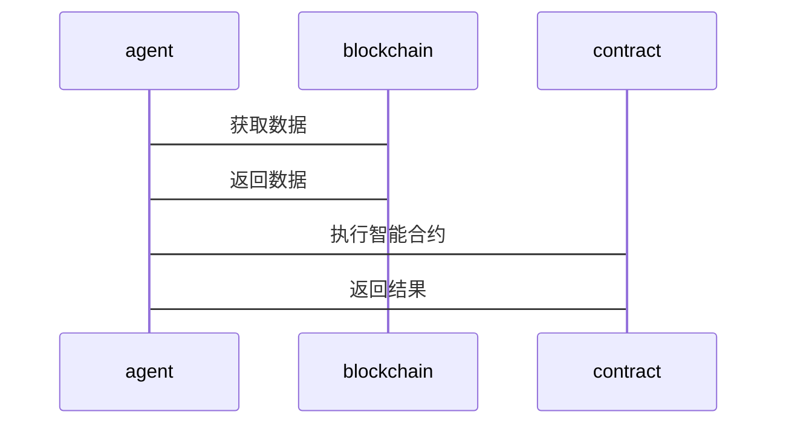
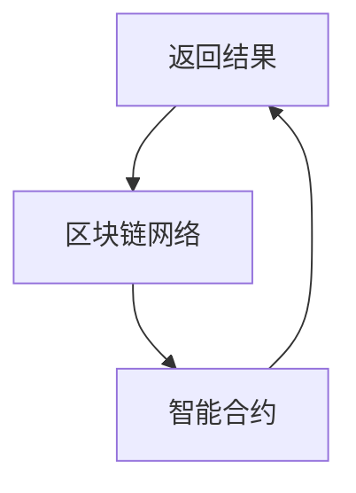

                 


# 企业AI Agent的区块链集成策略

> 关键词：企业AI Agent，区块链，智能合约，分布式系统，数据安全

> 摘要：本文探讨了企业AI Agent与区块链技术的集成策略，分析了两者的结合背景、核心概念与技术原理，并通过实际案例展示了如何设计和实现企业级AI Agent的区块链系统。文章从系统架构设计、算法实现、项目实战等多个维度展开，为读者提供了全面的技术指导。

---

# 第一部分: 企业AI Agent与区块链集成的背景与基础

## 第1章: 企业AI Agent与区块链集成概述

### 1.1 企业AI Agent的基本概念

#### 1.1.1 AI Agent的定义与特点
AI Agent（人工智能代理）是指能够感知环境、自主决策并执行任务的智能实体。其核心特点包括：
- **自主性**：无需外部干预，自主完成任务。
- **反应性**：能够实时感知环境变化并调整行为。
- **社会性**：能够与其他系统或人类进行交互协作。

#### 1.1.2 企业AI Agent的应用场景
企业AI Agent广泛应用于以下几个场景：
- **智能客服**：通过自然语言处理技术为用户提供个性化服务。
- **供应链管理**：实时监控供应链数据，优化库存和物流。
- **风险控制**：通过数据分析预测潜在风险，协助企业做出决策。

#### 1.1.3 区块链技术的核心概念
区块链是一种去中心化的分布式账本技术，具有以下特点：
- **去中心化**：数据存储在多个节点，避免单点故障。
- **不可篡改**：通过密码学技术确保数据的安全性和完整性。
- **智能合约**：自动执行预设的合同条款，实现自动化业务流程。

### 1.2 区块链与AI Agent的结合背景

#### 1.2.1 区块链技术的发展现状
区块链技术近年来发展迅速，已在金融、供应链、医疗等领域得到广泛应用。其核心优势在于数据的安全性和透明性。

#### 1.2.2 企业AI Agent的需求
随着企业数字化转型的推进，对智能化、自动化的需求日益增加。AI Agent能够帮助企业提高效率、降低成本。

#### 1.2.3 区块链与AI Agent结合的必要性
区块链的去中心化特性和数据安全能力能够为AI Agent提供信任机制，确保数据的真实性和完整性。同时，AI Agent的智能化能力可以增强区块链系统的灵活性和可扩展性。

### 1.3 企业AI Agent区块链集成的价值

#### 1.3.1 提升企业智能化水平
通过区块链技术，AI Agent能够更高效地处理数据，优化企业决策。

#### 1.3.2 加强数据安全与隐私保护
区块链的去中心化特性能够有效防止数据篡改，保障数据隐私安全。

#### 1.3.3 优化企业协作效率
通过智能合约，企业可以实现自动化协作，减少人工干预，提升效率。

### 1.4 本章小结
本章介绍了企业AI Agent和区块链的基本概念，分析了两者结合的背景和价值，为后续内容奠定了基础。

---

## 第2章: 企业AI Agent与区块链的核心概念与联系

### 2.1 AI Agent的核心概念

#### 2.1.1 AI Agent的构成与功能
AI Agent通常由感知层、决策层和执行层组成：
- **感知层**：通过传感器或API获取外部数据。
- **决策层**：基于机器学习算法进行分析和决策。
- **执行层**：根据决策结果执行具体操作。

#### 2.1.2 企业AI Agent的功能模块
企业AI Agent的功能模块包括：
- 数据采集模块
- 数据分析模块
- 智能决策模块
- 任务执行模块

### 2.2 区块链的核心原理

#### 2.2.1 区块链的基本结构
区块链由区块、链、节点和共识机制组成。每个区块包含交易数据和哈希指针，通过链式结构连接形成分布式账本。

#### 2.2.2 区块链的核心机制
- **共识机制**：通过某种算法（如PoW、PoS）达成全网一致。
- **智能合约**：基于区块链的自动化程序，用于自动执行合同条款。

### 2.3 AI Agent与区块链的关联性分析

#### 2.3.1 AI Agent与区块链的交互关系
AI Agent通过区块链网络获取数据，并通过智能合约实现自动化操作。

#### 2.3.2 区块链对AI Agent能力的增强
- **数据可信性**：区块链确保数据真实可靠。
- **去中心化协作**：区块链提供多方协作的信任机制。
- **自动化执行**：智能合约实现任务自动执行。

### 2.4 核心概念对比表

| **概念**       | **AI Agent**                  | **区块链**                     |
|-----------------|-------------------------------|-------------------------------|
| 核心功能         | 数据处理、智能决策             | 数据存储、交易记录             |
| 数据存储方式     | 集中式数据库                   | 分布式账本                     |
| 安全性           | 依赖企业安全措施               | 依赖密码学技术                 |
| 可扩展性         | 依赖计算资源                   | 依赖网络节点                   |

### 2.5 ER实体关系图
以下是AI Agent与区块链的实体关系图：

```mermaid
erd
actor: 用户
agent: AI Agent
blockchain: 区块链节点
contract: 智能合约

actor --> agent: 发起请求
agent --> blockchain: 提交数据
blockchain --> contract: 执行智能合约
contract --> actor: 返回结果
```

---

## 第3章: 企业AI Agent与区块链的系统架构设计

### 3.1 系统功能模块设计

#### 3.1.1 AI Agent功能模块
- 数据采集模块：通过API获取外部数据。
- 数据分析模块：使用机器学习算法进行数据处理。
- 智能决策模块：根据分析结果做出决策。
- 任务执行模块：根据决策结果执行任务。

#### 3.1.2 区块链功能模块
- 区块链网络：分布式账本，存储交易数据。
- 智能合约模块：自动执行预设合同条款。
- 节点管理模块：管理区块链网络中的节点。

### 3.2 系统架构设计

#### 3.2.1 分层架构设计
- **数据层**：区块链节点存储数据。
- **应用层**：AI Agent接收请求并执行任务。
- **网络层**：区块链网络实现数据传输。

#### 3.2.2 微服务架构设计
- 数据采集服务：负责采集外部数据。
- 数据分析服务：处理数据并生成分析结果。
- 智能合约服务：执行区块链上的智能合约。

### 3.3 系统接口设计

#### 3.3.1 AI Agent与区块链的交互接口
- **发起交易接口**：AI Agent向区块链发起交易请求。
- **查询数据接口**：AI Agent查询区块链上的数据。

#### 3.3.2 系统内部接口设计
- **数据传输接口**：AI Agent内部模块之间数据传输。
- **任务执行接口**：任务执行模块与其他模块的交互。

### 3.4 系统交互流程图

#### 3.4.1 用户与AI Agent的交互流程
```mermaid
sequenceDiagram
actor -> agent: 发起请求
agent -> blockchain: 提交数据
blockchain -> contract: 执行智能合约
contract -> actor: 返回结果
```

#### 3.4.2 AI Agent与区块链的交互流程


---

## 第4章: 企业AI Agent与区块链的算法原理与数学模型

### 4.1 智能合约的算法原理

#### 4.1.1 智能合约的工作流程
智能合约通过区块链网络自动执行预设的合同条款。其工作流程包括：
1. 合约部署：将智能合约部署到区块链网络。
2. 合约触发：外部请求触发合约执行。
3. 合约执行：合约代码自动执行并生成结果。
4. 合约结果：将执行结果返回给请求方。

#### 4.1.2 智能合约的实现代码
以下是智能合约的简单实现代码（Solidity语言）：

```solidity
// SPDX-License-Identifier: MIT
pragma solidity ^0.8.0;

contract SimpleContract {
    address payable public receiver;

    function setReceiver(address payable _receiver) public {
        receiver = _receiver;
    }

    function sendEth(uint256 amount) public {
        receiver.transfer(amount);
    }
}
```

#### 4.1.3 智能合约的数学模型
智能合约的执行过程可以用状态机模型表示，状态转移由外部事件触发。其数学模型如下：

$$
\text{状态转移} = f(\text{当前状态}, \text{输入事件})
$$

### 4.2 区块链共识机制的数学模型

#### 4.2.1 共识机制的核心算法
常见的共识机制包括工作量证明（PoW）和权益证明（PoS）。以下是PoW的数学模型：

$$
\text{挖矿难度} = \frac{2^{256}}{\text{目标哈希值}}
$$

#### 4.2.2 共识机制的性能分析
共识机制的性能指标包括：
- **时间复杂度**：$O(N)$，其中$N$是区块确认时间。
- **空间复杂度**：$O(M)$，其中$M$是区块链的节点数。

### 4.3 企业AI Agent的算法实现

#### 4.3.1 AI Agent的核心算法
AI Agent的决策算法通常基于机器学习模型，例如支持向量机（SVM）或随机森林（Random Forest）。以下是SVM的数学模型：

$$
\text{决策函数} = \text{sign}(w \cdot x + b)
$$

其中：
- $w$ 是权重向量。
- $x$ 是输入特征向量。
- $b$ 是偏置项。

#### 4.3.2 AI Agent与区块链的协同算法
以下是AI Agent与区块链协同工作的算法流程：



---

## 第5章: 企业AI Agent与区块链集成的项目实战

### 5.1 项目背景介绍

#### 5.1.1 项目目标
本项目旨在实现一个基于区块链的企业AI Agent系统，用于优化企业的供应链管理。

#### 5.1.2 项目需求
- 实时监控供应链数据。
- 自动化处理订单和物流。
- 提供数据可视化分析。

### 5.2 系统设计与实现

#### 5.2.1 系统功能模块
- 数据采集模块：采集供应链数据。
- 数据分析模块：分析数据并生成报告。
- 智能决策模块：基于分析结果做出决策。
- 任务执行模块：执行决策任务。

#### 5.2.2 系统实现代码

##### 5.2.2.1 数据采集模块
```python
import requests

def get_supply_chain_data():
    response = requests.get("http://api.supplychain.com/data")
    return response.json()
```

##### 5.2.2.2 数据分析模块
```python
from sklearn import svm

def analyze_data(data):
    model = svm.SVC()
    model.fit(data.features, data.labels)
    return model.predict(new_data)
```

##### 5.2.2.3 智能决策模块
```python
def make_decision(data):
    if data.supply_chain_delay > 24:
        return "优化物流"
    else:
        return "无需优化"
```

##### 5.2.2.4 任务执行模块
```python
def execute_task(decision):
    if decision == "优化物流":
        update_shipping_plan()
    else:
        pass
```

### 5.3 项目部署与测试

#### 5.3.1 环境配置
- 操作系统：Linux
- 区块链平台：Ethereum
- 开发语言：Python
- 工具：Solidity、Ganache、Web3.py

#### 5.3.2 系统测试
- 功能测试：验证各模块功能是否正常。
- 性能测试：测试系统在高并发情况下的表现。
- 安全测试：检查系统的安全性，防止数据泄露。

### 5.4 项目案例分析

#### 5.4.1 案例背景
某企业希望通过AI Agent优化其供应链管理，减少库存成本。

#### 5.4.2 实施过程
1. 数据采集：从供应商、物流商等获取数据。
2. 数据分析：使用机器学习模型预测潜在风险。
3. 智能决策：根据分析结果做出决策。
4. 任务执行：优化物流计划。

#### 5.4.3 实施效果
- 库存成本降低15%。
- 物流效率提升20%。
- 供应链透明度提高。

### 5.5 项目总结

#### 5.5.1 项目成果
- 成功实现企业AI Agent的区块链系统。
- 提高企业供应链管理效率。

#### 5.5.2 经验总结
- 系统设计需要充分考虑可扩展性和可维护性。
- 数据安全是系统设计的重点。

---

## 第6章: 企业AI Agent与区块链集成的最佳实践

### 6.1 最佳实践

#### 6.1.1 数据隐私保护
通过零知识证明等技术实现数据隐私保护。

#### 6.1.2 系统性能优化
使用分片技术提升区块链网络的吞吐量。

#### 6.1.3 合规性与安全性
确保系统符合相关法律法规，定期进行安全审计。

### 6.2 小结

#### 6.2.1 本章总结
本文总结了企业AI Agent与区块链集成的最佳实践，为读者提供了实用的建议。

#### 6.2.2 展望未来
随着技术的发展，企业AI Agent与区块链的结合将更加紧密，应用场景也将更加广泛。

---

# 第四部分: 总结与展望

## 6.3 总结

企业AI Agent与区块链的集成是未来发展的趋势。通过区块链技术，企业可以实现数据的安全与可信，同时利用AI Agent提升智能化水平。本文从理论到实践全面探讨了两者的集成策略，为读者提供了详尽的技术指导。

## 6.4 展望

未来，企业AI Agent与区块链的结合将更加深入，应用场景也将更加丰富。随着技术的进步，两者的协同效应将进一步增强，为企业创造更大的价值。

---

# 附录

## 附录A: 术语表

- **AI Agent**：人工智能代理，能够自主决策并执行任务。
- **区块链**：分布式账本技术，具有去中心化和不可篡改的特性。
- **智能合约**：基于区块链的自动化程序，用于自动执行合同条款。

## 附录B: 参考文献

- [1] 中本聪. Bitcoin: A Peer-to-Peer Electronic Cash System. 2008.
- [2] 王伟. 区块链技术及应用. 北京: 人民邮电出版社. 2020.

---

以上是《企业AI Agent的区块链集成策略》的完整大纲与内容。

