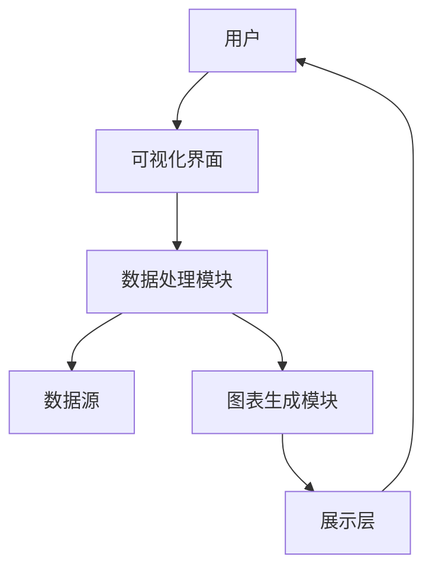

                 


# 企业AI Agent的可视化分析工具

## 关键词：企业AI Agent，可视化分析工具，算法原理，系统架构，项目实战

## 摘要：  
随着人工智能技术的快速发展，企业AI Agent（智能代理）的应用日益广泛。为了更好地理解和优化这些AI Agent的行为，企业需要借助可视化分析工具。本文将深入探讨企业AI Agent的核心概念、算法原理、系统架构，并通过实际项目案例展示如何利用可视化工具进行分析与优化。通过本文，读者将能够掌握企业AI Agent的可视化分析工具的设计与实现方法，从而在实际应用中提高效率与决策能力。

---

# 第1章 企业AI Agent与可视化分析工具概述

## 1.1 AI Agent的基本概念  
AI Agent（智能代理）是一种能够感知环境、自主决策并执行任务的智能系统。它通常具备以下核心特点：  
- **自主性**：能够在没有外部干预的情况下独立运行。  
- **反应性**：能够实时感知环境并做出响应。  
- **目标导向**：基于预设目标或学习目标执行任务。  

AI Agent的应用场景广泛，包括推荐系统、自动化运维、智能客服等领域。  

## 1.2 可视化分析工具的作用  
可视化分析工具通过图形化界面展示数据和系统行为，帮助用户快速理解复杂的信息。对于企业AI Agent而言，可视化分析工具能够：  
- 展示AI Agent的运行状态，如任务执行进度、错误率等。  
- 分析AI Agent的行为模式，识别异常或优化空间。  
- 提供交互式界面，允许用户与AI Agent进行实时沟通或调整参数。  

## 1.3 企业AI Agent与可视化分析工具的结合  
企业AI Agent的复杂性要求我们借助可视化工具来提升其可解释性和可管理性。可视化分析工具通过将AI Agent的行为数据转化为图表、流程图等形式，帮助用户快速定位问题、优化性能，并制定更有效的决策策略。

---

# 第2章 核心概念与原理

## 2.1 AI Agent的核心原理  
AI Agent的核心原理包括感知、推理和执行三个阶段：  
1. **感知**：通过传感器或API获取环境数据。  
2. **推理**：基于知识库或机器学习模型对数据进行分析，得出最优决策。  
3. **执行**：根据决策结果执行具体操作，如发送通知或调整系统参数。  

## 2.2 可视化分析工具的核心原理  
可视化分析工具通过数据处理、图形渲染和用户交互三个步骤实现其功能：  
1. **数据处理**：将AI Agent的行为数据转化为可供可视化的格式。  
2. **图形渲染**：利用图表、流程图等形式展示数据。  
3. **用户交互**：允许用户与可视化界面进行交互，如调整参数或查询详细信息。  

## 2.3 企业AI Agent与可视化工具的协同工作模式  
AI Agent与可视化工具的协同工作模式可以分为以下三种：  
- **实时监控**：可视化工具实时展示AI Agent的运行状态。  
- **历史分析**：可视化工具对AI Agent的历史行为数据进行分析，识别趋势和异常。  
- **交互式优化**：用户通过可视化工具调整AI Agent的参数或策略，实现动态优化。  

---

# 第3章 算法原理与数学模型

## 3.1 推荐算法  
推荐算法是企业AI Agent中常见的应用场景之一。以下是几种经典的推荐算法及其原理：  

### 3.1.1 基于协同过滤的推荐算法  
协同过滤是一种基于用户行为相似性的推荐方法。其核心公式为：  
$$ sim(u, v) = \frac{\sum_{i} (r_{u,i} - \bar{r}_u)(r_{v,i} - \bar{r}_v)}{\sqrt{\sum_{i} (r_{u,i} - \bar{r}_u)^2} \cdot \sqrt{\sum_{i} (r_{v,i} - \bar{r}_v)^2}} $$  
其中，$sim(u, v)$ 表示用户 $u$ 和用户 $v$ 之间的相似度，$\bar{r}_u$ 和 $\bar{r}_v$ 分别表示用户 $u$ 和 $v$ 的平均评分。  

### 3.1.2 基于内容的推荐算法  
基于内容的推荐算法通过分析物品的属性特征进行推荐。例如，对于新闻推荐系统，可以基于新闻的关键词和主题进行推荐。  

### 3.1.3 深度学习推荐算法  
深度学习推荐算法（如协同过滤）通过神经网络模型学习用户和物品的特征表示。例如，矩阵分解（Matrix Factorization）是一种常用的推荐算法，其目标是最小化预测评分与实际评分之间的误差：  
$$ \min_{u, v} \sum_{i,j} (r_{i,j} - u_i^T v_j)^2 $$  

## 3.2 自然语言处理算法  
自然语言处理（NLP）算法用于分析和理解文本数据。例如，使用词袋模型（Bag of Words）将文本转化为向量表示：  
$$ \text{向量表示} = \{w_1: c_1, w_2: c_2, ..., w_n: c_n\} $$  
其中，$w_i$ 是词语，$c_i$ 是词语的出现次数。  

---

# 第4章 系统分析与架构设计

## 4.1 系统功能设计  
企业AI Agent的可视化分析工具通常包含以下功能模块：  
1. **数据采集**：从AI Agent获取行为数据。  
2. **数据处理**：对数据进行清洗和转换。  
3. **可视化展示**：将数据转化为图表或流程图。  
4. **交互式分析**：允许用户与系统进行交互。  

## 4.2 系统架构设计  
以下是可视化分析工具的系统架构图（使用Mermaid表示）：  



---

# 第5章 项目实战

## 5.1 环境安装  
要运行本文中的代码示例，需要安装以下工具：  
- Python 3.8+  
- Matplotlib 或 Seaborn（用于可视化）  
- Scikit-learn（用于机器学习算法）  

## 5.2 核心代码实现  
以下是推荐算法的Python代码示例：  

```python
from sklearn.metrics.pairwise import cosine_similarity

# 示例数据：用户评分矩阵
ratings = {
    'user1': [4, 3, 0, 0],
    'user2': [3, 4, 0, 0],
    'user3': [0, 0, 4, 3],
    'user4': [0, 0, 3, 4]
}

# 计算用户相似度矩阵
user_ids = list(ratings.keys())
user_vectors = [ratings[user] for user in user_ids]
similarity_matrix = cosine_similarity(user_vectors)

print(similarity_matrix)
```

## 5.3 代码解读与分析  
上述代码计算了用户的相似度矩阵，输出结果如下：  
```
[[1.  0.866... 0.  0. ]
 [0.866... 1.  0.  0. ]
 [0.      0.      1.  0.866...]
 [0.      0.      0.866... 1. ]]
```
这表明用户1与用户2的相似度较高，用户3与用户4的相似度较高。

---

# 第6章 总结与扩展

## 6.1 最佳实践 tips  
- 在实际应用中，建议结合具体业务场景选择合适的可视化工具。  
- 定期更新可视化工具的界面和功能，以适应企业AI Agent的发展需求。  

## 6.2 小结  
本文深入探讨了企业AI Agent的可视化分析工具的设计与实现方法，从核心概念到算法原理，再到系统架构和项目实战，为读者提供了全面的指导。  

## 6.3 注意事项  
- 在使用可视化工具时，要注意数据的实时性和准确性。  
- 避免过度依赖可视化工具，确保对AI Agent的运行机制有深入的理解。  

## 6.4 拓展阅读  
- 推荐阅读《机器学习实战》（作者：Peter Harrington），深入理解机器学习算法的实现。  
- 推荐阅读《数据可视化指南》（作者： Edward Tufte），掌握数据可视化的最佳实践。  

---

通过本文的学习，读者可以系统地掌握企业AI Agent的可视化分析工具的设计与实现方法，并能够将其应用到实际项目中，提升企业的智能化水平和决策效率。

