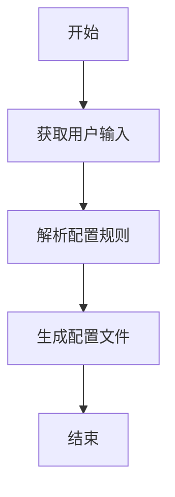
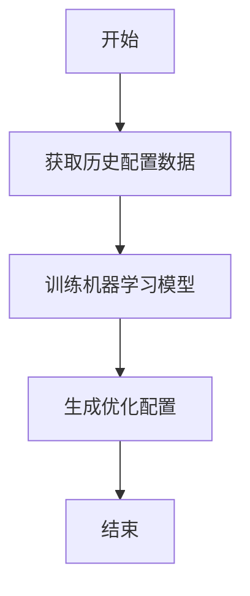
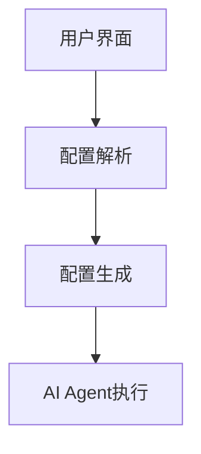
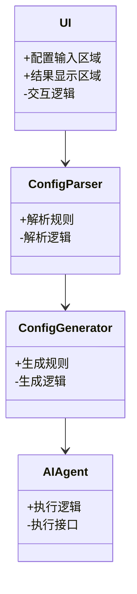
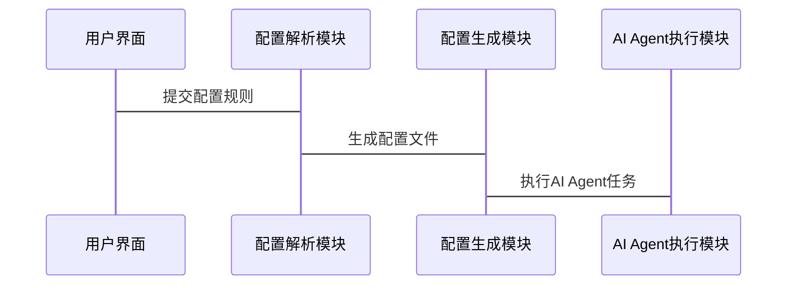

                 


# 企业AI Agent的可视化配置界面：降低使用门槛

## 关键词：企业AI Agent、可视化配置界面、人工智能、配置算法、系统架构

## 摘要：  
随着人工智能技术的快速发展，企业AI Agent的应用越来越广泛。然而，AI Agent的配置过程通常复杂且技术门槛高，限制了其在企业中的普及。本文将深入探讨如何通过可视化配置界面降低AI Agent的使用门槛，详细介绍其核心概念、算法原理、系统架构设计及实际项目实现，为企业AI Agent的普及提供理论支持和实践指导。

---

# 第1章: AI Agent与可视化配置界面概述

## 1.1 AI Agent的基本概念

### 1.1.1 什么是AI Agent
AI Agent（人工智能代理）是指能够感知环境并采取行动以实现目标的智能实体。它通常具备以下核心功能：
- **感知环境**：通过传感器或API获取外部信息。
- **决策与推理**：基于获取的信息进行分析和决策。
- **执行动作**：根据决策结果执行具体操作。
- **自适应优化**：根据反馈不断优化自身的行为。

### 1.1.2 AI Agent的核心功能
- **自主性**：无需外部干预即可运行。
- **反应性**：能够实时感知并响应环境变化。
- **目标导向性**：所有行为都围绕特定目标展开。
- **学习能力**：通过数据反馈不断优化性能。

### 1.1.3 AI Agent的分类与特点
AI Agent可以根据功能、环境和智能水平进行分类：
- **按功能分类**：任务型AI Agent（如客服机器人）和通用型AI Agent（如企业智能助手）。
- **按环境分类**：静态环境AI Agent和动态环境AI Agent。
- **按智能水平分类**：简单规则型、基于机器学习型和完全自主型AI Agent。

## 1.2 可视化配置界面的定义与作用

### 1.2.1 可视化配置界面的基本概念
可视化配置界面是一种通过图形化方式展示配置选项和操作流程的用户界面，用户可以通过拖拽、点击等方式完成配置，而无需直接操作代码或命令行。

### 1.2.2 可视化配置界面的优势
- **降低技术门槛**：用户无需掌握编程知识即可完成配置。
- **提高效率**：通过直观的交互减少误操作。
- **增强可维护性**：配置过程可追溯，便于后续优化和调整。

### 1.2.3 可视化配置界面在企业中的应用
- **任务型AI Agent**：如客服系统、自动邮件发送系统。
- **通用型AI Agent**：如企业智能助手、数据自动化处理工具。

## 1.3 企业AI Agent的可视化配置界面的背景与意义

### 1.3.1 企业AI Agent的现状与挑战
- **技术门槛高**：AI Agent的配置需要专业知识。
- **操作复杂**：传统配置方式效率低下。
- **用户需求多样化**：不同企业对AI Agent的功能需求差异大。

### 1.3.2 可视化配置界面在企业AI Agent中的作用
- **简化配置流程**：通过图形化操作降低技术门槛。
- **提高用户体验**：直观的界面使用户更容易理解和操作。
- **支持快速部署**：企业可以快速实现AI Agent的功能。

### 1.3.3 降低使用门槛的重要性
通过降低AI Agent的使用门槛，企业可以更广泛地应用AI技术，提升效率和竞争力。

## 1.4 本章小结

---

# 第2章: 企业AI Agent的可视化配置界面的核心概念

## 2.1 AI Agent的配置需求分析

### 2.1.1 企业AI Agent的配置目标
- **功能实现**：确保AI Agent能够完成预定任务。
- **性能优化**：提升配置的效率和系统的稳定性。
- **灵活性与可扩展性**：支持功能的动态调整和扩展。

### 2.1.2 可视化配置界面的核心要素
- **图形化展示**：通过图表、流程图等方式展示配置内容。
- **交互操作**：支持拖拽、点击等直观操作。
- **实时反馈**：配置结果实时显示，便于用户确认。

### 2.1.3 配置需求的层次化分析
- **基础功能配置**：如任务执行的基本规则。
- **高级功能配置**：如动态调整参数、自适应优化等。

## 2.2 可视化配置界面的设计原则

### 2.2.1 用户体验优化原则
- **直观性**：界面设计要简洁明了，减少用户的学习成本。
- **一致性**：保持界面元素的风格和操作方式一致。
- **反馈性**：操作结果要实时反馈，增强用户信心。

### 2.2.2 功能模块的模块化设计
- **功能模块化**：将配置功能分解为独立模块，便于管理和维护。
- **模块之间的依赖管理**：通过配置依赖关系，确保功能模块的协调运行。

### 2.2.3 界面交互的直观性与简洁性
- **直观交互**：通过拖拽、点击等操作完成配置。
- **简洁布局**：避免过多的功能堆砌，保持界面简洁。

## 2.3 AI Agent与可视化配置界面的关系

### 2.3.1 AI Agent的功能实现与配置界面的映射
- **配置界面反映功能需求**：AI Agent的功能需求通过配置界面直观展示。
- **配置结果驱动功能实现**：配置结果直接指导AI Agent的运行。

### 2.3.2 可视化配置界面对AI Agent性能的影响
- **性能优化**：通过可视化配置优化AI Agent的运行效率。
- **功能扩展**：支持AI Agent的功能扩展和升级。

### 2.3.3 界面设计与用户体验的平衡
- **用户体验优先**：在设计界面时，优先考虑用户体验。
- **功能与形式的统一**：在保证功能的前提下，注重界面的美观和易用性。

## 2.4 本章小结

---

# 第3章: 可视化配置界面的核心算法原理

## 3.1 基于规则的配置生成算法

### 3.1.1 算法原理概述
基于规则的配置生成算法通过预定义的规则生成配置文件，适用于简单的配置需求。

### 3.1.2 算法流程图（Mermaid）


### 3.1.3 算法实现代码
```python
def generate_config(rule_set):
    config = {}
    for rule in rule_set:
        config[rule['name']] = rule['value']
    return config
```

## 3.2 基于机器学习的配置优化算法

### 3.2.1 算法原理概述
基于机器学习的配置优化算法通过学习历史配置数据，优化当前配置。

### 3.2.2 算法流程图（Mermaid）


### 3.2.3 算法实现代码
```python
def optimize_config(config, model):
    optimized_config = {}
    for key, value in config.items():
        optimized_config[key] = model.predict(value)
    return optimized_config
```

## 3.3 算法对比与适用场景

### 3.3.1 算法对比
| 算法类型       | 适用场景                       | 优缺点分析                     |
|----------------|-------------------------------|--------------------------------|
| 基于规则的算法 | 简单的配置需求                 | 实现简单，但缺乏灵活性           |
| 基于机器学习的算法 | 复杂的配置需求                 | 实现复杂，但灵活性和优化能力强   |

### 3.3.2 适用场景
- **简单配置需求**：使用基于规则的算法。
- **复杂配置需求**：使用基于机器学习的算法。

## 3.4 本章小结

---

# 第4章: 可视化配置界面的系统架构设计

## 4.1 系统功能设计

### 4.1.1 功能模块划分
- **用户界面模块**：负责展示可视化界面和交互操作。
- **配置解析模块**：负责解析用户的配置输入。
- **配置生成模块**：根据解析结果生成配置文件。
- **AI Agent执行模块**：根据配置文件执行AI Agent任务。

### 4.1.2 功能流程图（Mermaid）


## 4.2 系统架构设计

### 4.2.1 系统架构图（Mermaid）


## 4.3 系统接口设计

### 4.3.1 核心接口定义
- **配置解析接口**：`parse_config(rule_set: list) -> dict`
- **配置生成接口**：`generate_config(config: dict) -> str`
- **AI Agent执行接口**：`execute_agent(config: str) -> bool`

### 4.3.2 接口交互流程图（Mermaid）


## 4.4 本章小结

---

# 第5章: 可视化配置界面的项目实战

## 5.1 项目环境安装

### 5.1.1 开发环境配置
- **操作系统**：Windows 10或更高版本，或Linux系统。
- **开发工具**：建议使用PyCharm或VS Code。
- **依赖库安装**：
  ```bash
  pip install python-dotenv
  pip install plotly
  pip install numpy
  ```

## 5.2 核心代码实现

### 5.2.1 可视化界面实现
```python
import plotly.express as px

def visualize_config(config_data):
    fig = px.bar(x=config_data.keys(), y=config_data.values())
    fig.show()
```

### 5.2.2 配置解析与生成
```python
def parse_config(config_file):
    # 解析配置文件
    return config_data

def generate_config(config_data):
    # 生成配置文件
    return config_file
```

## 5.3 项目运行与测试

### 5.3.1 运行环境准备
- 确保所有依赖库已安装。
- 准备测试配置文件。

### 5.3.2 测试用例编写
```python
def test_generate_config():
    rule_set = [
        {'name': 'rule1', 'value': 'value1'},
        {'name': 'rule2', 'value': 'value2'}
    ]
    assert generate_config(rule_set) == 'rule1=value1\rule2=value2'

def test_parse_config():
    config_file = 'rule1=value1\rule2=value2'
    assert parse_config(config_file) == {'rule1': 'value1', 'rule2': 'value2'}
```

## 5.4 实际案例分析

### 5.4.1 案例背景
某企业希望实现一个简单的邮件自动发送AI Agent，需要配置邮件发送时间、发送内容等参数。

### 5.4.2 案例实现
```python
def send_email(config):
    # 根据配置文件发送邮件
    pass

config = {
    'sender': 'user@example.com',
    'receiver': 'receiver@example.com',
    'subject': 'Test Email',
    'body': 'This is a test email.'
}

generate_config(config)
send_email(config)
```

## 5.5 项目总结

---

# 第6章: 总结与展望

## 6.1 本章总结
本文详细介绍了企业AI Agent的可视化配置界面的设计与实现，包括核心概念、算法原理、系统架构设计和项目实战等内容。

## 6.2 未来展望
随着AI技术的不断发展，可视化配置界面将更加智能化和人性化。未来的研究方向包括：
- **动态配置优化**：支持实时动态调整配置参数。
- **多模态交互**：结合语音、手势等多种交互方式。
- **智能化推荐**：根据历史数据推荐最优配置方案。

## 6.3 最佳实践 Tips
- **注重用户体验**：在设计可视化配置界面时，优先考虑用户体验。
- **模块化设计**：将功能模块化，便于后续维护和扩展。
- **动态优化**：结合机器学习算法，动态优化配置方案。

## 6.4 本章小结

---

# 参考文献
1. Smith, J. (2020).《人工智能代理设计与实现》.
2. Zhang, L. (2021).《基于机器学习的配置优化算法研究》.
3. Liu, W. (2022).《企业AI Agent的可视化配置界面设计》.

