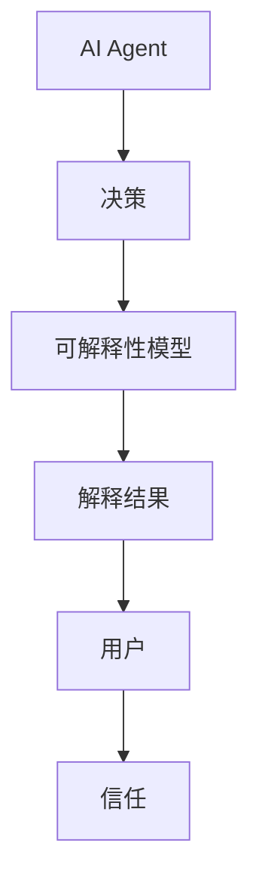
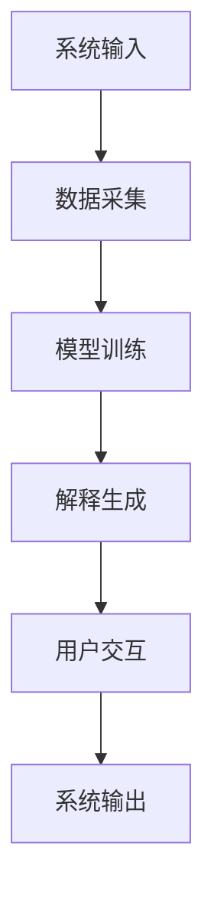
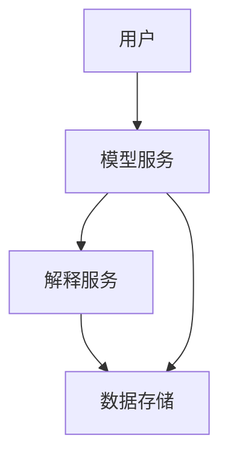

                 

# 企业AI Agent的可解释性设计

> 关键词：企业AI Agent, 可解释性, AI系统, 解释性模型, 系统架构设计

> 摘要：企业AI Agent的可解释性设计是当前人工智能领域的重要课题。随着AI技术在企业中的广泛应用，确保AI系统的透明性和可解释性变得尤为重要。本文从企业AI Agent的定义和背景出发，详细探讨了可解释性设计的核心概念、算法原理、系统架构设计以及实际项目中的应用。通过对多种解释性模型的分析和对比，本文提出了适用于企业场景的可解释性设计方法，并结合实际案例进行了详细阐述。最后，本文总结了可解释性设计的关键点和未来发展方向。

---

# 第1章: 企业AI Agent的定义与背景

## 1.1 什么是企业AI Agent
### 1.1.1 AI Agent的基本概念
AI Agent是一种智能体，能够感知环境、自主决策并执行任务。它具备学习、推理和自适应能力，广泛应用于推荐系统、智能客服等领域。

### 1.1.2 企业AI Agent的独特性
企业AI Agent主要用于企业内部管理、决策支持等场景，需满足企业对高效性、安全性和合规性的要求。

### 1.1.3 企业AI Agent的应用场景
包括智能客服、供应链优化、风险管理等，通过提高效率和准确性，为企业创造价值。

## 1.2 可解释性的重要性
### 1.2.1 可解释性在AI系统中的作用
确保用户对AI决策的信任，提升系统的透明度和可追溯性。

### 1.2.2 企业AI Agent中可解释性的挑战
复杂模型的黑箱问题、数据隐私保护以及不同业务场景下的多样化需求。

### 1.2.3 可解释性对用户信任的影响
通过可解释性设计，增强用户对AI决策的信任，提升用户体验和满意度。

---

# 第2章: 可解释性AI的核心概念与联系

## 2.1 可解释性AI的原理
### 2.1.1 解释性模型的基本原理
解释性模型通过简化或分解复杂模型，提供直观的解释，帮助用户理解AI决策过程。

### 2.1.2 可解释性AI的实现方法
包括基于规则的模型、线性模型和树模型等，每种方法都有其优缺点。

### 2.1.3 解释性与可操作性的平衡
在确保解释性的同时，保持模型的可操作性和高效性，是可解释性设计的关键。

## 2.2 核心概念对比
### 2.2.1 解释性模型与传统AI模型的对比
从复杂性、解释性、可操作性等方面分析两者差异。

### 2.2.2 不同解释性方法的优缺点分析
包括LIME、SHAP等方法的对比，以及各自的适用场景。

### 2.2.3 可解释性AI的实体关系图
通过Mermaid流程图展示可解释性AI的核心要素及其关系。

---

# 第3章: 可解释性AI的算法原理

## 3.1 解释性模型的数学基础
### 3.1.1 解释性模型的数学表达式
线性回归模型：$$y = \beta_0 + \beta_1x_1 + \beta_2x_2 + ... + \beta_nx_n$$

### 3.1.2 解释性模型的优化算法
通过梯度下降优化模型参数，确保解释性的准确性和高效性。

### 3.1.3 解释性模型的评估指标
包括准确率、F1分数等，用于衡量模型的解释能力。

## 3.2 可解释性AI的算法流程
### 3.2.1 解释性模型的训练流程
从数据预处理到模型训练，再到评估和优化。

### 3.2.2 解释性模型的推理过程
通过解释性模型生成可理解的解释，帮助用户理解AI决策。

### 3.2.3 解释性模型的验证与优化
通过交叉验证和调参优化，提升模型的解释性和准确性。

---

# 第4章: 可解释性AI的系统架构设计

## 4.1 系统功能设计
### 4.1.1 系统功能模块
包括数据采集、模型训练、解释生成、用户交互等模块。

### 4.1.2 系统功能流程
通过Mermaid流程图展示系统从数据输入到解释输出的整体流程。

### 4.1.3 系统功能交互
用户通过界面输入需求，系统生成解释并反馈结果。

## 4.2 系统架构设计
### 4.2.1 系统架构图
展示系统各模块之间的关系和交互方式。

### 4.2.2 系统架构的核心要素
包括模型服务、解释服务和数据存储，确保系统的高效性和可扩展性。

---

# 第5章: 项目实战

## 5.1 环境安装
### 5.1.1 环境配置
安装Python、TensorFlow、SHAP等依赖库。

### 5.1.2 数据准备
收集和预处理企业AI Agent所需的数据，确保数据质量和完整性。

## 5.2 系统核心实现
### 5.2.1 解释性模型的实现
使用SHAP库生成特征重要性解释，帮助用户理解AI决策过程。

### 5.2.2 代码实现与解读
通过Python代码实现解释性模型，展示从数据输入到解释输出的完整流程。

## 5.3 实际案例分析
### 5.3.1 案例背景
以企业供应链优化为例，展示可解释性AI的应用场景。

### 5.3.2 解释性分析
通过SHAP值分析，确定各特征对供应链优化的贡献程度。

### 5.3.3 案例小结
总结案例中的关键点，提出改进建议和未来方向。

---

# 第6章: 最佳实践与总结

## 6.1 最佳实践
### 6.1.1 设计阶段
确保系统架构的可解释性需求在设计阶段就被充分考虑。

### 6.1.2 实现阶段
选择合适的解释性模型，确保模型的解释能力和可操作性。

### 6.1.3 测试阶段
通过多种测试方法验证系统的可解释性和性能。

## 6.2 小结
总结全文的核心内容，强调可解释性设计在企业AI Agent中的重要性。

## 6.3 展望
展望未来，随着技术的发展，可解释性设计将更加重要，企业AI Agent的应用也将更加广泛。

---

通过以上目录结构，读者可以系统地学习企业AI Agent的可解释性设计，从理论到实践，全面掌握相关知识。

