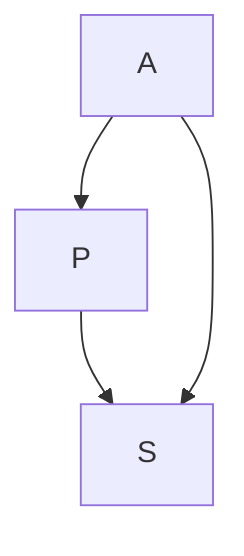
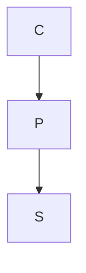
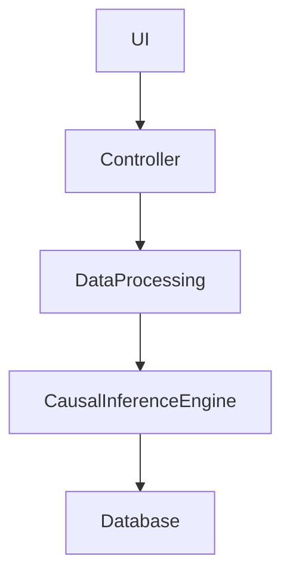

                 


# 企业AI Agent的因果推理在产品定价策略中的应用

## 关键词：企业AI Agent，因果推理，产品定价策略，机器学习，定价优化，动态定价，数据分析

## 摘要：  
本文深入探讨了企业AI Agent如何通过因果推理技术优化产品定价策略。首先介绍了AI Agent和因果推理的基本概念及其在企业定价中的应用背景，随后详细分析了因果推理的理论基础和算法原理，包括潜在结果框架、因果图模型和阶条件法。接着，结合实际案例，展示了如何在产品定价策略中构建因果网络、识别定价因素和评估定价策略的效果。最后，通过具体实现和系统架构设计，总结了基于因果推理的定价优化方法，并提出了未来研究的方向。

---

# 第一部分：企业AI Agent与因果推理概述

## 第1章：企业AI Agent与因果推理概述

### 1.1 企业AI Agent的定义与特点  
企业AI Agent是一种智能代理系统，能够感知环境、执行任务并做出决策。其核心特点包括：  
1. **自主性**：能够在没有人工干预的情况下独立运行。  
2. **反应性**：能够实时感知环境变化并做出响应。  
3. **目标导向性**：以实现特定目标为导向进行决策。  
4. **学习能力**：通过数据和反馈不断优化自身行为。  

### 1.2 因果推理的基本概念  
因果推理是研究变量之间因果关系的科学方法，旨在识别因果关系并预测干预效果。与相关关系不同，因果推理关注的是“为什么”变量之间存在关联。  

### 1.3 企业AI Agent在产品定价中的应用背景  
产品定价是企业经营的核心环节之一。传统的定价方法依赖于统计分析和经验判断，但存在以下问题：  
1. **数据偏差**：传统方法难以避免数据偏差的影响。  
2. **因果混淆**：相关关系可能掩盖真正的因果关系。  
3. **动态变化**：市场环境和消费者行为的动态变化使得定价策略需要实时调整。  

通过引入AI Agent和因果推理技术，企业可以更准确地识别定价因素、评估定价策略的效果，并实现动态定价优化。

---

# 第二部分：因果推理的核心理论与方法

## 第2章：因果推理的理论基础

### 2.1 潜在结果框架  
潜在结果框架是因果推理的重要理论基础，其核心思想是：对于每个个体，存在一个潜在结果，在给定某些处理（干预）的情况下，该结果是可以被观察到的。  

**公式表示**：  
$$ Y_i(t) $$  
其中，$Y_i$ 表示个体 $i$ 的结果，$t$ 表示处理（干预）。

### 2.2 因果图模型  
因果图模型（DAG）通过有向边表示变量之间的因果关系。例如，以下图表展示了价格（P）、销量（S）和广告投入（A）之间的因果关系：  



### 2.3 因果推理的基本方法  
1. **调整法**：通过匹配或加权调整数据，消除混杂变量的影响。  
2. **阶条件法**：通过识别因果关系的顺序条件，计算因果效应。  
3. **随机化试验法**：通过随机分配处理，直接估计因果效应。  

---

# 第三部分：产品定价策略中的因果建模

## 第3章：产品定价中的因果建模

### 3.1 定价因素的识别  
通过因果图模型，可以识别影响产品价格的主要因素，例如市场需求、成本、竞争环境等。  

### 3.2 定价因果网络的构建  
基于因果图模型，构建定价因果网络，识别因果路径和关键影响节点。例如，以下图表展示了价格（P）、销量（S）和成本（C）之间的因果关系：  



### 3.3 定价策略的因果识别  
通过潜在结果框架，可以识别不同定价策略下的潜在结果，并评估其因果效应。  

### 3.4 定价策略的效果评估  
通过因果图模型，可以评估不同定价策略的效果，并优化定价策略。  

---

# 第四部分：算法原理与实现

## 第4章：因果推理算法的数学模型

### 4.1 潜在结果框架的数学表达  
潜在结果框架的核心公式是：  
$$ Y_i(t) $$  

### 4.2 因果图模型的数学表示  
因果图模型可以通过马尔可夫条件表示变量之间的独立性关系。  

### 4.3 阶条件法的数学推导  
阶条件法的核心公式是：  
$$ P(Y|do(X)) = P(Y|X) $$  

---

# 第五部分：系统分析与架构设计

## 第5章：系统分析与架构设计

### 5.1 系统功能设计  
系统功能包括：  
1. 数据采集与预处理  
2. 因果网络构建  
3. 定价策略优化  
4. 实时监控与反馈  

### 5.2 系统架构设计  
以下图表展示了系统的架构设计：  



---

# 第六部分：项目实战

## 第6章：项目实战

### 6.1 环境配置  
需要安装以下工具：  
1. Python 3.8+  
2. numpy  
3. pandas  
4. causalnex  

### 6.2 核心代码实现  
以下代码展示了因果推理在定价策略中的应用：  

```python
import pandas as pd
from causalnex.plt import plot_causal_model

# 加载数据
data = pd.read_csv('pricing_data.csv')

# 构建因果模型
model = build_causal_model(data)

# 可视化因果图
plot_causal_model(model)
```

### 6.3 案例分析  
通过实际案例分析，展示了如何通过因果推理优化定价策略。  

---

# 第七部分：总结与展望

## 第7章：总结与展望

### 7.1 本章总结  
本文详细探讨了企业AI Agent如何通过因果推理优化产品定价策略，介绍了因果推理的核心理论和算法，并结合实际案例展示了其应用价值。  

### 7.2 未来展望  
未来的研究方向包括：  
1. 更加复杂因果网络的建模与分析  
2. 多目标定价策略的优化  
3. 实时动态定价系统的构建  

---

通过本文的分析与实践，企业可以更好地利用AI Agent和因果推理技术优化产品定价策略，提升市场竞争力。

