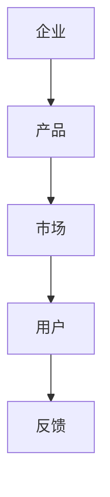
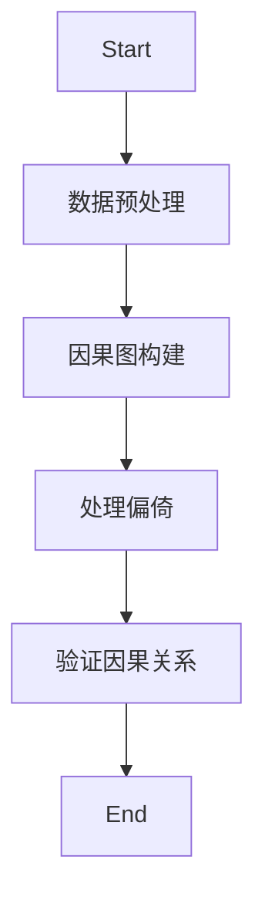
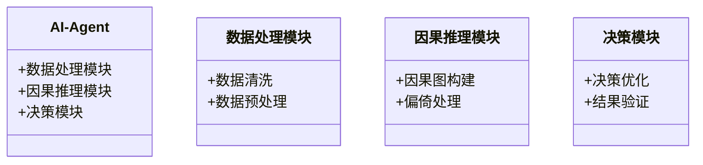
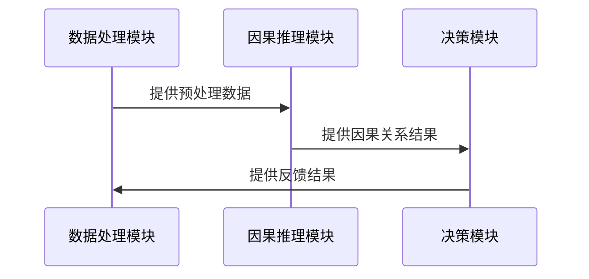

                 


# 企业AI Agent的因果推理在产品开发中的应用

## 关键词：
企业AI Agent, 因果推理, 产品开发, 算法原理, 系统架构, 项目实战

## 摘要：
本文详细探讨了企业AI Agent在产品开发中的因果推理应用，通过背景介绍、核心概念、算法原理、系统架构、项目实战和最佳实践等多个维度，全面解析因果推理在产品开发中的重要性及其实际应用。文章旨在为企业技术决策者、产品经理和技术开发人员提供深入的技术洞察和实践指导，帮助他们更好地理解和应用因果推理技术，提升产品开发效率和决策准确性。

---

# 第一部分: 企业AI Agent的因果推理基础

## 第1章: 企业AI Agent与因果推理概述

### 1.1 问题背景
#### 1.1.1 传统AI推理的局限性
传统AI推理主要依赖于相关性分析，难以处理因果关系。在产品开发中，相关性分析无法解释因果关系，导致决策失误。

#### 1.1.2 因果推理在企业中的需求
企业需要通过因果推理来理解变量之间的因果关系，从而做出更准确的决策。AI Agent作为企业智能决策的核心工具，必须具备因果推理能力。

#### 1.1.3 AI Agent在产品开发中的角色
AI Agent通过因果推理帮助企业在产品开发中预测因果关系，优化产品设计和市场策略。

### 1.2 问题描述
#### 1.2.1 产品开发中的不确定性问题
产品开发中存在许多不确定性，如市场需求变化、用户反馈等，传统统计方法难以处理这些不确定性。

#### 1.2.2 因果推理在决策中的作用
因果推理能够帮助企业在复杂环境中识别因果关系，做出更合理的决策。

#### 1.2.3 AI Agent如何辅助因果推理
AI Agent通过集成因果推理算法，帮助企业识别因果关系，优化产品开发流程。

### 1.3 问题解决
#### 1.3.1 因果推理的基本方法
因果推理的基本方法包括因果图构建、处理偏倚和验证因果关系。

#### 1.3.2 AI Agent在因果推理中的应用
AI Agent通过因果推理算法，帮助企业识别因果关系，优化决策过程。

#### 1.3.3 产品开发中的因果推理案例
通过具体案例说明因果推理在产品开发中的应用，如预测市场需求变化对产品设计的影响。

### 1.4 边界与外延
#### 1.4.1 因果推理的边界条件
因果推理的应用需要满足一定的边界条件，如数据质量和模型假设。

#### 1.4.2 AI Agent的局限性
AI Agent在因果推理中的局限性包括数据不足、模型假设不准确等问题。

#### 1.4.3 产品开发中的因果推理应用场景
说明因果推理在产品开发中的具体应用场景，如产品迭代优化、用户行为预测等。

### 1.5 概念结构与核心要素
#### 1.5.1 因果推理的基本概念
因果推理的基本概念包括因果关系、因果图、偏倚等。

#### 1.5.2 AI Agent的核心要素
AI Agent的核心要素包括数据处理能力、因果推理算法、决策能力等。

#### 1.5.3 产品开发中的因果关系网络
构建产品开发中的因果关系网络，分析各变量之间的因果关系。

---

## 第2章: 因果推理的核心概念与联系

### 2.1 因果推理的原理
#### 2.1.1 因果关系的定义
因果关系是指一个变量的变化会导致另一个变量的变化。因果关系不同于相关性，相关性并不意味着因果关系。

#### 2.1.2 因果图的构建
因果图是一种有向无环图（DAG），用于表示变量之间的因果关系。因果图的构建需要明确变量之间的因果关系。

#### 2.1.3 调度因果推理的基本步骤
调度因果推理的基本步骤包括数据预处理、因果图构建、处理偏倚、验证因果关系。

### 2.2 核心概念对比
#### 2.2.1 因果推理与相关性分析对比
| 对比维度 | 因果推理 | 相关性分析 |
|----------|----------|------------|
| 目的     | 理解因果关系 | 描述变量之间的关系 |
| 方法     | 构建因果图 | 计算相关系数 |
| 应用场景 | 支持决策 | 描述数据分布 |

#### 2.2.2 AI Agent与传统规则推理对比
| 对比维度 | AI Agent | 传统规则推理 |
|----------|----------|--------------|
| 技术基础 | 机器学习、因果推理 | 基于规则的逻辑推理 |
| 应用场景 | 智能决策、产品开发 | 简单逻辑推理问题 |

#### 2.2.3 产品开发中的因果关系与传统数据分析对比
| 对比维度 | 因果关系 | 相关性分析 |
|----------|----------|------------|
| 目的     | 支持决策 | 描述数据分布 |
| 方法     | 构建因果图 | 计算相关系数 |
| 应用场景 | 产品开发中的决策优化 | 数据分析和可视化 |

### 2.3 ER实体关系图


### 2.4 因果推理的算法流程


---

## 第3章: 因果推理算法原理

### 3.1 因果推理的基本算法
#### 3.1.1 调度因果推理
调度因果推理是一种基于因果图的推理方法，用于处理数据中的偏倚。其核心步骤包括因果图构建、处理偏倚、验证因果关系。

#### 3.1.2 贝叶斯网络
贝叶斯网络是一种概率图模型，用于表示变量之间的概率关系。它可以通过概率推理来推断因果关系。

#### 3.1.3 结构方程模型
结构方程模型是一种用于估计变量之间因果关系的方法，通过构建结构方程来表示变量之间的因果关系。

### 3.2 反事实推理
#### 3.2.1 反事实推理的定义
反事实推理是一种通过假设相反事实来推断因果关系的方法。它可以帮助企业在产品开发中预测不同决策的后果。

#### 3.2.2 反事实推理的算法
反事实推理的算法包括构建因果图、计算反事实概率、验证反事实假设。

#### 3.2.3 反事实推理的应用
反事实推理在产品开发中的应用包括预测用户行为、优化产品设计、预测市场需求变化。

---

### 3.3 代码实现
#### 3.3.1 调度因果推理的代码实现
```python
def do_calculus(data, treatment, outcome):
    # 构建因果图
    causal_graph = build_causal_graph(data)
    
    # 处理偏倚
    adjusted_data = adjust_for_confounding(data, causal_graph)
    
    # 验证因果关系
    return calculate_effect(adjusted_data, treatment, outcome)
```

#### 3.3.2 贝叶斯网络的代码实现
```python
import numpy as np
from sklearn.naive_bayes import GaussianNB

# 数据预处理
X = np.array([...])
y = np.array([...])

# 构建贝叶斯网络
model = GaussianNB()
model.fit(X, y)

# 进行概率推理
predictions = model.predict(X)
```

---

## 第4章: 系统分析与架构设计

### 4.1 问题场景介绍
在企业AI Agent的因果推理系统中，我们需要解决的问题包括数据预处理、因果图构建、偏倚处理、验证因果关系等。

### 4.2 系统功能设计
#### 4.2.1 领域模型


#### 4.2.2 系统架构


#### 4.2.3 系统接口设计
系统接口设计包括数据接口、算法接口、结果接口等。

#### 4.2.4 系统交互


---

## 第5章: 项目实战

### 5.1 环境安装
#### 5.1.1 安装Python
安装Python 3.x版本，确保环境兼容性。

#### 5.1.2 安装依赖库
安装必要的Python库，如`numpy`, `scikit-learn`, `networkx`等。

### 5.2 系统核心实现
#### 5.2.1 数据预处理
```python
import pandas as pd
import numpy as np

# 数据预处理
data = pd.read_csv('data.csv')
data = data.dropna()
```

#### 5.2.2 因果图构建
```python
import networkx as nx

def build_causal_graph(data):
    causal_graph = nx.DiGraph()
    # 添加节点
    nodes = data.columns.tolist()
    causal_graph.add_nodes_from(nodes)
    # 添加边
    for i in range(len(nodes)):
        for j in range(i+1, len(nodes)):
            causal_graph.add_edge(nodes[i], nodes[j])
    return causal_graph
```

#### 5.2.3 偏倚处理
```python
def adjust_for_confounding(data, causal_graph):
    # 构建偏倚图
    confounding_vars = [...]  # 根据业务需求确定
    adjusted_data = data.drop(columns=confounding_vars)
    return adjusted_data
```

#### 5.2.4 验证因果关系
```python
def calculate_effect(adjusted_data, treatment, outcome):
    # 计算因果效应
    effect = adjusted_data[outcome].mean() - adjusted_data[treatment].mean()
    return effect
```

### 5.3 案例分析
通过具体案例分析，说明因果推理在产品开发中的实际应用。

### 5.4 项目总结
总结项目实施的经验和教训，提出改进建议。

---

## 第6章: 最佳实践与小结

### 6.1 最佳实践
#### 6.1.1 数据质量的重要性
确保数据质量是因果推理成功的关键。

#### 6.1.2 模型选择的注意事项
选择合适的因果推理模型，根据业务需求和数据特点进行选择。

#### 6.1.3 系统架构的设计要点
系统架构设计要注重模块化和可扩展性。

### 6.2 小结
总结全文内容，强调因果推理在企业AI Agent中的重要性。

### 6.3 注意事项
注意事项包括数据质量、模型选择、系统架构设计等方面。

### 6.4 拓展阅读
推荐相关的书籍和论文，供读者深入学习。

---

通过以上内容，我们系统地介绍了企业AI Agent的因果推理在产品开发中的应用，从理论到实践，为读者提供了全面的技术指导和实践参考。

