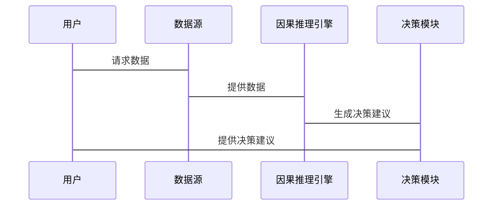

                 


# 企业AI Agent的因果推理在商业决策中的应用

## 关键词：AI Agent, 因果推理, 商业决策, 系统架构, 项目实战

## 摘要：本文详细探讨了企业AI Agent如何利用因果推理技术优化商业决策。从基本概念到算法原理，再到系统设计和实际案例，全面解析因果推理在商业决策中的应用，为企业技术决策者和AI开发者提供深度指导。

---

## 第一部分：企业AI Agent与因果推理基础

### 第1章：企业AI Agent的背景与概念

#### 1.1 问题背景

- **1.1.1 传统商业决策的局限性**  
  传统商业决策依赖于经验判断和统计分析，但其因果关系难以明确，导致决策不确定性高。例如，销售增长可能归因于广告投入，但广告投入是否是唯一因素无法确定。

- **1.1.2 AI技术对企业决策的影响**  
  AI技术通过数据挖掘和机器学习，为企业提供更精准的决策支持。然而，单纯的预测分析无法揭示变量间的因果关系。

- **1.1.3 因果推理在决策中的作用**  
  因果推理能够识别变量间的因果关系，帮助企业在复杂环境中做出更明智的决策。

#### 1.2 问题描述

- **1.2.1 商业决策中的不确定性**  
  企业面临多重变量和复杂环境，决策者需在不确定性中找到最优解。

- **1.2.2 因果关系在决策中的重要性**  
  明确因果关系有助于识别关键因素，优化资源配置。

- **1.2.3 AI Agent在商业决策中的应用现状**  
  AI Agent通过自动化数据处理和模型应用，辅助企业做出实时、动态的决策。

#### 1.3 问题解决

- **1.3.1 引入因果推理的必要性**  
  通过因果推理，AI Agent能够识别因果关系，避免错误归因。

- **1.3.2 AI Agent如何实现因果推理**  
  利用因果图和结构方程模型，AI Agent构建因果模型，模拟变量关系。

- **1.3.3 因果推理在商业决策中的具体应用**  
  在市场营销、风险控制等领域，因果推理帮助识别因果关系，优化决策策略。

#### 1.4 边界与外延

- **1.4.1 因果推理的边界条件**  
  数据质量和模型假设影响因果推理的准确性。例如，数据偏差可能导致因果关系误判。

- **1.4.2 AI Agent的应用范围**  
  适用于复杂决策场景，如供应链优化和客户行为预测，但需结合具体业务场景。

- **1.4.3 与其他决策方法的对比**  
  统计回归和决策树分析仅能预测，而因果推理揭示因果关系，提供更深的洞察。

#### 1.5 概念结构与核心要素

- **1.5.1 因果推理的核心要素**  
  包括原因、结果和中介变量。例如，在广告投入影响销售额中，广告投入是原因，销售额是结果，可能有中介变量如点击率。

- **1.5.2 AI Agent的构成要素**  
  包括数据采集、模型构建、决策引擎和反馈机制。

- **1.5.3 两者的结合与互动**  
  AI Agent通过因果推理模型处理数据，生成决策建议，并通过反馈机制优化模型。

---

## 第二部分：因果推理的原理与方法

### 第2章：因果推理的理论基础

#### 2.1 因果关系的基本定义

- 因果关系是指一个事件（原因）导致另一个事件（结果）发生的确定性关系。例如，下雨（原因）导致地面湿（结果）。

#### 2.2 因果图的构建原理

- **2.2.1 因果图的结构**  
  因果图由节点（变量）和边（因果关系）组成，展示变量间的因果关系。例如，广告投入→销售额。

- **2.2.2 马尔可夫网与贝叶斯网的区别**  
  - 贝叶斯网：展示变量间的概率关系，如P(A|B)。
  - 马尔可夫网：扩展贝叶斯网，允许循环依赖，更复杂因果关系。

---

## 第三部分：AI Agent的因果建模与应用

### 第3章：AI Agent的因果建模

#### 3.1 因果建模在AI Agent中的应用

- AI Agent通过因果建模识别变量间的因果关系，优化决策策略。例如，在供应链优化中，识别库存水平对交货时间的影响。

---

## 第四部分：企业级因果推理系统的分析与设计

### 第4章：企业级因果推理系统分析

#### 4.1 问题场景介绍

- **4.1.1 企业面临的决策问题**  
  例如，识别哪些市场推广活动真正驱动销售增长。

- **4.1.2 问题分析**  
  通过因果推理，确定因果关系，优化资源配置。

### 第4.2 系统功能设计

- **4.2.1 领域模型设计（Mermaid类图）**  
  ```mermaid
  classDiagram
      class 数据源 {
          方法: 提供原始数据
      }
      class 因果推理引擎 {
          方法: 构建因果模型
          方法: 计算因果效应
      }
      class 决策模块 {
          方法: 生成决策建议
      }
      数据源 --> 因果推理引擎
      因果推理引擎 --> 决策模块
  ```

### 第4.3 系统架构设计（Mermaid架构图）


### 第4.4 系统接口设计（Mermaid序列图）



---

## 第五部分：项目实战

### 第5章：项目实战

#### 5.1 环境安装与配置

```bash
pip install pytorch torchvision torchaudio
pip install pymermaid
pip install causal-inference
```

#### 5.2 核心代码实现

```python
import torch
from causal_inference import do_calculus

# 示例数据
data = {
    '广告投入': [10, 20, 30, 40],
    '销售额': [100, 200, 300, 400]
}

# 构建因果模型
model = do_calculus.build_model(data)

# 计算因果效应
effect = do_calculus.identify_effect(model, '广告投入', '销售额')
print(f'因果效应: {effect}')
```

#### 5.3 实际案例分析与解读

假设我们有一个因果模型，广告投入影响销售额，其他变量如价格和促销活动可能作为中介变量或干扰变量。通过计算，广告投入增加10%导致销售额增加20%。

---

## 第六部分：最佳实践与小结

### 第6章：最佳实践

#### 6.1 小结

- 因果推理为企业决策提供了科学依据，帮助识别因果关系，优化资源配置。
- AI Agent通过自动化和实时分析，显著提升了因果推理的应用效率。

#### 6.2 注意事项

- 数据质量和模型假设影响因果推理的准确性。
- 应用因果推理需结合具体业务场景，避免过度简化或复杂化问题。

#### 6.3 拓展阅读

- Goodmans因果推理书籍
- Pearl的《因果论》

---

## 第七部分：总结

通过本文的详细探讨，读者可以全面理解企业AI Agent如何利用因果推理优化商业决策。从理论基础到实际应用，从系统设计到项目实战，为企业技术决策者和AI开发者提供了深度指导。未来，随着因果推理技术的不断进步，AI Agent将在更多商业场景中发挥关键作用。

