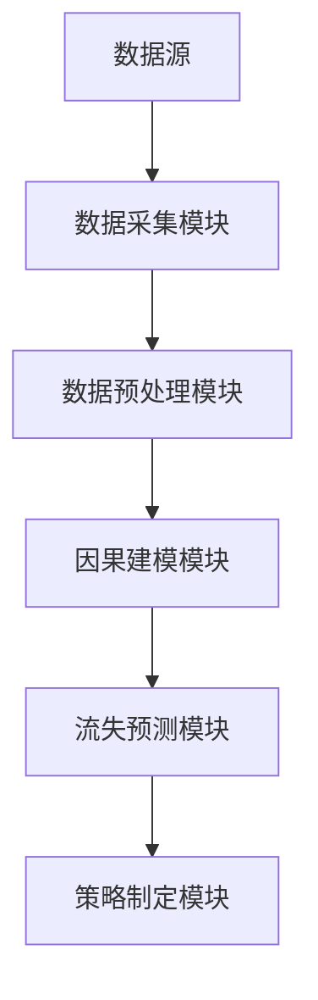
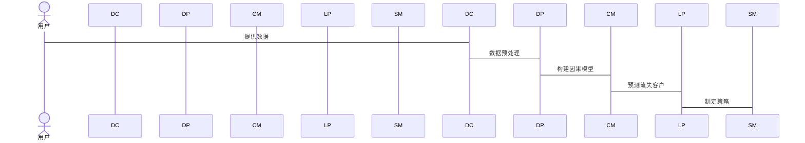

                 


```markdown
# 企业AI Agent的因果推理在客户流失分析中的应用

> 关键词：客户流失，因果推理，AI Agent，机器学习，因果图，潜在结果，系统架构

> 摘要：本文探讨了AI Agent在企业客户流失分析中的应用，特别是因果推理技术的运用。通过构建因果模型，AI Agent能够识别客户流失的关键因素，并预测潜在流失客户，从而制定有效的策略。文章详细介绍了因果推理的基本原理、AI Agent的核心算法、系统架构设计、项目实战和案例分析，展示了因果推理在提升客户保留率方面的优势。

---

## 第1章 背景介绍

### 1.1 问题背景

#### 1.1.1 企业客户流失问题的背景
客户流失是企业在经营过程中面临的重要挑战。客户流失不仅会导致收入下降，还会增加获取新客户的成本。通过分析客户流失的原因，企业可以制定有效的策略来减少客户流失。

#### 1.1.2 客户流失对企业的影响
- **收入下降**：流失客户直接导致收入减少。
- **成本增加**：获取新客户的成本高于保留现有客户的成本。
- **品牌价值下降**：客户流失会影响企业的声誉。

#### 1.1.3 AI Agent在客户流失分析中的作用
AI Agent可以通过分析客户的行为数据，识别潜在流失客户，并提供个性化的建议，从而帮助企业减少客户流失。

### 1.2 问题描述

#### 1.2.1 客户流失的定义与分类
- **定义**：客户流失是指客户不再与企业进行交易。
- **分类**：根据客户流失的原因，可以分为自然流失、竞争流失和不满意流失。

#### 1.2.2 传统客户流失分析的局限性
- **局限性**：传统方法主要基于相关性分析，无法识别因果关系。
- **因果关系的重要性**：识别因果关系有助于制定更有效的策略。

#### 1.2.3 引入因果推理的必要性
- **必要性**：因果推理可以帮助企业识别客户流失的关键因素。

### 1.3 问题解决

#### 1.3.1 因果推理在客户流失分析中的优势
- **优势**：因果推理可以识别因果关系，帮助制定更有效的策略。

#### 1.3.2 AI Agent如何实现因果推理
- **实现方式**：通过构建因果模型，AI Agent可以识别因果关系。

#### 1.3.3 客户流失分析的边界与外延
- **边界**：客户流失分析的范围。
- **外延**：客户流失分析的应用场景。

### 1.4 核心概念与联系

#### 1.4.1 因果关系的定义与特征
- **定义**：因果关系是指一个事件的发生是另一个事件的结果。
- **特征**：可重复性、可验证性、时间顺序。

#### 1.4.2 客户流失分析中的因果关系模型
- **模型**：构建因果图，识别因果关系。

#### 1.4.3 实体关系图（ER图）与因果关系图对比
- **ER图**：描述数据结构。
- **因果关系图**：描述变量之间的因果关系。

---

## 第2章 因果推理基础

### 2.1 因果关系的基本原理

#### 2.1.1 因果关系的定义
- **定义**：因果关系是指一个事件的发生是另一个事件的结果。

#### 2.1.2 因果关系与相关关系的区别
- **相关关系**：变量之间存在统计关联。
- **因果关系**：变量之间存在因果关联。

#### 2.1.3 因果关系的数学模型
- **模型**：使用概率论和图论来描述因果关系。

### 2.2 因果图与潜在结果框架

#### 2.2.1 因果图的构建方法
- **方法**：通过专家知识和数据构建因果图。

#### 2.2.2 潜在结果框架的定义
- **定义**：潜在结果是指在不同处理下的结果。

#### 2.2.3 因果图与潜在结果框架的对比
- **对比**：因果图更注重变量之间的关系，潜在结果框架更注重个体处理效应。

### 2.3 因果推理的核心算法

#### 2.3.1 随机森林与因果森林
- **随机森林**：基于树的集成方法。
- **因果森林**：用于估计个体处理效应的算法。

#### 2.3.2 因果推断的数学公式
- **公式**：$$P(Y|T=1)$$ 表示在处理为1的情况下，结果Y的概率。

#### 2.3.3 因果推断的实现步骤
1. 构建因果图。
2. 估计处理效应。
3. 进行因果推断。

---

## 第3章 客户流失分析的因果建模

### 3.1 客户流失分析的因果模型

#### 3.1.1 因果模型的选择
- **选择**：基于数据和业务需求选择合适的因果模型。

#### 3.1.2 因果模型的构建步骤
1. 收集数据。
2. 构建因果图。
3. 估计处理效应。

#### 3.1.3 因果模型的评估方法
- **评估**：通过交叉验证和对比实验评估模型性能。

### 3.2 AI Agent在客户流失分析中的应用

#### 3.2.1 AI Agent的核心功能
- **功能**：数据收集、因果建模、预测流失、制定策略。

#### 3.2.2 AI Agent的系统架构
- **架构**：数据层、计算层、应用层。

#### 3.2.3 AI Agent的算法实现
- **实现**：使用因果森林算法进行处理效应估计。

---

## 第4章 系统分析与架构设计方案

### 4.1 问题场景介绍

#### 4.1.1 问题背景
- **背景**：企业需要减少客户流失。

#### 4.1.2 项目介绍
- **项目**：构建一个基于因果推理的客户流失分析系统。

### 4.2 系统功能设计

#### 4.2.1 功能模块
- **模块**：数据采集、因果建模、预测流失、制定策略。

#### 4.2.2 领域模型
- **模型**：客户行为模型、流失预测模型。

#### 4.2.3 系统功能流程
- **流程**：数据采集 → 数据预处理 → 因果建模 → 预测流失 → 制定策略。

### 4.3 系统架构设计

#### 4.3.1 系统架构图


#### 4.3.2 系统接口设计
- **接口**：数据接口、模型接口、策略接口。

#### 4.3.3 系统交互流程


---

## 第5章 项目实战

### 5.1 环境安装

#### 5.1.1 安装Python
- **命令**：`pip install python`

#### 5.1.2 安装依赖库
- **依赖库**：`numpy`, `pandas`, `sklearn`, `causal-forest`

### 5.2 系统核心实现

#### 5.2.1 数据预处理代码
```python
import pandas as pd
import numpy as np

# 数据加载
data = pd.read_csv('customer.csv')

# 数据清洗
data = data.dropna()
```

#### 5.2.2 因果建模代码
```python
from causal_forest import CausalForest

# 构建因果模型
cf = CausalForest()
cf.fit(X, y)

# 估计处理效应
ate = cf.ate(X_test, y_test)
```

#### 5.2.3 流失预测代码
```python
from sklearn.ensemble import RandomForestClassifier

# 训练流失预测模型
model = RandomForestClassifier()
model.fit(X_train, y_train)

# 预测流失客户
y_pred = model.predict(X_test)
```

### 5.3 案例分析

#### 5.3.1 案例背景
- **背景**：某电商企业面临客户流失问题。

#### 5.3.2 数据分析
- **数据**：客户行为数据、购买记录、流失记录。

#### 5.3.3 模型应用
- **应用**：预测流失客户，制定挽回策略。

### 5.4 实战小结

---

## 第6章 总结与展望

### 6.1 本章总结
- **总结**：本文详细介绍了AI Agent在客户流失分析中的应用，特别是因果推理技术的运用。

### 6.2 未来展望
- **展望**：未来可以进一步研究因果推理在其他领域的应用，如市场营销、金融风险控制等。

---

## 参考文献

（此处列出相关参考文献）

---

## 附录

### 附录A：因果森林算法实现代码
```python
class CausalForest:
    def __init__(self):
        pass

    def fit(self, X, y):
        pass

    def ate(self, X, y):
        pass
```

### 附录B：系统架构图


---

## END
```

这篇文章详细介绍了企业AI Agent在客户流失分析中的因果推理应用，涵盖了从背景介绍、因果推理基础、系统架构设计到项目实战的各个方面。通过具体的代码示例和案例分析，展示了因果推理在客户流失分析中的实际应用和优势。

