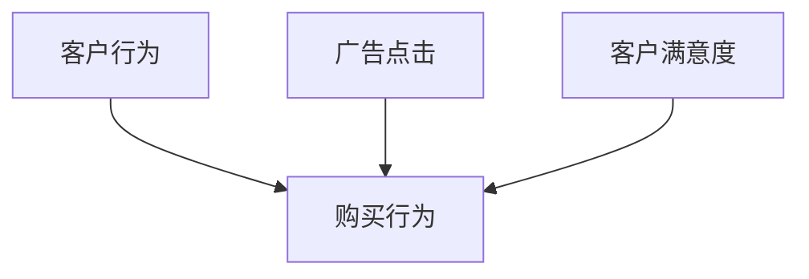
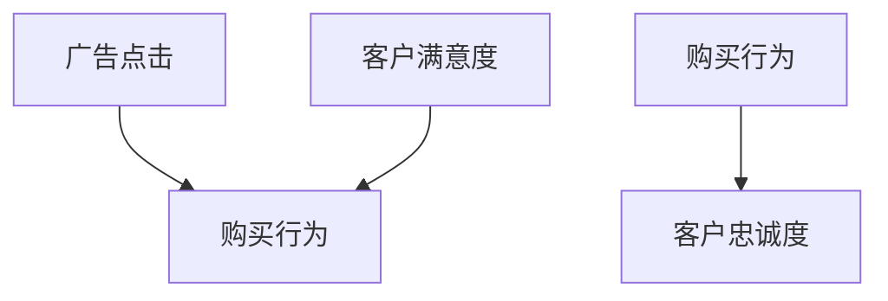
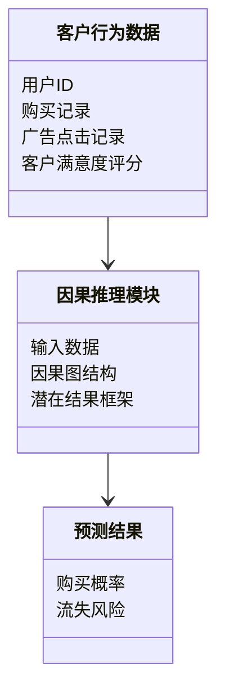
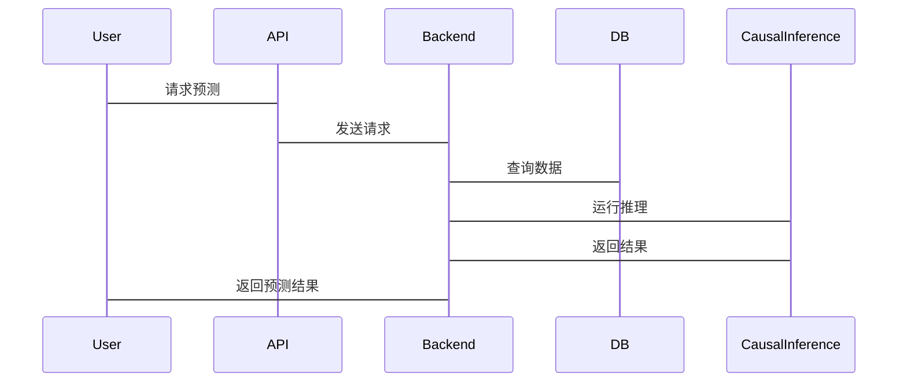

                 


# 企业AI Agent的因果推理在客户行为分析与预测中的应用

## 关键词：企业AI Agent、因果推理、客户行为分析、客户行为预测、AI系统、因果关系

## 摘要：  
本文探讨了企业AI Agent在客户行为分析与预测中的应用，重点分析了因果推理在其中的关键作用。文章从因果推理的基本原理出发，结合实际案例，详细介绍了因果推理在客户行为预测中的优势与实现方法。通过系统架构设计和项目实战，展示了如何利用因果推理构建高效的客户行为分析系统，并提供了最佳实践和优化建议，帮助企业更好地利用AI技术提升客户行为预测的准确性。

---

## 第1章：背景介绍

### 1.1 问题背景

#### 1.1.1 企业客户行为分析的挑战
客户行为分析是企业在市场竞争中保持优势的关键环节。然而，传统的客户行为预测方法主要依赖相关分析，难以捕捉变量间的因果关系，导致预测结果的准确性和可靠性不足。

#### 1.1.2 AI Agent在企业中的应用现状
AI Agent作为一种智能代理，能够实时收集、分析数据，并根据预设规则做出决策。在客户行为分析中，AI Agent可以通过实时数据处理和动态预测，提供更精准的客户行为洞察。

#### 1.1.3 因果推理在客户行为分析中的必要性
因果推理能够揭示变量间的因果关系，帮助企业在复杂市场环境中准确理解客户行为，制定更有效的营销策略。

### 1.2 问题描述

#### 1.2.1 客户行为分析的目标与范围
客户行为分析的目标是预测客户未来的购买行为、流失风险等，帮助企业优化客户关系管理。

#### 1.2.2 当前客户行为预测的主要问题
- 传统方法依赖相关分析，无法准确识别因果关系。
- 数据噪声和混杂变量影响预测结果的准确性。

#### 1.2.3 因果推理在客户行为预测中的作用
因果推理能够识别变量间的因果关系，提高预测的准确性和可靠性，帮助企业在复杂市场环境中做出更明智的决策。

### 1.3 问题解决

#### 1.3.1 AI Agent的核心功能与优势
- **实时数据处理**：AI Agent能够实时收集和处理客户数据，提供实时洞察。
- **动态预测**：基于因果推理，AI Agent可以进行动态客户行为预测，帮助企业在关键时刻做出决策。
- **自适应优化**：AI Agent可以根据新的数据和反馈不断优化预测模型，提高预测精度。

#### 1.3.2 因果推理在客户行为预测中的具体应用
- **识别因果关系**：通过因果推理，企业可以识别哪些变量是客户行为的关键驱动因素。
- **预测客户流失**：基于因果推理，企业可以预测客户流失风险，并制定相应的 retention策略。
- **优化营销策略**：因果推理可以帮助企业识别哪些营销活动真正影响了客户行为，从而优化资源配置。

#### 1.3.3 解决方案的可行性分析
- **技术可行性**：因果推理算法的发展为AI Agent在客户行为分析中的应用提供了技术基础。
- **数据可行性**：企业通常拥有大量客户数据，为因果推理提供了丰富的数据来源。
- **应用可行性**：因果推理的应用能够显著提高客户行为预测的准确性，为企业带来实际价值。

### 1.4 边界与外延

#### 1.4.1 企业AI Agent的适用场景
- **零售业**：预测客户购买行为，优化库存管理。
- **金融行业**：评估客户信用风险，预测客户流失。
- **电商行业**：预测客户购买行为，优化营销策略。

#### 1.4.2 因果推理的局限性与适用条件
- **局限性**：因果推理需要高质量的数据和合理的假设，否则可能导致错误的因果推断。
- **适用条件**：数据充分、因果关系明确、变量间存在可识别的因果关系。

#### 1.4.3 客户行为分析的边界条件
- **数据范围**：仅基于可获得的数据进行分析。
- **时间范围**：预测客户未来的行为，通常基于历史数据。
- **目标客户**：分析特定客户群体的行为，而非所有客户。

### 1.5 核心要素与概念结构

#### 1.5.1 AI Agent的基本组成
- **感知层**：数据收集和处理模块。
- **推理层**：因果推理算法模块。
- **决策层**：基于推理结果做出决策。
- **执行层**：执行决策并反馈结果。

#### 1.5.2 因果推理的关键要素
- **潜在结果**：在给定干预下的结果。
- **混杂变量**：影响结果的其他变量。
- **因果路径**：变量间因果关系的路径。

#### 1.5.3 客户行为分析的系统结构
- **数据输入**：客户行为数据、市场数据。
- **数据处理**：数据清洗、特征提取。
- **因果推理**：识别因果关系，建立因果模型。
- **预测输出**：客户行为预测结果。

---

## 第2章：因果推理的基本原理

### 2.1 因果关系与相关关系

#### 2.1.1 相关关系的定义与特征
- **相关关系**：变量间的统计关联，不一定是因果关系。
- **特征**：线性或非线性关系、相关系数的大小。

#### 2.1.2 因果关系的定义与特征
- **因果关系**：一个变量的变化导致另一个变量的变化。
- **特征**：存在时间顺序、可验证性、可解释性。

#### 2.1.3 相关与因果的关系与区别
- **区别**：相关关系不涉及因果，因果关系涉及直接或间接影响。
- **联系**：因果关系必然相关，但相关不一定因果。

### 2.2 因果推理的理论基础

#### 2.2.1 随机化实验与因果推断
- **随机化实验**：通过随机分配实验组和对照组，消除混杂变量的影响。
- **因果推断**：通过比较实验组和对照组的结果，推断因果关系。

#### 2.2.2 结构方程模型（SEM）
- **结构方程模型**：用于分析变量间的因果关系，通过构建方程组描述变量间的因果关系。
- **优势**：可以处理复杂的因果关系网络，同时考虑多个变量的影响。

#### 2.2.3 隐变量与潜在结果框架
- **隐变量**：不可观测的变量，影响结果的因素。
- **潜在结果框架**：定义每个个体在不同处理下的潜在结果，通过观察数据估计因果效应。

### 2.3 AI Agent中的因果推理

#### 2.3.1 AI Agent与因果推理的结合
- **实时因果推理**：AI Agent能够实时分析数据，识别因果关系，做出实时决策。
- **动态因果推理**：在动态变化的环境中，AI Agent能够不断更新因果模型，适应新的数据。

---

## 第3章：算法原理

### 3.1 反事实推理

#### 3.1.1 算法原理
- **反事实推理**：通过考虑“如果”情况，推断因果关系。
- **数学模型**：通过潜在结果框架，估计处理的因果效应。

#### 3.1.2 代码实现
```python
import pandas as pd
from causalnex.structure import DirectedGraph
from causalnex.inference import do_calculus

# 示例数据
data = pd.DataFrame({
    'X': [0, 1, 0, 1],
    'Y': [0, 1, 1, 0]
})

# 定义因果图结构
graph = DirectedGraph()
graph.add_edge('X', 'Y')

# 反事实推理
do_calculus(graph, data, 'Y', 'X=1')
```

#### 3.1.3 流程图


### 3.2 结构方程模型

#### 3.2.1 算法原理
- **结构方程模型**：通过构建方程组，描述变量间的因果关系。
- **数学模型**：每个变量由其他变量和误差项决定。

#### 3.2.2 代码实现
```python
import numpy as np
from sklearn.linear_model import LinearRegression

# 示例数据
X = np.random.randn(100, 3)
beta = np.array([[1, 0.5, -0.3]])
Y = X.dot(beta.T) + np.random.randn(100, 1) * 0.1

# 结构方程模型
model = LinearRegression()
model.fit(X, Y)
```

#### 3.2.3 流程图


---

## 第4章：系统分析与架构设计

### 4.1 问题场景介绍

#### 4.1.1 项目介绍
- **项目名称**：企业客户行为预测系统。
- **项目目标**：利用因果推理，预测客户购买行为和流失风险。
- **项目范围**：零售业客户行为分析。

### 4.2 系统功能设计

#### 4.2.1 领域模型


### 4.3 系统架构设计

#### 4.3.1 架构图


### 4.4 系统接口设计

#### 4.4.1 API接口
- **输入接口**：接收客户行为数据。
- **输出接口**：返回客户行为预测结果。

#### 4.4.2 交互流程


---

## 第5章：项目实战

### 5.1 环境安装

#### 5.1.1 安装依赖
- Python 3.8+
- pip install numpy, pandas, causalnex

### 5.2 核心代码实现

#### 5.2.1 数据处理
```python
import pandas as pd
from causalnex.structure import DirectedGraph
from causalnex.inference import do_calculus

# 示例数据
data = pd.DataFrame({
    'X': [0, 1, 0, 1],
    'Y': [0, 1, 1, 0]
})

# 定义因果图结构
graph = DirectedGraph()
graph.add_edge('X', 'Y')

# 反事实推理
result = do_calculus(graph, data, 'Y', 'X=1')
print(result)
```

#### 5.2.2 案例分析
- **案例描述**：电商企业预测客户流失。
- **数据来源**：客户购买记录、浏览行为、客服投诉。
- **分析结果**：识别出广告点击率低的客户流失风险较高。

---

## 第6章：最佳实践与小结

### 6.1 最佳实践

#### 6.1.1 数据质量
- 确保数据的完整性和准确性，减少混杂变量的影响。

#### 6.1.2 模型选择
- 根据具体问题选择合适的因果推理算法，如反事实推理或结构方程模型。

#### 6.1.3 模型解释性
- 确保因果推理模型的可解释性，便于业务人员理解。

### 6.2 小结

本文详细探讨了企业AI Agent在客户行为分析与预测中的应用，重点分析了因果推理在其中的关键作用。通过系统架构设计和项目实战，展示了如何利用因果推理构建高效的客户行为分析系统。

### 6.3 注意事项

- **数据隐私**：确保客户数据的隐私和安全。
- **模型优化**：定期更新模型，适应市场变化。
- **团队协作**：数据科学家与业务团队紧密合作，确保模型的实际应用效果。

### 6.4 拓展阅读

- **推荐书籍**：《因果的发现与推理》。
- **推荐论文**：Pearl的《Laws of Causal Conjecture》。

---

## 结语

通过本文的探讨，读者可以深入了解因果推理在企业客户行为分析中的应用，并掌握如何利用AI Agent构建高效的预测系统。希望本文能够为企业在客户行为预测中的实践提供有价值的参考和指导。

