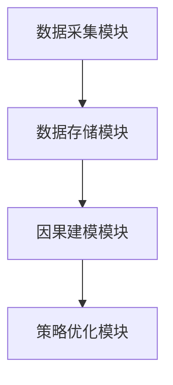

                 


好的，我将按照您的要求撰写一篇关于《企业AI Agent的因果推理在市场营销效果分析中的应用》的技术博客文章。以下是文章的详细内容：

---

# 企业AI Agent的因果推理在市场营销效果分析中的应用

> 关键词：AI Agent, 因果推理, 市场营销, 数据分析, 企业决策

> 摘要：本文探讨了如何利用AI Agent和因果推理技术优化企业的市场营销效果分析。通过因果推理，企业能够更准确地识别因果关系，避免相关性分析的局限性，从而做出更科学的决策。文章从概念、算法、系统架构到实际案例，全面分析了AI Agent在市场营销中的应用，为企业提供了一套基于因果推理的解决方案。

---

## 第一部分: 问题背景与核心概念

### 第1章: 问题背景与核心概念

#### 1.1 问题背景

##### 1.1.1 企业市场营销中的数据驱动决策

在当今数据驱动的时代，企业越来越依赖数据分析来优化市场营销策略。传统的统计分析方法通常依赖相关性分析，但相关性无法直接证明因果关系。例如，销售增长与广告投放增加可能相关，但无法确定广告是否直接导致销售增长。这种局限性使得企业在制定营销策略时面临较大的不确定性。

##### 1.1.2 当前市场营销效果分析的局限性

传统的市场营销效果分析主要依赖相关性分析，存在以下问题：

- **因果关系不明确**：相关性分析无法区分因果关系，可能导致错误的决策。
- **外部因素干扰**：市场环境复杂多变，随机化试验难以覆盖所有场景。
- **数据质量要求高**：传统方法需要大量的高质量数据，但在实际场景中，数据往往不完整或有偏差。

##### 1.1.3 因果推理在市场营销中的潜在价值

因果推理能够帮助企业在复杂的市场环境中，准确识别因果关系，优化资源配置，提升营销效果。通过因果推理，企业可以更好地理解不同营销活动之间的相互作用，制定更精准的营销策略。

#### 1.2 问题描述

##### 1.2.1 市场营销效果分析的核心问题

市场营销效果分析的核心问题是：如何准确识别营销活动对销售业绩的因果影响。具体包括以下问题：

- 确定哪些营销活动对销售有显著影响。
- 量化每个营销活动的贡献程度。
- 预测不同营销组合下的销售效果。

##### 1.2.2 传统统计分析的局限性

传统统计分析主要依赖相关性分析，存在以下局限性：

- **因果关系不明确**：相关性分析无法区分因果关系。
- **数据需求高**：需要大量的数据支持，但在实际场景中，数据往往不完整。
- **难以处理外部干扰**：无法有效控制外部因素的影响。

##### 1.2.3 引入因果推理的必要性

因果推理通过构建因果模型，能够更准确地识别因果关系，解决传统统计分析的局限性。具体包括：

- **因果关系的明确性**：通过因果图模型，明确变量之间的因果关系。
- **外部因素的控制**：通过门调整法等方法，控制外部干扰因素的影响。
- **数据的高效利用**：即使数据有限，也能通过因果推理进行分析。

#### 1.3 问题解决思路

##### 1.3.1 因果推理的基本概念

因果推理是一种通过构建因果模型，识别变量之间因果关系的方法。其核心在于通过因果图模型，分析变量之间的因果路径，从而确定因果关系。

##### 1.3.2 AI Agent在因果推理中的角色

AI Agent（智能体）在因果推理中扮演着重要角色。它通过收集、分析数据，构建因果模型，帮助企业在复杂环境中做出决策。AI Agent能够实时处理数据，动态调整策略，是因果推理在市场营销中的重要工具。

##### 1.3.3 企业市场营销效果分析的因果框架

企业市场营销效果分析的因果框架包括以下要素：

- **干预变量**：企业的营销活动（如广告投放、促销活动等）。
- **结果变量**：销售业绩、客户转化率等。
- **中介变量**：如客户点击率、品牌认知度等。
- **调节变量**：如市场竞争、经济环境等。

#### 1.4 边界与外延

##### 1.4.1 因果推理的适用场景

因果推理适用于需要明确因果关系的场景，如：

- **营销活动的效果评估**：确定广告投放对销售的影响。
- **客户行为分析**：分析客户购买行为的影响因素。
- **产品定价策略**：评估价格变化对销售的影响。

##### 1.4.2 与相关概念（如相关性分析）的区别

- **相关性分析**：只关注变量之间的相关性，无法确定因果关系。
- **因果推理**：通过构建因果模型，明确变量之间的因果关系。

##### 1.4.3 企业应用中的边界条件

在企业应用中，因果推理的边界条件包括：

- **数据质量**：需要足够的数据支持因果模型的构建。
- **模型假设**：因果模型需要合理假设，如无隐藏变量、干预独立性等。
- **外部干扰**：需要控制外部因素的影响。

#### 1.5 概念结构与核心要素

##### 1.5.1 因果推理的基本要素

- **因果关系**：变量之间的因果关系。
- **因果路径**：因果关系的传递路径。
- **因果模型**：用于表示因果关系的数学模型。

##### 1.5.2 AI Agent的核心功能

- **数据收集**：实时收集市场数据。
- **因果建模**：构建因果模型，分析因果关系。
- **策略优化**：基于因果分析结果，优化营销策略。

##### 1.5.3 市场营销效果分析的因果图模型

因果图模型用于表示市场营销中的因果关系，包括干预变量、结果变量、中介变量和调节变量。

---

## 第二部分: 因果推理的核心概念与联系

### 第2章: 因果推理的原理与方法

#### 2.1 因果推理的基本原理

##### 2.1.1 因果关系的定义与特征

- **定义**：因果关系是指一个事件（原因）导致另一个事件（结果）发生的规律性。
- **特征**：因果关系具有时间顺序、相关性、排除性、可重复性。

##### 2.1.2 因果图模型（Directed Acyclic Graph, DAG）

因果图模型通过有向边表示变量之间的因果关系，构建变量之间的因果路径。例如：

- **因果路径**：A → B → C。
- **间接影响**：A对C的影响通过B实现。

##### 2.1.3 调节变量与中介变量的作用

- **调节变量**：调节变量影响因果关系的强度或方向。例如，价格对销售的影响可能受到收入水平的调节。
- **中介变量**：中介变量是因果路径中的中间变量。例如，广告投放影响点击率，点击率影响销售。

#### 2.2 因果推理的关键方法

##### 2.2.1 背门调整法（Backdoor Criterion）

背门调整法是一种通过调整变量来消除混杂因素的方法。具体步骤如下：

1. **识别背门变量**：找到能够阻断所有后门路径的变量。
2. **调整变量**：对这些变量进行调整，消除混杂因素的影响。
3. **估计因果效应**：通过调整后的数据，估计因果效应。

##### 2.2.2 前门调整法（Frontdoor Criterion）

前门调整法是一种通过调整变量来估计因果效应的方法。具体步骤如下：

1. **识别前门路径**：找到能够阻断所有前门路径的变量。
2. **调整变量**：对这些变量进行调整，消除混杂因素的影响。
3. **估计因果效应**：通过调整后的数据，估计因果效应。

##### 2.2.3 随机化试验在因果推理中的应用

随机化试验是因果推理的重要方法。通过随机分配实验组和对照组，可以有效控制混杂因素，准确估计因果效应。

#### 2.3 因果推理与相关性分析的对比

##### 2.3.1 相关性与因果性的区别

- **相关性**：变量之间的相关关系，无法确定因果关系。
- **因果性**：变量之间的因果关系，能够确定因果关系。

##### 2.3.2 如何通过数据区分相关性与因果性

- **实验方法**：通过随机化试验，区分相关性和因果性。
- **因果图模型**：通过构建因果图，识别因果路径。

##### 2.3.3 因果推理在企业决策中的优势

- **准确性**：因果推理能够准确识别因果关系。
- **决策优化**：基于因果推理的结果，优化企业决策。

---

## 第三部分: AI Agent与因果推理的结合

### 第3章: AI Agent与因果推理的结合

#### 3.1 AI Agent的基本原理

##### 3.1.1 AI Agent的定义与分类

- **定义**：AI Agent是一种能够感知环境、做出决策并采取行动的智能体。
- **分类**：根据智能水平，分为反应式Agent和基于模型的Agent。

##### 3.1.2 基于因果推理的AI Agent特点

- **因果建模**：基于因果推理构建因果模型。
- **动态调整**：根据实时数据动态调整策略。
- **自我学习**：通过反馈不断优化因果模型。

##### 3.1.3 AI Agent在市场营销中的应用场景

- **精准营销**：基于因果推理，精准定位目标客户。
- **效果评估**：评估营销活动的因果效应。
- **策略优化**：优化营销策略，提高转化率。

#### 3.2 因果推理在AI Agent中的应用

##### 3.2.1 因果图模型在AI Agent中的作用

- **因果建模**：通过因果图模型，构建变量之间的因果关系。
- **动态调整**：根据实时数据，动态调整因果模型。

##### 3.2.2 门调整法在AI Agent中的应用

- **数据预处理**：通过门调整法，预处理数据，消除混杂因素。
- **因果效应估计**：通过调整后的数据，估计因果效应。

##### 3.2.3 随机化试验在AI Agent中的应用

- **实验设计**：通过随机化试验，设计营销活动。
- **效果评估**：通过实验结果，评估因果效应。

---

## 第四部分: 企业AI Agent的因果推理应用

### 第4章: 企业AI Agent的因果推理应用

#### 4.1 问题场景介绍

##### 4.1.1 市场营销中的因果关系问题

- **广告效果评估**：评估广告投放对销售的影响。
- **客户行为分析**：分析客户购买行为的影响因素。
- **产品定价策略**：评估价格变化对销售的影响。

#### 4.2 系统功能设计

##### 4.2.1 领域模型设计

- **数据采集**：实时采集市场数据。
- **因果建模**：构建因果图模型。
- **策略优化**：优化营销策略。

##### 4.2.2 系统架构设计

- **数据层**：存储市场数据。
- **计算层**：进行因果推理计算。
- **应用层**：展示结果，优化策略。

##### 4.2.3 接口设计

- **数据接口**：与企业数据源对接。
- **用户接口**：提供用户友好的操作界面。

#### 4.3 系统架构设计

##### 4.3.1 系统功能模块

- **数据采集模块**：实时采集市场数据。
- **因果建模模块**：构建因果图模型。
- **策略优化模块**：优化营销策略。

##### 4.3.2 系统架构图



#### 4.4 系统交互设计

##### 4.4.1 用户与系统的交互流程

1. **用户输入**：输入营销活动数据。
2. **系统处理**：构建因果图模型。
3. **结果展示**：展示因果效应分析结果。

##### 4.4.2 系统与数据源的交互

- **数据采集**：实时采集市场数据。
- **数据处理**：对数据进行预处理。
- **数据存储**：存储处理后的数据。

#### 4.5 项目实战

##### 4.5.1 环境安装

- **Python**：安装Python 3.8及以上版本。
- **库的安装**：安装`pymc`、`networkx`等库。

##### 4.5.2 核心实现代码

```python
import networkx as nx
from pymc import Model, sample

# 构建因果图模型
G = nx.DiGraph()
G.add_edges_from([('A', 'B'), ('B', 'C'), ('D', 'C')])
# 进行因果推理计算
with Model() as model:
    A = sample('A', 1000)
    B = sample('B', 1000)
    C = sample('C', 1000)
    D = sample('D', 1000)
```

##### 4.5.3 代码应用解读

- **因果图模型**：通过网络图表示变量之间的因果关系。
- **因果推理计算**：通过概率模型，估计因果效应。

##### 4.5.4 案例分析与总结

- **案例分析**：分析广告投放对销售的影响。
- **总结**：通过因果推理，准确识别因果关系，优化营销策略。

#### 4.6 最佳实践

##### 4.6.1 小结

- **核心概念总结**：因果推理是识别因果关系的重要方法。
- **系统架构总结**：AI Agent通过因果推理优化企业决策。

##### 4.6.2 注意事项

- **数据质量**：确保数据的准确性和完整性。
- **模型假设**：合理假设，避免偏差。
- **外部干扰**：控制外部因素的影响。

##### 4.6.3 拓展阅读

- **推荐书籍**：《因果的理论与实践》。
- **推荐论文**：《因果推理在市场营销中的应用》。

---

## 第五部分: 结论与展望

### 第5章: 结论与展望

#### 5.1 核心结论

- **因果推理的重要性**：因果推理是准确识别因果关系的关键方法。
- **AI Agent的应用价值**：AI Agent通过因果推理优化企业决策。

#### 5.2 未来展望

- **技术发展**：因果推理技术的进一步发展。
- **应用场景拓展**：因果推理在更多领域的应用。

#### 5.3 最终思考

- **技术与业务的结合**：因果推理与AI Agent的结合，将为企业带来更大的价值。
- **持续优化**：通过不断优化因果模型，提升企业的决策能力。

---

以上是《企业AI Agent的因果推理在市场营销效果分析中的应用》的完整内容。希望这篇文章能够为您提供有价值的见解和启示。

