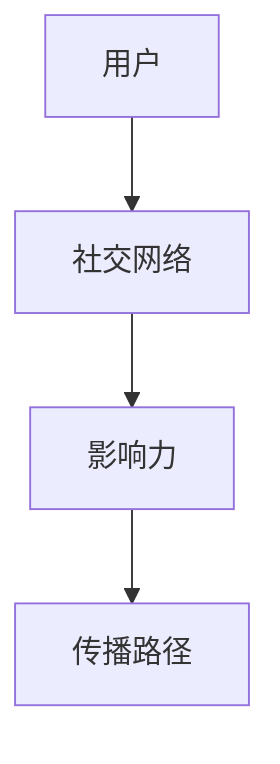
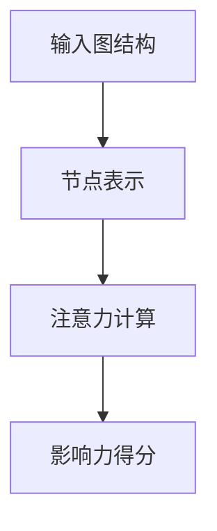
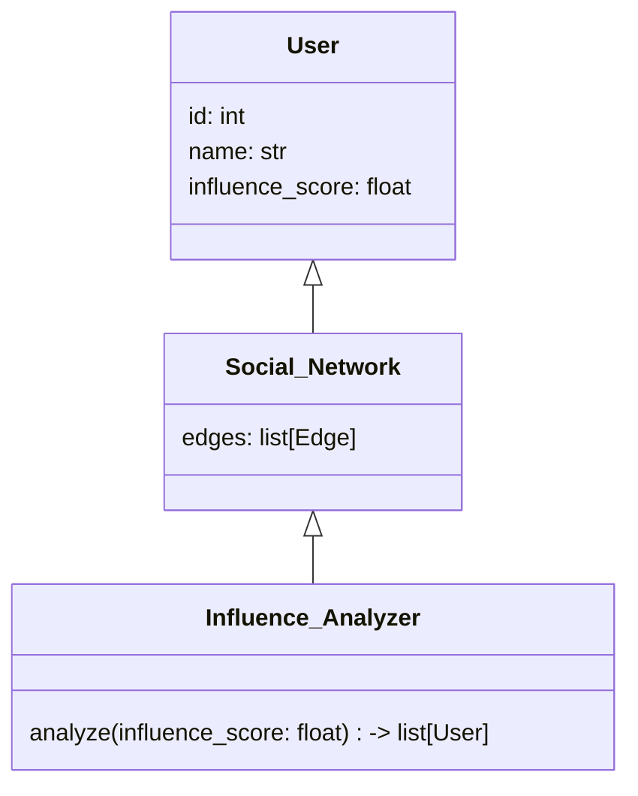
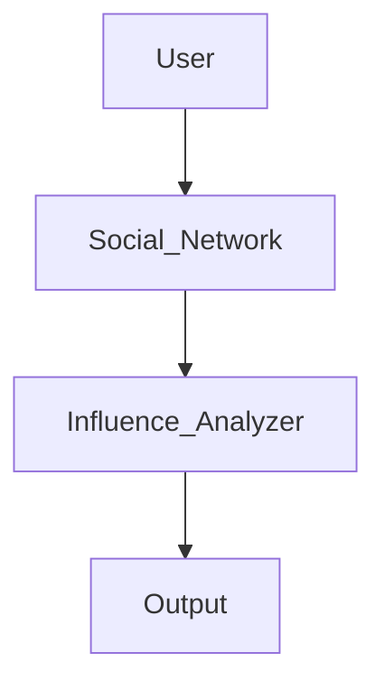
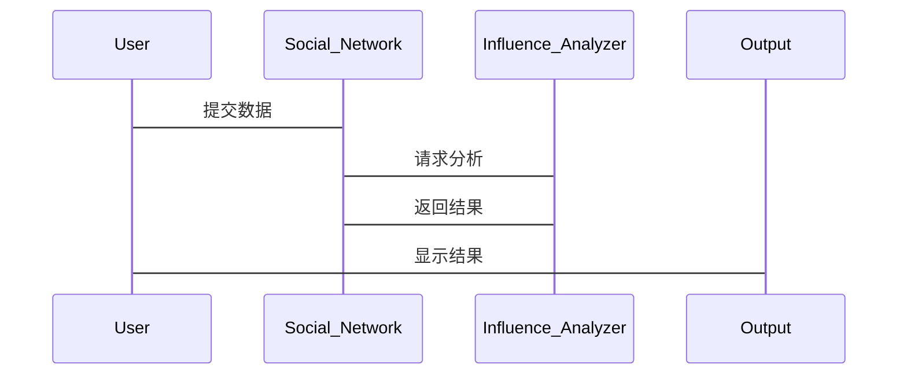

                 


# 《企业AI Agent的图注意力网络在社交网络影响力分析中的应用》

> 关键词：企业AI Agent, 图注意力网络, 社交网络, 影响力分析, 深度学习

> 摘要：本文深入探讨了企业AI Agent在社交网络影响力分析中的应用，重点介绍了图注意力网络（Graph Attention Network, GAT）在其中的核心作用。通过分析影响力传播机制、AI Agent的功能需求以及图注意力网络的算法原理，本文详细讲解了如何利用GAT模型实现高效的影响力分析，并通过实际案例展示了其在企业中的应用价值。

---

# 第一部分: 企业AI Agent与图注意力网络概述

---

## 第1章: 企业AI Agent与图注意力网络背景介绍

### 1.1 问题背景

#### 1.1.1 社交网络影响力分析的重要性
在当今高度互联的数字时代，社交网络已成为企业信息传播和品牌推广的重要渠道。影响力分析能够帮助企业识别关键意见领袖（KOL）、评估营销策略的效果以及优化资源配置。

#### 1.1.2 传统影响力分析的局限性
传统的影响力分析方法通常基于中心性指标（如度中心性、接近中心性等），但这些方法难以捕捉复杂的社交关系和非线性传播路径，导致结果不够精准。

#### 1.1.3 AI Agent在企业中的应用需求
AI Agent（智能体）能够实时感知环境、自主决策并执行任务，这使得其在社交网络分析中具有巨大的潜力。企业需要一种智能化的解决方案来应对动态变化的社交网络环境。

### 1.2 问题描述

#### 1.2.1 社交网络中的影响力定义
影响力是指某个节点（用户或内容）在网络中传播信息的能力。影响力分析的目标是量化每个节点的影响力，并预测信息传播的范围。

#### 1.2.2 基于图结构的影响力传播机制
社交网络本质上是图结构，影响力传播遵循特定的规则，如扩散模型（Diffusion Model）和谣言模型（Rumor Model）。

#### 1.2.3 企业AI Agent的目标与挑战
AI Agent的目标是通过实时分析社交网络数据，为企业提供精准的影响力分析结果。其主要挑战在于如何处理海量数据、捕捉复杂关系以及实现高效的实时计算。

### 1.3 问题解决与边界

#### 1.3.1 图注意力网络的核心作用
图注意力网络（GAT）通过引入注意力机制，能够更好地捕捉图结构中的关键节点和关系，从而提升影响力分析的准确性。

#### 1.3.2 AI Agent在影响力分析中的边界
AI Agent的功能边界包括数据采集、模型训练和结果输出，但不涉及具体的企业策略制定。

#### 1.3.3 企业应用场景的外延
影响力分析的应用场景包括市场营销、舆情监控、品牌推广和客户关系管理等。

### 1.4 核心概念结构

#### 1.4.1 图注意力网络的基本组成
图注意力网络由图结构、节点表示和注意力机制三部分组成。

#### 1.4.2 AI Agent的系统架构
AI Agent的系统架构包括数据采集模块、模型训练模块和结果输出模块。

#### 1.4.3 影响力分析的数学模型
影响力分析的数学模型基于图注意力网络的节点表示和注意力权重计算。

---

## 第2章: 图注意力网络与影响力分析的核心概念

### 2.1 图注意力网络原理

#### 2.1.1 图结构与节点表示
图结构由节点和边组成，节点表示通过向量形式捕获节点的特征信息。

#### 2.1.2 注意力机制的引入
注意力机制通过计算节点之间的注意力权重，确定哪些节点对当前节点的影响力贡献更大。

#### 2.1.3 图注意力网络的数学模型
图注意力网络的节点表示公式为：
$$ v_i = \sum_{j} \alpha_{ij} v_j $$
其中，$\alpha_{ij}$ 是注意力权重，计算公式为：
$$ \alpha_{ij} = \frac{e^{q_i^T k_j}}{\sum_{l} e^{q_i^T k_l}} $$

### 2.2 AI Agent与影响力分析的关系

#### 2.2.1 AI Agent的定义与功能
AI Agent是一种能够自主感知环境、决策并执行任务的智能体。

#### 2.2.2 影响力分析的核心指标
影响力分析的核心指标包括影响力得分、传播范围和传播速度。

#### 2.2.3 图注意力网络在影响力分析中的应用
图注意力网络能够捕捉社交网络中的关键节点和关系，从而提升影响力分析的准确性。

### 2.3 核心概念对比分析

#### 2.3.1 图注意力网络与传统图模型对比
| 特性 | 图注意力网络 | 传统图模型 |
|------|--------------|------------|
| 节点表示 | 引入注意力权重 | 基于度数或相似性 |
| 计算复杂度 | 较高 | 较低 |
| 性能 | 更精准 | 较低 |

#### 2.3.2 AI Agent与传统影响力分析方法对比
| 特性 | AI Agent | 传统方法 |
|------|----------|----------|
| 自主性 | 高 | 低 |
| 实时性 | 高 | 低 |
| 精准度 | 高 | 中等 |

#### 2.3.3 影响力传播机制的对比
| 传播模型 | 基于GAT的影响力传播 | 传统扩散模型 |
|----------|-------------------|--------------|
| 基础 | 图注意力网络 | 图结构 |
| 优势 | 精准捕捉关键节点 | 简单易实现 |
| 局限性 | 计算复杂度高 | 精准度较低 |

### 2.4 ER实体关系图架构



---

## 第3章: 图注意力网络的算法原理

### 3.1 图注意力网络算法流程



### 3.2 算法数学模型

#### 3.2.1 节点表示向量的构建
节点表示向量 $v_i$ 通过注意力机制计算得到：
$$ v_i = \sum_{j} \alpha_{ij} v_j $$

#### 3.2.2 注意力权重的计算
注意力权重 $\alpha_{ij}$ 通过查询（query）和键（key）的点积计算：
$$ \alpha_{ij} = \frac{e^{q_i^T k_j}}{\sum_{l} e^{q_i^T k_l}} $$

#### 3.2.3 影响力传播的公式
影响力传播的最终得分 $I_i$ 可以表示为：
$$ I_i = \sum_{j} \beta_{ij} I_j $$

### 3.3 算法实现步骤

#### 3.3.1 数据预处理
- 将社交网络数据转换为图结构。
- 提取节点特征向量。

#### 3.3.2 模型训练
- 初始化模型参数。
- 训练模型，计算节点表示和注意力权重。
- 计算影响力得分。

#### 3.3.3 结果输出
- 输出每个节点的影响力得分。
- 根据需求进行排序和筛选。

### 3.4 通俗易懂的举例说明

假设有一个简单的社交网络，包含3个用户：A、B、C。A是关键节点，影响力较大。通过图注意力网络计算，我们可以得到A的影响力得分高于B和C。

---

## 第4章: 系统分析与架构设计方案

### 4.1 问题场景介绍
假设某企业希望利用AI Agent分析其品牌在社交媒体上的影响力。目标是识别关键意见领袖，优化营销策略。

### 4.2 系统功能设计

#### 4.2.1 领域模型


#### 4.2.2 系统架构设计


#### 4.2.3 系统接口设计
- 输入接口：接受社交网络数据。
- 输出接口：返回影响力分析结果。

#### 4.2.4 系统交互设计


---

## 第5章: 项目实战

### 5.1 环境安装
- 安装Python和必要的库（如NumPy、PyTorch）。
- 安装社交网络数据集（如Twitter数据）。

### 5.2 核心实现代码

```python
import torch
import torch.nn as nn
import torch.nn.functional as F

class GATLayer(nn.Module):
    def __init__(self, in_features, out_features):
        super(GATLayer, self).__init__()
        self.w_q = nn.Linear(in_features, out_features)
        self.w_k = nn.Linear(in_features, out_features)
    
    def forward(self, x, adj):
        q = self.w_q(x)
        k = self.w_k(x)
        attention = F.softmax((q @ k.T) * 0.5, dim=-1)
        x = (attention @ x)
        return x

class InfluenceAnalyzer(nn.Module):
    def __init__(self, input_dim, hidden_dim):
        super(InfluenceAnalyzer, self).__init__()
        self.gat = GATLayer(input_dim, hidden_dim)
        self.fc = nn.Linear(hidden_dim, 1)
    
    def forward(self, x, adj):
        x = self.gat(x, adj)
        influence_score = self.fc(x)
        return influence_score
```

### 5.3 代码解读与分析
- `GATLayer`实现图注意力网络的基本单元，包含查询和键的计算。
- `InfluenceAnalyzer`将图注意力网络与全连接层结合，输出影响力得分。

### 5.4 实际案例分析
以Twitter数据为例，训练模型后，可以识别出关键用户的影响力得分，并用于优化营销策略。

### 5.5 项目小结
通过项目实战，验证了图注意力网络在影响力分析中的有效性，并展示了如何将其应用于实际企业场景。

---

## 第6章: 最佳实践与注意事项

### 6.1 小结
- 图注意力网络能够有效捕捉社交网络中的关键节点和关系。
- AI Agent为企业提供了智能化的影响力分析工具。

### 6.2 注意事项
- 数据质量对模型性能影响重大，需确保数据的完整性和准确性。
- 模型训练需要大量计算资源，建议使用云计算或分布式计算。

### 6.3 拓展阅读
- 关注最新的图神经网络研究。
- 探索其他影响力分析模型（如GCN、GraphSAGE）。

---

## 第7章: 未来展望

随着社交网络的不断发展，图注意力网络在影响力分析中的应用将更加广泛。未来的研究方向包括：
1. 更高效的算法优化。
2. 多模态数据的融合。
3. 实时影响力分析的实现。

---

通过以上结构，本文全面介绍了企业AI Agent在社交网络影响力分析中的应用，从理论到实践，为读者提供了深入的指导和参考。

