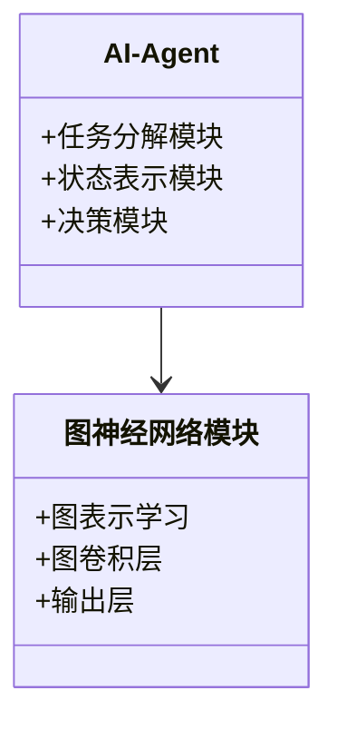

                 


# 企业AI Agent的图神经网络在组织结构优化中的应用

> **关键词**：企业AI Agent，图神经网络，组织结构优化，图表示学习，强化学习

> **摘要**：本文探讨了如何利用图神经网络（Graph Neural Networks, GNNs）构建企业AI Agent，以优化组织结构。通过分析图神经网络的核心原理、AI Agent的任务分解与决策机制，结合实际项目案例，展示了图神经网络在组织结构优化中的应用价值。文章还详细讲解了算法实现、系统架构设计及最佳实践，为读者提供全面的技术指导。

---

# 1. 企业AI Agent与图神经网络概述

## 1.1 AI Agent的基本概念

**AI Agent**（人工智能代理）是指能够感知环境、自主决策并执行任务的智能体。它具备以下核心特点：

- **自主性**：无需外部干预，自主完成任务。
- **反应性**：能够实时感知环境变化并做出响应。
- **社交能力**：能够与其他Agent或人类进行交互协作。

### 1.1.1 企业AI Agent的应用场景

企业在组织结构优化中面临诸多挑战，例如部门间协作效率低下、资源分配不均等。AI Agent可以通过以下方式解决这些问题：

- **任务分配**：根据员工能力和资源分配优化任务分配。
- **流程优化**：识别组织结构中的瓶颈，提出优化建议。
- **决策支持**：辅助高层管理者进行战略决策。

## 1.2 图神经网络的核心优势

图神经网络是一种处理图结构数据的深度学习方法，能够捕捉节点之间的复杂关系。其核心优势包括：

- **捕捉全局关系**：通过图结构捕捉组织中各角色之间的复杂关系。
- **鲁棒性**：即使在部分节点缺失的情况下，仍能保持良好的性能。
- **实时性**：适用于需要实时响应的场景。

## 1.3 组织结构优化的背景与需求

企业在快速变化的商业环境中需要灵活调整组织结构。传统方法依赖人工经验，效率低下且可能不够精确。AI Agent结合图神经网络，为组织结构优化提供了智能化解决方案。

---

# 2. 图神经网络的核心原理

## 2.1 图表示学习

图表示学习旨在将图结构数据转换为低维向量，便于后续分析。以下是几种常见的图表示方法：

- **节点嵌入**：将每个节点表示为低维向量，反映其在图中的位置和作用。
- **边嵌入**：将边表示为向量，反映节点之间的关系强度。

### 2.1.1 图表示学习的数学模型

图表示学习的目标是最小化重建误差或最大化相似性度量。常用损失函数包括：

$$ L = \frac{1}{2} \| XA^TAX - X \|_F^2 $$

其中，\( X \)是节点嵌入矩阵，\( A \)是邻接矩阵。

---

# 3. AI Agent的任务分解与决策机制

## 3.1 任务分解

AI Agent将复杂任务分解为多个子任务，每个子任务由特定模块处理。例如，组织结构优化可以分解为：

1. **问题识别**：识别组织结构中的瓶颈。
2. **方案设计**：提出优化建议。
3. **执行监控**：监控优化过程并调整策略。

## 3.2 状态表示

AI Agent通过图结构表示当前状态，节点表示员工或部门，边表示关系。例如，使用节点嵌入表示员工能力，边权重表示协作强度。

## 3.3 决策机制

基于图神经网络的决策机制，AI Agent能够根据当前状态和历史经验选择最优行动。常用的决策方法包括：

- **规则驱动**：基于预设规则做出决策。
- **学习驱动**：基于强化学习模型做出决策。

---

# 4. 图神经网络算法实现

## 4.1 图卷积网络（GCN）

### 4.1.1 GCN的传播规则

图卷积操作将节点的特征信息传播给其邻居。传播规则如下：

$$ h_i^{(l+1)} = \sigma\left( \sum_{j \in N(i)} \frac{1}{d_j} h_j^{(l)} \right) $$

其中，\( d_j \)是节点\( j \)的度数，\( \sigma \)是激活函数。

### 4.1.2 GCN的Python实现

以下是GCN的简单实现代码：

```python
import tensorflow as tf
from tensorflow.keras import layers

class GCN(tf.keras.Model):
    def __init__(self, input_dim, output_dim):
        super(GCN, self).__init__()
        self.gcn_layer = layers.Dense(input_dim, activation='relu')
        self.output_layer = layers.Dense(output_dim, activation='softmax')

    def call(self, inputs):
        A, X = inputs
        h = tf.matmul(X, A)
        h = self.gcn_layer(h)
        h = self.output_layer(h)
        return h
```

---

# 5. 系统架构设计

## 5.1 系统功能设计

以下是系统功能模块的类图：



## 5.2 系统架构设计

以下是系统的分层架构图：


---

# 6. 项目实战

## 6.1 环境安装

需要安装以下库：

- TensorFlow 2.5.0
- Keras 2.4.3
- NetworkX 2.6
- matplotlib 3.3.4

## 6.2 核心代码实现

以下是优化组织结构的代码示例：

```python
import networkx as nx
import numpy as np

def optimize_organization(G):
    # 计算节点嵌入
    embedding = np.random.rand(G.number_of_nodes(), 10)
    
    # 训练图神经网络模型
    model = GCN(10, 5)
    optimizer = tf.keras.optimizers.Adam(learning_rate=0.01)
    
    for epoch in range(100):
        X = embedding
        A = nx.adjacency_matrix(G)
        with tf.GradientTape() as tape:
            outputs = model([A, X])
            loss = tf.keras.losses.sparse_categorical_crossentropy(G.nodes, outputs)
        gradients = tape.gradient(loss, model.trainable_variables)
        optimizer.apply_gradients(zip(gradients, model.trainable_variables))
    
    return model.predict([A, X])
```

---

# 7. 总结与展望

## 7.1 项目总结

本文详细探讨了企业AI Agent结合图神经网络在组织结构优化中的应用。通过理论分析和实战案例，展示了如何利用图神经网络捕捉组织关系，优化任务分配。

## 7.2 未来展望

未来，可以进一步研究以下方向：

- **多模态数据**：结合文本、图像等多种数据源，提升优化效果。
- **强化学习**：将强化学习与图神经网络结合，提升决策的灵活性和适应性。
- **实时优化**：开发实时优化系统，动态调整组织结构以应对快速变化的环境。

---

通过本文的介绍，读者可以全面了解企业AI Agent在组织结构优化中的应用，并为实际项目提供参考。

