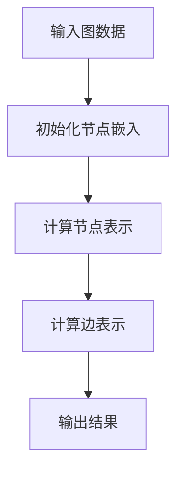
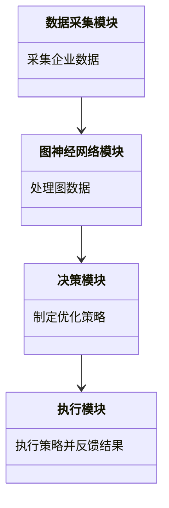
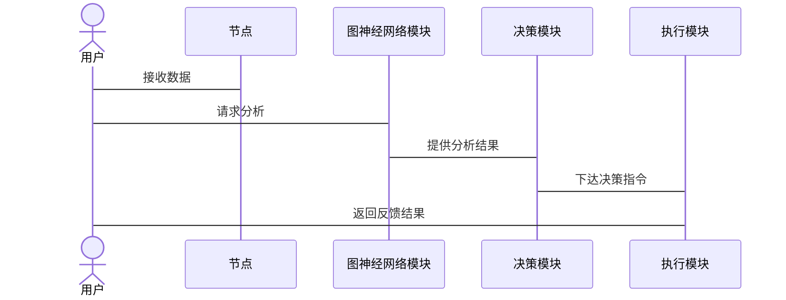

                 


# 企业AI Agent的图神经网络在组织网络优化中的应用

> **关键词**: 企业AI Agent, 图神经网络, 组织网络优化, 算法原理, 系统架构设计

> **摘要**: 本文深入探讨了企业AI Agent在组织网络优化中的应用，重点分析了图神经网络在其中的核心作用。通过详细讲解图神经网络的数学基础、算法原理、系统架构设计以及项目实战，本文为读者提供了从理论到实践的全面指导。文章最后总结了最佳实践和未来的发展方向。

---

## 第1章: 企业AI Agent与图神经网络概述

### 1.1 企业AI Agent的定义与特点

#### 1.1.1 企业AI Agent的定义
企业AI Agent是一种能够感知环境、自主决策并执行任务的智能体。它结合了人工智能、大数据分析和自动化技术，能够在复杂的企业环境中优化资源分配、提升效率并解决问题。

#### 1.1.2 企业AI Agent的核心特点
- **自主性**: 能够自主决策，无需人工干预。
- **反应性**: 能够实时感知环境变化并做出响应。
- **学习能力**: 可以通过数据学习和优化自身算法。
- **协作性**: 能够与其他系统或AI Agent协同工作。

#### 1.1.3 企业AI Agent与传统AI的区别
| 特性          | 传统AI                  | 企业AI Agent            |
|---------------|-------------------------|--------------------------|
| 智能水平       | 基于规则或预设模型       | 具备自主学习和决策能力   |
| 适应性         | 固定场景应用             | 能够适应复杂动态环境     |
| 交互方式       | 单向输入输出             | 支持多轮交互和协作        |

### 1.2 图神经网络的定义与特点

#### 1.2.1 图神经网络的定义
图神经网络是一种基于图结构数据的深度学习模型，能够处理节点之间的关系和连接。它通过聚合邻居节点的信息来更新节点表示，从而捕捉图中的复杂关系。

#### 1.2.2 图神经网络的核心特点
- **图结构表示**: 能够处理复杂的非结构化数据，如社交网络、知识图谱等。
- **节点与边的表示**: 同时关注节点和边的信息，能够捕捉图中的丰富关系。
- **全局视角**: 能够从全局角度理解图的结构和节点之间的关系。

#### 1.2.3 图神经网络与传统神经网络的区别
| 特性          | 传统神经网络             | 图神经网络               |
|---------------|--------------------------|--------------------------|
| 输入数据类型   | 一维向量或二维图像         | 图结构数据（节点和边）    |
| 数据处理方式   | 无法捕捉数据间的关联性     | 能够捕捉节点间的关联性   |
| 应用场景       | 图像识别、自然语言处理     | 社交网络分析、推荐系统等  |

### 1.3 企业AI Agent在组织网络优化中的应用前景

#### 1.3.1 企业AI Agent的潜在应用领域
- **资源优化**: 包括人力资源分配、设备调度等。
- **决策支持**: 基于历史数据和实时信息，辅助企业做出更优决策。
- **风险管理**: 识别潜在风险并制定应对策略。

#### 1.3.2 企业AI Agent在组织网络优化中的优势
- **高效性**: 能够快速处理大量数据并给出优化建议。
- **准确性**: 基于深度学习算法，能够做出高精度的预测和决策。
- **适应性**: 能够根据环境变化动态调整策略。

#### 1.3.3 企业AI Agent应用的挑战与机遇
- **挑战**: 数据隐私问题、模型可解释性不足、计算资源需求大。
- **机遇**: 提高企业效率、降低成本、增强竞争力。

---

## 第2章: 图神经网络的数学基础

### 2.1 图论基础

#### 2.1.1 图的定义与表示
图由节点（顶点）和边（连接节点的边）组成，可以表示为 $G = (V, E)$，其中 $V$ 是节点集合，$E$ 是边集合。

#### 2.1.2 邻接矩阵与邻接表
- **邻接矩阵**: 一个 $n \times n$ 的矩阵，表示节点之间的连接情况。$A_{i,j} = 1$ 表示节点 $i$ 和 $j$ 之间有边相连，否则为 $0$。
- **邻接表**: 一种基于哈希表或链表的结构，记录每个节点连接的其他节点。

#### 2.1.3 图的遍历算法
- **广度优先搜索（BFS）**: 从起点开始，逐层访问所有节点。
- **深度优先搜索（DFS）**: 从起点开始，尽可能深入访问节点。

### 2.2 神经网络基础

#### 2.2.1 神经网络的定义与组成
神经网络由输入层、隐藏层和输出层组成，节点之间通过权重连接，激活函数用于引入非线性。

#### 2.2.2 神经网络的激活函数
- **sigmoid**: $f(x) = \frac{1}{1 + e^{-x}}$
- **ReLU**: $f(x) = \max(0, x)$

#### 2.2.3 神经网络的训练过程
- **前向传播**: 输入数据经过网络，计算输出。
- **反向传播**: 计算损失函数，调整权重以最小化损失。

### 2.3 图神经网络的基本原理

#### 2.3.1 图神经网络的输入表示
图神经网络的输入是图结构数据，包括节点特征和边特征。

#### 2.3.2 图神经网络的传播机制
通过聚合邻居节点的信息来更新当前节点的表示。

#### 2.3.3 图神经网络的聚合操作
- **加和聚合**: $h_i^{(l+1)} = \sigma\left(\sum_{j \in N(i)} W h_j^{(l)}\right)$
- **平均聚合**: $h_i^{(l+1)} = \sigma\left(\frac{1}{|N(i)|} \sum_{j \in N(i)} W h_j^{(l)}\right)$

---

## 第3章: 图神经网络的算法原理

### 3.1 图神经网络的核心算法

#### 3.1.1 GNN（Graph Neural Network）算法
GNN 是一种通用的图神经网络框架，通过逐层传播和聚合邻居信息来更新节点表示。

#### 3.1.2 GAT（Graph Attention Network）算法
GAT 基于自注意力机制，能够捕捉长距离依赖关系。

#### 3.1.3 GCN（Graph Convolutional Network）算法
GCN 是一种基于卷积操作的图神经网络，适用于处理图数据。

### 3.2 图神经网络的数学模型

#### 3.2.1 图的邻接矩阵表示
邻接矩阵 $A$ 是一个对称矩阵，表示节点之间的连接情况。

#### 3.2.2 图的节点嵌入表示
节点嵌入表示为低维向量，能够捕捉节点的特征和关系。

#### 3.2.3 图的边嵌入表示
边嵌入表示为低维向量，能够捕捉边的特征和权重。

### 3.3 图神经网络的算法流程图



---

## 第4章: 企业AI Agent的系统架构设计

### 4.1 企业AI Agent的系统架构

#### 4.1.1 系统组成部分
- **数据采集模块**: 采集企业网络中的数据。
- **图神经网络模块**: 对图数据进行处理和分析。
- **决策模块**: 根据分析结果做出决策。
- **执行模块**: 执行决策并反馈结果。

#### 4.1.2 系统架构图



### 4.2 系统接口设计

#### 4.2.1 系统接口
- **输入接口**: 接收企业网络数据。
- **输出接口**: 输出优化结果和反馈信息。

#### 4.2.2 系统交互流程图



---

## 第5章: 项目实战

### 5.1 环境安装

#### 5.1.1 安装Python
```bash
python --version
```

#### 5.1.2 安装依赖库
```bash
pip install numpy
pip install matplotlib
pip install networkx
pip install tensorflow
```

### 5.2 核心代码实现

#### 5.2.1 图神经网络实现
```python
import numpy as np
import tensorflow as tf

class GNNModel(tf.keras.Model):
    def __init__(self, input_dim, hidden_dim, output_dim):
        super(GNNModel, self).__init__()
        self.embedding = tf.keras.layers.Dense(input_dim, activation='relu')
        self.gcn_layer = tf.keras.layers.Dense(hidden_dim, activation='relu')
        self.output_layer = tf.keras.layers.Dense(output_dim, activation='sigmoid')

    def call(self, inputs):
        x = self.embedding(inputs)
        x = self.gcn_layer(x)
        outputs = self.output_layer(x)
        return outputs
```

#### 5.2.2 训练过程
```python
model = GNNModel(input_dim=128, hidden_dim=64, output_dim=1)
model.compile(optimizer='adam', loss='binary_crossentropy')
model.fit(x_train, y_train, epochs=10, batch_size=32)
```

### 5.3 案例分析

#### 5.3.1 数据准备
假设有企业网络数据，包括节点特征和边特征。

#### 5.3.2 模型训练
使用训练数据训练图神经网络模型。

#### 5.3.3 模型预测
使用训练好的模型对测试数据进行预测，输出优化结果。

### 5.4 项目小结

---

## 第6章: 最佳实践与总结

### 6.1 总结
本文详细探讨了企业AI Agent在组织网络优化中的应用，重点分析了图神经网络在其中的核心作用。通过理论与实践相结合，为读者提供了从概念到实现的全面指导。

### 6.2 小结
企业AI Agent和图神经网络的结合为企业优化提供了新的思路和方法。然而，实际应用中仍需克服数据隐私、模型可解释性等挑战。

### 6.3 注意事项
- 数据隐私保护
- 模型可解释性
- 计算资源需求

### 6.4 未来展望
随着图神经网络技术的不断发展，企业AI Agent将在更多领域得到应用，为企业创造更大的价值。

### 6.5 扩展阅读
- 图神经网络相关论文
- 企业AI Agent的经典案例

---

以上是《企业AI Agent的图神经网络在组织网络优化中的应用》的完整目录和内容框架，希望对您有所帮助！

