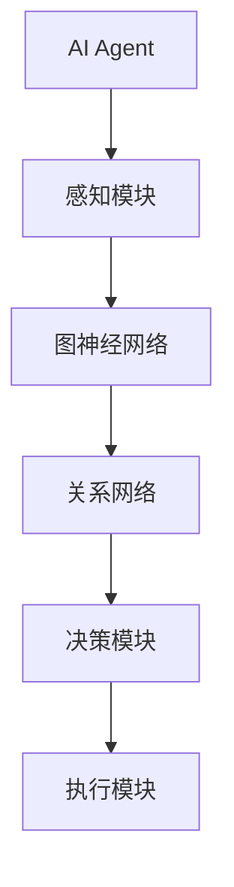
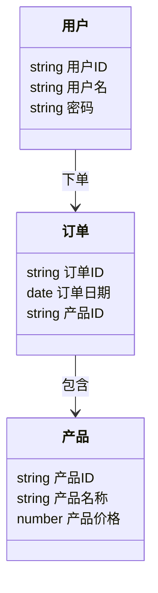
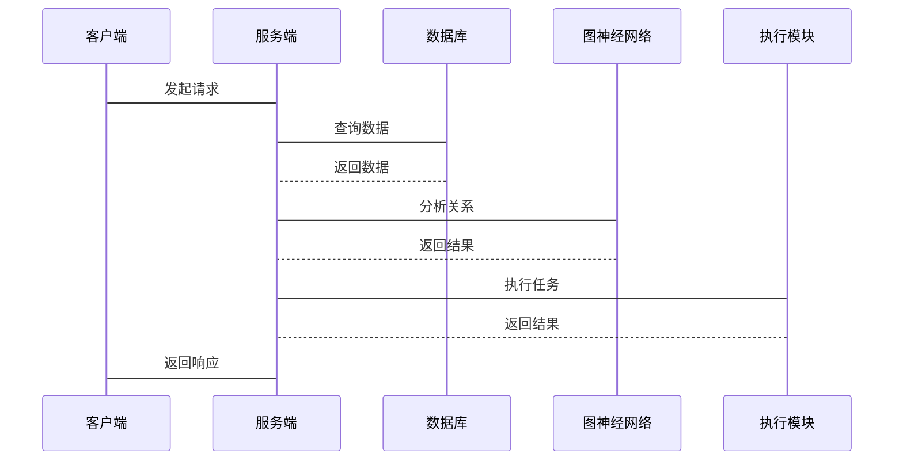

                 


# 企业AI Agent的图神经网络应用：复杂关系分析

---

## 关键词
- 图神经网络
- AI Agent
- 复杂关系分析
- 企业应用
- 深度学习

---

## 摘要
随着企业数字化转型的深入，复杂关系分析成为企业智能化决策的关键。AI Agent（人工智能代理）作为智能化系统的核心组件，能够通过图神经网络的强大能力，高效处理复杂的实体关系和语义信息。本文将系统性地探讨企业AI Agent在图神经网络中的应用，从理论基础到实践案例，详细阐述图神经网络如何助力AI Agent实现复杂关系分析，并为企业智能化提供解决方案。

---

# 第1章: 问题背景与目标

## 1.1 问题背景
### 1.1.1 企业复杂关系分析的挑战
企业在经营过程中面临海量数据，包括客户、供应商、产品、交易等实体之间的复杂关系。传统的方法难以高效处理这些非结构化数据，导致企业在决策时缺乏深度洞察。此外，实时性要求高、数据异构性强、关系网络动态变化等特性进一步增加了复杂关系分析的难度。

### 1.1.2 AI Agent在企业中的角色
AI Agent是一种能够感知环境、自主决策、执行任务的智能实体。它通过与企业系统的交互，能够实时分析数据，提供决策支持。在复杂关系分析中，AI Agent能够动态更新关系网络，发现隐藏的模式，从而优化企业运营。

### 1.1.3 图神经网络的优势
图神经网络（Graph Neural Network, GNN）擅长处理图结构数据，能够直接建模实体之间的关系。相比于传统深度学习模型，图神经网络在处理复杂网络结构时具有天然优势，能够捕捉节点之间的语义信息，适用于复杂关系分析。

---

## 1.2 问题描述
### 1.2.1 企业复杂关系分析的核心问题
企业在分析复杂关系时，通常面临以下问题：
- **数据异构性**：不同实体类型（如客户、产品、订单）之间的关系复杂，难以统一建模。
- **动态性**：关系网络会随时间变化，需要动态更新和分析。
- **实时性**：企业需要实时分析关系网络，以应对快速变化的市场环境。

### 1.2.2 AI Agent在复杂关系分析中的定位
AI Agent作为复杂关系分析的核心模块，负责实时感知、分析和决策。它通过图神经网络处理关系网络，提供智能化的解决方案。

### 1.2.3 图神经网络的适用场景
图神经网络适用于以下场景：
- **社交网络分析**：分析客户之间的关系，发现社群结构。
- **供应链优化**：分析供应商、产品、订单之间的关系，优化供应链效率。
- **风险控制**：分析企业间的关联风险，识别潜在风险点。

---

## 1.3 问题解决
### 1.3.1 AI Agent与图神经网络的结合
AI Agent通过图神经网络处理复杂关系，能够实时更新关系网络，提供动态的决策支持。

### 1.3.2 图神经网络在复杂关系分析中的应用
图神经网络通过节点嵌入和关系传播，能够捕捉实体之间的语义信息，帮助AI Agent理解复杂关系。

### 1.3.3 企业AI Agent的构建目标
- 提供实时的复杂关系分析能力。
- 支持动态更新的关系网络建模。
- 实现智能化的决策支持。

---

## 1.4 边界与外延
### 1.4.1 企业AI Agent的边界
AI Agent专注于复杂关系分析，不涉及企业其他核心业务逻辑的处理。

### 1.4.2 图神经网络的边界
图神经网络专注于关系网络的建模和分析，不涉及具体业务数据的处理。

### 1.4.3 问题的外延与扩展
复杂关系分析可以扩展到更多领域，如金融风控、社交网络分析、医疗数据挖掘等。

---

## 1.5 概念结构与核心要素
### 1.5.1 企业AI Agent的核心要素
- **感知模块**：实时感知环境数据。
- **分析模块**：通过图神经网络分析关系网络。
- **决策模块**：基于分析结果做出决策。

### 1.5.2 图神经网络的核心要素
- **节点嵌入**：表示每个实体的特征。
- **边权重**：表示实体之间的关系强度。
- **图传播**：通过消息传递机制更新节点表示。

---

# 第2章: 核心概念与联系

## 2.1 图神经网络的核心原理
### 2.1.1 图的表示与节点关系
图由节点和边组成，节点表示实体，边表示实体之间的关系。图神经网络通过消息传递机制，将节点特征传播到相邻节点。

### 2.1.2 图嵌入与节点表示
图嵌入是将图结构数据转换为低维向量表示的过程。节点表示通过聚合邻居节点的信息生成。

### 2.1.3 图神经网络的传播机制
通过消息传递机制，图神经网络将信息从局部传播到全局，实现节点特征的更新。

---

## 2.2 AI Agent的基本原理
### 2.2.1 AI Agent的定义与分类
AI Agent是一种智能实体，能够感知环境、自主决策、执行任务。根据智能水平，分为反应式和认知式AI Agent。

### 2.2.2 AI Agent的核心功能
- **感知环境**：通过传感器或接口获取环境数据。
- **决策制定**：基于感知数据做出决策。
- **执行任务**：通过执行器完成任务。

### 2.2.3 AI Agent的决策机制
AI Agent通过状态空间、动作空间和奖励函数进行决策，实现最优策略。

---

## 2.3 图神经网络与AI Agent的联系
### 2.3.1 图神经网络在AI Agent中的作用
图神经网络为AI Agent提供复杂关系分析的能力，帮助其理解实体之间的关系。

### 2.3.2 AI Agent如何利用图神经网络进行关系分析
AI Agent通过图神经网络建模关系网络，实时更新节点特征，发现隐藏的模式。

### 2.3.3 两者结合的优势与挑战
优势：提高复杂关系分析的效率和准确性；挑战：图神经网络的计算复杂度较高。

---

## 2.4 核心概念对比与ER实体关系图

### 2.4.1 图神经网络与传统神经网络的对比
| 特性             | 图神经网络                   | 传统神经网络                 |
|------------------|----------------------------|-----------------------------|
| 数据结构         | 图结构                      | 结构化数据（如表格）         |
| 节点关系         | 显式建模                    | 隐式建模                    |
| 应用场景         | 社交网络分析、供应链优化     | 图像分类、自然语言处理       |

### 2.4.2 AI Agent与传统AI的对比
| 特性             | AI Agent                     | 传统AI                      |
|------------------|------------------------------|-----------------------------|
| 智能水平         | 高度智能                    | 中度智能                    |
| 任务处理         | 多任务处理                  | 单任务处理                  |
| 自主性           | 高度自主                    | 较低自主                    |

### 2.4.3 ER实体关系图
```mermaid
erDiagram
    actor 用户 {
        string 用户ID
        string 用户名
        string 密码
    }
    actor 订单 {
        string 订单ID
        date 订单日期
        string 产品ID
    }
    actor 产品 {
        string 产品ID
        string 产品名称
        number 产品价格
    }
    用户 -> 订单 : 下单
    订单 -> 产品 : 订单包含
```

---

## 2.5 图神经网络与AI Agent的结合示意图


---

# 第3章: 算法原理与数学模型

## 3.1 图神经网络的算法原理
### 3.1.1 消息传递机制
通过消息传递机制，图神经网络将节点特征传播到相邻节点。

### 3.1.2 节点特征更新
节点特征通过聚合邻居节点的信息进行更新。

### 3.1.3 图嵌入计算
通过多次传播，节点特征逐步收敛到稳定的嵌入表示。

---

## 3.2 图神经网络的数学模型
### 3.2.1 节点表示更新公式
$$ h_v^{(l+1)} = \sigma(\sum_{u \in N(v)} W h_u^{(l)}) $$

### 3.2.2 边权重计算公式
$$ w_{uv} = \text{similarity}(h_u, h_v) $$

### 3.2.3 聚合函数
$$ h_v^{(l+1)} = \text{aggregate}(\{h_u^{(l)} | u \in N(v)\}) $$

---

## 3.3 图神经网络的实现步骤
### 3.3.1 数据预处理
- 数据清洗
- 特征提取
- 图构建

### 3.3.2 模型训练
- 确定超参数
- 模型训练
- 模型优化

### 3.3.3 模型部署
- API接口开发
- 模型服务化
- 接口调用

---

## 3.4 图神经网络的Python实现示例
```python
import tensorflow as tf
from tensorflow.keras import layers

class Graph Neural Network:
    def __init__(self, input_dim):
        self.model = tf.keras.Sequential([
            layers.InputLayer(input_shape=(input_dim,)),
            layers.Dense(64, activation='relu'),
            layers.Dense(1, activation='sigmoid')
        ])
    
    def call(self, inputs):
        return self.model(inputs)
```

---

## 3.5 图神经网络的应用场景
- 社交网络分析
- 供应链优化
- 风险控制

---

# 第4章: 系统分析与架构设计

## 4.1 问题场景介绍
企业需要实时分析客户、供应商、产品之间的复杂关系，优化供应链效率。

---

## 4.2 系统功能设计
### 4.2.1 领域模型


### 4.2.2 系统架构


### 4.2.3 接口设计
- API接口：RESTful API
- 数据格式：JSON
- 接口文档：OpenAPI

---

## 4.3 系统交互流程


---

## 4.4 系统实现细节
### 4.4.1 环境安装
- 安装Python 3.8+
- 安装TensorFlow、Keras、Flask

### 4.4.2 核心代码实现
```python
from flask import Flask, request, jsonify
import tensorflow as tf

app = Flask(__name__)

@app.route('/analyze', methods=['POST'])
def analyze():
    data = request.json
    result = model.predict(data)
    return jsonify(result)

if __name__ == '__main__':
    app.run(debug=True)
```

---

## 4.5 项目总结
通过图神经网络，企业能够高效分析复杂关系，优化供应链效率，提升决策能力。

---

# 第5章: 项目实战与案例分析

## 5.1 项目实战
### 5.1.1 环境安装
- Python 3.8+
- 安装TensorFlow、Keras、Flask

### 5.1.2 核心代码实现
```python
import tensorflow as tf
from tensorflow.keras import layers

class GraphNeuralNetwork:
    def __init__(self, input_dim):
        self.model = tf.keras.Sequential([
            layers.InputLayer(input_shape=(input_dim,)),
            layers.Dense(64, activation='relu'),
            layers.Dense(1, activation='sigmoid')
        ])
    
    def call(self, inputs):
        return self.model(inputs)
```

### 5.1.3 代码解读
- 模型初始化：构建图神经网络模型
- 前向传播：输入数据，输出结果
- 模型训练：使用训练数据优化模型

---

## 5.2 案例分析
### 5.2.1 案例背景
某企业需要分析客户、订单、产品之间的关系，优化供应链效率。

### 5.2.2 数据准备
- 数据清洗
- 特征提取
- 图构建

### 5.2.3 模型训练
- 模型初始化
- 数据输入
- 模型优化

### 5.2.4 模型部署
- API接口开发
- 模型服务化
- 接口调用

---

## 5.3 项目总结
通过图神经网络，企业能够高效分析复杂关系，优化供应链效率，提升决策能力。

---

# 第6章: 最佳实践与小结

## 6.1 最佳实践
### 6.1.1 数据预处理
- 数据清洗
- 特征提取
- 图构建

### 6.1.2 模型优化
- 参数调优
- 模型评估
- 模型部署

---

## 6.2 小结
本文详细探讨了企业AI Agent在图神经网络中的应用，从理论到实践，系统性地分析了复杂关系分析的解决方案。

---

## 6.3 注意事项
- 数据隐私保护
- 模型可解释性
- 系统性能优化

---

## 6.4 拓展阅读
- 图神经网络相关论文
- AI Agent相关书籍
- 复杂关系分析的经典案例

---

通过本文的探讨，读者能够全面理解企业AI Agent的图神经网络应用，掌握复杂关系分析的核心技术，并能够在实际项目中灵活应用。

