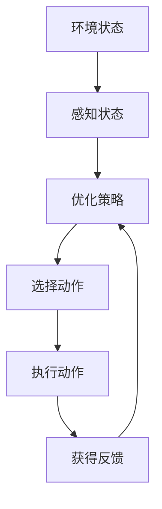
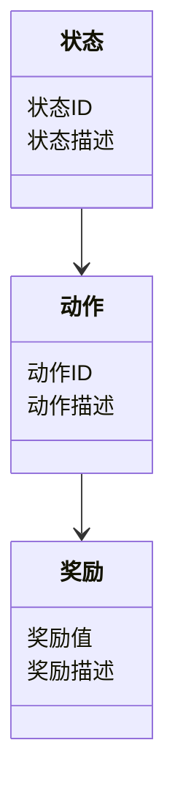
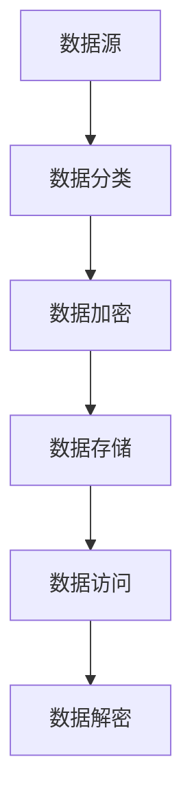
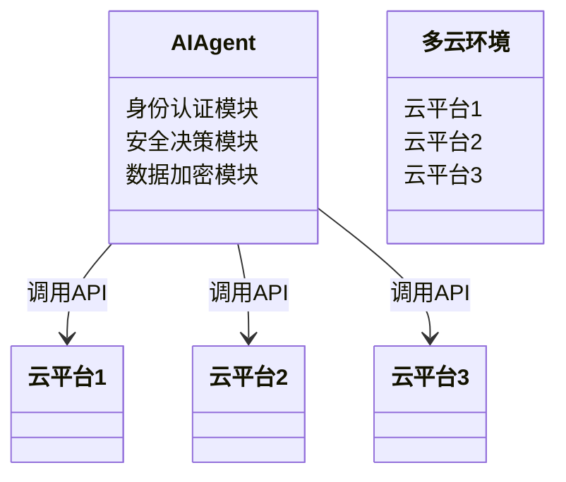

                 


# 企业AI Agent的多云环境安全策略

## 关键词：企业AI Agent，多云环境，安全策略，零信任，数据安全，强化学习

## 摘要：  
随着企业AI Agent在多云环境中的广泛应用，安全问题变得愈发重要。本文将深入分析企业AI Agent在多云环境中的安全挑战，并提出相应的安全策略。通过探讨多云环境下的身份认证、数据安全、强化学习算法等关键问题，本文为企业构建安全的AI Agent多云环境提供了理论支持和实践指导。

---

# 第1章: 企业AI Agent与多云环境概述

## 1.1 企业AI Agent的定义与特点

### 1.1.1 AI Agent的基本概念  
AI Agent（人工智能代理）是一种能够感知环境、自主决策并执行任务的智能实体。它通过接收输入信息（如传感器数据、用户请求），结合内部知识库和目标函数，生成输出动作（如执行命令、触发事件）。AI Agent的核心特征包括自主性、反应性、目标导向性和学习能力。

### 1.1.2 企业AI Agent的核心特点  
1. **智能化**：基于机器学习和自然语言处理，能够理解复杂业务场景并做出决策。  
2. **自主性**：能够在无需人工干预的情况下完成任务。  
3. **可扩展性**：支持多种业务场景和数据源的集成。  
4. **安全性**：需要在复杂环境中确保数据和操作的安全性。  

### 1.1.3 AI Agent在企业中的应用场景  
1. **智能客服**：通过自然语言处理为用户提供个性化服务。  
2. **自动化运维**：监控系统状态并自动修复问题。  
3. **智能决策支持**：基于数据分析为企业提供决策建议。  

---

## 1.2 多云环境的定义与挑战

### 1.2.1 多云环境的定义  
多云环境是指企业同时使用多个云服务提供商（如AWS、Azure、Google Cloud）构建业务系统。这种架构通过分散资源实现高可用性和灵活性，但也带来了复杂的管理问题。

### 1.2.2 多云环境的优势与劣势  
- **优势**：  
  1. 高可用性：避免单点故障。  
  2. 灵活性：可以根据业务需求选择最优云服务。  
  3. 成本优化：通过竞争选择最经济的服务。  
- **劣势**：  
  1. 复杂性：跨平台的管理和协调难度大。  
  2. 安全风险：多云环境增加了数据泄露和攻击面。  
  3. 一致性挑战：不同云平台的接口和规范不统一。  

### 1.2.3 多云环境中的安全问题  
1. **数据隔离**：跨云数据传输可能面临中间人攻击。  
2. **身份认证**：多云环境下的身份认证需要协调多个系统的信任关系。  
3. **权限管理**：需要在多个云平台之间统一权限策略。  

---

## 1.3 企业AI Agent与多云环境的安全需求

### 1.3.1 AI Agent在多云环境中的角色  
AI Agent作为多云环境的核心组件，负责协调多个云服务的资源调度、任务分配和异常处理。其安全性能直接影响整个系统的稳定性。

### 1.3.2 多云环境中AI Agent的安全挑战  
1. **跨平台兼容性**：需要支持多种云平台的接口和协议。  
2. **数据隐私**：AI Agent可能处理敏感数据，需确保数据在传输和存储过程中的安全性。  
3. **权限管理**：AI Agent需要在不同云平台之间获取必要的权限，同时避免过度权限。  

### 1.3.3 安全策略的目标与核心要素  
- **目标**：保护AI Agent的通信、数据和决策过程免受攻击。  
- **核心要素**：  
  1. 身份认证与授权。  
  2. 数据加密与隐私保护。  
  3. 安全监控与应急响应。  

---

## 1.4 本章小结  
本章从企业AI Agent的基本概念出发，分析了多云环境的定义、优势与挑战，并结合AI Agent在多云环境中的角色，提出了安全策略的核心目标和要素。

---

# 第2章: 多云环境下的AI Agent安全策略框架

## 2.1 多云环境下的安全策略设计原则

### 2.1.1 最小权限原则  
最小权限原则要求AI Agent仅获得完成任务所需的最小权限。这可以通过以下步骤实现：  
1. **分析任务需求**：明确AI Agent需要执行的具体操作。  
2. **定义最小权限集**：基于任务需求授予最小权限。  
3. **定期审计**：检查权限是否仍然符合任务需求。  

### 2.1.2 零信任原则  
零信任原则要求AI Agent在与任何资源交互时，都需要经过严格的认证和授权。其实施步骤如下：  
1. **身份认证**：验证AI Agent的身份。  
2. **授权检查**：确认AI Agent是否有权限执行特定操作。  
3. **动态授权**：根据实时上下文调整权限。  

### 2.1.3 可观察性与可追溯性原则  
可观察性与可追溯性原则要求AI Agent的行为可以被监控和追溯。  
1. **日志记录**：记录AI Agent的所有操作。  
2. **行为分析**：通过日志分析识别异常行为。  
3. **事件响应**：根据异常行为采取相应的应急措施。  

---

## 2.2 多云环境下的AI Agent身份认证机制

### 2.2.1 联合身份认证  
联合身份认证通过跨云平台的身份提供商（IdP）实现单点登录（SSO）。其流程如下：  
1. **用户发起请求**：用户向AI Agent发起请求。  
2. **身份验证**：AI Agent通过联合身份认证协议（如OAuth 2.0）验证用户身份。  
3. **授权**：用户授权AI Agent执行特定操作。  
4. **访问控制**：AI Agent根据授权结果执行操作。  

### 2.2.2 基于属性的认证  
基于属性的认证通过验证用户属性（如地理位置、设备信息）来增强安全性。  
1. **属性验证**：AI Agent验证用户的属性信息。  
2. **动态授权**：根据属性信息动态调整权限。  

### 2.2.3 跨云身份互操作性  
跨云身份互操作性要求不同云平台之间的身份认证机制能够兼容。这可以通过以下方式实现：  
1. **统一身份目录**：建立统一的身份目录，实现跨云身份互认。  
2. **标准协议**：使用标准协议（如SAML、OpenID Connect）实现互操作性。  

---

## 2.3 多云环境下的数据安全策略

### 2.3.1 数据分类与分级  
数据分类与分级是数据安全的基础。  
1. **数据分类**：根据数据类型（如结构化数据、非结构化数据）进行分类。  
2. **数据分级**：根据数据敏感性（如公开数据、内部数据、机密数据）进行分级。  

### 2.3.2 数据加密与隐私保护  
数据加密是保护数据隐私的重要手段。  
1. **数据-at-rest加密**：对存储数据进行加密。  
2. **数据-in-transit加密**：对传输数据进行加密。  
3. **加密算法选择**：使用AES、RSA等加密算法。  

### 2.3.3 数据共享与访问控制  
数据共享需要遵循严格的访问控制策略。  
1. **访问控制列表（ACL）**：定义数据的访问权限。  
2. **基于属性的访问控制（ABAC）**：根据用户属性动态调整访问权限。  

---

## 2.4 本章小结  
本章从多云环境下的安全策略设计原则出发，探讨了AI Agent的身份认证机制和数据安全策略，提出了实现安全目标的具体方法。

---

# 第3章: 基于强化学习的AI Agent安全决策算法

## 3.1 强化学习在AI Agent安全决策中的应用

### 3.1.1 强化学习的基本原理  
强化学习是一种通过试错学习优化决策策略的方法。其核心要素包括：  
1. **状态（State）**：环境当前的状况。  
2. **动作（Action）**：AI Agent的决策行为。  
3. **奖励（Reward）**：对动作的反馈，用于优化策略。  
4. **策略（Policy）**：动作选择的概率分布。  
5. **价值函数（Value Function）**：评估状态或动作的价值。  

### 3.1.2 安全决策中的状态、动作与奖励机制  
1. **状态**：AI Agent的当前安全状态，如系统资源使用情况、网络连接状态。  
2. **动作**：AI Agent的决策行为，如授权访问、拒绝请求。  
3. **奖励**：根据安全决策的正确性给予奖励或惩罚。  

### 3.1.3 策略网络与价值网络的构建  
1. **策略网络**：通过神经网络输出动作的概率分布。  
2. **价值网络**：评估状态的价值。  

---

## 3.2 多云环境下的安全策略优化算法

### 3.2.1 状态空间建模  
状态空间建模是强化学习的基础。  
1. **状态表示**：将多云环境中的资源状态、网络状态等抽象为状态空间。  
2. **状态转移**：根据AI Agent的动作，更新状态空间。  

### 3.2.2 动作空间设计  
动作空间设计需要考虑多云环境的复杂性。  
1. **动作选择**：AI Agent根据当前状态选择最优动作。  
2. **动作执行**：执行动作并观察环境反馈。  

### 3.2.3 奖励函数设计与优化  
奖励函数设计需要平衡安全性和效率。  
1. **奖励机制**：根据安全决策的正确性给予奖励。  
2. **奖励优化**：通过调整奖励权重，优化决策策略。  

---

## 3.3 基于强化学习的安全策略实现

### 3.3.1 算法实现步骤  
1. **初始化**：定义状态空间、动作空间和奖励函数。  
2. **状态感知**：AI Agent感知当前环境状态。  
3. **决策制定**：基于强化学习算法选择最优动作。  
4. **执行与反馈**：执行动作并获得反馈。  
5. **策略优化**：根据反馈优化策略网络。  

### 3.3.2 算法复杂度分析  
1. **时间复杂度**：主要取决于状态空间和动作空间的大小。  
2. **空间复杂度**：主要取决于神经网络的参数数量。  

---

## 3.4 本章小结  
本章通过强化学习算法，探讨了AI Agent在多云环境中的安全决策问题，提出了基于强化学习的安全策略优化方法。

---

# 附录：相关图表与代码示例  

## 附录A: 强化学习算法的mermaid流程图  



---

## 附录B: 数据分类与分级的类图  



---

## 附录C: 数据加密与隐私保护的流程图  



---

## 附录D: 加密算法实现代码  

```python
import AES

def encrypt(data, key):
    cipher = AES.new(key, AES.MODE_ECB)
    return cipher.encrypt(data)

def decrypt(ciphertext, key):
    cipher = AES.new(key, AES.MODE_ECB)
    return cipher.decrypt(ciphertext)
```

---

## 附录E: 强化学习算法实现代码  

```python
import numpy as np

class DQN:
    def __init__(self, state_size, action_size, learning_rate):
        self.state_size = state_size
        self.action_size = action_size
        self.learning_rate = learning_rate
        self.model = self.build_model()
    
    def build_model(self):
        # 定义神经网络模型
        model = Sequential()
        model.add(Dense(64, activation='relu', input_dim=self.state_size))
        model.add(Dense(self.action_size, activation='linear'))
        model.compile(loss='mean_squared_error', optimizer=Adam(lr=self.learning_rate))
        return model
    
    def act(self, state):
        # 选择动作
        Q = self.model.predict(state)
        return np.argmax(Q[0])
    
    def learn(self, state, action, reward, next_state):
        # 训练模型
        target = reward + self.model.predict(next_state)[0]
        target_Q = self.model.predict(state)
        target_Q[0][action] = target
        self.model.fit(state, target_Q, epochs=1, verbose=0)
```

---

## 附录F: 系统架构设计的mermaid图  



---

## 附录G: 项目实战案例分析  

### 项目实战：设计一个基于强化学习的AI Agent安全决策系统  
1. **环境安装**：安装TensorFlow、Keras、AES库。  
2. **核心代码实现**：实现DQN算法，训练AI Agent在多云环境中的安全决策能力。  
3. **案例分析**：分析AI Agent在不同安全场景中的决策效果。  
4. **优化建议**：根据实验结果优化奖励函数和策略网络。  

---

## 附录H: 最佳实践 tips  

1. **小结**：本文从多云环境的安全挑战出发，提出了基于强化学习的AI Agent安全策略。  
2. **注意事项**：在实际应用中，需要根据具体场景调整算法参数和安全策略。  
3. **拓展阅读**：推荐阅读《云安全技术》和《强化学习实战》相关书籍。  

---

# 参考文献  
1. 刘军, 等. 《云安全技术》. 北京: 清华大学出版社, 2021.  
2. Sutton, R. S., & Barto, A. G. (2018). Reinforcement learning: An introduction. MIT Press.  
3. OAuth 2.0 标准文档.  
4. AES 加密算法规范.  

---

**本文完**

