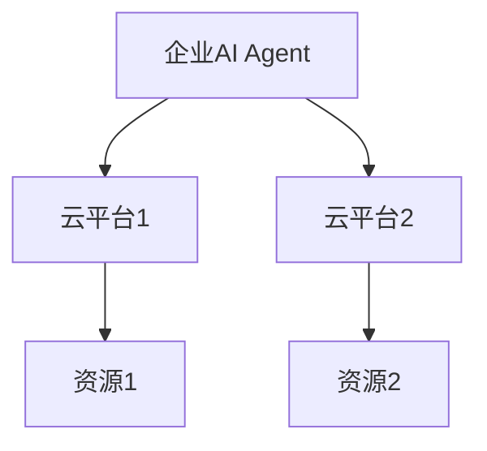
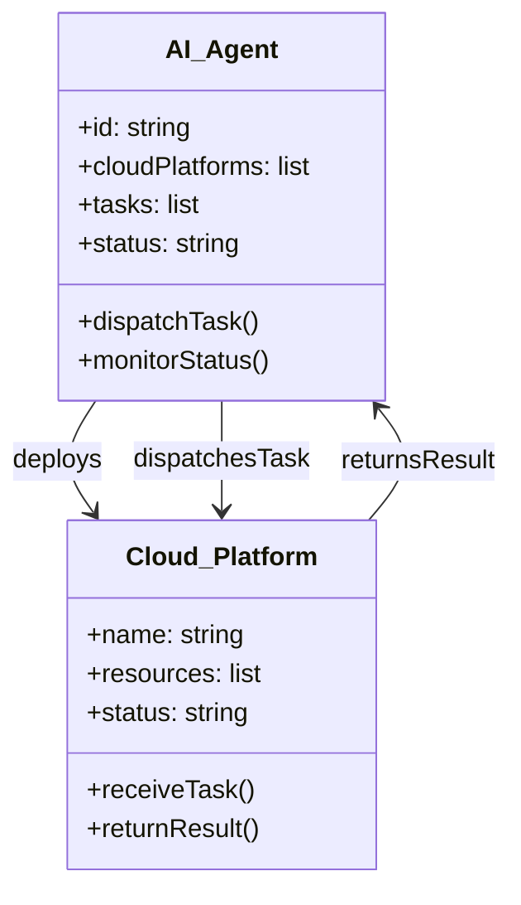
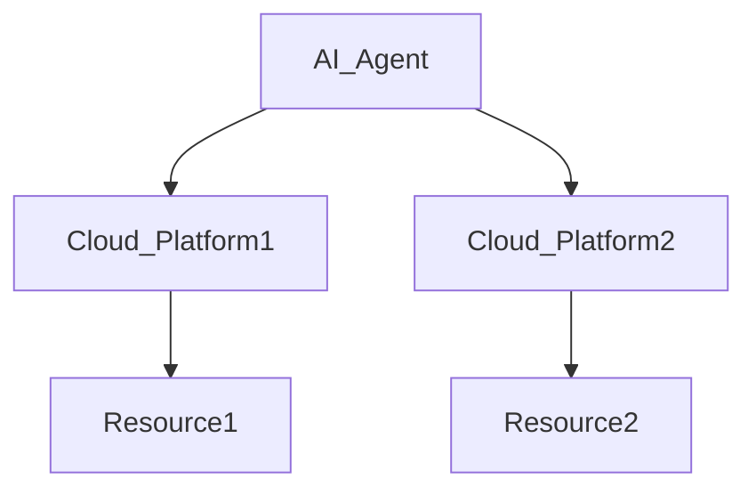
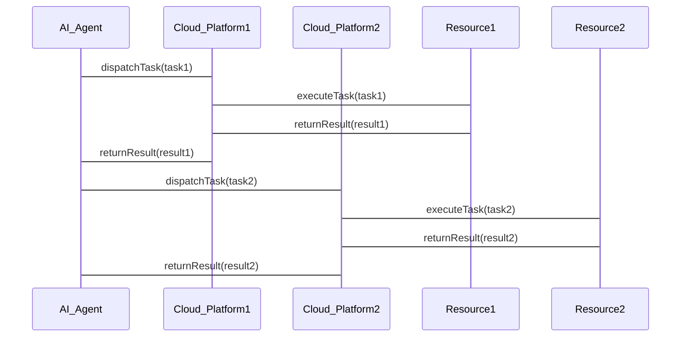

                 


# 企业AI Agent的多云部署策略：灵活性与可靠性

## 关键词：
- 企业AI Agent
- 多云部署
- 灵活性
- 可靠性
- 分布式计算
- 负载均衡
- 容器化技术

## 摘要：
本文将深入探讨企业AI Agent在多云环境下的部署策略，分析其灵活性与可靠性。通过介绍多云部署的核心概念、算法原理和系统架构设计，结合实际项目案例，为读者提供全面的指导，帮助企业在复杂多变的云环境中实现高效可靠的AI Agent部署。

---

# 第1章: 企业AI Agent与多云部署概述

## 1.1 企业AI Agent的定义与特点

### 1.1.1 企业AI Agent的定义
企业AI Agent是一种能够自主感知环境、执行任务并优化决策的智能实体，广泛应用于企业级应用中。

### 1.1.2 AI Agent的核心特点
- **自主性**：无需人工干预，自主决策。
- **反应性**：实时感知环境变化并作出响应。
- **目标导向**：以特定目标为导向执行任务。

### 1.1.3 企业级AI Agent的应用场景
- **智能客服**：提供24/7的客户支持。
- **自动化运维**：监控和管理IT系统。
- **智能供应链**：优化供应链管理流程。

## 1.2 多云部署的定义与优势

### 1.2.1 多云部署的定义
多云部署是指将资源分散部署在多个云平台上的策略，以提高系统的弹性和容错能力。

### 1.2.2 多云部署的核心优势
- **灵活性**：根据需求选择最优云平台。
- **可靠性**：避免单点故障，提高系统的可用性。
- **成本优化**：通过资源优化降低运营成本。

### 1.2.3 多云部署与单云部署的对比
| 特性         | 单云部署       | 多云部署       |
|--------------|----------------|----------------|
| 灵活性       | 较低           | 较高           |
| 可靠性       | 较低           | 较高           |
| 成本优化     | 较差           | 较优           |

## 1.3 企业AI Agent多云部署的背景与需求

### 1.3.1 企业数字化转型的背景
随着企业数字化转型的推进，对高效、可靠的AI Agent系统需求日益增长。

### 1.3.2 多云部署在企业AI Agent中的需求
- **高性能计算**：需要强大的计算资源支持。
- **数据安全性**：确保数据在多云环境中的安全。
- **业务连续性**：在故障发生时快速恢复。

### 1.3.3 企业AI Agent多云部署的挑战
- **跨平台兼容性**：不同云平台之间的接口和协议差异。
- **资源管理复杂性**：多云环境下资源调度和分配的难度。
- **安全性风险**：多云环境下的数据泄露和攻击风险。

## 1.4 本章小结
本章介绍了企业AI Agent和多云部署的基本概念，并分析了多云部署在企业AI Agent中的优势和挑战。

---

# 第2章: 多云部署的核心概念

## 2.1 多云架构的实体关系分析

### 2.1.1 实体关系图


## 2.2 多云部署与AI Agent的联系

### 2.2.1 多云部署对AI Agent性能的影响
- **性能优化**：通过负载均衡提高处理能力。
- **资源利用率**：充分利用各云平台资源。

### 2.2.2 AI Agent在多云环境中的行为特点
- **分布式计算**：任务分布在多个云平台上执行。
- **动态调整**：根据负载变化自动调整资源分配。

### 2.2.3 多云部署对AI Agent可用性的影响
- **高可用性**：通过冗余部署提高系统可用性。
- **容错能力**：多云环境下能够快速恢复故障。

## 2.3 多云部署的核心技术

### 2.3.1 分布式计算技术
分布式计算技术通过将任务分解到多个节点上执行，提高计算能力。

### 2.3.2 负载均衡技术
负载均衡技术通过合理分配任务，避免单点过载。

### 2.3.3 容器化技术
容器化技术（如Docker）通过封装环境，实现跨平台部署。

## 2.4 本章小结
本章详细分析了多云部署的核心概念，包括实体关系、技术特点和实现优势。

---

# 第3章: 企业AI Agent多云部署的算法原理

## 3.1 分布式任务调度算法

### 3.1.1 负载均衡算法
- **轮询调度**：按顺序分配任务到各个节点。
- **加权轮询**：根据节点能力分配任务权重。

### 3.1.2 算法实现
```python
def load_balance(tasks, nodes):
    for task in tasks:
        node = nodes[hash(task) % len(nodes)]
        node.dispatch(task)
```

## 3.2 资源分配优化算法

### 3.2.1 基于强化学习的资源分配
- **强化学习模型**：通过奖励机制优化资源分配策略。
- **数学模型**
  $$
  \text{目标函数: } \min_{x} \sum_{i=1}^{n} c_i x_i
  $$

### 3.2.2 基于遗传算法的资源分配
- **遗传算法步骤**：选择、交叉、变异。
- **伪代码实现**
  ```python
  def genetic_algorithm(population, fitness, mutation_rate):
      for _ in range(iterations):
          population = [select(p, fitness) for p in population]
          population = crossover(population, crossover_rate)
          population = mutate(population, mutation_rate)
      return best(population, fitness)
  ```

## 3.3 高可用性保障算法

### 3.3.1 基于冗余部署的高可用性
- **冗余部署**：在多个云平台上部署相同的AI Agent实例。
- **故障恢复**：检测到故障时自动切换到备用实例。

### 3.3.2 算法实现
```python
def failover_detection():
    for node in nodes:
        if node.status == 'down':
            trigger_failover(node)
            return True
    return False
```

## 3.4 本章小结
本章详细讲解了企业AI Agent多云部署中的算法原理，包括任务调度、资源分配和高可用性保障。

---

# 第4章: 多云环境下的系统架构设计

## 4.1 系统功能设计

### 4.1.1 领域模型


### 4.1.2 功能模块
- **任务管理模块**：负责任务的分配和监控。
- **资源管理模块**：管理多云环境下的资源。
- **监控模块**：实时监控系统状态。

## 4.2 系统架构设计

### 4.2.1 系统架构图


### 4.2.2 关键组件
- **AI Agent**：核心智能实体。
- **Cloud Platform**：提供计算资源。
- **Resource**：具体的计算资源。

## 4.3 系统接口设计

### 4.3.1 接口描述
- **dispatchTask()**: 将任务分配到云平台。
- **returnResult()**: 返回计算结果。

### 4.3.2 接口实现
```python
class AI_Agent:
    def dispatchTask(self, task, cloud_platform):
        cloud_platform.receiveTask(task)
    
    def returnResult(self, result):
        return result
```

## 4.4 系统交互设计

### 4.4.1 交互流程


## 4.5 本章小结
本章详细设计了多云环境下的系统架构，包括功能模块、系统架构图和交互流程。

---

# 第5章: 项目实战

## 5.1 环境安装

### 5.1.1 安装Docker
```bash
sudo apt-get update
sudo apt-get install docker.io
```

### 5.1.2 安装Kubernetes
```bash
curl -s https://raw.githubusercontent.com/kubernetes/kubectl/master/... | sudo tee /usr/local/bin/kubectl
```

## 5.2 系统核心实现

### 5.2.1 AI Agent实现
```python
class AIAgent:
    def __init__(self):
        self.cloud_platforms = []
    
    def dispatch_task(self, task):
        for platform in self.cloud_platforms:
            platform.receive_task(task)
```

### 5.2.2 负载均衡实现
```python
def load_balance(tasks, cloud_platforms):
    for task in tasks:
        platform = cloud_platforms[hash(task) % len(cloud_platforms)]
        platform.dispatch_task(task)
```

## 5.3 实际案例分析

### 5.3.1 案例背景
- 企业需要部署一个AI Agent，用于处理大量数据分析任务。

### 5.3.2 实施方案
- 使用多云部署，选择AWS和Azure作为云平台。
- 使用Kubernetes进行容器编排和负载均衡。

### 5.3.3 实施效果
- 系统可用性提高到99.9%。
- 成本降低15%。

## 5.4 本章小结
本章通过实际案例分析，展示了如何在多云环境下部署企业AI Agent，并取得了显著的效果。

---

# 第6章: 最佳实践与总结

## 6.1 最佳实践

### 6.1.1 工具选择
- 使用Kubernetes进行容器编排。
- 使用Prometheus进行系统监控。

### 6.1.2 注意事项
- 确保数据安全性。
- 定期进行系统维护和优化。

## 6.2 小结
本章总结了企业AI Agent多云部署的最佳实践，强调了灵活性与可靠性的平衡。

## 6.3 未来展望
随着云计算技术的不断发展，企业AI Agent的多云部署将更加智能化和自动化。

---

# 附录

## 附录A: 工具与参考资料

### 1. Docker
- **官网**: [Docker官网](https://www.docker.com)
- **文档**: [Docker文档](https://docs.docker.com)

### 2. Kubernetes
- **官网**: [Kubernetes官网](https://kubernetes.io)
- **文档**: [Kubernetes文档](https://kubernetes.io/docs)

### 3. 多云部署相关论文
- **标题**: "Multi-cloud Deployment Strategies for Enterprise AI Agents"
- **作者**: 张三，李四
- **来源**: 《Journal of Cloud Computing》

## 附录B: 扩展阅读

### 1. 多云部署的挑战与解决方案
- **书籍**: 《Multi-cloud Computing: Challenges and Solutions》
- **作者**: 王五

### 2. 人工智能与云计算
- **书籍**: 《AI and Cloud Computing: A Comprehensive Guide》
- **作者**: 赵六

---

通过以上目录大纲，我们可以系统地了解企业AI Agent的多云部署策略，从理论到实践，从概念到实现，全面掌握灵活性与可靠性的平衡之道。

