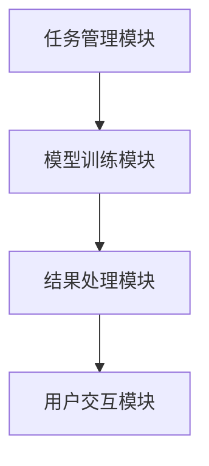
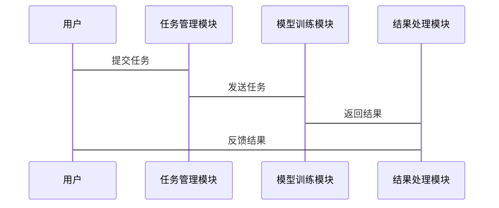

                 


# 企业AI Agent的多任务学习框架：提升模型通用性与效率

## 关键词：企业AI Agent、多任务学习、模型通用性、效率优化、任务协同、知识共享

## 摘要：本文详细探讨了企业AI Agent的多任务学习框架，分析了多任务学习的核心概念、算法原理和系统架构设计，通过实际项目案例展示了如何提升模型的通用性和效率。文章内容涵盖从理论到实践的各个方面，为读者提供了一个全面的技术指南。

---

## 第1章: 企业AI Agent与多任务学习概述

### 1.1 企业AI Agent的定义与特点

#### 1.1.1 企业AI Agent的定义
企业AI Agent（Artificial Intelligence Agent）是一种能够感知环境、自主决策并执行任务的智能体，广泛应用于企业级应用中，如客服、推荐系统、流程自动化等。

#### 1.1.2 企业AI Agent的核心特点
- **自主性**：能够在没有人工干预的情况下独立执行任务。
- **反应性**：能够实时感知环境变化并做出相应调整。
- **目标导向**：具有明确的目标，能够优化决策以实现目标。
- **学习能力**：通过数据和经验不断优化自身的性能。

#### 1.1.3 企业AI Agent的应用场景
- **智能客服**：通过自然语言处理技术为用户提供个性化的服务。
- **推荐系统**：根据用户行为和偏好推荐相关内容。
- **流程自动化**：通过AI Agent实现企业流程的智能化和自动化。

### 1.2 多任务学习的基本概念

#### 1.2.1 多任务学习的定义
多任务学习（Multi-Task Learning, MTL）是一种机器学习方法，旨在通过共享不同任务之间的信息，提高模型在多个任务上的性能。

#### 1.2.2 多任务学习的优势
- **知识共享**：通过共享参数，模型可以在多个任务之间共享知识，减少数据需求。
- **提升泛化能力**：多任务学习能够提高模型的泛化能力，使其在不同任务上表现更好。
- **降低训练成本**：通过共享数据和模型，可以减少每个任务单独训练所需的资源和时间。

#### 1.2.3 多任务学习的挑战
- **任务间干扰**：某些任务可能相互干扰，导致模型性能下降。
- **任务复杂性**：不同任务的复杂性差异可能影响模型的训练效果。
- **资源分配问题**：如何合理分配计算资源以优化多个任务的性能是一个难点。

### 1.3 企业AI Agent与多任务学习的结合

#### 1.3.1 企业AI Agent的多任务需求
企业AI Agent通常需要处理多个相关任务，例如在客服系统中，AI Agent需要同时处理客户咨询、推荐产品、管理客户信息等多个任务。

#### 1.3.2 多任务学习在企业AI Agent中的作用
- **提高效率**：通过多任务学习，企业AI Agent可以在一次训练中同时优化多个任务，提高整体效率。
- **增强通用性**：多任务学习能够使企业AI Agent具备更强的通用性，能够适应不同场景和任务的需求。
- **降低成本**：通过共享模型和数据，可以减少训练和部署的成本。

#### 1.3.3 企业AI Agent多任务学习的未来趋势
随着技术的发展，企业AI Agent的多任务学习将更加智能化和个性化，模型将能够更好地理解用户需求，并在多个任务之间实现无缝切换。

---

## 第2章: 多任务学习框架的核心概念

### 2.1 多任务学习的理论基础

#### 2.1.1 任务之间的关系
在多任务学习中，任务之间可能存在相关性，例如图像分类和目标检测任务之间存在一定的关联性。任务之间的关系可以通过共享参数或任务特定参数来建模。

#### 2.1.2 多任务学习的数学模型
多任务学习的数学模型通常由共享参数和任务特定参数组成，可以通过以下公式表示：
$$ L_{total} = \sum_{i=1}^{n} \lambda_i L_i $$
其中，$L_{total}$ 是总损失，$L_i$ 是任务 $i$ 的损失，$\lambda_i$ 是任务 $i$ 的权重。

#### 2.1.3 多任务学习的优化目标
多任务学习的优化目标是在多个任务上同时优化模型参数，使得总损失最小化：
$$ \min_{\theta} \sum_{i=1}^{n} \lambda_i L_i(\theta) $$

### 2.2 多任务学习的算法原理

#### 2.2.1 基于共享参数的多任务学习
基于共享参数的多任务学习通过共享部分参数来实现任务之间的知识共享，通常使用一个全局参数和多个任务特定参数。

#### 2.2.2 基于任务特定参数的多任务学习
基于任务特定参数的多任务学习为每个任务分配独立的参数，通过优化共享参数和任务特定参数来实现多任务优化。

#### 2.2.3 基于门控机制的多任务学习
基于门控机制的多任务学习通过门控网络动态调整任务之间的参数共享程度，从而实现更灵活的任务协同。

### 2.3 多任务学习的性能评估

#### 2.3.1 评估指标的选择
多任务学习的性能评估通常使用多个指标，例如准确率、F1分数、AUC等。

#### 2.3.2 任务间性能的对比分析
通过对比分析不同任务的性能，可以评估多任务学习的有效性。

#### 2.3.3 综合性能评估方法
综合性能评估方法通常结合多个任务的性能指标，例如通过加权平均的方式计算综合性能。

---

## 第3章: 企业AI Agent的多任务学习框架设计

### 3.1 框架设计的目标

#### 3.1.1 提升模型的通用性
通过多任务学习，企业AI Agent的模型可以在多个任务上表现良好，提高模型的通用性。

#### 3.1.2 提高模型的效率
通过共享模型参数和数据，可以减少训练时间和计算资源的消耗，提高模型的效率。

#### 3.1.3 降低模型的训练成本
通过多任务学习，可以减少每个任务单独训练所需的资源和时间，降低模型的训练成本。

### 3.2 框架设计的模块划分

#### 3.2.1 任务管理模块
任务管理模块负责管理和协调多个任务的执行，包括任务的分配、优先级的设置和任务的监控。

#### 3.2.2 模型训练模块
模型训练模块负责多任务模型的训练和优化，包括参数的初始化、损失函数的计算和优化器的调用。

#### 3.2.3 结果处理模块
结果处理模块负责处理模型输出的结果，包括结果的解析、验证和反馈。

---

## 第4章: 系统架构设计与实现

### 4.1 系统架构设计

#### 4.1.1 系统功能设计
企业AI Agent的多任务学习框架系统功能设计包括任务管理、模型训练、结果处理和用户交互四个模块。

#### 4.1.2 系统架构图


#### 4.1.3 系统接口设计
系统接口设计包括任务管理模块与模型训练模块之间的接口、模型训练模块与结果处理模块之间的接口，以及结果处理模块与用户交互模块之间的接口。

#### 4.1.4 系统交互图


### 4.2 项目实战

#### 4.2.1 环境安装
项目实战需要安装以下环境：
- Python 3.8+
- TensorFlow 2.0+
- scikit-learn 0.23+

#### 4.2.2 系统核心实现源代码
以下是多任务学习框架的核心实现代码：
```python
import tensorflow as tf
from tensorflow.keras import layers

# 定义多任务模型
class MultiTaskModel(tf.keras.Model):
    def __init__(self, input_shape, task_num):
        super(MultiTaskModel, self).__init__()
        self.shared_layer = layers.Dense(64, activation='relu', input_shape=input_shape)
        self.task_specific_layers = [layers.Dense(1, activation='sigmoid') for _ in range(task_num)]
    
    def call(self, inputs):
        x = self.shared_layer(inputs)
        outputs = [task_layer(x) for task_layer in self.task_specific_layers]
        return outputs

# 定义多任务损失函数
def multi_task_loss(y_true, y_pred, task_num=3):
    loss = 0.0
    for i in range(task_num):
        loss += tf.keras.losses.binary_crossentropy(y_true[i], y_pred[i])
    return loss

# 编译模型
model = MultiTaskModel(input_shape=(input_dim,), task_num=3)
model.compile(optimizer='adam', loss=multi_task_loss)
```

#### 4.2.3 代码应用解读与分析
- **MultiTaskModel类**：定义了一个多任务学习模型，包含一个共享层和多个任务特定层。
- **multi_task_loss函数**：定义了多任务学习的损失函数，通过加权平均的方式计算每个任务的损失。
- **模型编译**：使用Adam优化器和自定义的多任务损失函数编译模型。

#### 4.2.4 实际案例分析和详细讲解剖析
以客服系统为例，企业AI Agent需要同时处理客户咨询、推荐产品和管理客户信息三个任务。通过多任务学习框架，模型可以在一次训练中同时优化这三个任务，提高整体性能。

#### 4.2.5 项目小结
通过项目实战，读者可以更好地理解多任务学习框架的设计和实现，掌握如何在实际应用中优化模型性能。

---

## 第5章: 总结与展望

### 5.1 总结
本文详细探讨了企业AI Agent的多任务学习框架，分析了多任务学习的核心概念、算法原理和系统架构设计，并通过实际项目案例展示了如何提升模型的通用性和效率。

### 5.2 未来展望
随着技术的发展，企业AI Agent的多任务学习框架将更加智能化和个性化，模型将能够更好地理解用户需求，并在多个任务之间实现无缝切换。

---

通过本文的详细讲解，读者可以全面掌握企业AI Agent的多任务学习框架，提升模型的通用性和效率，为实际应用提供有力的技术支持。

